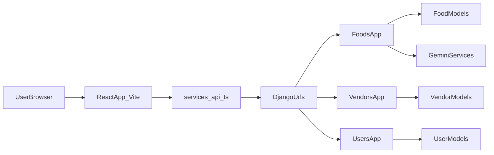

## YamYab AGENT Guide (for Future AI Agents)

### TL;DR

YamYab is a mobile-style React/Vite single-page app (`YamYab-App-Front`) backed by a Django REST API (`yamyab-backend`) that serves foods, vendors, user data, and AI-powered prompt search results. The frontend talks exclusively to the backend via `src/services/api.ts`, manages authentication via `src/contexts/AuthContext.tsx`, and renders a simple state-machine-based shell in `src/App.tsx`. The backend is split into three Django apps—`foods`, `vendors`, and `users`—plus global configuration in `yamyab/settings.py`, with a small AI integration layer around Google Gemini for natural-language food search.

---

### 1. Architecture Overview

- **Frontend**: React 18 SPA, bootstrapped by Vite.
  - Entry: `YamYab-App-Front/src/main.tsx` mounts `App` within `AuthProvider`.
  - Shell: `YamYab-App-Front/src/App.tsx` orchestrates splash, onboarding, auth, and main views.
  - API layer: `YamYab-App-Front/src/services/api.ts` centralizes all HTTP calls to the backend.
  - Auth context: `YamYab-App-Front/src/contexts/AuthContext.tsx` manages JWT tokens and user info.
  - UI components:
    - Screens in `YamYab-App-Front/src/components/` (e.g., `Home`, `Explore`, `Favorites`, `Profile`, `DetailPage`, `VendorDetailPage`, `Onboarding`, `LoginPage`, `RegisterPage`, `BottomNav`, `LanguageSwitcher`).
    - Design system primitives in `YamYab-App-Front/src/components/ui/`.
  - i18n: configuration in `YamYab-App-Front/src/i18n/config.ts` and locale JSONs under `src/i18n/locales`.

- **Backend**: Django 5 project with Django REST Framework and SimpleJWT.
  - Entry: `yamyab-backend/manage.py` with settings in `yamyab-backend/yamyab/settings.py`.
  - Routing: `yamyab-backend/yamyab/urls.py` wires:
    - `/admin/` → Django admin.
    - `/api/` → `users.urls` (auth, favorites, history, profile).
    - `/` → `foods.urls` (foods, places, AI prompt search).
    - `/` → `vendors.urls` (vendors, vendor foods, comments).
  - Domain apps:
    - `yamyab-backend/foods`: `Food` model, food list/detail APIs, “places” compatibility endpoints, AI prompt-search view.
    - `yamyab-backend/vendors`: `Vendor` and `Comment` models, vendor list/detail, vendor foods and comments.
    - `yamyab-backend/users`: auth endpoints, JWT integration, `UserProfile`, `UserFavorite`, `UserFoodClick`, favorites/history/profile APIs.

- **High-level request flow**:
  1. User interacts with a screen component in the React app.
  2. Component calls a function from `src/services/api.ts`.
  3. The API function builds a URL (using `API_BASE_URL`) and attaches headers via `getAuthHeaders()`.
  4. Django routing (`yamyab/urls.py` → app `urls.py`) dispatches to a view.
  5. The view queries models, may call AI services, and returns JSON.
  6. The frontend updates local state (e.g., favorites set, `places` list) and re-renders.

#### Mermaid: Top-Level Architecture

---

### 2. Runtime Flow (User Journey)

**Startup & shell**

- `YamYab-App-Front/src/main.tsx`:
  - Imports `AuthProvider`, `App`, i18n config, and global styles.
  - Calls `createRoot(document.getElementById("root")!)` and renders:
    - `<AuthProvider><App /></AuthProvider>`.
- `AuthProvider` (`src/contexts/AuthContext.tsx`):
  - On mount, checks `localStorage` for `yamyab_access_token` and `yamyab_refresh_token`.
  - If a token exists, calls `getCurrentUser()` from `services/api.ts` (`GET /api/auth/me/`) to hydrate `user`.
  - Clears tokens on failure and exposes:
    - `user`, `isLoading`, `isAuthenticated`, and actions: `login`, `register`, `logout`, `refreshUser`.

**App shell state machine (`src/App.tsx`)**

- Internal state:
  - `appState: 'splash' | 'onboarding' | 'auth' | 'main'`.
  - `authView: 'login' | 'register'`.
  - `currentView: 'home' | 'explore' | 'favorites' | 'profile'`.
  - `selectedPlace`, `selectedVendorCode`, `favorites: Set<string>`, `places: Place[]`, `isLoadingPlaces`, `apiError`.
- Flow:
  - On initial render:
    - While `authLoading` or `appState === 'splash'`, renders `SplashScreen`, which triggers `handleSplashComplete`.
    - `handleSplashComplete` checks `localStorage.hasSeenOnboarding`:
      - If set → `appState = 'main'`.
      - Else → `appState = 'onboarding'`.
  - On `appState === 'onboarding'`:
    - Renders `Onboarding` and, on completion, sets `hasSeenOnboarding` and switches to `main`.
  - Auth transitions:
    - When auth finishes loading:
      - If not authenticated and not in splash/onboarding → `appState = 'auth'`.
      - If authenticated while in `auth` → `appState = 'main'`.
    - In `auth`:
      - `LoginPage` or `RegisterPage` based on `authView`.
      - Pages call `login` / `register` from `useAuth`, which set tokens and `user`.
  - Main UI:
    - When `appState === 'main'`, `App`:
      - Loads favorites via `fetchFavorites()` if authenticated.
      - Fetches places via `fetchPlaces()`, falling back to `fetchFallbackRecommendations()` if needed.
      - Renders:
        - `VendorDetailPage` if `selectedVendorCode` is set.
        - Else `DetailPage` if `selectedPlace` is set.
        - Else the main tab content (`Home`, `Explore`, `Favorites`, `Profile`) plus `BottomNav`.

**Data fetching lifecycle**

- Places and foods:
  - `fetchPlaces` (`services/api.ts`):
    - GET `/api/places/list/` with optional `cuisine`, `min_rating`, `search` query params.
    - Returns an array of `Place` objects shaped specifically for the frontend.
  - If `fetchPlaces` returns empty or fails:
    - `fetchFallbackRecommendations`:
      - Calls `fetchFoods` (GET `/api/foods/`) with `page_size`, `sort`.
      - Maps each `FoodSummary` into a `Place` object with reasonable defaults.
  - The `Home` component receives `places` and `favorites` and renders cards; clicking a place calls `handlePlaceClick`:
    - Sets `selectedPlace` in `App.tsx`.
    - If authenticated, calls `addHistory` (`POST /api/history/add/`) to log a click.

- Vendors:
  - `fetchVendors` → GET `/api/vendors/` with `offset`/`limit`.
  - `fetchVendorDetail` → GET `/api/vendors/<code>/`.
  - `fetchVendorFoods` → GET `/api/vendors/<code>/foods/` with `offset`/`page_size`.
  - `fetchVendorComments` → GET `/api/vendors/<code>/comments/` with `offset`/`page_size`.
  - `VendorDetailPage` and related components use these to render vendor and menu details.

- Favorites:
  - A `favorites: Set<string>` is maintained in `App.tsx`.
  - On app entering main state and when authenticated:
    - `fetchFavorites` (GET `/api/favorites/`) returns `food_ids`, converted to a `Set<string>`.
  - `toggleFavorite(placeId: string)`:
    - Optimistically updates the local `favorites` set.
    - If authenticated:
      - If currently favorite: calls `removeFavorite(foodId)` (DELETE `/api/favorites/<id>/`).
      - Else: calls `addFavorite(foodId)` (POST `/api/favorites/add/`).
      - On error, reverts local state.

**Backend handling**

- Foods (`yamyab-backend/foods/views.py`):
  - `food_list_api`: GET `/api/foods/` with search, filters, sort, `offset`, `page_size`.
  - `food_categories_api`: GET `/api/foods/categories/`.
  - `places_list`: GET `/api/places/list/` with `cuisine`, `min_rating`, `search` – uses `_food_to_place_dict` to match the frontend `Place` type.
  - `place_detail`: GET `/api/places/<id>/` – also returns a `Place`.
  - `food_detail_api`: GET `/api/foods/<id>/` – returns a rich `FoodDetail` structure for detailed views.
  - `prompt_search_api`: GET `/api/prompt-search/?prompt=...` – uses Gemini and search services to answer natural-language queries.

- Vendors (`yamyab-backend/vendors/views.py`):
  - `vendor_list_api`: GET `/api/vendors/` with `offset`, `limit`.
  - `vendor_detail_api`: GET `/api/vendors/<code>/`.
  - `vendor_foods_api`: GET `/api/vendors/<code>/foods/` with `offset`, `page_size`.
  - `vendor_comments_api`: GET `/api/vendors/<code>/comments/` with `offset`, `page_size`.

- Users (`yamyab-backend/users/views.py`):
  - `register`: POST `/api/auth/register/`.
  - `login`: POST `/api/auth/login/`.
  - `me`: GET `/api/auth/me/` – returns identity and preferences.
  - Favorites: `favorites_list`, `favorites_add`, `favorites_remove`.
  - History: `history_add`, `history_list`.
  - `profile_update`: PATCH `/api/profile/` to merge new preference values.

---

### 3. Frontend Details

**Layout**

- `YamYab-App-Front/src/main.tsx`: SPA entrypoint that wires `AuthProvider` and `App` into the DOM.
- `YamYab-App-Front/src/App.tsx`: global app shell and view/state orchestration.
- `YamYab-App-Front/src/components/`:
  - Page-level components:
    - `SplashScreen`, `Onboarding` – intro flows.
    - `Home`, `Explore`, `Favorites`, `Profile` – main tabs.
    - `DetailPage`, `VendorDetailPage` – food and vendor detail views.
    - `LoginPage`, `RegisterPage` – auth screens.
    - `BottomNav` – mobile-style tab bar.
    - `LanguageSwitcher` – language toggle integrated with i18n.
  - Card and list components:
    - `RecommendationCard` – defines the `Place` interface used across the app.
    - Other UI fragments for lists and carousels.
- `YamYab-App-Front/src/components/ui/`:
  - Reusable primitives (buttons, inputs, dialogs, sheets, navigation items) built on Radix UI and related libraries.
- `YamYab-App-Front/src/services/api.ts`:
  - Centralized API client with:
    - `API_BASE_URL` from `import.meta.env.VITE_API_BASE_URL` (or `''` for proxied dev).
    - `getAuthHeaders()` that attaches `Authorization: Bearer <token>` when present.
    - Grouped functions for auth, favorites, history, foods, prompt search, places, and vendors.
- `YamYab-App-Front/src/contexts/AuthContext.tsx`:
  - React context for the logged-in user and auth operations.
  - Stores tokens in `localStorage` as `yamyab_access_token` and `yamyab_refresh_token`.
- `YamYab-App-Front/src/i18n/`:
  - `config.ts` sets up i18next and `react-i18next`.
  - `locales/en.json`, `locales/fa.json` store translations.

**Key frontend patterns**

- **State-machine shell instead of router**:
  - `App.tsx` manages `appState` and `currentView` without `react-router`, making onboarding/auth/main flows linear and explicit.
- **Optimistic UI updates**:
  - Favorites are toggled locally first, then synced with the backend; failures cause a local revert.
- **Centralized HTTP logic**:
  - All authenticated requests use `getAuthHeaders()` from `services/api.ts`.
  - Error handling is mostly done per-function, throwing `Error` instances for the caller to catch.
- **Infinite scroll & pagination support**:
  - API methods expect `offset`/`page_size` or `limit` and use `has_next`/`next_offset` in responses (mirroring backend design).
- **Internationalization**:
  - Components use `useTranslation()` and translation keys are stored in JSON files, making UI copy easy to update without code changes.

---

### 4. Backend Details

**Global configuration (`yamyab-backend/yamyab/settings.py`)**

- `INSTALLED_APPS`:
  - Core Django apps plus:
    - `rest_framework`, `rest_framework_simplejwt`, `corsheaders`, `foods`, `vendors`, `users`.
- `MIDDLEWARE`:
  - Includes `corsheaders.middleware.CorsMiddleware` early for CORS handling.
- Database:
  - SQLite (`db.sqlite3`) by default; safe to swap for PostgreSQL, etc., if needed.
- REST & auth:
  - `REST_FRAMEWORK` uses `JWTAuthentication` by default with `AllowAny` permissions (per-view restrictions are added where necessary).
  - `SIMPLE_JWT`:
    - `ACCESS_TOKEN_LIFETIME`: 7 days.
    - `REFRESH_TOKEN_LIFETIME`: 30 days.
- CORS:
  - `CORS_ALLOWED_ORIGINS` allows `http://localhost:3000` and `http://127.0.0.1:3000`.
- AI:
  - `GEMINI_API_KEY` is read from environment with a fallback hard-coded value (appropriate for local dev only).

**Routing (`yamyab-backend/yamyab/urls.py`)**

- `/admin/` → Django admin.
- `/api/` → `users.urls` (auth and user-related).
- Root path includes:
  - `foods.urls`: food, places, and prompt-search endpoints.
  - `vendors.urls`: vendor, vendor foods, and comments endpoints.

**Foods app (`yamyab-backend/foods`)**

- `models.Food`:
  - Captures names, categories, descriptions, instructions, servings, and many nutrition fields.
  - Uses JSON fields for `keywords_list`, `ingredients_list`, and `images`.
  - Optional foreign key to `Vendor` (`vendors.models.Vendor`) with `related_name="foods"`.
- `views.food_list_api`:
  - GET `/api/foods/`.
  - Supports filters: `category`, free-text `search`, numeric ranges for nutrition metrics (e.g., `calories_min`/`max`).
  - Sorting: `sort` query parameter (e.g., `-aggregated_rating`).
  - Infinite scroll: `offset`, `page_size`, returning `has_next` and `next_offset`.
- `views.food_categories_api`:
  - GET `/api/foods/categories/`.
  - Returns normalized, deduplicated category names.
- `views._food_to_place_dict`:
  - Internal helper to convert a `Food` to the `Place` JSON shape used by the frontend.
  - Important for maintaining the contract with `services/api.fetchPlaces`.
- `views.places_list` and `views.place_detail`:
  - Compatibility endpoints for:
    - GET `/api/places/list/`.
    - GET `/api/places/<id>/`.
  - Backed by the richer `Food` model but return the simple `Place` structure.
- `views.food_detail_api`:
  - GET `/api/foods/<id>/`.
  - Returns a detailed object matching `FoodDetail` in `services/api.ts`, including vendor and nutrition info.
- `views.prompt_search_api`:
  - GET `/api/prompt-search/?prompt=...`.
  - Uses:
    - `foods.services.gemini_client.call_gemini(prompt)` to query Gemini.
    - `foods.services.prompt_parser.parse_prompt()` to turn Gemini’s text into structured search instructions.
    - `foods.services.food_search.apply_food_search()` to run the actual database query.
  - Returns:
    - A “conversation” JSON (type `conversation`) or
    - A `search` JSON with a list of foods, matching `PromptSearchResponse` in the frontend.

**Vendors app (`yamyab-backend/vendors`)**

- `models.Vendor`:
  - Fields: `title`, `code` (unique), `highlight`, `rating`, `description`, `comment_count`, `address`, `vendor_type`.
- `models.Comment`:
  - Linked to `Vendor` with `related_name='comments'`.
  - Stores metadata (dates, sender, text, rating, etc.).
- `views.vendor_list_api`:
  - GET `/api/vendors/`.
  - Offset/limit pagination, sorted by rating.
- `views.vendor_detail_api`:
  - GET `/api/vendors/<code>/`.
  - Returns vendor details matching `VendorDetail` in the frontend.
- `views.vendor_foods_api`:
  - GET `/api/vendors/<code>/foods/`.
  - Uses `Food` filtered by `vendor`, excludes foods without images.
  - Offset/page_size pagination with `has_next` and `next_offset`.
- `views.vendor_comments_api`:
  - GET `/api/vendors/<code>/comments/`.
  - Paginates `Comment` objects, returning sender, text, rating, and date.

**Users app (`yamyab-backend/users`)**

- `models.UserProfile`:
  - One-to-one with `AUTH_USER_MODEL`.
  - Adds `uuid` and a `preferences` JSON field.
- `models.UserFavorite`:
  - Records `(user, food_id)` pairs; unique per user/food.
- `models.UserFoodClick`:
  - Records click history with `(user, food_id, clicked_at)` plus an index for efficient retrieval.
- `views.register` / `views.login`:
  - Provide SimpleJWT tokens and a minimal user object on success.
  - Always ensure a `UserProfile` exists.
- `views.me`:
  - Returns user identity plus `uuid` and `preferences`.
- Favorites & history views:
  - `favorites_list`, `favorites_add`, `favorites_remove`.
  - `history_add`, `history_list`.
- `views.profile_update`:
  - Merges incoming `preferences` dict into the stored JSON and returns updated values.

---

### 5. AI / Prompt Search Pipeline

End-to-end flow for AI prompt search:

1. **Frontend**:
   - `services/api.promptSearch(prompt: string)`:
     - Builds `/api/prompt-search/?prompt=<encoded>`.
     - Attaches auth headers when available (not strictly required for current behavior).
     - Expects a `PromptSearchResponse` (`conversation`, `search`, or `error`).
2. **Backend (`foods/views.py::prompt_search_api`)**:
   - Reads the `prompt` query param and trims it.
   - If empty, returns a `conversation` response prompting the user for more detail.
   - Otherwise:
     - Calls `call_gemini(prompt)` to get an LLM-generated text.
     - Calls `parse_prompt(llm_text)` to interpret that text into a structured representation (e.g., dietary preferences, calorie ranges, cuisine).
     - If parsing or the LLM call fails, returns an `error` response with status 400.
   - If `parsed["type"] == "conversation"`:
     - Returns the parsed conversational message directly.
   - Else:
     - Calls `apply_food_search(parsed)` to query foods.
     - Returns a `search` response with a list of matching foods.

**Extensibility notes**

- To change prompt behavior or ranking:
  - Adjust `foods.services.gemini_client`, `prompt_parser`, or `food_search` rather than the view itself.
  - Keep the response structure compatible with the `PromptSearchResponse` union in the frontend unless you also update `services/api.ts`.

---

### 6. Auth, Favorites, and History

**Auth**

- Tokens:
  - Backend uses SimpleJWT; `register` and `login` return `access` and `refresh` tokens.
  - Frontend stores them as `yamyab_access_token` and `yamyab_refresh_token` in `localStorage`.
  - `getAuthHeaders()` in `services/api.ts` adds the `Authorization` header.
- Lifecycle:
  - On load, `AuthProvider` attempts to fetch `/api/auth/me/` if a token is present.
  - On failure, it clears tokens and sets `user = null`.
  - `logout` clears tokens (no server call required).

**Favorites**

- Model: `users.models.UserFavorite` stores user-food relationships.
- API:
  - `GET /api/favorites/` → `{ "food_ids": [number, ...] }`.
  - `POST /api/favorites/add/` with `{ "food_id": number }`.
  - `DELETE /api/favorites/<food_id>/`.
- Frontend:
  - `fetchFavorites`, `addFavorite`, `removeFavorite` in `services/api.ts`.
  - `App.tsx` manages a `Set` of favorite IDs, toggled optimistically and synced with these endpoints.

**History**

- Model: `users.models.UserFoodClick`.
- API:
  - `POST /api/history/add/` with `{ "food_id": number }`.
  - `GET /api/history/` → `{ "food_ids": [number, ...] }` (most recent first, limited).
- Frontend:
  - `addHistory` and `fetchHistory` in `services/api.ts`.
  - `App.tsx` calls `addHistory` when a place is selected (for authenticated users).

---

### 7. Extension Playbook for Future Agents

This section gives practical recipes for common modifications.

#### 7.1 Add a new backend endpoint

1. **Choose the appropriate app**:
   - Foods-related: use `yamyab-backend/foods`.
   - Vendors-related: use `yamyab-backend/vendors`.
   - User/auth-related: use `yamyab-backend/users`.
2. **Model changes (if needed)**:
   - Add or modify fields in the corresponding `models.py`.
   - Run migrations (outside this agent’s scope) when applying changes locally.
3. **Create a view**:
   - For DRF-style endpoints (especially in `users`):
     - Use `@api_view([...])` and `@permission_classes([...])` with `Response`.
   - For simple JSON endpoints (common in `foods` and `vendors`):
     - Use `JsonResponse` and explicit dicts.
   - Reuse helpers like `_food_to_place_dict` when returning `Place`-shaped data.
4. **Wire up URLs**:
   - Edit the app’s `urls.py` to add a new `path(...)` or `re_path(...)`.
   - Ensure the base prefix (e.g., `/api/foods/`, `/api/vendors/`, `/api/auth/`) is consistent with existing endpoints.
5. **Expose it on the frontend**:
   - Add a function in `YamYab-App-Front/src/services/api.ts` that:
     - Constructs the correct URL from `API_BASE_URL`.
     - Uses `getAuthHeaders()` if authentication is required.
     - Returns a typed response (create or reuse interfaces as needed).
   - Call this function from existing or new components.

#### 7.2 Add a new frontend screen/tab

1. **Create a component** under `YamYab-App-Front/src/components/` (e.g., `NewFeaturePage.tsx`).
2. **Extend the `MainView` union** in `App.tsx` (add `'newFeature'` for example).
3. **Update `handleNavigate`** and render logic:
   - Add a branch for `currentView === 'newFeature'`.
4. **Update `BottomNav`** to include a button/icon that passes `'newFeature'` to `onNavigate`.
5. **Wire in data fetching**:
   - Use or add functions in `services/api.ts`.
   - Use `useAuth()` if the screen should be auth-gated.

#### 7.3 Extend AI capabilities

1. Modify prompt design or parsing in:
   - `foods.services.gemini_client` – how prompts are formatted and sent.
   - `foods.services.prompt_parser` – how Gemini text is interpreted.
   - `foods.services.food_search` – how parsed instructions are translated into queries over `Food`.
2. Keep the endpoint contract:
   - Maintain the `PromptSearchResponse` union unless you also update the frontend’s TypeScript types and consuming components.
3. Optionally add new filters or metadata:
   - Extend `Food` fields and search logic to support new dietary tags or metrics.

#### 7.4 Add new user preferences

1. Extend `UserProfile.preferences` usage:
   - Decide on new preference keys and their structure.
2. Backend:
   - `profile_update` already merges new keys into the preferences JSON.
   - If needed, add additional endpoints or validation logic in `users/views.py`.
3. Frontend:
   - Use `useAuth()` to access `user.preferences`.
   - Add controls on the `Profile` screen to update preferences via a new or existing API call (e.g., a new `updateProfilePreferences` function in `services/api.ts`).

---

### 8. Conventions, Gotchas, and Best Practices

**Conventions**

- Frontend:
  - Keep all backend interactions within `services/api.ts` rather than calling `fetch` directly.
  - Use TypeScript interfaces for responses and prefer explicit prop types in components.
  - Use `useTranslation()` and locale JSON keys for user-facing text.
- Backend:
  - Favor simple, explicit function-based views with clear URL patterns.
  - Keep response schemas stable and documented via TypeScript interfaces in the frontend.
  - Use pagination patterns (`offset`, `page_size`/`limit`, `has_next`, `next_offset`) consistently.

**Gotchas**

- **Place vs Food shape**:
  - The frontend relies on a `Place` interface defined in `RecommendationCard.tsx`.
  - The backend’s `_food_to_place_dict` must stay in sync with that interface; changes on one side should be mirrored on the other.
- **API base URL and headers**:
  - Always use `API_BASE_URL` and `getAuthHeaders()` in new `services/api.ts` functions.
  - Do not hard-code full URLs or tokens in components.
- **AI key security**:
  - `GEMINI_API_KEY` is read from environment with a dev fallback; avoid committing production keys.
  - For real deployments, override the default via environment variables and limit key scope.
- **Token handling**:
  - Tokens live in `localStorage`; any changes to their names or usage must be reflected in both `AuthContext` and `services/api.ts`.

This document should give future agents enough context to confidently navigate the codebase, understand key flows, and extend the system without breaking existing behavior.

