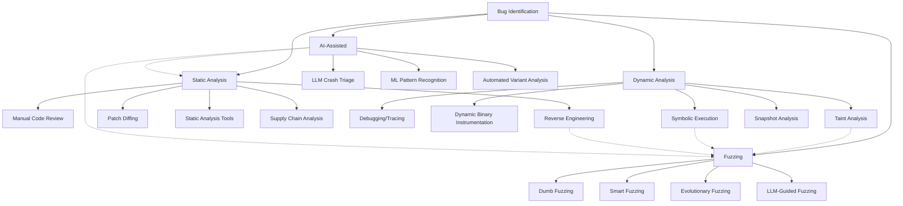

# Bug Identification

## Overview

Bug identification is the process of discovering potential vulnerabilities in software through various techniques including static analysis, dynamic analysis, and fuzzing. This document outlines methodologies and tools for effective vulnerability research.

For practical exploit development, see [Exploit Development](/exploit/development.md).



## Vulnerability Research Methodology

### Phase 1: Reconnaissance

- **Target Enumeration:** Identify version, dependencies, configuration
- **Attack Surface Mapping:** List all input vectors, APIs, protocols
- **Documentation Review:** RFCs, specifications, developer docs
- **Prior Art Analysis:** CVE database, exploit-db, bug trackers

### Phase 2: Static Analysis

- **Source Review:** If available, focus on parsing/validation code
- **Binary Analysis:** Reverse engineering with Ghidra/IDA
- **Patch Diffing:** Compare vulnerable vs patched versions
- **SBOM Analysis:** Check third-party component vulnerabilities

### Phase 3: Dynamic Analysis

- **Behavioral Analysis:** Monitor syscalls, network, file I/O
- **Debugging:** Trace execution paths with controlled input
- **Instrumentation:** Coverage-guided exploration
- **Taint Analysis:** Track input propagation

### Phase 4: Fuzzing

- **Corpus Generation:** Create valid seed inputs
- **Harness Development:** Isolate target functionality
- **Coverage Monitoring:** Identify untested code paths
- **Crash Triage:** Classify and prioritize findings

### Phase 5: Exploitation

- **Primitive Development:** Convert bug to reliable primitives
- **Mitigation Bypass:** Defeat ASLR, DEP, CFG, etc.
- **Payload Development:** Create working exploit
- **Weaponization:** Package for real-world use (if authorized)

## Attack Surface Identification

Before diving into specific bug hunting techniques, it's essential to understand where to look for vulnerabilities.

### Windows User Mode

- Shared Memory
- RPC
- Named Pipes
- File & Network IO
- Windows Messages
- For authentication-related vulnerabilities, see [Windows Auth](/exploit/windows-auth.md)

### Kernel

- _Device Drivers_
  - Many third-party software with drivers to target
  - Can accept arbitrary user input via the `IOCTL` interface
  - Also performs actions when we `open,close` handles to it
- _OS_
  - Drivers that handle hardware and user input
  - Intercepts/transitions from user to kernel
- _Modern Linux interfaces (hotspots)_
  - **io_uring**: SQE size/offset confusions, submission/completion race windows, kernel copy‑sizes derived from user buffers
  - **userfaultfd**: cross‑thread write‑what‑where and TOCTOU primitives during fault handling
  - **seccomp user‑notifier**: confused‑deputy patterns in broker processes; notifier time‑of‑check vs time‑of‑use gaps
- _Hyper-V & VTL Interfaces_ – On many modern Windows 11 systems (especially 24H2 on supported hardware), Virtualization‑Based Security and VTL1 are enabled or easily enabled by policy. Treat the hypervisor surface (e.g., `hvix64.exe` and synthetic MSRs) as a common kernel target, and verify VBS/HVCI status on the host before assuming defaults.

### Drivers

- _DriverEntry_: registers for any callbacks, setup structure, etc
- _I/O Handlers_: handlers that get called when a process attempts to `open,close,etc` the driver, `IOCTL` allows driver functionality to be called from user processes
- Practical triage example (CVE‑2025‑8061):
  - IOCTL handlers that accept a fixed‑size struct and pass a user‑controlled `PHYSICAL_ADDRESS` directly to `MmMapIoSpace`
  - then memcpy out/in mapped memory (sometimes via wrappers that swap src/dst) indicate physical memory read/write primitives.
  - Similarly, unguarded MSR read/write paths yield `RDMSR/WRMSR` primitives.
- See the Lenovo `LnvMSRIO.sys` case study in [windows-kernel.md](/exploit/windows-kernel.md)

### eBPF & XDP

- **BPF helpers and verifier**: pointer leaks, verifier bypass, JIT bugs
- **User‑entry vectors**: `bpf()` syscall, privileged pods in Kubernetes, Cilium datapath
- **Tooling**: `bpftool`, verifier logs, `bpftrace` scripts for quick triage
- **CO‑RE skeletons** (`bpftool gen skeleton`) simplify packaging portable tracing probes.
- **BPF LSM** hooks allow low‑overhead coverage feedback on security‑critical kernel paths; export events with `trace_pipe`.

### Container & Micro‑VM Surface

- Namespace/cgroup escapes, device‑mapper abuse, races in snapshotting backends (e.g., overlayfs)
- Micro‑VM hypercalls in Firecracker, CloudHypervisor, Kata Containers
- For detailed container exploitation techniques, see [Container](/exploit/container.md)

### Cloud‑Native & IAM Bugs

- Misconfigured IAM policies, privilege‑escalating API actions (AWS `sts:AssumeRole`, Azure Golden SAML)
- SSRF paths into metadata services (`169.254.169.254`, IMDSv2 bypass techniques)
- Race conditions in managed control‑plane components (Kubernetes API server, AWS Lambda workers)
- Kubernetes Attack Vectors: look at [kubernetes](/pentest/kubernetes.md) for a deeper checklist
- **Serverless Vulnerabilities:**
  - Lambda layer poisoning
  - Function URL authentication bypass
  - Event injection through SQS/SNS/EventBridge
  - Cold start race conditions

### Network / Transport Protocol Parsers

- **QUIC / HTTP/3**: coalesced frames, reorder/timing corner cases; verify against RFC 9000 (QUIC) and RFC 9114 (HTTP/3)
- **HTTP/2**: stream state machine desync; flow‑control integer edge cases (RFC 7540)
- **gRPC / Protobuf**: length truncation across language FFI, map/list coercion; see gRPC framing and protobuf varint rules
- **GraphQL**: input coercion and resolver recursion limits; check GraphQL spec for type coercion semantics

### WebAssembly Runtimes

- WASM JIT optimization bugs in V8, Wasmtime, Wasmer
- WASI sandbox escapes through host‑call interfaces
- Typed‑Func‑Refs, GC, Tail‑calls, Memory64 expand type/bounds confusion surface. See the WebAssembly proposals status page for current rollout and engine adoption.
- **Checklist**:
  - validate table element types/import signatures/hostcall marshalling
  - fuzz mixed 32/64-bit memories.
  - _Fuzzing tip_: compile native libs to WASM for fast, deterministic mutation cycles

### Browser / JS Engine Exploitation

#### Modern V8 Architecture (2024-2025)

V8 now uses a multi-tier JIT pipeline with distinct exploitation characteristics:

- **Ignition (Interpreter):** Bytecode interpreter; rarely targeted directly
- **Maglev (Mid-tier JIT):** Introduced Chrome 115+; simpler IR than TurboFan
- **TurboFan (Optimizing JIT):** Aggressive optimization; traditional exploitation target
- **Turboshaft:** New IR replacing TurboFan internals; different optimization patterns create new bug classes
  - Type lattice changes affecting confusion bugs
  - Maglev → Turboshaft transition paths expose state inconsistencies
  - Node-based to block-based IR transition

#### V8 Maglev Exploitation

- Integer overflow in Maglev's fast-path arithmetic
- Corrupted HeapNumber backing store via Maglev bounds check bypass
- Map/ElementsKind confusion in polymorphic inline caches

#### WebAssembly JSPI (JavaScript Promise Integration)

- **Stack Heap Spray:** Suspended WASM stacks allocated on heap; predictable layout
- **Type Confusion:** `WebAssembly.Suspending` wrapper type mismatch
- **Info Leak:** Stack pointers exposed through Promise resolution chains
- **Sandbox Escape:** JSPI bridges JS/WASM boundary; bypass traditional WASM isolation

#### Spectre-BHB Browser Mitigations

- **Chrome 120+:** Site Isolation per-frame; shared array buffer restrictions
- **Firefox 122+:** Process-per-site with BHI fences in JIT trampolines
- **Safari 17.4+:** WebKit JIT speculation guards on type checks

#### Site Isolation Plus

- **Frame-level process isolation:** Each cross-origin frame in separate process
- **Cross-origin memory protection:** Hardware-backed memory isolation
- **New IPC attack surface:** Mojo interface exploitation required for escapes
- **Renderer → Browser requirements:** Need Mojo race or type confusion
- New Info-Leak Requirements:
  - Traditional `SharedArrayBuffer + Atomics` timing attacks less reliable
  - Need alternative side-channels: CSS timing, WebGL shader execution, AudioContext
  - Cross-origin info leaks require chaining multiple primitives

#### Practical Browser Exploitation Workflow

1. **Target Selection:**
   - V8 Maglev for Chrome/Edge (faster development cycle = more bugs)
   - JSC for Safari (less scrutiny than V8)
   - SpiderMonkey for Firefox (IonMonkey/Warp still viable)

2. **Primitive Development:**
   - `addrof`: Leak object addresses (info leak)
   - `fakeobj`: Craft fake object (type confusion)
   - `arbread/arbwrite`: Arbitrary memory access
   - `shellcode`: RWX page or WASM JIT abuse

3. **Sandbox Escape:**
   - Mojo IPC race conditions
   - GPU process exploitation via WebGL
   - Utility process TOCTOU (Chrome's new architecture)

4. **Post-Exploitation:**
   - Chrome: Target browser process via Mojo
   - Safari: XPC service exploitation for sandbox escape
   - Firefox: Target parent process via IPC

### Firmware & Embedded

- UEFI DXE driver flaws, BMC web console auth bypass, ECU/CAN message injection
- BLE & Zigbee stack overflows, heap exploits in `btstack`, `lwIP`

### macOS / Apple‑Silicon Kernel

- IOKit user‑client input validation, IOMFB allocator corner‑cases
- Hypervisor.framework fuzzing with `hv_fuzz`

### Mobile Platforms (iOS/Android)

#### iOS 17+ Exploitation

- **PAC Bypass:** Pointer Authentication Code bypass via signing gadgets
- **PPL Bypass:** Page Protection Layer exploitation for kernel r/w
- **Secure Enclave:** SEP exploitation via malformed Mach messages
- **Neural Engine:** ANE kernel driver attack surface

#### Android 14+ Exploitation

- **MTE (Memory Tagging):** Probabilistic bypass with tag collisions
- **GKI (Generic Kernel Image):** Vendor hooks as attack surface
- **Scudo Hardening:** Heap exploitation with hardened allocator
- **Hardware Attestation:** Keymaster/StrongBox TEE attacks

#### Cross-Platform Mobile

- **Flutter:** Dart VM type confusion, FFI boundary issues
- **React Native:** JavaScript bridge serialization bugs
- **Unity:** IL2CPP memory corruption, native plugin vulnerabilities

### Supply Chain Attack Surface

#### Package Manager Vulnerabilities

- **Dependency Confusion:** Internal vs public package name conflicts
- **Typosquatting:** Similar package names (numpy vs numpi)
- **Manifest Manipulation:** Lock file poisoning, version pinning bypass
- **Build-time Injection:** Malicious install scripts, post-install hooks

#### CI/CD Pipeline Analysis

- **GitHub Actions:** Workflow poisoning via PR from forked repos
- **Jenkins:** Groovy script injection, plugin vulnerabilities
- **Docker:** Build argument exploitation, base image substitution
- **Secrets Exposure:** Environment variables in build logs, artifact leakage

### AI & LLM Application Security

- Prompt‑injection, sandbox boundary escapes, hidden‑channel data exfil
- See [AI Security](/pentest/ai.md) for a deeper checklist

### Confidential‑Computing / TEE Surface

- **Intel TDX**: diff `tdx.ko` or `tdx_psci.c` between kernel LTS branches to spot new GPA→HPA validation checks.
- **AMD SEV‑SNP**: look for unchecked `VMGEXIT` leafs in PSP firmware; `sevtool --decode` helps locate IDA entry points.
- **Arm CCA / RMM**: analyze SMC handlers inside Realm Management Monitor (RMM) EL3 firmware.
- **Cloud offerings (Azure CCE, Google C3)**: focus on paravirtualised MMIO and attestation report flows exposed to guests.
- For TEE-specific exploitation, see [Secure Enclaves](/exploit/secure-enclaves.md)

### GPU & vGPU Surface

- **HGX HMC (verify CVE/advisories)**: research indicates malformed NVLINK‑C2C packets can corrupt HMC register space; confirm against vendor advisories for the specific platform.
- **vGPU manager IOCTLs**: diff `nvidia‑vgpu‑mgr` monthly; watch `VGPU_PLUGIN_IOCTL_GET_STATE` and similar calls for unchecked buffers.
- **LeftoverLocals info‑leak**: contiguous VRAM allocations can leak data from prior tenants in multi‑tenant AI clusters.

### Hardware Security Attack Surface

#### Side-Channel Analysis

- **Power Analysis:** DPA/SPA attacks on cryptographic operations
- **Electromagnetic (EM):** Near-field probing of processor emissions
- **Timing Attacks:** Cache timing, branch prediction analysis
- **Acoustic:** Key extraction via CPU sound emissions

#### Fault Injection

- **Voltage Glitching:** Brown-out attacks on secure boot
- **Clock Glitching:** Skip instruction execution
- **Laser Fault Injection (LFI):** Targeted bit flips
- **EM Pulse Injection:** Wider area fault induction

#### Hardware Implants & Supply Chain

- **PCB Modification:** Added components, trace rerouting
- **Firmware Backdoors:** UEFI/BMC persistent implants
- **Hardware Trojans:** Malicious logic in ICs
- **DMA Attacks:** PCIe, Thunderbolt, FireWire exploitation

### EDR Driver Vulnerability Research

#### Common vulnerability types in EDR drivers

- Authorization bypass issues
- Memory corruption in IOCTL handlers
- Race conditions in driver communication
- Improper input validation
- For detailed EDR analysis techniques, see [EDR](/exploit/edr.md)

#### Research methodology

1. Identify accessible driver interfaces
2. Reverse engineer IOCTL/message handlers
3. Analyze authorization mechanisms
4. Test for input validation flaws
5. Look for race conditions and memory corruption

#### Tools for driver analysis

- IDA Pro / Ghidra for reverse engineering
- WinDbg for dynamic analysis
- Process Monitor for behavior analysis
- Custom fuzzing tools for interface testing

#### Quick triage rubric (post‑crash)

- Buffer overflow vs UAF: check access type, allocation lifetime, and red‑zones (ASan/KASAN reports)
- Integer issues: trace size/length and allocation math; look for truncation/casts
- Logic bugs: unexpected state transitions without memory errors; validate auth/flags
- Info‑leaks: uninitialized reads, OOB reads, pointer/string formatters

#### Coverage‑first recon checklist

- Produce one baseline coverage run (e.g., `drcov`, Intel® PT, or Lighthouse import)
- Identify cold paths reachable from attacker inputs
- Seed corpus: include minimal valid examples that traverse target parsers
- Enable lightweight oracles (ASan/UBSan/KASAN) where feasible to maximize signal

## Static Analysis Methods

Static analysis examines code without execution to identify potential vulnerabilities.

### Manual Code Review

- Installing the target application and examining its structure
- Enumerating the ways to feed input to it
- Examine the file formats and network protocols that the application uses
- Locating logical vulnerabilities or memory corruptions
- For Windows-specific techniques, see [Windows Kernel](/exploit/windows-kernel.md)
- For Linux-specific techniques, see [Linux](/exploit/linux.md)

### Patch Diffing

Patch diffing compares vulnerable and patched versions of binaries to identify security changes.

#### What is Patch Diffing

Patch diffing is a technique to identify changes across versions of binaries related to security patches. It compares a vulnerable version of a binary with a patched one to highlight the changes, helping to discover new, missing, and interesting functionality across versions.

##### Benefits

- **Single Source of Truth**: Without a CVE blog post or sample POC, a patch diff can be the only source of information to determine changes and deduce the original issue.
- **Vulnerability Discovery**: While understanding the original issue, you may discover additional vulnerabilities in the troubled code area.
- **Skill Development**: Patch diffing provides focused practice in reverse engineering and helps build mental models for various vulnerability classes.

##### Challenges

- **Asymmetry**: Small source code changes can drastically affect compiled binaries.
- **Finding Security-Related Changes**: Security patches often include other changes like new features, bug fixes, and performance improvements.
- **Minimizing Noise**:
  - Diff the correct binaries to avoid analyzing unrelated updates
  - Reduce the time delta between compared versions
  - Use binary symbols when available to add precision to comparisons

#### Tools

- IDA Pro with plugins like DarunGrim and Diaphora
- BinDiff Works with analysis output from IDA or Ghidra
- [Ghidriff](https://github.com/clearbluejar/ghidriff): Ghidra binary diffing engine
- Radare2 (radiff2)
- Ghidra Version Tracking Tool
- Ghidra 11 built-in Partial Match Correlator

#### Patch Diffing Workflow

The process of patch diffing typically follows these steps:

1. **Preparation**
   - Create a diffing session
   - Load binary versions (vulnerable and patched)
   - Ensure binaries pass preconditions
   - Run auto-analysis on both binaries

2. **Evaluation**
   - Run correlators to find similarities
   - Generate associations between binaries
   - Evaluate matches between functions
   - Accept matching functions
   - Analyze differences until sufficient understanding is reached

3. **Function Analysis**
   - **Identify new functions**: Functions in the patched binary with no match in the original
   - **Identify deleted functions**: Functions in the original binary with no match in the patched version
   - **Identify changed functions**: Functions that exist in both versions but have been modified
   - Focus on functions with security relevance (often indicated by their names or based on CVE descriptions)

4. **Interpreting Results**
   - New functions often indicate added security checks or validation
   - Changed functions may show modified logic for handling edge cases
   - Correlate changes with public CVE information when available
   - Remember that patches are not necessarily atomic - multiple issues may be fixed in one update

When using Ghidra's Version Tracking:

- Use "Show Only Unmatched Functions" filter to identify new or deleted functions
- Look for functions with a similarity score below 1.0 to find modified functions
- Examine the modified functions to understand what security checks were added

Starting with Ghidra 11 (December 2024) a built-in _Partial Match Correlator_ covers most PatchDiffCorrelator use-cases; install the plugin only if you need bulk-mnemonics scoring.

#### Case Study: 7‑Zip Symlink Path Traversal

- Target: 7‑Zip 24.09 (vulnerable) → 25.00 (fixed)
- File of interest: `CPP/7zip/UI/Common/ArchiveExtractCallback.cpp`
- High‑signal edits: absolute‑path detection and link‑path validation for WSL/Linux symlinks converted on Windows.

##### Minimal security‑relevant diff (simplified):

```cpp
-bool IsSafePath(const UString &path)
+static bool IsSafePath(const UString &path, bool isWSL)
{
  CLinkLevelsInfo levelsInfo;
-  levelsInfo.Parse(path);
+  levelsInfo.Parse(path, isWSL);
  return !levelsInfo.IsAbsolute
      && levelsInfo.LowLevel >= 0
      && levelsInfo.FinalLevel > 0;
}

+bool IsSafePath(const UString &path);
+bool IsSafePath(const UString &path)
+{
+  return IsSafePath(path, false); // isWSL
+}

-void CLinkLevelsInfo::Parse(const UString &path)
+void CLinkLevelsInfo::Parse(const UString &path, bool isWSL)
{
-  IsAbsolute = NName::IsAbsolutePath(path);
+  IsAbsolute = isWSL ? IS_PATH_SEPAR(path[0]) : NName::IsAbsolutePath(path);
  LowLevel = 0;
  FinalLevel = 0;
}
```

##### Root cause (logic):

- Linux/WSL symlink data containing a Windows‑style path (e.g., `C:\...`) was treated as relative by the Linux absolute‑path check, setting `linkInfo.isRelative = true`.
- `SetFromLinkPath` prefixed the symlink’s zip‑internal directory when building `relatPath`, letting `IsSafePath(relatPath)` pass despite an absolute Windows target.
- A subsequent “dangerous link” guard checked `_item.IsDir`; non‑directory symlinks skipped the validation.
- Result: symlink creation to arbitrary absolute Windows paths; extracted files written into the link target.

##### Practical triage checklist:

- Search this file for: `IsSafePath`, `CLinkLevelsInfo::Parse`, `SetFromLinkPath`, `CloseReparseAndFile`, `FillLinkData`, `CLinkInfo::Parse`, `_ntOptions.SymLinks_AllowDangerous`.
- Verify absolute‑path detection across OS semantics (Linux vs Windows) and that relative/absolute status cannot be desynced by mixed‑style paths.
- Ensure “dangerous link” checks run for both files and directories; avoid `_item.IsDir` short‑circuiting validation for file symlinks.
- Confirm `IsSafePath` evaluates the final target path after concatenations; normalize before validation.

##### Quick repro (Windows, developer mode or elevated):

- Create zip structure:
  - `data/link` → symlink to `C:\Users\<USER>\Desktop`
  - `data/link\calc.exe` → payload file
- If `link` is extracted first, subsequent writes follow the symlink into the absolute target directory.

#### Apple Patch Diffing

- Identify a CVE of interest
- Download corresponding IPSW and update and N-1
  - use [ipsw.me](https://ipsw.me/) to download those files
  - convert the downloaded `.ipsw` to `.zip`
- Determine changes for update
  - you can use [IPSW tool](https://github.com/blacktop/ipsw) to download and diff
- Map binaries to CVE
- Extract the related file(s)
- Diff the binaries
  - In Ghidra set Decompiler Parameter ID to true
  - Leverage [IDAObjectTypes](https://github.com/PoomSmart/IDAObjcTypes)
- Root cause the vulnerability

```bash
# Downloading the correct IPSWs
ipsw download --device Macmini9,1 -V -b 23A344
ipsw download --device Macmini9,1 -V -b 23B74

# Comparing two different IPSWs
ipsw diff UniversalMac_14.0_23A344.ipsw UniversalMac_14.1_23B74.ipsw

# What is inside the DSC
ipsw extract -d IPSW

# Extracting files
ipsw extract -f -p file

# Extracting specific architecture file
ipsw macho lipo Contacts
```

#### Windows 11 Patch Diffing

This checklist mirrors the Apple IPSW workflow but uses Microsoft tooling and build numbers.

1. Identify the target update
   - Open **Settings → Windows Update → Update history** or consult the Windows Release Health dashboard to note the **KB** and **OS build** numbers (e.g., _KB5037778 → build 22631.3525_).
   - Record the previous build you want to diff against (e.g., _22631.3447_).

2. Collect the binaries

```bash
winbindex download tcpip.sys 10.0.22631.3447 10.0.22631.3525

mkdir pre,post
wget -Uri https://www.catalog.update.microsoft.com/Download.aspx?q=KB5037778 -OutFile kb.msu
expand -F:* .\kb.msu .\post
# repeat for the older KB into .\pre
# Download both *UUP* bundles, then run
uup_download_windows.cmd --extract
# and copy changed PE files to *pre* / *post*
```

3. Fetch matching symbols

```powershell
# Requires Debugging Tools for Windows
foreach ($ver in '3447','3525') {
    symchk /r .\$ver /s SRV*https://msdl.microsoft.com/download/symbols
}
```

4. Load in the disassembler
   - Open _tcpip.sys_ from both **pre** and **post** folders in **IDA 8+** or **Ghidra 11**; ensure PDB symbols resolve.
   - Save the IDA databases (e.g., `tcpip_3447.i64`, `tcpip_3525.i64`).

5. Run the diff
   - **BinDiff 7**: _Tools → BinDiff → Diff Database…_ and select the two IDBs to generate a `.BinDiff` report.
   - **Ghidriff** (headless):
     ```bash
     ghidriff diff pre/tcpip.sys post/tcpip.sys -o tcpip.diff
     ```

6. Triage the results
   - Sort by _Similarity %_ ascending; investigate anything below **95 %**.
   - Focus on functions with names like `Validate`, `Parse`, `Copy`, `Check`, or protocol‑specific handlers (`IppReceiveEsp`, `Ipv6pFragmentReassemble`, etc.).
   - Determine whether changes add bounds checks, size validations, or privilege checks.

7. Validate in a lab VM
   - Snapshot two Windows 11 VMs (build **3447** and **3525**).
   - Attach WinDbg (kernel mode) using `bcdedit /dbgsettings net hostip:<IP> port:<PORT>`.
   - Reproduce the issue against the **pre‑patch** VM; confirm no crash or breakpoint triggers in the **post‑patch** VM.

8. Automate monthly
   - Schedule a PowerShell script that, every Patch Tuesday (second Tuesday), downloads the latest Cumulative Update, extracts changed PE files, retrieves symbols, and launches a headless **Diaphora** diff.
   - Email the generated HTML report to quickly spot new attack surface.

> [!TIP]
> For large modules like **ntoskrnl.exe**, diff only the `.text` section to save RAM:  
> bindiff --primary ntoskrnl_pre.i64 --secondary ntoskrnl_post.i64 --section .text

#### Linux Kernel Patch Diffing

Patch‑diffing Linux kernels is often faster at the source level, but for binary‑only targets (vendor kernels, modules) function‑level diffing is still practical.

1. Identify target builds
   - Note distro and kernel build (e.g., Ubuntu `6.8.0-47-generic`, RHEL `5.14.0-503`).
   - Capture both pre and post versions (package changelogs or CVE bulletins help).

2. Fetch kernel images and debug info
   - Ubuntu/Debian:
     ```bash
     # Discover versions
     apt list -a linux-image-generic | cat
     # Download image + modules dirs (repeat for both versions)
     apt-get download linux-image-unsigned-<ver>-generic linux-modules-<ver>-generic
     # Debug symbols via debuginfod (preferred to ddebs)
     export DEBUGINFOD_URLS="https://debuginfod.ubuntu.com https://debuginfod.debian.net"
     ```
   - Fedora/RHEL/CentOS:
     ```bash
     dnf download kernel-core-<ver> kernel-debuginfo-<ver>
     rpm2cpio kernel-core-<ver>.rpm | cpio -idmv
     rpm2cpio kernel-debuginfo-<ver>.rpm | cpio -idmv
     ```

3. Extract `vmlinux`

   ```bash
   # If only vmlinuz is present, use the upstream helper
   /usr/src/linux-headers-<ver>/scripts/extract-vmlinux /boot/vmlinuz-<ver> > vmlinux-<ver>
   # Or take vmlinux directly from debuginfo package tree
   ```

4. Identify changed modules quickly

   ```bash
   # Compare module trees (pre vs post)
   rsync -rcn --delete /lib/modules/<pre>/ /lib/modules/<post>/ | grep -E "\.ko$" | sed 's/^/chg: /'
   ```

5. Function‑level binary diff
   - Open `vmlinux-<pre>` and `vmlinux-<post>` in Ghidra 11/IDA 8 and run Diaphora/BinDiff/Ghidriff.
   - For hot subsystems (e.g., `io_uring`, `net/ipv6`, `fs/overlayfs`), diff only the relevant `.ko` pairs to reduce noise.

6. Source‑level triage (when sources are available)

   ```bash
   # Ubuntu example: unpack both source trees, then
   git diff --no-index -- function.c.orig function.c.patched | less
   # Or use diffoscope for enriched reports
   ```

7. Symbolization and crash mapping (cheat‑sheet)

   ```bash
   # Decode kernel oops backtraces to lines
   ./scripts/decode_stacktrace.sh vmlinux /lib/modules/<ver>/build < dmesg.log
   # Map PC to file:line quickly
   addr2line -e vmlinux-<ver> 0xffffffff81234567
   ```

> [!TIP]
> For modern distros built with Clang: KCFI and fine‑grained CFI thunks create many small stub changes; filter by real function body deltas to focus on security‑relevant logic.

> [!NOTE]
> Syzkaller routinely bisects kernel bugs; consult syzbot reports for reproducers and fix commits, then confirm your diff isolates the same region before deeper RE.

#### Kernel network parser identification heuristics (SMB2-inspired, broadly applicable)

##### Cross-field invariants (length/offset/next)

- Always validate `(offset + length) <= remaining_buffer` and `<= total_buffer` using a widened type (e.g., `u64`) before arithmetic; reject on overflow with `check_add_overflow()`/`array_size()` helpers.
- For chained entries with a `next` field, assert: `next >= sizeof(entry_header)`, `next <= remaining_buffer`, and that pointer advancement actually makes progress. For entries carrying sub-lengths (e.g., `name_len`, `value_len`), assert `header + name_len + value_len <= next`.
- Do not cast to a struct until the full header is present and aligned; gate recasts with a prior `buf_len` check.

##### Fixed-size buffers vs variable-length payloads

- Ban unbounded copies/crypto/decompression into fixed-size arrays. Require `len <= sizeof(array)` (or clamp with `min_t()` and bail) when writing into in-struct arrays.
- Crypto transforms are just writes with extra steps: if using ARC4/AES helpers that copy `len` bytes into a fixed buffer (e.g., session keys), bound `len` against a named maximum constant and prefer allocating a buffer sized from validated `len`.

##### Type/width hazards

- Normalize parser math to a wide unsigned type before comparisons; avoid truncating `u32/u64` fields into `u16` for size checks. Favor `size_t/u64` for `offset+len` arithmetic, then compare to `buf_len` of the same width.

##### Loop structure around `next`

- Pattern to flag: `e = (struct entry *)((char *)e + next);` without a preceding block that revalidates `buf_len` and the entry’s internal sub-lengths.
- Ensure a break condition on exhaustion and reject zero/negative progress values to avoid infinite loops or pointer stagnation.

##### Allocation-size correlation

- When parser-controlled `len` influences a subsequent write into an object from a fixed SLUB cache (e.g., `kmalloc-512`), ensure the write length is bounded by the destination object field, not just the incoming length.

##### Patch-diff signals to prioritize

- Newly added guards like `if (len > CONST) return -EINVAL;`, `if (buf_len < sizeof(struct foo)) return -EINVAL;`, or conversions to `min_t(size_t, len, sizeof(...))`.
- Insertions of `check_add_overflow(offset, len, &sum)` or `array_size(n, sz)` helpers in hot parse paths.

##### Static query seeds (Semgrep/CodeQL), to tune per codebase

- Unbounded copies into struct fields:
  ```yaml
  rules:
    - id: c-fixed-array-unbounded-copy
      languages: [c, cpp]
      patterns:
        - pattern: memcpy($DST, $SRC, $LEN)
        - pattern-inside: |
            struct $S { ... char $BUF[$N]; ... };
            ...
            $DST = &...->$BUF
        - pattern-not: memcpy($DST, $SRC, MIN($LEN, sizeof(*$DST)))
      message: Unbounded copy into fixed-size struct field
      severity: WARNING
  ```
- Dangerous `next`-driven pointer arithmetic without bounds checks:
  ```yaml
  - id: c-parser-next-missing-bounds
    languages: [c, cpp]
    pattern: |
      $E = (struct $T *)((char *)$E + $NEXT);
    message: Parser advances by user-controlled 'next' without prior buf_len/sizeof checks
    severity: WARNING
  ```
- Crypto/decompression writes to fixed arrays (seed with function names in your tree, e.g., `*_crypt`, `*_decrypt`, `decompress_*`).

##### Dynamic confirmation (cheap)

- Grammar fuzz small invariants: send `next < header`, `next > remaining`, `name_len + value_len > next`, and `len > MAX_CONST` variants; expect `-EINVAL`/reject. If not, investigate.
- Use TUN/TAP + KCOV to drive packet/SMB request paths; enable KASAN/KMSAN to surface overflows/leaks early.

##### Reference (motivating example)

- Lessons distilled from a 2025 ksmbd remote chain writeup combining a fixed-buffer overflow in NTLM auth with an EA `next` validation issue — see Will’s Root: Eternal‑Tux: KSMBD 0‑Click RCE (`https://www.willsroot.io/2025/09/ksmbd-0-click.html`).

#### Case Study: EvilESP Vulnerability (CVE-2022-34718)

This case study demonstrates real-world patch diffing to identify a Windows TCP/IP RCE vulnerability.

##### Vulnerability Overview

- CVE-2022-34718: Critical RCE in `tcpip.sys` discovered in September 2022
- An unauthenticated attacker could send specially crafted IPv6 packets to Windows nodes with IPsec enabled
- Affects the handling of ESP (Encapsulating Security Payload) packets in IPv6 fragmentation

##### Patch Diffing Process

1. **Binary Acquisition**
   - Used Winbindex to obtain sequential versions of `tcpip.sys` (pre-patch and post-patch)
   - Loaded both files in Ghidra with PDB symbols

2. **Diff Analysis**
   - Used BinDiff to compare the binaries
   - Identified only two functions with less than 100% similarity: `IppReceiveEsp` and `Ipv6pReassembleDatagram`

3. **Code Analysis**
   - **Ipv6pReassembleDatagram**: Added bounds check comparing `nextheader_offset` against the header buffer length
   - **IppReceiveEsp**: Added validation for the Next Header field of ESP packets

4. **Root Cause Identification**
   - Found an out-of-bounds 1-byte write vulnerability
   - ESP Next Header field is located after the encrypted payload data
   - A malicious packet could cause `nextheader_offset` to exceed the allocated buffer size

_(Update: Server 2022 build 20349.2300, May 2024, hardened this code path; the original PoC needs a 2-byte pad tweak to reproduce the crash.)_

##### Exploitation

- Required setting up IPsec security association on the victim
- Created fragmented IPv6 packets encapsulated in ESP
- Controlled the offset of the out-of-bounds write through payload and padding size
- Value written is controllable via the Next Header field
- Limited to writing to addresses that are 4n-1 aligned (where n is an integer)
- Initially achieved DoS with potential for RCE through further exploitation

##### Lessons Learned

- Binary patch diffing effectively identified the vulnerability location and nature
- Understanding protocol specifications (ESP and IPv6 fragmentation) was critical
- Simple buffer checks are still overlooked in complex networking code
- Even limited primitives (single byte overwrite at constrained offsets) can be dangerous
- For modern exploitation techniques, see [Modern Samples](/exploit/modern-samples.md)
- For mitigation bypass techniques, see [Modern Mitigations](/exploit/modern-mitigations.md)

When applying patch diffing to networking protocols:

1. Understand the protocol specifications thoroughly
2. Look for missing bounds checks in data processing
3. Pay attention to buffer size calculations
4. Check for proper validation of protocol field values and locations
5. Consider evasion techniques for exploit deployment - see [EDR](/exploit/edr.md)
6. Specs: ESP (RFC 4303) and IPv6 (RFC 8200) are essential references when reasoning about header placement and bounds

#### Semi-Automatic Patch Diffing

- Use [WinbIndex](https://winbindex.m417z.com/) to download the changed binary and then use [BinDiff](https://www.zynamics.com/bindiff.html) or [Ghidriff](https://github.com/clearbluejar/ghidriff) to actually see the diff itself
- You can also use [Diaphora](https://github.com/joxeankoret/diaphora) instead of BinDiff

#### Manual Patch Diffing

- Microsoft releases patches on the second Tuesday of each month
- For Windows you can go to [update catalog](https://www.catalog.update.microsoft.com/Search.aspx) and search for the product version (for example `2022-10 x64 "Windows 10" 22H2`)
- Try to look for smaller updates

```shell
mkdir 2022-09
mv *.msu 2022-09
cd 2022-09
mkdir extract
mkdir patch
expand -F:* .\*.msu .\extract
expand -F:* .\extract\<largest>.cab .\patch
expand -F:* .\patch\<largest>.cab .\patch
expand -F:* .\patch\Cab_* .\patch\
```

You can use [Patch Extract](https://gist.github.com/abzcoding/f6191c3aa9ca6d019f360b429d6b510f) instead

```shell
gci -Recurse c:\windows\WinSxS\ -Filter ntdll.dll
# copy the biggest file somewhere
.\delta_patch.py -i .\NTDLL\ntdll.dll -o ntdll.2020-10.dll .\NTDLL\r\ntdll.dll .\2020-10\x64\ntdll_<stuff>\f\ntdll.dll
.\delta_patch.py -i .\NTDLL\ntdll.dll -o ntdll.2020-11.dll .\NTDLL\r\ntdll.dll .\2020-11\x64\ntdll_<stuff>\f\ntdll.dll
```

Open unpatched version in IDA as the primary and the second, after that use BinDiff add-on to find the differences between them
then right click on a different matched function and see the visual diff in bin diff
also you can uncheck proximity browsing to see the entire function
look at red blocks and then yellow blocks

With patch clean script you can only see the actual changed files

### Static Analysis Tools

#### IDA Pro and Rust Tools for Vulnerability Research

- [rhabdomancer](https://github.com/0xdea/rhabdomancer): IDA Pro headless plugin that locates calls to potentially insecure API functions in binary files
  - Helps auditors backtrace from candidate points to find pathways allowing access from untrusted input
  - Generates JSON/SARIF reports containing vulnerable function calls and their details
  - Written in Rust using IDA Pro 9 idalib and Binarly's idalib Rust bindings

- [haruspex](https://github.com/0xdea/haruspex): IDA Pro headless plugin that extracts pseudo-code generated by IDA Pro's decompiler
  - Exports pseudo-code in a format suitable for IDEs or static analysis tools like Semgrep/weggli
  - Creates individual files for each function with their pseudo-code
  - Can be used as a library by third-party crates

- [augur](https://github.com/0xdea/augur): IDA Pro headless plugin that extracts strings and related pseudo-code from binary files
  - Stores pseudo-code of functions that reference strings in an organized directory tree
  - Helps trace how strings are used within the application
  - Complements other reverse engineering tools

#### Modern Static Analysis Tools

- **Semgrep Pro** – Cloud-augmented SAST with custom rule sharing, LLM-assisted rule writing
- **CodeQL** – GitHub's semantic code analysis, excellent for variant analysis
- **Weggli** – Fast semantic search for C/C++ (better than grep for code patterns)
- **Joern** – Code property graph analysis for vulnerability discovery
- **Ghidra 11.2+** – Built-in ML-powered function signature recognition
- **Binary Ninja 4.0** – Cloud collaboration, improved HLIL decompilation
- **Cutter** – Rizin GUI with built-in decompiler integration

#### Deprecated Tools (Avoid)

- **Intel Pin** → Use DynamoRIO or Frida (Pin is sustain-only mode)
- **WinAFL** → Use AFL++ 4.x (integrated Windows support)
- **Old BinDiff** → Use BinDiff 8 or Ghidriff

For more details about these tools: [Streamlining vulnerability research with IDA Pro and Rust](https://security.humanativaspa.it/streamlining-vulnerability-research-with-ida-pro-and-rust/)

## Dynamic Analysis Methods

Dynamic analysis examines code during execution to identify vulnerabilities in real-time operation.

### Hybrid Reverse Engineering (dynamic)

Reverse engineering involves analyzing an application while it runs to understand its behavior.

#### Network Protocol Analysis Example

- Identify ports used by a program
- Use WinDbg to debug it
- Set a breakpoint on `bp wsock32!recv`
- Write a python script to send data to that port
- After your breakpoint hits, continue execution using `pt` and check `rax` for result and `dd rsp L5` for input buffer
- `lm m <exe_name>` to identify its location on the disk
- Open that executable with IDA and rebase module
- Use the information printed by WinDbg `k` command to find the location you need to investigate
- Set a hardware breakpoint on your input buffer, only check functions that touches it
- Dump the callstack when your breakpoint got hit
- Try to identify the correct packet structure
- Then try to send proper malformed packets to crash it

#### Hypervisor Debugging and Analysis

- Debugging Windows Hypervisor (Hyper-V) requires specialized setup and knowledge
- Setup requirements:
  - Host: Windows 10/11 with WinDbg
  - Guest: Windows VM with Virtualization-based security (VBS) enabled
  - Configure debugging with `bcdedit /hypervisorsettings` commands

- Analyzing Hypervisor components:
  - Target `hvix64.exe` (Intel processor hypervisor core)
  - Use bindiff with `winload.efi` and older versions of `hvloader.dll` for insight
  - Leverage Hypervisor Top Level Functional Specification (TLFS) documentation

- Inspecting Secure Kernel (SK) Calls:
  - Monitor VTL calls (transitions from VTL0 to VTL1)
  - Use conditional breakpoints on `nt!VslpEnterIumSecureMode`
  - Examine secure service call numbers (SSCN)
  - Use tools like hvext to translate guest virtual addresses

- Memory access techniques:
  - Translate Guest Virtual Address (GVA) to Guest Physical Address (GPA)
  - Translate GPA to Host Physical Address (HPA) when needed
  - Understand Second Level Address Translation mechanisms

- For mitigation techniques, see [Mitigation](/exploit/mitigation.md) or [Modern Mitigations](/exploit/modern-mitigations.md)

### Binary Instrumentation

Binary instrumentation is a prerequisite for advanced dynamic analysis methods.

- [Intel Pin](https://www.intel.com/content/www/us/en/developer/articles/tool/pin-a-dynamic-binary-instrumentation-tool.html): is a dynamic binary instrumentation framework
  - It enables you to write modules that execute some program and insert code into it at execution time to track things
  - Can easily hook any function in the program and collect runtime data
  - Can be combined with Ghidra/IDA to provide more information
    > [!NOTE]
    > Intel Pin is now in sustain‑only mode — no new ISA extensions will be added. Prefer **DynamoRIO** or **Frida‑Stalker** for forward‑looking projects.
- [DynamoRIO](https://github.com/DynamoRIO/dynamorio): more powerful and faster alternative to `Intel Pin`, but harder to setup
- `Frida`: Slower, better for mobile applications

### Dynamic Taint Analysis

- Technique to determine how data flow through a given program and influence its state
- Done by marking certain bytes of memory and tracking how it flows through program execution
- Often implemented on top of dynamic binary instrumentation tools like Intel Pin
- Steps:
  - Define taint sources: data that you want to track
  - Define taint sinks: program locations that we want to check if they get influenced by data from taint sources
  - Tracking input propagation: all instructions handling taint data need to be instrumented

### Symbolic Execution

- Transform the program into a mathematical equation that can be solved
- Instructions are simulated to maintain a binary formula describing the satisfied conditions for each path
- Scan types:
  - `Static`: [S2E](https://github.com/S2E/s2e) based on source code, not reliant on architecture, very hard to reason about kernel/libraries
  - `Dynamic`: combine concrete state with symbolic state, scales better
- Engine types:
  - `Full System`: operates on the entire VM by integrating with hypervisors, very powerful but hard to use
  - `Binary`: [Triton](https://github.com/JonathanSalwan/Triton) based on Pin/Taint Analysis and [Angr](https://github.com/angr/angr) based on `VEX-IR`
  - `Source Code`: [Klee](https://github.com/klee/klee) based on LLVM
- You can augment fuzzers via symbolic execution, [driller](https://github.com/shellphish/driller) is an example

#### Challenges with Symbolic Execution

- Memory
  - Complex data structures are hard to symbolize
- Environment
  - How are library and system calls handled
  - Symbolically executing massive library functions hurt performance
- State/Path Explosion
  - Biggest issue, loops/nested conditionals exponentially increases execution state
  - Heuristics are often used to determine with paths to follow
- Constraint Solving
  - Once the formula gets large enough, it gets hard to solve and impacts performance

### eBPF‑based Dynamic Tracing

- **bpftrace** / **BCC**: attach uprobes/kprobes to collect heap, syscall, or scheduler events with minimal overhead
- Ideal for pre‑fuzz triage and live coverage measurement on kernels or containerised workloads

### Coverage Recon (quick)

```bash
# Collect light coverage then visualize
drrun -t drcov -- ./target @@
python3 drcov2lcov.py ./drcov.*.log > coverage.info
genhtml coverage.info -o cov_html
```

- Load into Lighthouse (IDA) or lcov HTML to identify cold paths reachable from attacker input
- Use results to select fuzz targets and build a minimal, representative seed corpus

## Fuzzing

Fuzzing is a technique where you feed the application malformed inputs and monitor for crashes or unintended behaviors. See the dedicated [Fuzzing](/exploit/fuzzing.md) document for more detailed techniques.

### Fuzzing Overview

#### What is Fuzzing?

- Target software parses controllable input
- We create and/or mutate input and feed it into program
- Find crashes

#### What a Fuzzer Does

- Generic but platform/architecture specific
- Handles Input Generation/Mutation/Saving (called Corpus)
- Instrumenting Target (running, resetting, getting feedback)
- Reporting Crashes

#### What a Harness Does

- Target Specific
- Handles Feeding the input into the target

#### Fuzzer vs Harness Relationship

- Find Top Level Callable Functions
- Use Harness to Call that Function and Feed Input to it
- Fuzzer Generates and Sends the Input to Harness and Collects Coverage and Detects Crashes

### Crash Detection Techniques

- Paged Heap (heap overflows, UAF)
  - Guard pages between allocations
- Address Sanitizer (overflows + more)
  - Shadow memory (by inserting red zones in-between stack objects)
- Memory Sanitizer (uninitialized variable read)
  - Memory Leak, Used to Break ASLR
- Cluster crashes with token‑based Capstone‑hashing or `gdb‑script dedup.py` before manual analysis.

### Fuzzing Tools

#### Modern Fuzzing Frameworks

- **AFL++ 4.21+** – Unified cross-platform fuzzer with Windows support, CMPLOG, QEMU-mode
- **LibAFL 0.13+** – Rust-native, highly customizable, supports in-process and fork-server modes
- **Honggfuzz** – Persistent-mode Windows support, hardware-based feedback
- **Nyx** – Full-VM snapshot fuzzing with KVM acceleration
- **ICICLE** – Fast Windows kernel fuzzing framework
- **Syzkaller** – Kernel fuzzer with LLM-guided seed selection (2025)

#### Instrumentation & Coverage

- **DynamoRIO** – Used by AFL++, faster than Intel Pin (Note: Intel Pin is now sustain-only)
- **Frida Stalker** – Cross-platform dynamic instrumentation
- **Intel PT** – Hardware-accelerated coverage collection
- **Emerald** – Generates `drcov` data for coverage visualization

#### Specialized Fuzzers

- **ChatAFL / LLM-driller** – LLM-guided corpus expansion (+30% coverage on complex targets)
- **Reads-From Fuzzer (RFF)** – Concurrency fuzzer for race/TOCTOU bugs
- **LibFuzzer** – In-process, coverage-guided fuzzer for source-available targets
- **Radamsa** → **Replaced by LibAFL mutators** (more coverage-aware)

#### Symbolic Execution Engines

- **Triton** – Dynamic binary analysis framework
- **Angr** – Binary analysis platform with symbolic execution
- **Manticore** – Dynamic symbolic execution tool
- **S2E** – Selective symbolic execution platform

### Continuous-Integration Fuzzing

- **ClusterFuzzLite** – GitHub Actions/CI runner that feeds corpora to AFL++, libFuzzer or honggfuzz and files issues automatically.

### Snapshot Fuzzing

#### VMM Snapshot Fuzzing

- **QEMU Snapshots:** Fast restoration for stateful targets
- **KVM Acceleration:** Dirty page tracking for efficient resets
- **Persistent Mode:** Memory-only reset without full VM restore

### Fuzzing Types

#### Dumb Fuzzing

- Just sending random data to the target

#### Smart Fuzzing

- _Mutation Based_: Test cases are obtained by applying mutations to valid, known good samples (e.g., [Radamsa](https://gitlab.com/akihe/radamsa))
- _Generation(Grammar) Based_: Test cases are obtained by modeling files or protocol specifications based on models, templates, RFCs, or documentation (e.g., [Peach Fuzzer](https://peachtech.gitlab.io/peach-fuzzer-community/))
- _Model Based_: Test cases are obtained by modeling the target protocol/file format (when you want to test the target's ability to accept and process invalid sequences of data)
- _Differential Fuzzing_: Comparing outputs of different implementations with the same input

#### Evolutionary Fuzzing

- Test cases and inputs are generated based on the response from the program
- `AFL` is an example
- Or Google ClusterFuzz

#### Concurrency Fuzzing

- Systematically permutes thread scheduling to uncover data‑race, atomicity, and TOCTOU vulnerabilities that traditional coverage‑guided fuzzers miss

#### LLM‑Guided Fuzzing

- **ChatAFL** – integrates an LLM to propose protocol‑aware mutations; boosts state coverage on network daemons by ~40 %.
- **SyzAgent / SyzLLM (2025‑02)** – schedules kernel `syz` programs suggested by an LLM fine‑tuned on the Syzkaller corpus.
- **NumSeed** – leverages natural‑language descriptions of inputs to seed generation for binary‑only targets.

### Combined Method

The most effective approach often combines multiple techniques:

- Reverse engineer first to identify interesting parts
- Fuzz those parts to find crashes
- Investigate crashes to find exploitable vulnerabilities
- For shellcode development, see [Shellcode](/exploit/shellcode.md)

## AI/ML-Assisted Vulnerability Discovery

Modern vulnerability research increasingly leverages machine learning and large language models to accelerate discovery and analysis.

### LLM-Powered Triage and Analysis

- **Automated Crash Analysis:**
  - GPT-4/Claude for interpreting crash dumps and stack traces
  - Automated root-cause hypothesis generation from fuzzer output
  - Natural language queries against large codebases for vulnerability patterns
- **Decompilation Enhancement:**
  - Ghidra's ML-powered function signature recognition (11.2+)
  - Binary Ninja's HLIL AI improvements for cleaner pseudocode
  - Automated variable and function renaming based on context

### AI-Powered Vulnerability Scanners

- **ZeroScan:** Deep learning model trained on CVE datasets to identify vulnerability patterns in binaries
- **BigCode/StarCoder Models:** Fine-tuned on security-relevant code for pattern recognition
- **CodeQL with ML:** GitHub's semantic analysis enhanced with machine learning classifiers

### LLM-Assisted Fuzzing

- **ChatAFL:** Uses LLMs to generate input grammars and seed corpus based on protocol documentation
- **HyLLFuzz:** GPT/Llama-3 generates branch-targeted mutations achieving ~1.3× edge coverage improvement
- **Grammar Inference:** Automatically derive input structure from example files using transformer models

### Practical Integration

```python
# Example: Using local LLM for crash triage (OPSEC-safe)
from transformers import AutoTokenizer, AutoModelForCausalLM

def analyze_crash_local(crash_log, binary_info):
    model = AutoModelForCausalLM.from_pretrained("meta-llama/Llama-3-8b")
    tokenizer = AutoTokenizer.from_pretrained("meta-llama/Llama-3-8b")

    prompt = f"""Analyze this crash and suggest root cause:

Binary: {binary_info}
Crash Log:
{crash_log}

Provide: 1) Root cause hypothesis 2) Exploitability assessment 3) Suggested exploit primitive"""

    inputs = tokenizer(prompt, return_tensors="pt")
    outputs = model.generate(**inputs, max_length=1000)
    return tokenizer.decode(outputs[0])
```

### Limitations and Considerations

- **False Positives:** AI models can hallucinate vulnerabilities; manual verification essential
- **Training Data Bias:** Models trained on public CVEs may miss novel vulnerability classes
- **OPSEC:** Avoid sending proprietary code to cloud LLM APIs; use local models (Llama, Mistral)
- **Context Windows:** Most models have 4K-32K token limits; chunk large binaries/logs appropriately

## Quick Reference: Tool Selection Guide

### By Target Type

| Target               | Primary Tools     | Secondary Tools     |
| -------------------- | ----------------- | ------------------- |
| **Linux Kernel**     | Syzkaller, AFL++  | KASAN, KCOV, ftrace |
| **Windows Kernel**   | ICICLE, WinAFL    | Verifier, KFUZZ     |
| **Browsers**         | LibFuzzer, Domato | ClusterFuzz, Dharma |
| **Network Services** | AFL++, Boofuzz    | Peach, Sulley       |
| **Mobile Apps**      | QARK, Frida       | MobSF, Objection    |
| **Web Apps**         | Burp Suite, FFUF  | Nuclei, Semgrep     |
| **Firmware**         | Binwalk, EMBA     | FACT, Firmwalker    |
| **Containers**       | Trivy, Falco      | Grype, Syft         |

### By Technique

| Technique               | Recommended Tools    | Notes                          |
| ----------------------- | -------------------- | ------------------------------ |
| **Coverage Fuzzing**    | AFL++ 4.21+          | Cross-platform, CMPLOG support |
| **Snapshot Fuzzing**    | Nyx, QEMU+AFL++      | Stateful target support        |
| **Concurrency Fuzzing** | RFF, ThreadSanitizer | Race condition detection       |
| **Symbolic Execution**  | Angr, Triton         | Path exploration               |
| **Taint Analysis**      | DynamoRIO, Triton    | Data flow tracking             |
| **Binary Diffing**      | BinDiff 8, Ghidriff  | Patch analysis                 |
| **Static Analysis**     | CodeQL, Semgrep      | Pattern matching               |
| **Dynamic Analysis**    | Frida, DynamoRIO     | Runtime instrumentation        |

### Tool Migration Path

| Old Tool  | New Alternative    | Migration Notes            |
| --------- | ------------------ | -------------------------- |
| Intel Pin | DynamoRIO          | Pin is sustain-only        |
| WinAFL    | AFL++ 4.x          | Integrated Windows support |
| Radamsa   | LibAFL mutators    | Better coverage awareness  |
| BinDiff 7 | BinDiff 8/Ghidriff | Improved algorithms        |
| IDA 7.x   | IDA 8.x/Ghidra 11  | Better decompilation       |
