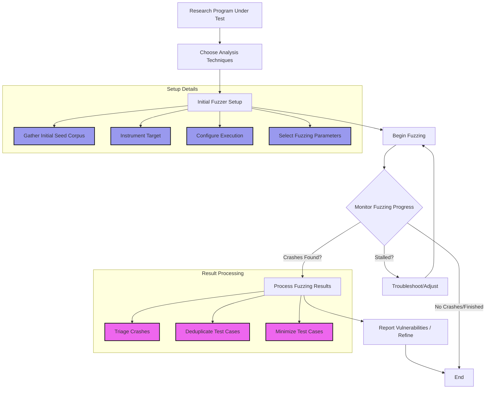
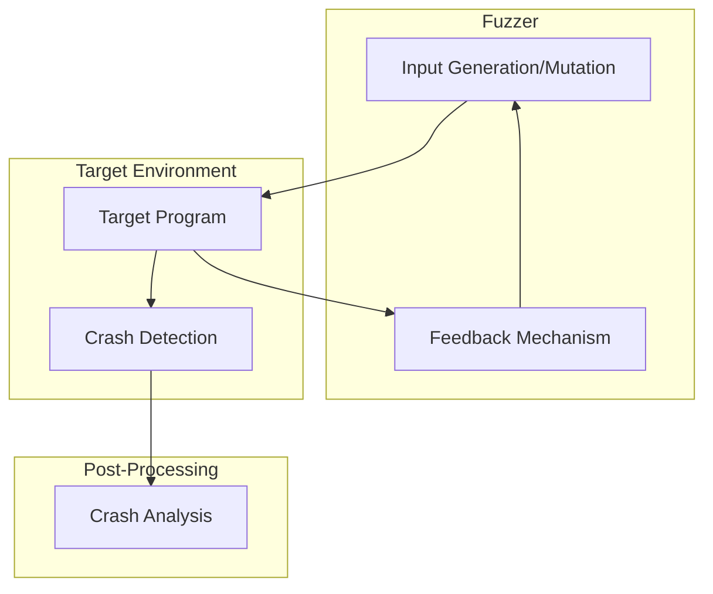
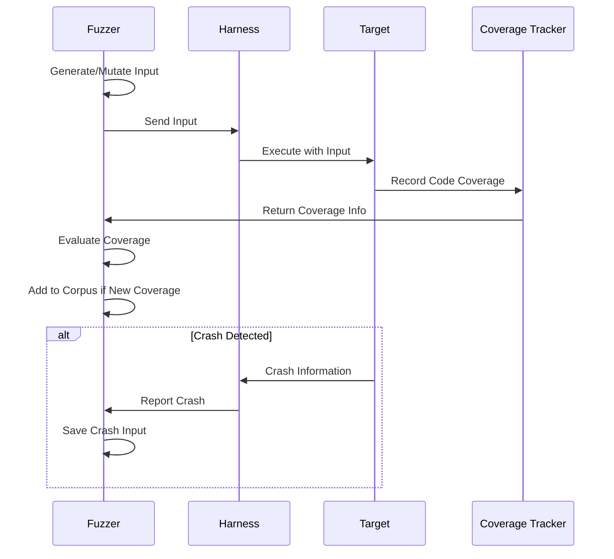
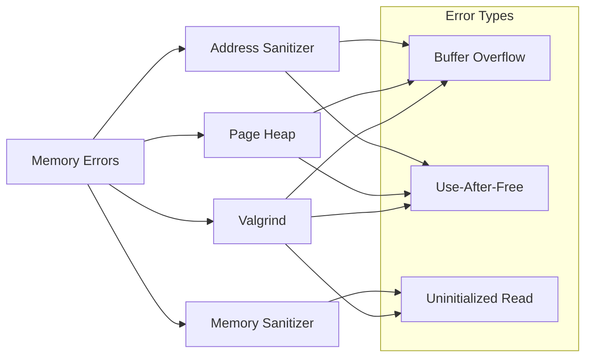

# Fuzzing

automated software testing technique that is used for program analysis

## Types

### BlackBox

- Generates random or model‑based inputs and feeds them into the program under test
- Fuzzer has no knowledge of the program internals during fuzzing
- Pros
  - Extremely fast
  - Easy to use
  - Scalable
- Cons
  - Random testing leads to poor coverage

### GreyBox

- Relies on lightweight instrumentation of the program under test
- Fuzzer has some knowledge of the program internals during fuzzing
- Pros
  - Feedback
  - Scalable
  - Relatively fast
- Cons
  - Simplistic mutations
- Examples
  - General: [AFL++](https://github.com/AFLplusplus/AFLplusplus), [Honggfuzz](https://github.com/google/honggfuzz), [BooFuzz](https://github.com/jtpereyda/boofuzz), [WinAFL](https://github.com/googleprojectzero/winafl)
  - Directed: [UAFuzz](https://github.com/strongcourage/uafuzz), [AFLGo](https://github.com/aflgo/aflgo)
  - Grammar Based: [Tlspuffin](https://github.com/tlspuffin/tlspuffin), [AFLSmart](https://github.com/aflsmart/aflsmart)
  - Taint Based: [Angora](https://github.com/AngoraFuzzer/Angora),
  - Concolic: [QSYM](https://github.com/sslab-gatech/qsym), [AFL](https://aflplus.plus/libafl-book/advanced_features/concolic/concolic.html), [SymSan](https://github.com/R-Fuzz/symsan)
  - Self‑learning: [SieveFuzz](https://github.com/SieveFuzz/SieveFuzz), [RL‑Fuzz](https://github.com/fuzzwareorg/rl-fuzz)
  - Binary Fuzzing: [Jackalope](https://github.com/googleprojectzero/Jackalope)
  - Special Fuzzers: [Papora](https://github.com/ambergroup-labs/papora), [Medusa](https://github.com/trailofbits/medusa)
  - Kernel: [syzkaller](https://github.com/google/syzkaller), [kAFL](https://github.com/IntelLabs/kAFL), [wtf](https://github.com/0vercl0k/wtf), [KF/x](https://github.com/intel/kernel-fuzzer-for-xen-project)
  - ETC: [LibAFL](https://github.com/AFLplusplus/LibAFL) (snapshot & Unicorn support 0.15.x), [FuzzBench](https://google.github.io/fuzzbench/), [ClusterFuzz](https://github.com/google/clusterfuzz), [DynamoRIO](https://github.com/DynamoRIO/dynamorio)

### Snapshot

- Takes and restores memory/register snapshots of the target or VM to bypass expensive initialization.
- Pros
  - Order‑of‑magnitude faster execution on large or stateful binaries
  - Deterministic and easily reproducible
  - Works with closed‑source targets (no rebuild needed)
- Cons
  - Initial snapshot & harness creation can be complex
  - Requires specialised snapshot engine support (e.g., Nyx, Snapchange, wtf)
- Examples
  - [Nyx](https://github.com/nyx-fuzz/Nyx) (v2 with Intel‑PT support; note: Nyx integration requires the AFL++-Nyx fork, not mainline AFL++ 4.x)
  - [Snapchange](https://github.com/awslabs/snapchange)
  - [wtf](https://github.com/0vercl0k/wtf)

#### Snapshot Fuzzing Recipes

- **AFL++ Nyx (user-mode)**

```bash
NYX_MODE=1 AFL_MAP_SIZE=1048576 afl-fuzz -i seeds -o findings -- ./target_nyx @@
```

### WhiteBox

- Leverages heavyweight symbolic execution and static analysis, assuming full source availability
- Pros
  - Solves path constraints to get past difficult logic
  - Capable of generating inputs for deep, hard‑to‑reach program states
- Cons
  - Complex
  - Slow
  - Not scalable

### Ensemble Fuzzing

Ensemble fuzzing coordinates multiple heterogeneous fuzzers sharing a unified corpus, achieving better coverage than any single fuzzer.

#### Concept

- **Cross-Pollination:** Different fuzzers discover different code paths; sharing corpus maximizes coverage
- **Complementary Strengths:** AFL++ excels at control flow; Honggfuzz at crash detection; libFuzzer at in-process fuzzing
- **Coordinated Scheduling:** Use reinforcement learning or heuristics to select optimal fuzzer per input

#### Tools and Frameworks

- **EnFuzz:** Uses reinforcement learning to dynamically select which fuzzer runs on each input based on historical effectiveness
- **CollAFL:** Lightweight synchronization protocol for parallel fuzzer coordination without central coordinator
- **CUPID:** Analyzes feedback from all fuzzers to guide mutation strategies across the ensemble

#### Practical Setup

```bash
# Terminal 1: AFL++ primary with shared sync directory
afl-fuzz -M fuzzer1 -i seeds -o sync_dir -- ./target @@

# Terminal 2: Honggfuzz syncing to AFL corpus
../honggfuzz/honggfuzz -i sync_dir/fuzzer1/queue -W sync_dir/hfuzz \
  --linux_perf_ipt_block -t 10 -- ./target ___FILE___

# Terminal 3: libFuzzer reading from both corpora
./target_libfuzzer sync_dir/fuzzer1/queue sync_dir/hfuzz/queue \
  -max_total_time=3600 -runs=1000000

# Terminal 4: Sync monitor (optional)
watch -n 60 'ls -lh sync_dir/*/queue | wc -l'
```

#### Best Practices

- **Start Simple:** Begin with AFL++ + Honggfuzz; add libFuzzer if you have source
- **Corpus Deduplication:** Run `afl-cmin` periodically to minimize combined corpus
- **Resource Allocation:** Allocate 40% AFL++, 30% Honggfuzz, 30% libFuzzer based on empirical results
- **Monitoring:** Track unique crashes per fuzzer to identify which contributes most

#### Performance Gains

- Research shows **15-40% more coverage** vs single fuzzer
- **2-3× more unique crashes** in 24-hour runs
- Particularly effective on complex parsers with multiple code paths

## Components

### Power Scheduler

- Responsible for distributing the amount of fuzzing time among the seeds in the seed queue
- Prioritize more interesting seeds
  - Usually measure by its ability to produce new code coverage
- Assigns a scope to each seed and picks the one with highest score
- Self‑learning schedulers such as _SieveFuzz_ and _RL‑Fuzz_ use reinforcement learning to allocate energy dynamically based on past mutation success.
- Explore/Exploit auto‑tuning: AFL++ 4.30+ folds MOpt into the core and dynamically balances energy between seeds.

### Mutation

- Responsible for making small changes to the fuzzing seed, with the goal of exercising new program behavior
- Examples: bit-flips, addition/subtraction, deletion, etc
- Typically operate by making small, incremental changes
- LLM‑assisted mutations & harness scaffolding: Large‑language models can infer grammars/dictionaries (`--dict2`) and draft starter harness code (e.g., LibAFL's `llm_mutator`).
- Overflow‑aware arithmetic heuristics: Enable `--arith8/16/32-smart` in AFL++ (or equivalents) to target boundary‑condition overflows.
- AFLPlusPlus
  - Deterministic: includes single deterministic mutations on the content of the test cases
  - Havoc: mutations are randomly stacked and also includes changes to the size of the test case
  - Note: honggfuzz and libFuzzer implement weighted random mutation stacks instead of the deterministic/havoc split
- cmp_log guided mutations: Enable `-cmp_log` (AFL++) or `AFL_LLVM_CMPLOG=1` to perform Redqueen‑style input‑to‑state transforms.
- Snapshot‑aware mutations: With Nyx mode (`NYX_MODE=1`) AFL++ randomises in‑memory state as well as file input for deep state machines.
- LLM‑guided edits: _HyLLfuzz_ uses GPT/Llama‑3 to generate branch‑targeted mutations, achieving ≈ 1.3× edge coverage.

### Directed Fuzzing (reach a specific bug/function)

- AFLGo basics:
  - Build with distance metrics to target BBs/functions, then run with exploration/exploitation phases
  - Example:
    ```bash
    export AFLGO=/path/to/aflgo
    cmake -DAFLGO=ON -DDISTANCE_CFG=BBtargets.txt ..
    make clean all
    afl-fuzz -z exp -c 45m -i seeds -o out -- ./target @@
    ```
- libAFL targeted stages: use objective feedbacks to push towards addresses/symbols of interest

### Executor

- Responsible for executing the program under test with mutated fuzzing seed in a performant manner
- AFL++ uses a forkserver to skip the cost of expensive initialization and startup code
- AFL++ also offers persistent fuzzing mode, where the essential code is run inside a loop without a need for fork
- GPU‑accelerated execution loops are possible with _CUDA‑AFL_ and LibAFL's `VulkanExecutor`, ideal for shader or graphics targets.
- Recent AFL++ versions ship a Nyx executor capable of high exec/s on user‑mode targets; activate with `NYX_MODE=1` (verify version and build flags).

#### Persistent Mode Implementation

**HF_ITER Style (Honggfuzz):**

Honggfuzz offers HF_ITER-style persistent mode that's often easier to implement than ASAN-style for complex targets:

```cpp
#include "honggfuzz.h"

int main(int argc, char** argv) {
    // Expensive initialization (run once)
    initialize_target();

    // Persistent fuzzing loop
    for (;;) {
        size_t len;
        uint8_t *buf;

        // Get input from honggfuzz
        HF_ITER(&buf, &len);

        // Convert to target-appropriate format
        FILE* input_stream = fmemopen(buf, len, "r");

        // Execute target with fuzzed input
        int result = target_function(input_stream);

        // Cleanup for next iteration
        fclose(input_stream);
        reset_target_state();
    }
}
```

**Memory Management Considerations:**

```cpp
// Prevent memory leaks in persistent mode
void reset_target_state() {
    // Free any allocated memory
    cleanup_buffers();

    // Reset global state
    memset(&global_state, 0, sizeof(global_state));

    // Close any open file handles
    close_handles();
}
```

**ASAN-Style Alternative:**

```cpp
extern "C" int LLVMFuzzerTestOneInput(const uint8_t *data, size_t size) {
    // Direct fuzzing interface - no manual loop needed
    return target_function(data, size);
}
```

### Feedback

- Set of program state information from running with a particular input seed
- Fuzzers use feedback to determine fitness of a given seed(basic block coverage, edge coverage, path coverage)
- AFLPlusPlus uses edge coverage (keeps a shared bitmap between the target and the fuzzer)
- AFL++ uses edge coverage (keeps a shared bitmap between the target and the fuzzer)
- Hardware trace sources such as Intel® Processor Trace (IPT) and ARM ETM/CoreSight provide near‑zero‑overhead edge coverage for large binaries.
- LibAFL 0.15.2 can derive edge coverage from Last Branch Records, giving zero‑instrumentation tracing on recent Intel CPUs (`LBRFeedback`).

#### Intel PT Coverage Setup

**Honggfuzz with Intel PT:**

Intel PT provides hardware-based coverage tracking ideal for binary-only targets where source instrumentation isn't possible:

```bash
# Basic Intel PT setup with honggfuzz
../honggfuzz/honggfuzz -i input_corpus/ -W workspace/ --linux_perf_ipt_block -t 10 -- ./target @@

# Performance tuning
../honggfuzz/honggfuzz -i input_corpus/ -W workspace/ \
  --linux_perf_ipt_block \
  --linux_perf_ignore_unknown \
  --threads 4 \
  -t 30 -- ./target @@
```

**Intel PT Requirements:**

- Modern Intel CPU with PT support (check with `cat /proc/cpuinfo | grep intel_pt`)
- Linux kernel with PT enabled (`CONFIG_INTEL_PT=y`)
- Sufficient privileges or `CAP_SYS_ADMIN` capability

**Troubleshooting Intel PT:**

```bash
# Check PT availability
dmesg | grep -i "intel.*pt"
cat /sys/devices/intel_pt/type

# Permission issues
echo 'kernel.perf_event_paranoid = -1' >> /etc/sysctl.conf
sysctl -p

# Alternative: use capsh for specific capability
capsh --caps="cap_sys_admin+eip" -- -c "./honggfuzz_command"
```

### Oracle

- Detects if any interesting behavior occurred during execution of the program under test with a given input
- Code Sanitizers are special compile-time instrumentation for the program under test that perform run-time checks
- AFL++ offers `QASAN` to run binaries that are not instrumented with `ASan` under QEMU with the AFL++ instrumentation
- Different Bugs Require Different Oracles
  - **No Source**: Statically rewrite the binary or `YOLO` it
  - **Decoupled Sanitization**: use [SAND](https://github.com/SANDTeam/sand) to off-load sanitizer checks and speed up fuzzing
  - **Memory Safety**: use Address or Leak or Memory Sanitizer (try HWASAN for lower memory usage); or use ARM's MTE for hardware‑assisted tagging on AArch64
  - **Concurrency Issues**: use Thread Sanitizer – LLVM 18 adds detection for C++20 std::atomic_wait
  - **Type Safety**: use Type Sanitizer
  - **Undefined Behavior**: use `UBSan`
  - **Heap Hardening**: Scudo Hardened Allocator (part of LLVM's compiler-rt, available in recent Clang versions) detects overflows and double‑frees with minimal performance cost.
  - **Kernel Undefined Behavior**: Kernel UBSan (KUBSan) — enable with `CONFIG_UBSAN_TRAP=y` (verify availability in your kernel).
  - **Control‑Flow Integrity**: **KCFI** (Clang 18) adds low-overhead forward-edge CFI; enable with `-fsanitize=kcfi`.
  - **Data‑Flow**: Data‑Flow Sanitizer v2 adds taint‑tracking (`-fsanitize=dataflow`) and now works with libFuzzer.
  - **Security‑property oracles**: Idempotency or differential fuzzing for APIs (e.g., _DiffSink_ for compiler targets).
  - **Kernel Stuff**: use `KASAN`, `KMSAN`, `KCSAN`
  - **Logic Bugs**: Differential or Property(Correctness-Idempotency) Oracles

#### Property/Differential Oracles (quick patterns)

- Idempotency: `f(x) == f(f(x))` for normalizations/parsers
- Differential: compare two implementations or two versions, bucket on output mismatch
- Invariants: monotonic lengths, checksum equality, schema validation post‑parse

## Seed Corpus

### What is a Seed Corpus?

Seed corpus is a collection of input files used as a starting point for fuzzing. In mutational fuzzing, the fuzzer takes existing files and makes random mutations (flipping, reordering, removing, inserting data) before having the target application parse the mutated file.

### Why is a Seed Corpus Important?

- Increases code coverage, which correlates strongly with finding crashes
- Allows fuzzers to start close to "interesting" points in the target application
- Helps overcome "unsolvable cliffs" in code coverage that fuzzers might struggle with
- Research shows fuzzers perform significantly better when bootstrapped with a minimized corpus

### Creating a Seed Corpus

1. **Manual Creation**
   - Create files with different command-line tools or GUI applications
   - Use all possible tools for your file format to generate diverse outputs
   - Automate where possible, but can be time-consuming

2. **Existing Test Suites and Bug Reports**
   - Leverage test suites from the target application
   - Extract test cases from bug reports (high signal value)

3. **Web Crawling**
   - Use Common Crawl or similar datasets to extract relevant file types
   - Filter based on MIME types
   - Perform corpus distillation: keep only files that trigger new code paths

### Corpus Distillation Process

1. Iterate through each potential seed file
2. Check file size (smaller files generally more efficient for fuzzing)
3. Run the file with code coverage instrumentation
4. Record if the file triggers any new code coverage not seen before
5. Keep only files that increase code coverage
6. Perform final minimum-set cover minimization for the smallest possible corpus

### Tools for Corpus Creation

- [common-corpus](https://github.com/benhawkes/common-corpus): Tool to build fuzzing corpus from Common Crawl data
- [AFL's afl-cmin](https://github.com/AFLplusplus/AFLplusplus/blob/stable/afl-cmin): Corpus minimization tool
- [AFL's afl-tmin](https://github.com/AFLplusplus/AFLplusplus/blob/stable/afl-tmin): Test case minimizer
- [cf‑min](https://github.com/AFLplusplus/afl-cmin) – distributed/cluster‑friendly corpus minimizer
- Crash‑Repro‑Recorder (CRR) bundles – store the exact sequence of inputs needed to reproduce a crash deterministically

### Crash Triage Pipeline

```bash
# 1) Minimize
afl-tmin -i crash -o crash.min -- ./target @@
# 2) Symbolize/Log
ASAN_OPTIONS=abort_on_error=1:symbolize=1 ./target crash.min 2>asan.log
# 3) Coverage Hash
./cov-tool --bbids ./target crash.min > cov.hash
# 4) Bucket
./bucket.py --key "$(cat cov.hash)" --log asan.log --out triage/
```

#### Cross‑platform crash analysis quick cheatsheets (user‑mode)

- Linux
  - Enable coredumps and replay:
    ```bash
    ulimit -c unlimited
    sysctl -w kernel.core_pattern=core.%e.%p
    ./target crash.min   # produces core
    gdb -q ./target core.* -ex 'set pagination off' -ex bt -ex 'info reg' -ex q
    addr2line -e ./target 0xDEADBEAF
    ```
  - Stabilize runs: `taskset -c 0 chrt -f 99 ./target @@`; set `ASAN_OPTIONS=allocator_may_return_null=1:handle_abort=1`.

- Windows
  - Local dumps (WER):
    ```powershell
    New-Item 'HKLM:\SOFTWARE\Microsoft\Windows\Windows Error Reporting\LocalDumps' -Force | Out-Null
    New-ItemProperty -Path 'HKLM:\...\LocalDumps' -Name DumpType -Type DWord -Value 2 -Force | Out-Null
    ```
  - PageHeap (user mode):
    ```cmd
    gflags /p /enable target.exe /full
    ```
  - WinDbg basics:
    ```text
    .symfix; .reload /f
    !analyze -v
    k; r; lm
    ```
  - Optional: record Time‑Travel Debugging (TTD) to replay non‑deterministic crashes.

- macOS
  - `lldb -o 'bt all' -- ./target crash.min`; set `DEVELOPER_DIR` to Xcode for symbols.

#### Kernel crash triage quicksheet

- Linux
  - KASAN/KMSAN logs: `dmesg -T | egrep -i 'kasan|kmsan' -A 60`
  - Decode stacks:
    ```bash
    ./scripts/decode_stacktrace.sh vmlinux /lib/modules/$(uname -r)/build < dmesg.log
    ```
  - Map addresses: `addr2line -e vmlinux 0xffffffff81234567`

- Windows
  - Driver Verifier:
    ```cmd
    verifier /standard /driver yourdrv.sys
    ```
  - KD/WinDbg:
    ```text
    !analyze -v; kv; r; !verifier 3; !irpfind
    ```

#### Sanitizer options (quick reference)

- ASAN_OPTIONS: `abort_on_error=1:symbolize=1:allocator_may_return_null=1:detect_stack_use_after_return=1`
- UBSAN_OPTIONS: `print_stacktrace=1:halt_on_error=1`
- TSAN_OPTIONS: `halt_on_error=1:history_size=7:second_deadlock_stack=1`
- MSAN_OPTIONS: `poison_in_dtor=1:track_origins=2`
- HWASAN (AArch64): `abort_on_error=1:stack_history_size=7`

#### syzkaller crash repro and bisection (essentials)

```bash
# Reproduce from syz repro
syz-execprog -repeat=0 -procs=1 -wait=5m -cover=0 -debug target.repro

# Run minimized C reproducer under KASAN/KCFI build for clarity
make -j$(nproc) CONFIG_KASAN=y CONFIG_UBSAN=y CONFIG_KCFI=y

# Git bisection (when you have a fix commit)
git bisect start <bad> <good>
git bisect run ./repro.sh
```

## Workflow



### Research the Program Under Test

- Familiarize yourself with the program under test
- Learn what the program under test does and how it operates
- Interact with the program & learn how to use it
- Identify inputs & outputs
- Identify program areas to focus analysis efforts on Looking for
  - Potentially Vulnerable program code
  - Previously patched code
  - Previous vulnerabilities
  - Newly developed code
  - Complex logic
  - Input data ingestion sites
- For kernel modules, look beyond traditional attack vectors:
  - Beyond IOCTL handlers and `copy_from_user` calls
  - Specialized subsystems like DMA-BUF may have attack surface through:
    - Custom callbacks in operation structures
    - Memory mapping handlers
    - Page fault handlers
    - VM operation structures
    - Allocation/free mechanisms
  - Identify all user-controlled inputs, especially those passed to functions that don't use `copy_from_user`

### Choose the Right Set of Program Analyses

- Types of analyses that you select to conduct depends on a variety of factors
  - Size
  - Format
  - Interface
  - Complexity

### Initial Fuzzer Setup

- Construct a representative initial seed corpus by gathering a set of program inputs that resemble the input format program expects
- Instrument the program under test with coverage and sanitization
- Recommended build flags (Clang/LLVM):

  ```bash
  # LibFuzzer + ASan/UBSan (C/C++)
  CC=clang CXX=clang++ CFLAGS="-O1 -g -fno-omit-frame-pointer" \
  CXXFLAGS="-O1 -g -fno-omit-frame-pointer" \
  LDFLAGS="" \
  cmake -DCMAKE_C_FLAGS="-fsanitize=address,undefined -fsanitize-recover=undefined" \
        -DCMAKE_CXX_FLAGS="-fsanitize=fuzzer,address,undefined -fsanitize-recover=undefined" ..

  # MSVC (Windows) AddressSanitizer for x64
  # In Visual Studio 2022+: Project Properties → C/C++ → Address Sanitizer: Yes (/fsanitize=address)
  # Runtime options
  set ASAN_OPTIONS=detect_leaks=1:halt_on_error=1:strict_string_checks=1
  ```

- Execution method with Harness or command line arguments
- Select fuzzing parameters like power schedule, dictionary, custom mutator, etc
- Fuzzing setup to run in parallel, etc

### Quick‑Start Recipes

- LibFuzzer harness (C++):

  ```cpp
  #include <cstdint>
  #include <cstddef>
  extern "C" int LLVMFuzzerTestOneInput(const uint8_t* data, size_t size) {
    /* parse_or_process(data, size); */
    return 0;
  }
  ```

- AFL++ on a CLI target:

  ```bash
  # Instrument
  CC=afl-clang-fast CXX=afl-clang-fast++ cmake -DCMAKE_BUILD_TYPE=Release .. && make -j
  # Seed dir with a few minimal valid inputs
  afl-fuzz -i seeds -o findings -- ./target @@
  # Useful extras: dictionary and cmplog for hard compares
  afl-fuzz -i seeds -x dict.txt -o findings -c 0 -- ./target @@
  # Or enable cmplog build/runner pair
  AFL_LLVM_CMPLOG=1 CC=afl-clang-fast CXX=afl-clang-fast++ make clean all
  afl-fuzz -i seeds -o findings -M f1 -- ./target @@
  afl-fuzz -i seeds -o findings -S s1 -c 0 -- ./target @@
  ```

- Windows binary‑only (QEMU mode):

  ```bash
  afl-fuzz -Q -i seeds -o findings -- target.exe @@
  ```

### Begin Fuzzing

- Start the actual fuzzing process and wait for any crashes
- Fuzzing might get stalled, become unstable or have poor performance

### Process the Fuzzing Results

- Once the fuzzer produces a set of interesting test cases, we need to refine them
- Triage
  - Group test cases by root cause and/or vulnerability type
  - Prioritize patching the more sever vulnerabilities
- Deduplication: Remove all non-unique test cases
- Minimization: get rid of unnecessary bytes of input

#### Crash dedup & triage tips

- Prefer stack‑hash or coverage‑hash based bucketing (e.g., AFLTriage, Crash Triage scripts).
- Minimize before debugging: `afl-tmin`, `llvm-reduce`, or `creduce` for textual formats.
- Use stable environments: pin CPU governor, disable ASLR where safe, fix random seeds.
- Export sanitizer logs to files for CI artifacts.

#### Reproducibility quick checklist

- Save and replay exact input sequences in persistent mode
- Pin CPU governor; fix RNG seeds; disable ASLR only where safe and necessary
- Minimize before debugging (`afl-tmin`, `llvm-reduce`, `creduce`)
- Record binary hashes and sanitizer options with every crash

## Obstacles

### Binary Only vs Source Fuzzing

- Sometimes only executables are available, without any source code
- Solution
  - **Binary Rewriting**: inserting coverage and sanitization into a binary without recompilation (e.g., `retrowrite`, binary‑only ASan/QASan)
  - **Dynamic Binary Instrumentation**: inserting coverage and sanitization at runtime (e.g., `QASAN`, DynamoRIO, Frida/QBDI)

### Fuzzing Harness

- Some fuzzing targets are difficult to interact with
- Solution
  - Fuzzing harness acts as a middleware between the program under test and the fuzzer
  - Can also use function hooking to replace network or file function calls

#### Library Harness Best Practices

- **Research Existing Work**: Search for existing harnesses or test suites
- **Optimize Compilation**: Use `-O1` or `-O3` flags during compilation
- **Balance Coverage vs Speed**: A good harness maximizes code coverage while maintaining execution speed
- **Strategic Targeting**: Create multiple small harnesses for different library components
- **Resource Management**: Ensure proper initialization and cleanup of library resources
- **Input Manipulation**: Create functions that transform fuzzer input into valid library parameters
- **Persistent Mode**: For maximum efficiency, implement persistent mode harnesses that reuse library instances

#### Snapshot Harnessing Tips

- Snapshot after expensive initialization, right before the parse/dispatch loop
- Map fuzzer input into in‑memory buffers; avoid filesystem and network overhead
- Seed RNG and log it; ensure deterministic time sources where possible
- Export coverage early and often (breakpoints or tracepoints) for plateau detection

#### Structure‑aware fuzzing

- Extract tokens/keywords to a dictionary (AFL++ `--dict2` or `AFL_TOKEN_FILE`).
- Use libprotobuf‑mutator for protobuf/gRPC targets; generate corpus from `.proto` examples.
- For HTTP/REST/GraphQL, record real traffic and convert to templates with placeholders.

When building harnesses for libraries:

1. Start with a basic implementation that validates core functionality
2. Gradually expand to cover more API functions
3. Use the documentation to understand parameter boundaries and edge cases
4. Test with a variety of input encodings and configurations
5. Consider structural awareness when fuzzing format-specific libraries

Resources:

- [Awesome LibFuzzer Harness Collection](https://github.com/google/fuzzing/tree/master/examples)
- OSS-Fuzz project repositories

### Fuzzer Stalls

- Fuzzer progress has come to a halt
- Solution
  - Run a collection of different fuzzers
  - Produce actionable coverage statistics with tools like VisFuzz or afl-cov that inform you of where the fuzzer is getting stuck
  - Use a concolic fuzzer, which combines constraints solving with fuzzing to help traditional fuzzers get past difficult conditional statements
  - If all else fails, move on to a different analysis technique
  - For AFL++: enable `-c 0` (cmplog), try `AFL_MAP_SIZE=1048576`, use `-L 0` for MOpt, and add custom mutators.

#### Plateau escape tactics

- Switch to directed fuzzing (e.g., AFLGo/UAFuzz) for a specific function/basic block
- Add grammar/dictionary; enable CMPLOG/Redqueen to unlock hard compares
- Use concolic assistance (QSYM, Driller, libAFL concolic) on stubborn branches
- Reduce target surface via snapshotting or split harness to increase exec/s

### Fuzzing Reproducibility

- Inability to reproduce crashing test cases produced by fuzzer
- Solution
  - During persistent fuzzing, save all inputs starting from when a new process is created and replay those inputs in same order to reproduce behavior
  - AFLPlusPlus offers special compile-time instrumentation that attempts to eliminate concurrency issues

### Speed & Performance

- Fuzzer is running slowly
- Solution
  - Use snapshot fuzzing to eliminate execution of redundant, unimportant code
  - Avoid using complex fuzzing logic
  - Parallel fuzzing can sometimes help
  - Pin CPU governor to performance; disable throttling; set `AFL_SKIP_CPUFREQ=1` when needed.
  - Prefer `llvm_mode` over `qemu_mode` where possible; enable LTO instrumentation for higher throughput.

## Techniques

### Syzkaller

- Limit enabled syscalls to make fuzzing go deeper
- Write new `syzlang` descriptions
- Change the mutation of fuzzing inputs(integrate symbolic execution)
- Start fuzzing from the crafted corpus
- Customize `kcov` or use cover filter for directed fuzzing
- Extend grammar for better coverage
- **External Network Fuzzing**:
  - **Packet Injection**: Utilize `TUN/TAP` virtual network devices to inject network packets from within the VM, allowing the kernel to process them as if they were received externally. This approach is compatible with syzkaller's architecture, which runs the fuzzer process inside the VM.
  - **Coverage Collection**: Employ `KCOV` to gather code coverage from the kernel's network packet parsing code. `KCOV` can be adapted to work with `TUN/TAP` to trace the execution paths taken during packet processing.
  - **Pseudo-syscalls**: Implement `syzkaller` pseudo-syscalls to manage network-related operations, such as packet injection and resource management (e.g., `syz_emit_ethernet` for sending packets, `syz_extract_tcp_res` for handling TCP sequence and acknowledgement numbers).
  - **Syscall Descriptions**: Create detailed `syzlang` descriptions for network protocols and packet structures to guide the fuzzer. This includes defining packet fields, checksums, and relationships between different protocol layers.
  - **Integration Challenges**:
    - **Checksums**: Implement logic to correctly calculate and update checksums for various protocols (IP, TCP, UDP, ICMP) as the fuzzer mutates packet data.
    - **TCP Connections**: Develop sequences of syscalls and pseudo-syscalls to establish and manage TCP connections, enabling fuzzing of stateful TCP communication.
    - **ARP Traffic**: Minimize or filter out ARP traffic to isolate the fuzzing of specific protocols and avoid interference.
    - **IPv6 Support**: Extend descriptions and logic to support IPv6, including handling extension headers and specific IPv6 features.
  - **Reading Code**: For understanding external network fuzzing implementation, refer to the original pull request in syzkaller and the current sources, focusing on `initialize_netdevices()`, `syz_emit_ethernet()`, and network protocol descriptions in `syzlang`.
  - **Upstream docs** – See `docs/external_fuzzing_network.md` in the syzkaller repo for checksum helpers and packet templates.

#### Target Selection

- Use syzbot coverage heatmap to identify subsystems with less-than-ideal coverage
- Look for subsystems with coverage between 1-20% (completely uncovered might have good reasons)
- Network subsystems are easier to fuzz than hardware-dependent ones
- Check syzbot dashboard to identify promising targets and current fuzzing status

#### Attack Surface Analysis

- Analyze kernel code to understand the attack surface (e.g., examining netlink handlers)
- Map out the available operations (e.g., socket operations, netlink commands)
- Understand the code paths that process user inputs for targeted fuzzing

#### Performance Optimization

- Use hardware virtualization when possible for better performance
  - KVM on Linux, HVF on macOS can provide 3-5x speedup over TCG emulation
- Adapt QEMU parameters to work with available accelerators

#### Syzkaller Configuration and Setup

- **Cross-Architecture Setup**:
  - When configuring on non-standard hosts (e.g., ARM64 Mac), compile the target elements (kernel, rootfs) natively on Linux VM
  - Go 1.23 fixes the internal linker, but you **still need `CROSS_COMPILE=`** when the kernel uses a non‑GNU tool‑chain.
  - Specify OS/arch pairs when compiling: `make HOSTOS=darwin HOSTARCH=arm64 TARGETOS=linux TARGETARCH=arm64`
  - Build `syz-executor` on a Linux machine and copy to your host if cross-compilation fails

- **Kernel Module Fuzzing**:
  - Extract constants with `syz-extract` targeting specific syscall descriptions: `bin/syz-extract -os linux -sourcedir /path/to/linux -arch arm64 -build module_name.txt`
  - If extraction fails, manually compile programs to determine constant values
  - Use the obtained values to create/fix `.const` files for your module

- **Configuration File Example**:

  ```json
  {
    "name": "QEMU-aarch64",
    "target": "linux/arm64",
    "http": ":56700",
    "workdir": "/path/to/workdir",
    "kernel_obj": "/path/to/kernel",
    "syzkaller": "/path/to/syzkaller",
    "image": "/path/to/rootfs.ext3",
    "sshkey": "/path/to/id_rsa",
    "procs": 8,
    "enable_syscalls": ["openat$module_name", "ioctl$IOCTL_CMD", "mmap"],
    "type": "qemu",
    "vm": {
      "count": 4,
      "qemu": "/path/to/qemu-system-aarch64",
      "cmdline": "console=ttyAMA0 root=/dev/vda",
      "kernel": "/path/to/Image",
      "cpu": 2,
      "mem": 2048
    }
  }
  ```

#### Kernel fuzzing practicalities

- Use `KCFI` and `KASAN` builds for safer fuzzing; `CONFIG_DEBUG_INFO_BTF=y` helps symbolization.
- Prefer TUN/TAP packet injection over raw sockets for stable replay.
- Stabilize coverage with `kcov` filters and `syz_cover_filter`.

- **Performance Considerations**:
  - For ARM64 Macs, thermal throttling can significantly reduce execution rates
  - Monitor execution rates for performance degradation
  - VM acceleration and hardware features can improve performance
  - Consider using Hardware Tag-Based KASAN for better performance vs. coverage tradeoff
  - **Linux 6.8+ configs**
  - Enable: `CONFIG_KASAN=y` (or HWASAN on AArch64), `CONFIG_KCSAN=y`, `CONFIG_UBSAN=y`, `CONFIG_KCFI=y`, `CONFIG_DEBUG_INFO_BTF=y`.
  - Prefer `CONFIG_KFENCE=n` during fuzzing; enable later to confirm bugs.

### AFL

- Crafting high quality harness
  - identify existing harnesses [oss-fuzz](https://github.com/google/oss-fuzz)
  - adapt and enhance for your fuzzing objectives
- Corpus
  - use `afl-tmin` and `afl-cmin` to tune corpus dynamically
- Code Coverage
  - use `afl-cov` to understand the code coverage
  - then analyze and fine tune your harness
  - and optimize your test corpus based on coverage feedback
- Efficient Crash Triage
  - use [AFLTriage](https://github.com/quic/AFLTriage) and [AddressSanitizer](https://github.com/google/sanitizers/wiki/addresssanitizer)
  - try `afl-collect` / `afl-plot` and enable `ASAN_OPTIONS=abort_on_error=1:symbolize=1`

#### Modern AFL++ tips

- Use `-M`/`-S` for parallel fuzzer instances; combine `-c 0` (cmplog) on some slaves.
- Persistent mode (`__AFL_LOOP(N)`) for hot loops; in‑process fuzzing with `afl++-unicorn` for emulated targets.
- Dictionaries (`-x`) and `laf-intel`/`split-switches` to simplify hard conditions at compile time.

### MacOS

#### IPC Fuzzing

- We can mutate and fuzz the message that `mach_msg` is sending
  - Simple to do but slow
  - Hard to determine which process caused the crash
  - Hard to identify code coverage
- We can directly send a message to Target message handler(skipping kernel)
  - Very fast and easy to instrument
  - Easy to understand what caused the crash
  - but Different from end exploit, might need to invoke initialization routines
- Write a Fuzzing harness

```c
void *lib_handle = dlopen("libexample.dylib", RTLD_LAZY);
pFunction = dlsym(lib_handle, "DesiredFunction");
```

### EDR

#### EDR Attack Surface Overview

EDR solutions present a significant attack surface due to their complex architecture:

**Potential vulnerability categories:**

- Memory corruptions in file scanning & emulation (e.g., CVE-2021-1647)
- Arbitrary file deletion via symlink vulnerabilities
- User-Mode IPC authorization issues or memory corruptions
- User-to-driver authorization bypass
- Classic driver vulnerabilities (WDM, KMDF, Mini-Filter)
- Server-to-agent authentication flaws
- Parsing bugs in server responses
- Classic Windows application vulnerabilities (DLL hijacking, file permissions)
- Emulation/sandbox escapes
- Logic bugs in security implementations

#### Microsoft Defender's Scanning Engine (mpengine.dll)

Microsoft Defender includes a local analysis engine `mpengine.dll` that performs static checks and uses emulation environments for different file types. This engine presents a significant attack surface due to its complexity and the variety of file formats it processes.

**Target Characteristics:**

- Installed by default on Windows systems
- Runs as SYSTEM with high privileges
- Has 1-click remote attack surface through file scanning
- Processes numerous file formats with complex parsing logic
- Prone to memory corruption vulnerabilities

**Fuzzing Methodology:**

_Snapshot Fuzzing with WTF:_

- Uses Windows Terminal Framework for coverage-guided fuzzing
- Takes snapshots after Defender initiates file scanning
- Maintains identical configuration to real environment
- Avoids limitations of manual engine bootstrapping

_Alternative Approaches:_

- **kAFL/NYX**: Additional fuzzing frameworks tested
- **Jackalope**: Cross-platform coverage-guided fuzzer
- **Manual harness**: Historic approach using `RSIG_BOOTENGINE` and `RSIG_SCAN_STREAMBUFFER`

**Practical Attack Scenarios:**

_Web-based DoS:_

```html
<!-- Crash Defender via malicious file download -->
<a href="crash.pdf">Download PDF</a>
<!-- Crashes MsMpEng.exe when file is scanned -->
```

_Network Share DoS:_

```powershell
# Upload crash file to SMB share before credential dumping
copy crash.doc \\target\share\
# Defender crashes when scanning uploaded file
mimikatz.exe privilege::debug sekurlsa::logonpasswords
```

**Fuzzing Setup Requirements:**

_Snapshot Creation:_

```cpp
// Example WTF harness setup
if (!g_Backend->SetBreakpoint("nt!KeBugCheck2", [](Backend_t *Backend) {
    const uint64_t BCode = Backend->GetArg(0);
    const std::string Filename = fmt::format("crash-{:#x}", BCode);
    Backend->Stop(Crash_t(Filename));
}))
```

_Coverage Analysis:_

- Use IDA Lighthouse for visualization
- Monitor for DRIVER_VERIFIER_DETECTED_VIOLATION (0xc4)
- Track IRQL_NOT_LESS_OR_EQUAL (0xa) crashes

**Defense Implications:**

- Demonstrates need for robust input validation
- Shows importance of crash recovery mechanisms
- Highlights risks of complex file parsing engines
- Suggests value of sandboxing scanning processes

##### Cross-platform mpengine.dll Fuzzing

Recent advances enable fuzzing the latest Windows Defender engine (v1.1.25020.1007) on Linux using **loadlibrary** with Intel PT coverage:

```cpp
// Disable Lua VM to avoid stability issues
void my_lua_exec(){
  return;
}

int main(int argc, char** argv){
  // Hook luaV_execute to bypass Lua signature processing
  insert_function_redirect((void*)luaV_execute_address, my_lua_exec, HOOK_REPLACE_FUNCTION);

  // Setup persistent fuzzing loop
  for (;;) {
    size_t len;
    uint8_t *buf;
    HF_ITER(&buf, &len);

    ScanDescriptor.UserPtr = fmemopen(buf, len, "r");

    if (__rsignal(&KernelHandle, RSIG_SCAN_STREAMBUFFER, &ScanParams, sizeof ScanParams) != 0) {
      // Handle scan results
    }
  }
}
```

##### Performance Optimizations

- **Persistent Mode**: Eliminates initialization overhead, achieving hundreds of exec/s
- **Intel PT Coverage**: Hardware-based tracing for binary-only targets
- **Lua VM Bypassing**: Reduces crashes and focuses on native code vulnerabilities

##### honggfuzz with Intel PT Setup

```bash
# Non-persistent mode (slower, ~4s/execution)
../honggfuzz/honggfuzz -i ~/input/ -W ~/workspace/ --linux_perf_ipt_block -t 10 -- ./mpclient_x64 ___FILE___

# Persistent mode (faster, hundreds/sec)
../honggfuzz/honggfuzz -i ~/input/ -W ~/workspace/ --linux_perf_ipt_block -t 10 -- ./mpclient_x64_persistent
```

##### Common Issues and Solutions

- **Cache Files**: Mock `mpcache-*` file access to return NULL handles for 2025+ engines
- **Path Normalization**: Use absolute paths (e.g., `C:\input` vs `input`) to avoid Lua failures
- **Floating Point Exceptions**: Often originate from .NET emulator, require debugging

##### Lua VM Analysis and Bypassing

_Understanding Defender's Lua Implementation:_

Microsoft Defender uses Lua 5.1.5 for signature implementation, with native functions exposed through `MpCommon` and `mp` tables:

```lua
-- Example signature logic that can fail
local l_0_0 = ((MpCommon.PathToWin32Path)((mp.getfilename)(mp.FILEPATH_QUERY_FULL))):lower()
-- Calls native LsaMpCommonLib::PathToWin32Path() function
```

_Debugging Lua Execution:_

```cpp
// Hook luaV_execute main execution loop
75a16bbdc 4c 8b f1        MOV        R14,RCX ; R14 := lua_state
75a16bbdf 49 8b 46 28     MOV        RAX,qword ptr [R14 + 0x28]
75a16bbe3 4d 8b 66 30     MOV        R12,qword ptr [R14 + 0x30] ; R12 := state->savedpc
75a16bc07 41 8b 1c 24     MOV        EBX,dword ptr [R12] ; EBX := Lua instruction (4 bytes)

// Common failure point in luaV_gettable()
if ((lua_TValue *)callinfo[2] <= key_scalar_val) {
    luaG_runerror(state,"attempt to %s a %s value","index",type_name);
    // "attempt to index a nil value" - throws C++ exception
}
```

_Signature Extraction and Analysis:_

- Use **commial's scripts** to decompress .VDM signature files
- **luadec** for full decompilation with restored headers
- **LuaPytecode** for low-level bytecode analysis

```bash
# Extract VDM contents and analyze bytecode
python extract_vdm.py defender.vdm
luadec extracted_bytecode.luac
```

_Bypassing Strategy:_

Replace Lua execution entirely to focus on native code vulnerabilities while maintaining unpacker functionality:

```cpp
// Complete Lua bypass - maintains unpacker execution
void my_lua_exec(){
    return; // Skip all signature processing
}

// Alternative: Selective bypassing for specific functions
if (lua_function_name == "problematic_signature") {
    return; // Skip only problematic signatures
}
```

#### Fuzzing Scanning Engines

**Setting Up WTF (WhatsApp Trace Framework) for EDR Fuzzing:**

```cpp
// Basic WTF harness for mpengine.dll fuzzing
#include "wtf.h"

// Crash handler for detecting vulnerabilities
if (!g_Backend->SetBreakpoint("nt!KeBugCheck2", [](Backend_t *Backend) {
    const uint64_t BugCode = Backend->GetArg(0);
    const uint64_t Parameter1 = Backend->GetArg(1);

    // Log crash details
    const std::string Filename = fmt::format("crash-{:#x}-{:#x}", BugCode, Parameter1);
    DebugPrint("Crash detected: {} (BugCode: {:#x})\n", Filename, BugCode);

    Backend->Stop(Crash_t(Filename));
})) {
    DebugPrint("Failed to set crash breakpoint\n");
    return false;
}

// Monitor specific crash types
g_Backend->SetBreakpoint("nt!KeBugCheckEx", CrashHandler);
```

**Snapshot Positioning for Microsoft Defender:**

```powershell
# Trigger file scan via MpCmdRun.exe
MpCmdRun.exe -Scan -ScanType 3 -File "C:\test\target.exe"

# Alternative: Use Explorer context menu scan
# Right-click -> "Scan with Microsoft Defender"

# Monitor for scanning process start
Get-Process | Where-Object {$_.ProcessName -eq "MsMpEng"}
```

**WTF Configuration Example:**

```json
{
  "snapshot_path": "defender_scan.dmp",
  "backend": "bochscpu",
  "target": "mpengine.dll",
  "max_iterations": 1000000,
  "timeout": 30,
  "coverage_breakpoints": [
    "mpengine!UfsScannerWrapper::ScanFile",
    "mpengine!pefile_scan_mp",
    "mpengine!macho_scanfile"
  ]
}
```

**Alternative Fuzzing Frameworks:**

_kAFL/NYX Setup:_

```bash
# Install kAFL dependencies
git clone https://github.com/IntelLabs/kAFL.git
cd kAFL
./install.sh

# Create fuzzing target
python kafl_fuzz.py \
    --memory 2048 \
    --input corpus/ \
    --work-dir workdir/ \
    --seed-dir seeds/ \
    --target targets/mpengine_target.py
```

_Jackalope Configuration:_

```python
# Jackalope harness for EDR fuzzing
import jackalope

# Initialize fuzzer
fuzzer = jackalope.TargetFuzzer(
    target_binary="MpCmdRun.exe",
    target_args=["-Scan", "-ScanType", "3", "-File", "@@"],
    coverage_type="drcov",
    target_timeout=30000
)

# Add input corpus
fuzzer.add_corpus_dir("corpus/")

# Start fuzzing
fuzzer.fuzz()
```

**Coverage Analysis Tools:**

_IDA Lighthouse Integration:_

```python
# Load WTF traces in IDA with Lighthouse
import lighthouse
lighthouse.load_coverage_file("wtf_coverage.log")
lighthouse.coverage.show_coverage()
```

_Dynamic Analysis with Tenet:_

```python
# Time-travel debugging with Tenet
import tenet
trace = tenet.load_trace("wtf_trace.log")
trace.seek_to_address(0x7ffcdbb6e1e7)  # OOB read location
```

**File Format Corpus Building:**

```powershell
# Collect diverse file samples for fuzzing
$formats = @("*.exe", "*.dll", "*.pdf", "*.docx", "*.xlsx", "*.js", "*.vbs")
$corpus_dir = "C:\fuzzing\corpus\"

foreach ($format in $formats) {
    Get-ChildItem -Path "C:\Windows\System32" -Filter $format -Recurse |
        ForEach-Object { Copy-Item $_.FullName "$corpus_dir\$($_.Name)" }
}

# Add malware samples (use VirusTotal/MWDB)
# Add crafted samples with known vulnerabilities
```

**Debugging Crashes:**

```windbg
# WinDBG analysis of mpengine crashes
.load wow64exts
!analyze -v

# Check for DRIVER_VERIFIER_DETECTED_VIOLATION (0xc4)
!verifier

# Examine call stack for OOB reads
k
!address @rax  # Check if address is valid

# PageHeap analysis for heap corruption
!heap -p -a @rax
```

#### Driver Interface Fuzzing

**FilterConnectionPort Fuzzing:**

```cpp
// Sophos Intercept X port fuzzing example
#include <windows.h>
#include <fltuser.h>

HANDLE hPort;
HRESULT hr = FilterConnectCommunicationPort(
    L"\\SophosPortName",
    0,
    NULL,
    0,
    NULL,
    &hPort
);

if (SUCCEEDED(hr)) {
    // Send malformed messages
    BYTE fuzzData[1024];
    DWORD bytesReturned;

    for (int i = 0; i < 10000; i++) {
        // Generate mutated data
        GenerateFuzzData(fuzzData, sizeof(fuzzData));

        FilterSendMessage(
            hPort,
            fuzzData,
            sizeof(fuzzData),
            NULL,
            0,
            &bytesReturned
        );
    }
}
```

**IOCTL Fuzzing:**

```cpp
// EDR device driver IOCTL fuzzing
#include <winioctl.h>

HANDLE hDevice = CreateFile(
    L"\\\\.\\PaloEdrControlDevice",
    GENERIC_READ | GENERIC_WRITE,
    0,
    NULL,
    OPEN_EXISTING,
    0,
    NULL
);

if (hDevice != INVALID_HANDLE_VALUE) {
    DWORD bytesReturned;
    BYTE inputBuffer[4096];
    BYTE outputBuffer[4096];

    // Fuzz different IOCTL codes
    DWORD ioctlCodes[] = {
        0x2260D0, 0x2260D4, 0x2260D8, 0x2260DC,
        // Add more discovered codes
    };

    for (DWORD ioctl : ioctlCodes) {
        for (int i = 0; i < 1000; i++) {
            GenerateFuzzData(inputBuffer, sizeof(inputBuffer));

            DeviceIoControl(
                hDevice,
                ioctl,
                inputBuffer,
                sizeof(inputBuffer),
                outputBuffer,
                sizeof(outputBuffer),
                &bytesReturned,
                NULL
            );
        }
    }
}
```

#### Mini-Filter Communication Port Fuzzing

**Snapshot fuzzing approach:**

- Target FilterConnectionPorts with malformed messages
- Use tools like WTF (WhatsApp Trace Framework) for coverage-guided fuzzing
- Focus on message parsing logic in mini-filter drivers

**WTF Snapshot Fuzzing Implementation:**

```cpp
// Example WTF harness for mini-filter fuzzing
if (!g_Backend->SetBreakpoint("nt!KeBugCheck2", [](Backend_t *Backend) {
    const uint64_t BCode = Backend->GetArg(0);
    const uint64_t B0 = Backend->GetArg(1);
    // Log crash details for analysis
    const std::string Filename = fmt::format("crash-{:#x}-{:#x}", BCode, B0);
    DebugPrint("KeBugCheck2: {}\n\n", Filename);
    Backend->Stop(Crash_t(Filename));
}))
```

**Fuzzing Setup Process:**

1. **Snapshot Creation**: Create snapshot at FilterConnectionPort message handling entry point
2. **Coverage Collection**: Use IDA Lighthouse to visualize code coverage from fuzzing
3. **Crash Analysis**: Monitor for DRIVER_VERIFIER_DETECTED_VIOLATION (0xc4) and IRQL_NOT_LESS_OR_EQUAL (0xa) bug checks
4. **False Positive Handling**: Address snapshot IRQL inconsistencies where CR8 register stores interrupted state rather than actual IRQL

**Debugging Techniques:**

- **Tenet Integration**: Load WTF traces in IDA for time-travel debugging capability
- **ret-sync**: Synchronize WinDBG with IDA for live vs. snapshot execution comparison
- **Memory Access Monitoring**: Use breakpoints on `nt!ProbeForRead`/`nt!ProbeForWrite` to track pointer validation

### ETC

### Rust Fuzzing & UB Hunting

Rust's memory safety guarantees don't eliminate all bugs; `unsafe` blocks, FFI boundaries, and logic errors still need fuzzing.

#### Complete Rust Fuzzing Stack

**1. cargo-fuzz (libFuzzer integration)**

```bash
cargo install cargo-fuzz
cargo fuzz init
RUSTFLAGS="-Zsanitizer=address" RUSTC_BOOTSTRAP=1 cargo fuzz run fuzz_target_1

# With coverage tracking
RUSTFLAGS="-Zsanitizer=address -C instrument-coverage" cargo fuzz coverage fuzz_target_1
llvm-cov show target/coverage/debug/fuzz_target_1 \
  -instr-profile=fuzz-coverage.profdata -format=html > coverage.html
```

**2. cargo-careful (Nightly Bounds Checking)**

Catches UB that Miri misses, particularly in `std` and runtime edge cases:

```bash
cargo install cargo-careful
cargo +nightly careful test
cargo +nightly careful run --release

# Example: catches out-of-bounds that compile-time checks miss
# unsafe { slice.get_unchecked(idx) } with runtime bounds violations
```

**3. Miri (Interpreter-Based UB Detection)**

```bash
cargo +nightly miri setup
MIRIFLAGS="-Zmiri-strict-provenance -Zmiri-symbolic-alignment-check" cargo +nightly miri test

# Advanced: track specific allocations
MIRIFLAGS="-Zmiri-track-alloc-id=1234" cargo +nightly miri test
```

**4. loom (Concurrency Bug Detection)**

For testing lock-free data structures and concurrent code:

```rust
// Example loom test for concurrent queue
#[cfg(loom)]
#[test]
fn test_concurrent_queue() {
    loom::model(|| {
        let queue = Arc::new(Queue::new());
        let q1 = queue.clone();
        let q2 = queue.clone();

        let t1 = loom::thread::spawn(move || {
            q1.push(1);
        });

        let t2 = loom::thread::spawn(move || {
            q2.pop()
        });

        t1.join().unwrap();
        t2.join().unwrap();
    });
}
```

```bash
# Run loom tests
RUSTFLAGS="--cfg loom" cargo test --release
```

**5. proptest (Property-Based Fuzzing)**

Generate arbitrary inputs for property testing:

```rust
use proptest::prelude::*;

proptest! {
    #[test]
    fn test_parser_doesnt_panic(s in "\\PC*") {
        // Property: parser should never panic on any input
        let _ = std::panic::catch_unwind(|| {
            parse_input(&s)
        });
    }

    #[test]
    fn test_serialization_roundtrip(data: Vec<u8>) {
        // Property: deserialize(serialize(x)) == x
        let serialized = serialize(&data);
        let deserialized = deserialize(&serialized).unwrap();
        prop_assert_eq!(data, deserialized);
    }
}
```

#### Rust-Specific Vulnerability Classes

**Unsafe Block Vulnerabilities:**

```rust
// Common patterns to fuzz:
unsafe {
    // 1. Vec::from_raw_parts with wrong capacity
    Vec::from_raw_parts(ptr, len, wrong_capacity)

    // 2. Unchecked indexing
    slice.get_unchecked(oob_idx)

    // 3. Transmute with size mismatch
    std::mem::transmute::<SmallType, LargeType>(val)

    // 4. Pointer arithmetic
    ptr.offset(unchecked_offset)
}
```

**FFI Boundary Bugs:**

```rust
// Fuzz C library calls
#[no_mangle]
pub extern "C" fn parse_external(data: *const u8, len: usize) {
    unsafe {
        // Size mismatch between Rust and C types
        let c_struct: CStruct = libc_parse(data, len as c_int); // Truncation!
    }
}
```

#### Comprehensive Rust Fuzzing Workflow

```bash
# 1. Start with property tests (fast)
cargo test

# 2. Run Miri on test suite (catches UB)
cargo +nightly miri test

# 3. Add cargo-careful for runtime bounds checks
cargo +nightly careful test

# 4. Fuzz with cargo-fuzz (find crashes)
cargo fuzz run fuzz_target_1 -- -max_total_time=3600

# 5. Test concurrency with loom (if applicable)
RUSTFLAGS="--cfg loom" cargo test --release

# 6. Coverage analysis
cargo fuzz coverage fuzz_target_1
```

#### Integration with LibAFL (Advanced)

For Rust projects needing custom fuzzing logic:

```rust
use libafl::prelude::*;

// Custom Rust fuzzer with LibAFL
let mut harness = |input: &BytesInput| {
    let data = input.bytes();
    ExitKind::Ok
};

// Add custom mutators, feedback, etc.
```

#### Snapshot Fuzzing

- Takes a snapshot of the target program/OS memory state and registers
- Executes from snapshot in emulated environment, mutating memory data
- Resets to original snapshot when execution crashes or reaches specified point
- Advantages:
  - Fast execution (skips program startup)
  - Highly deterministic testing
  - No source code required
  - Easy tracking of code coverage and crashes
- Disadvantages:
  - Time-consuming setup process
  - Requires specialized knowledge
- Tools:
  - wtf (what the fuzz) – Windows/Linux/macOS, supports > 4 GB snapshots
  - Snapchange (AWS)
  - Nyx v2 – integrates Intel® PT tracing and plugs into AFL++ (`NYX_MODE=1`), sustaining ~20 k exec/s on full VM targets.

#### Embedded Systems Fuzzing

- Targets firmware, IoT devices, and embedded software
- Challenges:
  - Architecture diversity (MIPS, ARM, etc.)
  - Binary-only targets (no source access)
  - Emulation requirements
  - Limited or no sanitizer support
- Tools:
  - LibAFL (0.15.2) – Modular Rust framework; key features include Unicorn engine, snapshot module, StatsD monitoring, LBRFeedback, SAND (Decoupled Sanitization) support, and a Rust-based binary-only ASan for its updated QEMU (v9.2.2) backend.
  - Qemu-based emulation
  - Nautilus - Grammar-based fuzzing

#### Language Ecosystem Fuzzing

- Go (1.18+): built‑in fuzzing via `go test -fuzz=Fuzz -run=^$ ./...` with `FuzzXxx(*testing.F, data []byte)` signatures.
- Python: [Atheris](https://github.com/google/atheris) for native CPython fuzzing; integrates with `pytest` and OSS‑Fuzz.
- Rust: `cargo-fuzz` (libFuzzer), or LibAFL for custom pipelines; coverage via `cargo llvm-cov`.

#### CI/CD Fuzzing

- Lightweight CI with ClusterFuzzLite or GitHub Actions matrix jobs; cache corpora between runs.
- Example (GitHub Actions):

  ```yaml
  name: fuzz
  on: [push, pull_request]
  jobs:
    afl:
      runs-on: ubuntu-latest
      steps:
        - uses: actions/checkout@v4
        - name: Build with afl-clang-fast
          run: |
            sudo apt-get update && sudo apt-get install -y clang llvm
            make clean && CC=afl-clang-fast CXX=afl-clang-fast++ make -j
        - name: Run AFL++ (short smoke)
          run: |
            mkdir -p seeds findings
            echo "{}" > seeds/min.json
            timeout 15m afl-fuzz -i seeds -o findings -- ./target @@ || true
    libfuzzer:
      runs-on: ubuntu-latest
      steps:
        - uses: actions/checkout@v4
        - name: Build fuzz target
          run: |
            cmake -S . -B build -DCMAKE_CXX_FLAGS="-fsanitize=fuzzer,address,undefined -O1 -g"
            cmake --build build -j
        - name: Run fuzz target (sanitizers)
          run: timeout 15m ./build/my_fuzz_target -max_total_time=900 || true
  ```

- Upload artifacts (crashes, logs) in CI for manual triage:

  ```yaml
  - name: Upload crashes
    if: always()
    uses: actions/upload-artifact@v4
    with:
      name: crashes
      path: |
        findings/**/crashes/*
        findings/**/hangs/*
        **/*.log
  ```

#### OSS‑Fuzz onboarding (quick checklist)

- Build system supports sanitizers and libFuzzer entrypoints
- Minimal seed corpus in `seed_corpus/`
- Reproducers saved on crash; asserts map to sanitizer failures
- `project.yaml` configured with timeouts, fuzzers, and language

#### LLM‑Guided Fuzzing

- Use LLMs to propose input dictionaries, seed structures, and targeted mutations when coverage stalls.
- Tools: ChatAFL/HyLLFuzz integrations; prompt with protocol docs or examples to generate grammar hints.

#### Grammar-Based Fuzzing

- Generates inputs according to a defined grammar/structure
- Useful for highly-structured inputs where random mutations would be rejected
- Hybrid approaches combine grammar with coverage feedback
- Examples:
  - Nautilus - Grammar mutational fuzzer
  - AFLSmart - Smart greybox fuzzer with input awareness
  - Tlspuffin - Protocol fuzzer for TLS

#### Triaging and Analysis

- Process for analyzing fuzzer-generated crashes
- Techniques:
  - Crash reproducibility - Using minimized test cases
  - Crash minimization - Removing unnecessary input bytes
  - Root cause analysis - Identifying the vulnerable code
  - Backtrace reconstruction - Finding where the crash occurs
  - Partial overwrites - Leaking memory addresses
  - Memory pattern analysis - Identifying corruption patterns

#### Extended Instrumentation

- Extends coverage-guided fuzzing instrumentation to collect additional data beyond basic edge coverage
- Benefits:
  - Identifies vulnerable execution paths more efficiently
  - Provides better feedback to guide the fuzzer toward interesting targets
  - Can focus fuzzing on historically vulnerable code areas
- Implementation techniques:
  - Access program counter (PC) information during execution
  - Track real-time stack traces to identify vulnerable functions
  - Utilize return address information to trace execution paths
  - Compare PC to specific address spaces of interest
- Example application:
  - Modifying Fuzzilli's instrumentation for JerryScript to extract useful data
  - Using `__builtin_return_address(0)` to get current PC address
  - Tracking stack traces to narrow down root causes of vulnerabilities
- Potential improvements:
  - Feed historical vulnerability data to guide future fuzzing
  - Correlate "dangerous" files to their address space
  - Direct fuzzer to focus on specific paths by prioritizing certain inputs

#### eBPF & Kernel‑in‑Kernel Fuzzing

- syzkaller's `executor_bpf` and verifier‑stress templates exercise the in‑kernel eBPF verifier and JIT paths.

#### WebAssembly Runtime Fuzzing

- Differential‑fuzz runtimes such as V8, Wasmer, and Wasmtime with tools like `wasmtime-fuzz` and `wafl`.

#### Smart‑Contract Fuzzing

- Use _Echidna_ and _Foundry‑fuzz_ for Solidity, or _Move‑Fuzz_ for Aptos/Sui; all integrate cleanly into CI pipelines.

#### USB & Bluetooth Stack Fuzzing

- Snapshot‑plus‑wire‑capture harnesses from _HydraUSBFuzz_ and _BT‑SnoopFuzz_ enable realistic peripheral fuzzing.

#### DMA-BUF Subsystem Fuzzing

- Target memory-sharing frameworks in the Linux kernel that don't use traditional `copy_from_user`
- Focus on fuzzing:
  - Custom implementations of `struct dma_buf_ops` callbacks
  - Page fault handlers in VM operations structures
  - DMA-BUF heap allocation operations
  - Bounds checking in buffer access operations
- Generate test cases that exercise:
  - Memory mapping with different page offsets
  - Buffer allocation with various sizes and flags
  - Complex interaction patterns between different DMA-BUF operations
- Use coverage-guided fuzzing with kernel instrumentation to identify execution paths in these subsystems

#### AI/ML Model Fuzzing

- Tools such as _DeepFuzz_ and _TextFuzzer_ measure neuron coverage and search for jailbreak or adversarial failures.

#### Fuzzing Rust Crates

- First‑class Rust support through `cargo‑fuzz`, `honggfuzz‑rs`, or LibAFL with Cargo feature flags.

## Diagrams

### Fuzzer Architecture



### Coverage-Guided Fuzzing Process



### Memory Error Detection Techniques


