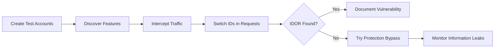
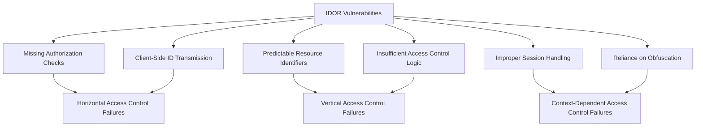
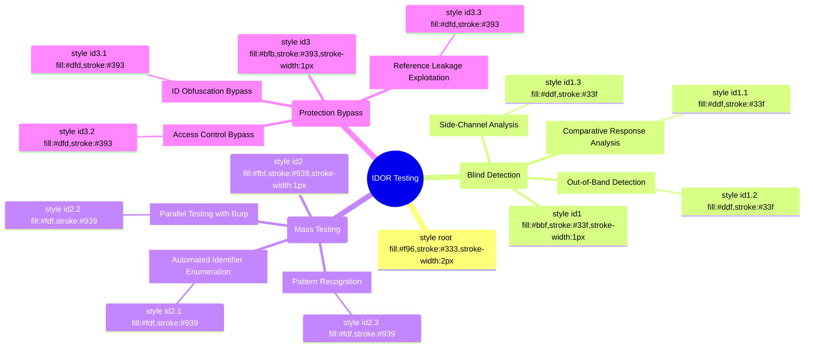
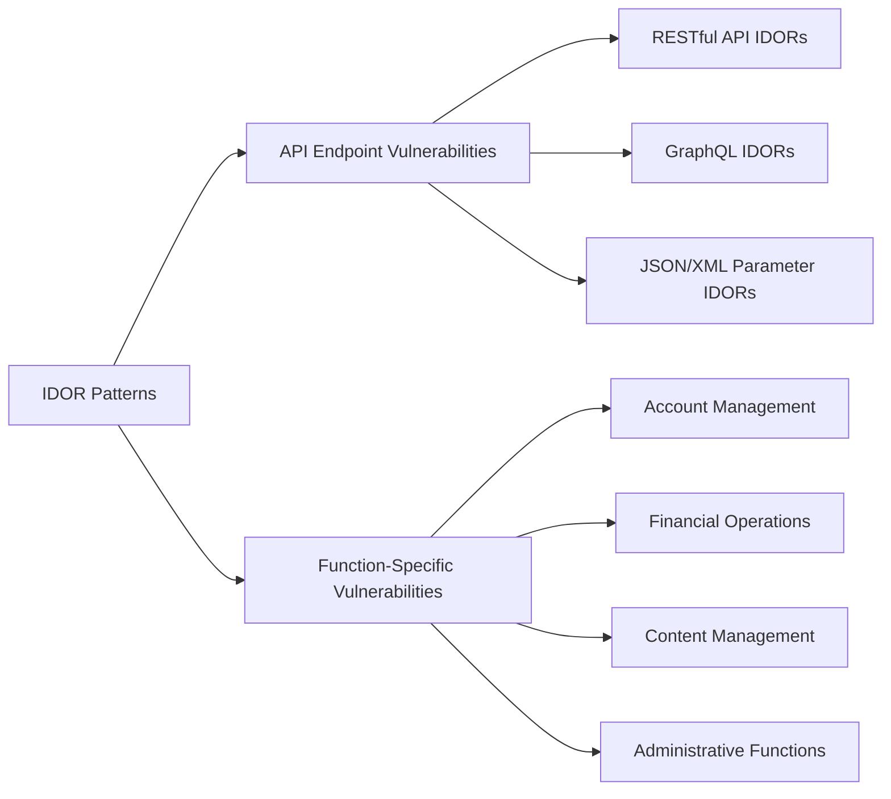

# Insecure Direct Object References (IDOR)

## Shortcut



- Create two accounts for each application role and designate one as the attacker account and the other as the victim account.
- Discover features in the application that might lead to IDOR. Pay attention to features that return sensitive information or modify user data.
- Revisit the features you discovered in step 2. With a proxy, intercept your browser traffic while you browse through the sensitive functionalities.
- With a proxy, intercept each sensitive request and switch out the IDs that you see in the requests. If switching out IDs grants you access to other user's information or lets you change their data, this indicates an IDOR.
- Don't despair if the application seems to be immune to IDOR. Use this opportunity to try a protection bypass technique. If the application uses an encoded, hashed, or randomized ID, you can try decoding, or predicting the IDs. You can also try supplying the application with an ID when it does not ask for one. Finally, sometimes changing the request method type or file type makes all the difference.
- Monitor for information leaks in export files, email, and other text alerts. An IDOR now might lead to an information leak in the future.

## Mechanisms



Insecure Direct Object References (IDOR) occur when an application exposes a reference to an internal implementation object without sufficient access control. These vulnerabilities allow attackers to manipulate these references to access unauthorized data or perform unauthorized actions.

IDOR vulnerabilities arise from flawed access control mechanisms that fail to validate whether a user should have permission to access or modify a specific resource. The core implementation issues include:

- **Missing Authorization Checks**: No validation of user permissions when accessing objects
- **Client-Side ID Transmission**: Relying on client-provided identifiers without server-side verification
- **Predictable Resource Identifiers**: Sequential or easily guessable object references
- **Insufficient Access Control Logic**: Authentication without proper authorization
- **Improper Session Handling**: Not binding resources to user sessions
- **Reliance on Obfuscation**: Using complex identifiers without actual access control

IDORs manifest in various patterns:

- **Horizontal Access Control Failures**: Accessing resources belonging to other users of the same privilege level
- **Vertical Access Control Failures**: Accessing resources requiring higher privileges
- **Context-Dependent Access Control Failures**: Access based on improper contextual states

## Hunt

### Identifying IDOR Vulnerabilities

#### Preparation

1. **Create Multiple Test Accounts**:
   - Set up accounts with different privilege levels (e.g., regular user, premium user)
   - Create multiple accounts within the same privilege level

2. **Establish Baseline Behavior**:
   - Document normal resource access patterns
   - Map all application endpoints that reference objects
   - Identify resource identifiers in requests
   - Evaluate caching headers (ETag/Last-Modified) that can leak existence side‑channels during enumeration

3. **Request Capture Setup**:
   - Configure a proxy (e.g., Burp Suite, OWASP ZAP)
   - For mobile applications, install the proxy’s CA certificate on the device or emulator (e.g., with mitmproxy or Burp Mobile Assistant) so HTTPS traffic can be intercepted.
   - Record all interactions with resource identifiers
   - Create an inventory of potential IDOR test targets

#### Finding IDOR Vulnerabilities

1. **Request Parameter Analysis**:
   - Look for identifiers in URLs, request bodies, cookies, and headers
   - Common parameter names:
     ```
     id, user_id, account_id, file, doc, document, record, item, order, number, profile,
     edit, view, filename, object, num, key, userid, uuid, group, role
     ```
   - Watch for identifiers hidden in JWT claims (`sub`, `org_id`) or signed cookies; tamper if server fails to re‑authorize.

2. **Parameter Manipulation Techniques**:
   - **Direct Modification**: Change numerical IDs (e.g., `id=1` → `id=2`)
   - **Add Missing IDs**: Try adding relevant IDs (e.g., `user_id`, `account_id`) to requests that don't initially have them (e.g., `GET /api/messages` → `GET /api/messages?user_id=<victim_uuid>`). Parameter names can often be inferred from other requests or discovered using tools like Arjun.
   - **GUID/UUID Replacement**: Replace one user's GUID with another's
   - **Decode and Modify**: Decode base64/hex encoded parameters before modification
   - **Array/Object Manipulation**: Add or modify array elements in API requests
     ```json
     {"items": [{"id": 123, "owner": "victim"}]} → {"items": [{"id": 456, "owner": "attacker"}]}
     ```
   - **File Type Manipulation**: Try changing requested file types or appending extensions (e.g., `.json`, `.xml`, `.config`). Ruby applications might respond differently to `/resource/123` vs `/resource/123.json`.
   - **Wildcard Testing**: Replace IDs with wildcards (e.g., `GET /api/users/*`). Rare, but worth trying.
   - **Array-based Access**: Try wrapping IDs in arrays (e.g., `{"id":19}` → `{"id":[19]}`).
   - **JSON Object Wrapping**: Try wrapping the ID in a nested JSON object (e.g., `{"id":111}` → `{"id":{"id":111}}`).
   - **Numeric vs Non-Numeric IDs**: If the application uses non-numeric IDs (GUIDs, usernames), try substituting them with potential numeric equivalents (e.g., `account_id=UUID` → `account_id=123`).
   - **Parameter Name Replacement**: Try alternative parameter names (e.g., album_id → account_id). Fuzz JSON Patch (RFC 6902) and JSON Merge Patch (RFC 7386) bodies for cross‑user modifications.

- **Multiple Value Testing**: Supply multiple values for same parameter (e.g., `id=123&id=456`, `user_id=attacker_id&user_id=victim_id`, `user_id=attacker_id[]&user_id=victim_id[]`). See HTTP Parameter Pollution under Bypass Techniques.
- **New Feature Focus**: Pay special attention to newly added features as they may have weaker access controls; include mobile and older API versions.
- **Cache Probing**: Use CDN cache keys and `If-None-Match` probing to infer existence without full access.

3. **Endpoint Analysis Questions**:
   For each endpoint receiving an object ID, ask:
   - Does this ID reference a private or sensitive resource (vs. public)?
   - What are _my_ legitimate IDs for this type of resource?
   - What are the different user roles interacting with this API? (user, admin, manager, etc.)

4. **Hidden Parameter Discovery**:
   - Analyze JavaScript client-side code for hidden parameters
   - Check mobile app API communications
   - Examine response data for additional identifiable references

5. **Web Socket Discovery**:
   - Identify how websockets are being initiated
   - Check if we can manipulate it to change anything
   - Make sure to test mobile/desktop applications of the target as well
   - Inspect mobile deep links and intent filters that include object IDs; try cross‑app invocation.

6. **Testing Methodology**:
   1. Access resource as User A and capture the request
   2. Note all identifiers (explicit and obfuscated)
   3. Log in as User B
   4. Replay User A's request with User B's session
   5. Modify identifiers to access resources belonging to other users
   6. Test both read and write operations(and all other application boundaries)
   7. if there are mobile applications create a unique user for that platform as well and test IDOR

### Advanced IDOR Testing Techniques



#### Blind IDOR Detection

1. **Comparative Response Analysis**:
   - Compare responses between valid and invalid resource IDs
   - Look for subtle differences in response times, sizes, or error messages
   - Use automated tools to detect variations across multiple requests

2. **Out-of-Band Detection**:
   - Inject tracking URLs in modifiable parameters
   - Monitor for callbacks when the resource is accessed
   - Use server callbacks to detect successful access

3. **Side-Channel Analysis**:
   - Analyze network traffic for additional clues
   - Look for timing differences or response size variations

#### Mass IDOR Testing

1. **Automated Identifier Enumeration**:

```python
import requests

session = requests.Session()
# Login code here...

# Test range of IDs
for id in range(1, 1000):
    response = session.get(f"https://example.com/api/documents/{id}")
    if response.status_code == 200:
        print(f"Found accessible document: {id}")
        # Log response for later analysis
```

2. **Parallel Testing with Burp**:
   - Use number payloads for sequential IDs (test large ranges, e.g., 100-1000+).
   - Use custom word lists for GUIDs/UUIDs from observed patterns
   - Set up Grep Match rules to identify successful access

3. **Pattern Recognition**:
   - Analyze response patterns for common IDOR signatures
   - Look for repeated or predictable access patterns

## Bypass Techniques

### ID Obfuscation Bypass

- **Hashed IDs**: Collect legitimate hashed IDs and map to users
- **Encoded IDs**: Decode base64/hex encodings and modify values
  ```
  /api/document/MjQ2 (base64 of "246") → /api/document/MjQ3 (base64 of "247")
  ```
- **Encrypted IDs**: Identify encryption patterns and test related IDs

### Access Control Bypass

- **HTTP Method Switching**: Change GET to POST or PUT
  ```
  GET /api/users/123 → POST /api/users/123
  ```
- **Content-Type Manipulation**: Modify content-type headers
  ```
  Content-Type: application/json → Content-Type: application/xml
  ```
- **Parameter Pollution (HTTP)**: Add duplicate parameters with different values. The server might prioritize the first or last occurrence differently.
  ```
  GET /api/document?id=attacker_id&id=victim_id
  GET /api/users?user_id=attacker_id[]&user_id=victim_id[]
  ```
- **Parameter Pollution (JSON)**: Provide duplicate keys in a JSON object. Behavior depends on the parser.
  ```json
  { "user_id": "attacker_id", "user_id": "victim_id" }
  ```
- **Mixed-Case / Path-Normalization Bypass**: Try different capitalizations, mixed-case encodings, dot-segments (../) and URL-encoded slashes (%2F) to bypass path or router checks.
  ```
  GET /admin/profile → GET /ADMIN/profile
  ```
- **Path Traversal Bypass**: Use path traversal sequences within parameters referencing objects.
  ```
  POST /users/delete/MY_ID/../VICTIM_ID
  ```
- **Outdated API Version Testing**: If multiple API versions exist (e.g., /v1/, /v2/), test the IDOR on older, potentially less secure versions.
  ```
  GET /v3/users/123 → 403 Forbidden
  GET /v1/users/123 → 200 OK
  ```

### Request Smuggling for IDOR

- **HTTP Request Smuggling**: Use CL.TE or TE.CL smuggling to inject victim IDs in backend requests

  ```
  POST / HTTP/1.1
  Content-Length: 4
  Transfer-Encoding: chunked

  1
  Z
  Q
  ```

  Front-end strips `user_id` parameter but back-end processes it from smuggled request chunk

### Mass Assignment IDOR

- **Parameter Injection**: Add fields that weren't in original schema
  ```json
  { "name": "John", "role": "admin", "user_id": "victim_id", "is_admin": true }
  ```
- **Case Variation Testing**: Test both camelCase and snake_case variants
  ```
  userId vs user_id vs UserId vs USER_ID
  ```
- **Nested Object Injection**: Add authorization fields in nested objects
  ```json
  {
    "profile": {
      "name": "John",
      "owner_id": "attacker_id",
      "target_id": "victim_id"
    }
  }
  ```

### Reference Leakage Exploitation

- **Harvesting IDs from HTML/JS Sources**:
  - Extract IDs from page source, JavaScript files
  - Analyze AJAX requests for leaked IDs

- **API Response Analysis**:
  - Check list responses for IDs of other users' resources
  - Look for IDs in error messages or debugging information
  - Check for endpoints that might translate identifiers (e.g., email to GUID).
  - Harvest IDs via analytics beacons, logs endpoints, GraphQL error suggestions, or search/autocomplete APIs.

## Vulnerabilities

### Common IDOR Vulnerability Patterns



#### API Endpoint Vulnerabilities

- **RESTful API IDORs**: Direct manipulation of resource identifiers in REST APIs

  ```
  GET /api/users/123/profile → GET /api/users/456/profile
  ```

- **GraphQL IDORs**: Changing object identifiers in GraphQL queries

  ```graphql
  query {
    user(id: "attacker_id") {
      changePassword(newPassword: "pwned")
    }
  }
  ```

- **JSON/XML Parameter IDORs**: Modifying nested parameters
  ```json
  {"user": {"id": 123, "action": "view"}} → {"user": {"id": 456, "action": "view"}}
  ```

#### Function-Specific Vulnerabilities

- **Account Management IDORs**:
  - Accessing another user's profile, settings, or personal information
  - Modifying another user's account details

- **Financial IDORs**:
  - Accessing another user's payment methods or financial records
  - Modifying order details, prices, or payment information

- **Content Management IDORs**:
  - Accessing private documents, media, or posts
  - Modifying content ownership or permissions

- **Administrative Function IDORs**:
  - Accessing administrative interfaces or functions
  - Executing privileged actions through API endpoints

- **OAuth/OIDC IDORs**:
  - Manipulating `state` or `code` parameters in OAuth flows
  - Accessing token endpoints with other users' authorization codes
  - PKCE code_verifier bypass via IDOR

- **2FA/MFA IDORs**:
  - Accessing backup code generation endpoints for other users
  - Retrieving TOTP secrets via `/api/users/{user_id}/totp-secret`
  - Disabling 2FA for other accounts

- **Notification/Webhook IDORs**:
  - Modifying notification preferences: `/api/notifications/settings/{user_id}`
  - Accessing webhook configuration endpoints for other tenants
  - Reading notification history of other users

- **Real-time Feature IDORs**:
  - Socket.io/WebSocket room IDs as direct object references
  - Live chat room access via predictable room identifiers
  - Real-time dashboard data streams with user/org IDs

### GraphQL

- Enforce authorization per-field, not just at the root resolver; test aliasing, fragments, batched and persisted queries.
- Restrict or gate introspection in production; sanitize error messages. Fuzz `__typename` switches to reach sibling object types.
- Swap out `id` arguments and nested object IDs in mutations and batch queries; verify per‑object ownership checks.

### gRPC / Protobuf

- Microservices increasingly use gRPC; IDs live in binary messages. Test with grpcurl and fuzzers; validate authorization on every method.
- If server reflection is enabled, fetch `.proto` definitions; disable reflection in production when possible.

### Cloud-Native Object URLs

- Presigned URLs (S3/GCS/Azure) are direct object references; require short expiries, method scoping, optional IP constraints, and backend re‑validation on GET.
- Attempt to tweak the `Key=`/object path, query params, or credentials (e.g., `X-Amz-Security-Token`) to replay others’ files; test cross‑tenant reuse.

### Observability / OpenTelemetry Leaks

- Trace systems like Zipkin or Jaeger often expose span attributes containing user IDs.
- Query endpoints such as `/api/v2/traces` or `/v1/traces`, harvest IDs, and replay them against protected APIs.

## Authorization-as-Code Pitfalls (OPA, Cedar)

- Organizations delegate authorization to policy engines (OPA, Cedar). Fuzz policy inputs directly (e.g., `POST /v1/data/authz/allow`).
- Verify explicit owner/tenant checks in Rego/Cedar; add unit tests for BOLA cases; deny‑by‑default at the first hop.

## Modern Detection & CI/CD Tooling

- Use Burp (Repeater/Intruder/Turbo Intruder) and auth‑diff extensions (e.g., Autorize/AuthMatrix) for parallel testing across roles.
- Use gRPC tooling (grpcurl, gRPC Inspector) and disable reflection in production where possible.
- CI tools that generate BOLA/IDOR cases (e.g., Pynt, StackHawk, RESTler) and block merges on failures.

## Methodologies

### Tools

#### Automated IDOR Detection Tools

- **Burp Suite Extensions**:
  - Authorize: Comparing responses between users
  - Authz: Automated access control testing
  - Auto Repeater: Replaying requests with modifications
  - IDOR Scanner: Dedicated IDOR detection extension
  - Pynt: CLI / CI scanner that auto-generates BOLA/IDOR test cases.
  - StackHawk: CI-native scanner; its BOLA module blocks merges on failing IDOR checks.

- **Specialized Tools**:
  - Arjun / Parameth: Useful for discovering hidden parameters often relevant in IDOR testing.
  - AuthMatrix: Testing authorization in web applications
  - Astra: Automated Security Testing for REST APIs
  - IIS-Shortname-Scanner: Testing for path disclosure

- **Framework-Specific Tools**:
  - RESTler: Stateful REST API fuzzing
  - GraphQLmap: Testing GraphQL endpoints for IDORs
  - Kiterunner: API endpoint discovery, finds hidden IDOR-prone endpoints

#### Manual Testing Tools

- **Proxy Tools**: Burp Suite, OWASP ZAP
- **API Testing**: Postman, Insomnia
- **Custom Scripts**: Python with requests library

### Testing Methodologies

#### Comprehensive IDOR Testing Process

1. **Reconnaissance Phase**:
   - Map all endpoints and functionality
   - Identify authentication mechanisms
   - Document all object references and formats

2. **Identification Phase**:
   - Set up multiple accounts at different privilege levels
   - Capture all interactions with the application
   - Catalog all potential IDOR test points

3. **Testing Phase**:
   - Perform parameter tampering across all identified points
   - Test for both read and write IDOR
   - Try multiple bypass techniques for each endpoint
   - Test indirect references (e.g., file uploads, exports)

4. **Exploitation Phase**:
   - Develop reliable proof-of-concept exploits
   - Assess the impact of discovered vulnerabilities
   - Determine the scope and severity

5. **Reporting Phase**:
   - Document clear reproduction steps
   - Demonstrate actual/potential business impact
   - Provide remediation recommendations

### Specific Test Scenarios

#### Account Management Testing

1. Log in as User A and access profile settings
2. Capture requests for viewing/editing profile
3. Log in as User B
4. Replay User A's requests with User B's session
5. Modify identifiers to access/edit User A's profile

#### Document Access Testing

1. Upload documents with User A
2. Capture document access/download requests
3. Log in as User B
4. Modify document identifiers to access User A's documents
5. Test both direct access and list/search interfaces

#### API Testing

1. Map all API endpoints and their parameters
2. Identify endpoints that accept object identifiers
3. Test horizontal access (between equal privilege users)
4. Test vertical access (between different privilege levels)
5. Test indirect references (nested objects, relationships)
6. Check corresponding mobile API endpoints for differences or leaks.
7. Look for parallel administrative endpoints (e.g., `/api/users/myinfo` vs `/api/admins/myinfo`).

### High-Impact IDOR Targets

When hunting for IDORs, prioritize these high-impact endpoints:

1. **User Profile Settings**:
   - /settings/profile
   - /user/profile
   - /user/settings
   - /account/settings
   - /username
   - /profile

2. **Payment and Financial Endpoints**:
   - Test create/update/delete operations on objects that might seem read-only (e.g., changing prices via PUT requests).
   - Any endpoint handling payment information
   - Order processing systems
   - Financial record access points

3. **Administrative Functions**:
   - User management interfaces
   - System configuration endpoints
   - Access control settings

4. **Authentication & MFA Endpoints**:
   - /api/users/{id}/backup-codes
   - /api/users/{id}/totp
   - /api/users/{id}/disable-2fa
   - /oauth/authorize (state parameter)
   - /api/users/{id}/sessions

5. **Notification & Communication**:
   - /api/notifications/{id}
   - /api/webhooks/{id}/config
   - /api/users/{id}/email-preferences
   - /api/alerts/{id}/settings

6. **Real-Time & Collaboration**:
   - /socket.io/?room={id}
   - /api/rooms/{id}/join
   - /api/live-sessions/{id}
   - /api/collaborative-docs/{id}

## Chaining and Escalation

IDOR vulnerabilities can often be chained with other issues or used to escalate privileges:

- **IDOR + Information Disclosure**: If an IDOR requires an unpredictable identifier (like a UUID), find another vulnerability (e.g., an API endpoint listing users) that leaks these identifiers. Use the leaked IDs to exploit the IDOR.
- **IDOR + Stored XSS**: If an IDOR allows modification of data viewable by other users (e.g., changing a profile name, posting a comment), inject an XSS payload. This escalates the IDOR to Stored XSS affecting other users.
- **IDOR for Feature Abuse**: Use IDOR to abuse application features, such as adding items to another user's cart, triggering actions on their behalf, or exhausting resources tied to their account.

## Remediation Recommendations

- **Implement Proper Authorization**: Validate access rights for every resource request
- **Use Indirect References**: Replace direct references with temporary per-session tokens
- **Server-Side Validation**: Validate that the requested object belongs to the current user
- **Contextual Access Controls**: Consider context beyond just resource ownership
- **Authorization Frameworks**: Use dedicated authorization frameworks like ABAC, RBAC
- **Least Privilege Principle**: Restrict access to the minimum necessary
- **Rate Limiting**: Implement rate limiting to prevent brute-force IDOR discovery
- **Activity Logging**: Log all access attempts for sensitive resources
- **Session Binding**: Explicitly bind resources to authenticated sessions
- **Input Validation**: Validate all input parameters for type, format, and range
- **Deny-by-Default**: Authorize on object owner and tenant at the very first layer; fail closed.
- **Unit/Contract Tests**: Add authorization unit tests per endpoint/field and CI scanners that auto-generate BOLA cases.
- **Cache Partitioning**: Partition CDN caches by auth headers; avoid cacheable 200/304 for private resources.
