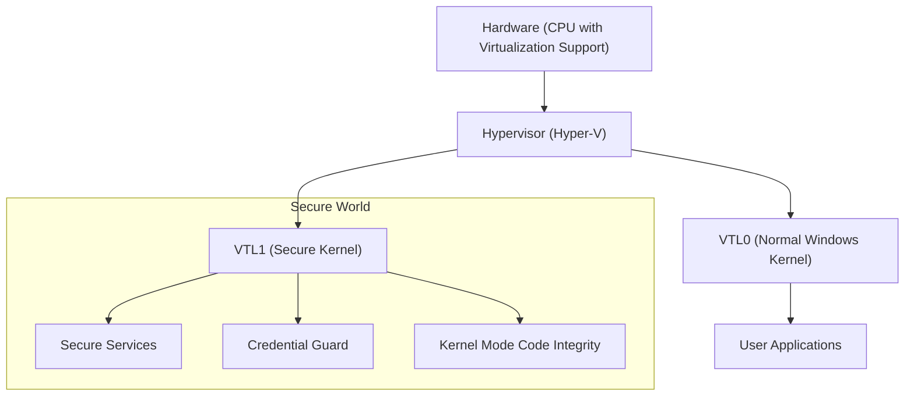
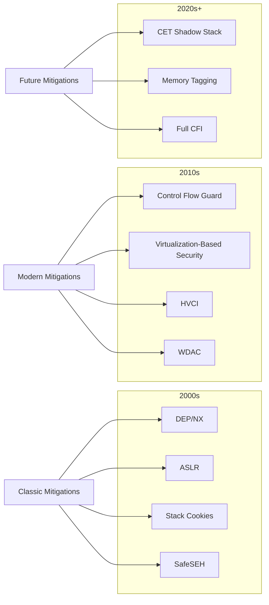

# Modern Kernel Exploit Mitigations

## Memory-safety & Isolation

### Kernel Address Space Layout Randomization (KASLR)

- Randomizes memory addresses where the kernel and its components are loaded.
- Makes it difficult for attackers to predict kernel code and data locations.

#### Bypass Techniques

- **Information Leaks:** Exploiting vulnerabilities (e.g., uninitialized memory, side-channels) to leak kernel pointers and calculate the base address.
- **Side-Channel Attacks:** Using timing, cache, or other microarchitectural side channels to infer memory layout.
  - **Prefetch Cache Timing:** Measures access speed across the kASLR range (0xfffff80000000000 to 0xfffff80800000000, ~0x8000 iterations with 0x100000 alignment). The fastest access indicates a cached address, revealing the actual kernel base. Uses `rdtscp` for timing, `mfence` for memory barriers, and `prefetchnta`/`prefetcht2` for cache manipulation.
- **Targeting Non-Randomized Regions:** Exploiting data or code segments that are not fully randomized.
- **Brute-Force:** Feasible in environments with limited entropy (e.g., some 32-bit systems or specific configurations).
- **Intel LAM:** Linear Address Masking support exists on recent kernels/CPUs but may be disabled by default. Verify with kernel config, boot params, and CPU flags on your target.

### Kernel Page Table Isolation (KPTI)

- Linux:
  - Separates user-space and kernel-space page tables.
  - Mitigates the Meltdown vulnerability by preventing user-space access to kernel memory.

#### Bypass Techniques

- **Side-Channel Attacks:** Exploiting microarchitectural side channels (e.g., TLB timing, cache attacks) that leak information across the isolation boundary.
- **Hardware Vulnerabilities:** Exploiting CPU vulnerabilities (e.g., L1TF, MDS) that can bypass page table separation.
- **Implementation Flaws:** Bugs in the KPTI implementation itself.

#### Practitioner

- Linux: check status via `/sys/devices/system/cpu/vulnerabilities/*` and `dmesg | grep -i kpti`.
- Windows: verify meltdown/KVA shadowing with `Get-SpeculationControlSettings` PowerShell script from Microsoft.

### Supervisor Mode Access Prevention (SMAP)

- Linux:
  - Hardware feature preventing unintended kernel access to user-space memory.
  - Protects against attacks exploiting improper memory accesses.

#### Bypass Techniques

- **ROP/JOP Gadgets:** Finding instruction sequences (gadgets) within kernel code that disable SMAP temporarily (e.g., via `stac` instruction) before accessing user memory.
- **Data-Only Attacks:** Attacks that achieve their goal without directly accessing user-space data from the kernel inappropriately.
- **Kernel Information Leaks:** Combining with KASLR bypasses to find suitable gadgets.

#### Practitioner

- Linux: confirm with `grep smap /proc/cpuinfo` and `cat /proc/cpuinfo | grep 'smep\|smap'`.
- Check CR4 at runtime with `rdmsr`/`wrmsr` tools or `lscpu -e` on supported systems.

### Supervisor Mode Execution Protection (SMEP)

- Linux/Windows:
  - Hardware feature preventing execution of user-space code when in supervisor mode.
  - Located in bit 20 of the CR4 control register.
  - Blocks certain privilege escalation attacks that rely on executing shellcode in user-mode memory.

#### Bypass Techniques

- **ROP/JOP Chains:** Constructing code reuse chains entirely from existing kernel code, avoiding execution of user-space code.
- **Data-Only Attacks:** Exploiting vulnerabilities without needing to execute shellcode (e.g., overwriting kernel data structures).
- **Disabling SMEP:** Finding gadgets or techniques to modify the CR4 control register to disable SMEP.
- **Type Confusion Exploits:** Using type confusion vulnerabilities to gain control flow and build ROP chains for SMEP bypass.
- **Page Table Manipulation:** Modifying page table entries (PTEs) to change user pages to supervisor pages, making user-space code executable in kernel context.
- **Write-What-Where Primitives:** Using arbitrary write vulnerabilities to modify CR4 register or page table structures.

#### Practitioner

- Linux: `grep smep /proc/cpuinfo`; verify effective state via `dmesg | grep -i smep`.
- Windows: SMEP is enforced when Memory Integrity/HVCI is enabled on modern systems.

### Kernel Data Protection (KDP)

- Windows:
  - Marks certain kernel memory regions as read-only.
  - Prevents unauthorized modification of critical kernel data structures.

#### Practitioner

- Check with `Get-CimInstance -ClassName Win32_DeviceGuard` and `System Information → Device Guard properties` for KDP/HVCI/VBS.

### Memory Integrity (Core Isolation)

- Windows:
  - Uses virtualization and HVCI to prevent malicious code alteration.
  - Guards against code injection or execution in kernel mode.

#### Practitioner

- Enable/verify: Windows Security → Device Security → Core isolation details.
- PowerShell: `Get-ItemProperty -Path HKLM:\SYSTEM\CurrentControlSet\Control\DeviceGuard\Scenarios\HypervisorEnforcedCodeIntegrity | Select-Object Enabled`.

### Read-Only Data Sections (RODATA)

- Linux:
  - Marks specific kernel memory regions as read-only.
  - Prevents modification of critical data structures and code.

### Hardened Usercopy

- Linux:
  - Adds boundary checks to memory copy operations between user and kernel space.
  - Prevents buffer overflows and memory corruption during copy operations.

### Memory Tagging Extension (MTE)

- Linux (ARM):
  - Hardware-assisted memory safety feature to detect memory corruption bugs.
  - Mitigates use-after-free and buffer overflows at a hardware level.
  - Adopted as a production security feature in **Android 16 (March 2025)** with both asynchronous and synchronous detection modes available for apps.

#### How MTE Works

- **4-bit Tags:** Each 16-byte memory allocation receives a random 4-bit tag (values 0-15)
- **Pointer Tagging:** Upper bits of pointers store the allocation tag
- **Tag Checking:** Hardware validates pointer tag matches memory tag on every dereference
- **Fault on Mismatch:** Invalid access triggers `SIGSEGV` (sync mode) or logs asynchronously (async mode)

#### Bypass Techniques

- Tag Collision (Probabilistic): With only 4-bit tags (16 possible values), collision probability is high
  - Increase entropy with larger allocation pools; Android 16 uses tag rotation heuristics.
- Untagged Memory Regions: Not all memory is MTE-protected
  - Enable MTE on stack via `prctl(PR_MTE_TCF_SYNC, PR_TAGGED_ADDR_ENABLE)`.
- Asynchronous Mode Exploitation: Android's async mode delays fault reporting for performance
  - Use synchronous mode (`MTE_mode=sync`) for security-critical apps.
- Integer Overflow in Tag Calculation: MTE tags are derived from allocation size; overflow can corrupt tags
- Kernel-Space Bypass: MTE only protects userspace by default
  - Kernel allocations (`kmalloc`, `vmalloc`) don't use MTE (Android 16, Linux 6.8)
  - Kernel exploit primitives (KASLR leak, arbitrary write) unaffected
  - Syscall buffer handling may not validate tags
- JIT Code Execution: JIT-compiled code can bypass MTE checks

```asm
; Assembly gadget to create untagged pointer
mov x0, xzr          ; Zero out tag bits
orr x0, x0, #0x1000  ; Set address without tag
ldr x1, [x0]         ; Load from untagged pointer (no MTE check)
```

#### Exploitation Workflow:

1. Leak a tagged pointer
2. Strip tag bits (mask upper 8 bits)
3. Use untagged pointer for memory operations
4. MTE doesn't validate untagged accesses in some contexts

#### Practitioner

- Android: enable per‑app via Developer Options or `adb shell setprop persist.device_config.runtime_native_boot.mte_mode sync` (device‑specific).
- Linux: compile with `CONFIG_ARM64_MTE` and use `prctl(PR_SET_TAGGED_ADDR_CTRL, ...)` from user space.
- Verify MTE status: `cat /proc/cpuinfo | grep mte` and check `HWCAP2_MTE` in `getauxval(AT_HWCAP2)`
- Android 16+ apps: opt-in via manifest `<application android:memtagMode="sync">`

### Intel Linear Address Masking (LAM)

Intel allows software to use upper address bits for metadata, similar to ARM's Top Byte Ignore (TBI).

#### How LAM Works

- **LAM57:** Uses bits 62:57 (6 bits) for tags in 5-level paging
- **LAM48:** Uses bits 62:48 (15 bits) for tags in 4-level paging
- **Hardware Masking:** CPU ignores tagged bits during address translation
- **Use Cases:** Memory tagging, capability systems, garbage collection metadata
- **Vulnerability Classes:**

1. **Pointer Forge:** Attackers can craft tagged pointers without validation
2. **Info Leak Bypass:** Some sanitizers only check canonical addresses; LAM-tagged pointers pass checks
3. **Address Confusion:** Software assuming canonical addresses may mishandle LAM pointers

### Memory Sealing

- Linux:
  - `mseal()` permanently seals selected VMAs so permissions/mappings can no longer change—even by the owner (verify kernel version and libc support on your target).
  - Adopted by projects such as Chrome/glibc/BPF tool‑chains to seal JIT pages, locking down GOT/PLT and eBPF JIT regions (version‑specific; verify).

#### Bypass Techniques

- **Time‑of‑use Window:** Exploits must succeed before sealing.
- **Data‑only Abuse:** Still possible if the mapping remains writable.
- **Kernel Flaws:** Bugs in the `mseal()` path could bypass a seal.

#### Practitioner

- Verify `mseal` availability via `grep -R sys_mseal /proc/kallsyms` or kernel `symbols`.
- Userland: `prctl(PR_MSEAL, ...)` (glibc 2.41+ headers), check errno for `ENOSYS` on older kernels.

### Privileged Access Never (PAN)

- Linux (ARM):
  - Hardware feature preventing direct kernel access to user-space memory.
  - Similar concept to SMAP on x86, prevents certain data leakage/corruption bugs.

### Kernel DMA Protection

- Windows:
  - Uses IOMMU/VT-d to protect against malicious peripherals performing DMA attacks.
  - Prevents unauthorized memory access via hardware devices.

### Pluton Security Processor

- Windows:
  - Microsoft Pluton is increasingly deployed with newer platforms, replacing or augmenting discrete TPM 2.0 and hardware‑binding BitLocker keys, Secure Boot, and HVCI policies. Check OEM/SKU documentation for Copilot+ requirements.

#### Practitioner

- Check Pluton state in Device Manager → Security devices, or `tpm.msc` shows Pluton‑backed TPM if present.

### Memory Protection Keys (MPK)

- Linux:
  - Provides per-page memory permissions using hardware keys.
  - Allows fine-grained control over memory access rights.

#### Bypass Techniques

- **PKRU Register Manipulation**: Using gadgets to modify the Protection Key Rights Register.
- **Unprotected Memory**: Targeting memory regions not protected by MPK.
- **Implementation Bugs**: Exploiting flaws in the MPK implementation.
- **Side-Channel Attacks**: Using side channels to infer protected memory contents.

### Protection Keys for Supervisor (PKS)

- Linux/Intel:
  - Extends PKU to supervisor pages; the kernel flips page permissions via `wrmsr PKS_MSC*` without TLB flushes (Sapphire‑Rapids+).
  - Landed upstream in Linux 6.12.

#### Bypass Techniques

- **ROP/JOP `WRMSR` Gadgets** that flip PKS bits.
- **Unprotected Regions** outside a PKS domain.
- **CPU Errata** undermining isolation.

#### Practitioner

- Linux: enable with `CONFIG_X86_PKS`; verify via `dmesg | grep -i pks` and `/proc/cpuinfo` flags.

### Zero-Page Memory Allocation

- Linux/Windows:
  - Ensures memory pages are zeroed before allocation.
  - Prevents leakage of residual data.

### Zero-Page Mapping Removal

- Linux:
  - Removes zero page mapping to prevent NULL pointer dereference exploits.
  - Enhances memory safety.

### Init-On-Alloc and Init-On-Free and Init-Stack-All-Zero

- Linux:
  - Automatically zeroes memory when allocated or freed.
  - Prevents use-after-free and information leakage.

### TPM Bus Encryption

- Linux:
  - Recent kernels add support for stronger TPM transports over SPI/I²C on some platforms. Feature availability and defaults vary; verify in `dmesg` and driver configs for your device.

#### Practitioner

- Verify with `dmesg | grep -i tpm` and kernel config `CONFIG_TCG_TIS_SPI`/`_I2C` options; firmware must expose supported transports.

## Memory Safety Initiatives

### Rust in the Linux Kernel

- First‑class Rust support landed in Linux 6.1 (December 2022) and was declared production‑ready with Linux 6.6 (October 2023).
- In‑tree Rust drivers (e.g., NVMe, DRM simple‑display, Wi‑Fi) have so far exhibited zero memory‑safety bugs under continuous fuzzing, demonstrating the practical security benefit of memory‑safe languages.
- Ongoing work aims to extend Rust usage into networking, Android GKI modules, and scheduler subsystems, further shrinking the kernel's attack surface.

### Safer Windows Drivers with C++20 and Rust

- Starting in Windows 11 23H2, the Windows Driver Framework (WDF) officially supports both modern C++20 and a Rust projection (`windows‑drivers‑rs`) that wrap KMDF/WDF APIs with lifetime‑safe abstractions.
- Hardware vendors can now obtain WHQL signatures for C++20 or Rust kernels drivers, eliminating common lifetime and IRQL‑misuse bugs without sacrificing performance.

### CHERI / Morello (Experimental Capability Hardware)

- Arm's Morello evaluation platform (2022‑2025) runs a CHERI‑enabled Linux kernel that enforces pointer capabilities in user and kernel space, providing hardware‑enforced spatial and temporal memory safety.
- Although experimental, CHERI demonstrates a plausible post‑2025 path toward fundamentally safer C/C++ code with architectural support.

### memfd_secret (userland secret memory)

- Linux:
  - `memfd_secret` (Linux 5.14+) provides user‑mode pages hidden from other processes and the kernel direct mappings
  - Useful for protecting keys and ROP staging from accidental exposure; verify support via kernel config and `memfd_secret(2)`

## Virtualization-Based Security Enhancements

### Virtualization-Based Security (VBS)

- Windows:
  - Creates an isolated, secure memory region using hardware virtualization.
  - Protects sensitive system components and data from malware and exploits.

#### Bypass Techniques

- **Hypervisor Vulnerabilities:** Exploiting bugs in the underlying hypervisor (Hyper-V) to escape the VBS container.
- **Misconfiguration:** Weaknesses in VBS configuration or deployment.
- **Physical Access:** Hardware-level attacks (e.g., DMA attacks if not mitigated by Kernel DMA Protection).
- **Compromised Signed Components:** Exploiting vulnerabilities in trusted components running within VBS.

#### Practitioner

- Confirm VBS/HVCI: `Core isolation` settings or PowerShell `Get-CimInstance -ClassName Win32_DeviceGuard` (look for `VirtualizationBasedSecurityStatus` and `SecurityServicesConfigured`).

### AMD Secure Encrypted Virtualization – Secure Nested Paging (SEV‑SNP)

- Linux guest support since 6.11; provides full memory encryption + integrity with an SVSM.
- Shipping today in major cloud "confidential VM" SKUs.

### Intel Trust Domain Extensions (TDX)

- Guest driver landed in 6.11; host enablement queued for 6.16.
- Protects guest memory against a compromised hypervisor.

#### Practitioner

- Cloud: verify TDX/SEV‑SNP instance type (`Azure DCasv5/ECasv5`, `GCP C3`, `AWS C7g` variants); attest via platform‑specific tools (e.g., `az confcom attestation`).

### Arm Confidential Compute Architecture (CCA) Realms

- Realm VM support merged in 6.13 for Arm v9 CPUs, giving encrypted, isolated guest environments.

### Hypervisor-Enforced Code Integrity (HVCI)

- Windows:
  - Uses VBS to enforce code integrity checks on kernel-mode drivers and binaries.
  - Ensures only signed and verified code can execute in kernel mode.

#### Bypass Techniques

- **Signed Malicious Drivers:** Obtaining signing certificates (stolen or illicitly acquired) to sign malicious code.
- **Exploiting Allowed Drivers:** Finding vulnerabilities in legitimate, signed drivers already running on the system ("Bring Your Own Vulnerable Driver" - BYOVD).
- **Hypervisor Vulnerabilities:** Exploiting the underlying hypervisor (see VBS bypasses).
- **Configuration Issues:** Weaknesses in Code Integrity policies.

### Mode Based Execution Control (MBEC)

- Windows:
  - Ensures driver code can only be executed in kernel mode.
  - Available in hardware and software (emulated) forms.
  - Prevents user-mode execution of kernel code.

### Kernel Mode Code Integrity (KMCI)

- Windows:
  - Ensures kernel pages can only become executable with proper signing.
  - Enforces driver signing enforcement and vulnerable driver blocklists.
  - Implements software SMEP (Supervisor Mode Execution Prevention).
  - `DriverSiPolicy.p7b` now refreshes **weekly** via Windows Update and MEM Configuration Manager, accelerating the BYOVD blocklist cadence.

### User Mode Code Integrity (UMCI)

- Windows:
  - Ensures user mode pages can only become executable with proper signing.
  - CI validates the signaturees of EXE and DLL before allowing them to load.
  - Enforces protected processes and protected process light signature requirements
  - Enforces `/INTEGRITYCHECK` for `FIPS 140-2` modules
  - Exposed to consumers as _Smart App Control_ and businesses as _App Control for Business_.
  - Part of the Device Guard technology stack.

### Windows Defender System Guard

- Windows:
  - Monitors system integrity during boot and runtime.
  - Protects against rootkits and bootkits by verifying system integrity.

### Windows Defender Application Guard

- Windows:
  - Runs untrusted content in isolated containers.
  - Protects the host from potentially malicious websites and documents.

### Credential Guard

- Windows:
  - Uses VBS to isolate and protect credentials.
  - Prevents attacks like Pass-the-Hash or Pass-the-Ticket.

### Device Guard

- Windows:
  - Combines WDAC and virtualization-based security to lock down devices.
  - Ensures only trusted applications can run.

## OS Loader and Hotpatching Changes (Windows 11 24H2+)

- Recent Windows versions (24H2 and later) introduced changes that impact classic process injection techniques like Process Hollowing (RunPE).
- **Status:** Client Hotpatching availability and cadence depend on SKU/servicing channel. Validate GA status in current Microsoft documentation.
- Windows Server 2025 requires an Azure Arc subscription for hotpatch servicing.

### Impact on Process Hollowing (MEM_PRIVATE Payloads)

- **Root Cause 1 (Error `0xC0000141`):** Native Hotpatching support added a new function `RtlpInsertOrRemoveScpCfgFunctionTable` during process initialization (`LdrpInitializeProcess -> LdrpProcessMappedModule`). This function calls `ZwQueryVirtualMemory` with a new `MemoryImageExtensionInformation` class, which _only_ works on `MEM_IMAGE` memory regions.
  - Classic Process Hollowing stores the payload in `MEM_PRIVATE` memory (either by unmapping the original PE or allocating a new region).
  - The `ZwQueryVirtualMemory` call fails with `STATUS_INVALID_ADDRESS` for the `MEM_PRIVATE` payload region, causing process loading to terminate.
- **Root Cause 2 (Error `0xC00004AC`, Memory Integrity Enabled):** If Memory Integrity (HVCI) is enabled, another check occurs later in the loading process.
  - `LdrpQueryCurrentPatch` is called on the payload's memory region.
  - This leads to a call to `NtManageHotPatch`, which fails with `STATUS_CONFLICTING_ADDRESSES` for the `MEM_PRIVATE` payload.
  - This error also terminates the process loading.

### Solutions and Bypasses

1.  **Use Alternative Techniques (Recommended):** Employ methods that map the payload as `MEM_IMAGE`, which are unaffected by these specific checks.
    - Examples: Process Doppelganging, Process Ghosting, Process Herpaderping, Transacted Hollowing, Ghostly Hollowing, Herpaderply Hollowing, Process Overwriting.
    - These techniques generally interact more naturally with the loader and newer OS features.
2.  **Patch NTDLL (If sticking to Classic RunPE):**
    - **For `0xC0000141`:** Hook `ZwQueryVirtualMemory`.
      - Check if the OS is Win11 24H2+ (64-bit).
      - If the `MemoryInformationClass` is `MemoryImageExtensionInformation` AND the query targets the base address of the `MEM_PRIVATE` payload:
        - Return a benign error like `STATUS_NOT_SUPPORTED` instead of calling the original function.
      - Otherwise, call the original `ZwQueryVirtualMemory`.
      - [Implementation Example](https://github.com/hasherezade/libpeconv/blob/master/run%5Fpe/patch%5Fntdll.cpp#L91)
    - **For `0xC00004AC` (Memory Integrity):** Hook `NtManageHotPatch`.
      - Patch the function to immediately return a benign error like `STATUS_NOT_SUPPORTED`.
      - Apply this patch early in the process creation, for both 32-bit and 64-bit.
      - Ensure `FlushInstructionCache` is called if patching after the function might have been cached.
      - [32-bit Example](https://github.com/hasherezade/libpeconv/blob/master/run%5Fpe/patch%5Fntdll.cpp#L4)
      - [64-bit Example](https://github.com/hasherezade/libpeconv/blob/master/run%5Fpe/patch%5Fntdll.cpp#L43)

## Control Flow Integrity and Execution Protections

### Data Execution Prevention (DEP)

- Windows/Linux:
  - Marks certain memory regions as non-executable.
  - Prevents execution of code from data pages, mitigating buffer overflow attacks.

#### Bypass Techniques

- **Return-oriented Programming (ROP)**: Using existing code fragments to create attack chains without injecting code.
- **ret2libc**: Jump directly to code in libc.
- **ret2data**: Place shellcode in the data section.
- **ret2strcpy**: Place shellcode on the stack and use strcpy to move it somewhere executable.
- **ret2gets**: Read from stdin to gain control.
- **VirtualProtect/VirtualAlloc**: Call these functions to change memory permissions.
- **JIT Spraying**: Leverage Just-In-Time compilation to get executable memory.

#### Practitioner

- use `!vprot rip` or `!vpro rsp` to check for protections inside WinDbg
- `.scriptload G:\Projects\narly.js; !nmod` also helps you to see which modules have DEP protection
- `Data Execution Prevention` settings inside `Windows Exploit Guard` can be used to force DEP protection on an executable
- pivot with `VirtualProtect` / `NtProtectVirtualMemory` (or pre‑ACG RWX section) from a ROP/JOP chain.
- Modern Windows 10/11 enforce **CET (Shadow Stack)** and **XFG (Cross‑Function Guard)**, which break classic ROP; successful chains must first disable CET (for example with `SetProcessMitigationPolicy`) or switch to JOP/SCS gadgets.
- an example would be `pop rcx; retn; pop rcx; retn; mov [rcx], rax; pop rbp; retn;`
- we can use `IAT` to identify and call `WriteProcessMemory` which can be used to circumvent DEP protection through `NtProtectVirtualMemory` API
- [Ropper 2.0](https://github.com/sashs/Ropper) **or Rizin‑ropper** — both support CET/XFG‑aware gadget filtering.

### Control Flow Integrity (CFI)

- Windows:
  - Ensures kernel execution follows legitimate paths.
  - Thwarts control-flow hijacking attacks like function pointer overwrites.

#### Bypass Techniques

- **Similar Function Prototypes**: For XFG (Extreme Flow Guard), functions with similar prototypes may be exploitable.
- **Data-Only Attacks**: Manipulating program state without violating CFI constraints.
- **Implementation Weaknesses**: Exploiting gaps in the implementation of CFI.
- **JIT Compilation**: Just-in-time compiled code may bypass CFI checks.

#### Practitioner

- Windows build: enable CFG/XFG via `/guard:cf /guard:xfg` and `/Qspectre` where applicable; inspect PE `LoadConfig` for CFG/XFG metadata.
- Linux build: Clang `-fsanitize=cfi` (user space) or `CONFIG_CFI_CLANG=y` (kernel), with LTO; verify symbols contain CFI jump tables.

### kCFI

- Linux
  - Clang-based forward-edge Control-Flow Integrity that verifies indirect function calls at runtime in the kernel.
  - Enabled by default in Android GKI kernels and ChromeOS since early 2024; available upstream via `CONFIG_CFI_CLANG`.
  - Complements FineIBT and hardware CET by protecting software-only control-flow edges.
  - **BHI Hardening (Linux 6.9/6.10):** FineIBT now incorporates indirect‑branch serialization to mitigate Branch History Injection.

### Control Flow Guard (CFG)

- Windows:
  - Ensures indirect calls go only to valid, predefined locations.
  - Helps prevent control-flow hijacking attacks.

#### Bypass Techniques

- **JIT Code Execution**: Using Just-In-Time compiled code which may not be properly protected.
- **Import Address Table (IAT) Manipulation**: Inserting entries in IAT since these aren't checked.
- **Data-only Attacks**: Modifying program data to influence control flow without redirecting execution.
- **Type Confusion**: Exploiting type confusion to bypass CFG checks.

#### Practitioner

- Check process mitigation: `Get-ProcessMitigation -Name process.exe` (PowerShell) → CFG/strictCFG/XFG states.
- PE inspection: `dumpbin /loadconfig` shows GuardCFFunctionTable and flags.

### Stack Canaries

- Linux/Windows:
  - Inserts random values before return addresses on the stack.
  - Detects stack buffer overflows before they overwrite return addresses.

#### Bypass Techniques

- **Leaking Canary Values**: Using format string or other information disclosure vulnerabilities.
- **Overwriting Non-return Variables**: Attacking function pointers or other control flow variables not protected by canaries.
- **Brute Force**: On systems with low entropy canaries or predictable generation.
- **Exception Handler Attacks**: Targeting exception registration records which may not be protected.
- **Unprotected Functions**: Exploiting functions not protected by canaries (often due to performance considerations).

### Stack Clash Protection

- Linux/GCC:
  - Prevents stack and heap collisions by probing stack pages during large allocations.
  - Mitigates privilege escalation attacks that rely on stack/heap layout manipulation.
  - Enabled with `-fstack-clash-protection` compiler flag.

#### Bypass Techniques

- **Precise Heap Layout**: Carefully crafting heap allocations to avoid clash detection.
- **Small Allocations**: Using allocations smaller than the probe size to avoid triggering protection.
- **Alternative Memory Regions**: Targeting other memory regions not protected by stack clash detection.
- **Implementation Gaps**: Exploiting edge cases in the probing logic.

### Hardware‑Enforced Stack Protection

- Windows:
  - Utilizes Intel CET (specifically the Shadow Stack feature, referred to as Kernel Mode Hardware-enforced Stack Protection or KCET) and AMD Shadow Stack features.
  - Requires Hypervisor-Enforced Code Integrity (HVCI) / Virtualization-Based Security (VBS) to be enabled.
  - Provides a hardware-backed shadow stack to protect return addresses against ROP/JOP attacks.
  - Applies to kernel-mode stacks, including those associated with user-mode threads executing in kernel mode (e.g., during system calls).
  - Hardware-Enforced Stack Protection is enabled by default on compatible hardware with Windows 11, version 24H2, when VBS/HVCI is active. The `IMAGE_GUARD_SHADOW_STACK` PE flag indicates compatibility and is increasingly adopted for key binaries, with Windows components widely enabling it.

#### Bypass Techniques

- **Increased Difficulty with HVCI:** When combined with Hypervisor-Enforced Code Integrity (HVCI), bypassing hardware-enforced shadow stacks becomes significantly more challenging. HVCI leverages virtualization (Hyper-V) to protect the shadow stack's integrity via the Secure Kernel (VTL1). The Secure Kernel manages the shadow stack pointer (`VMX_GUEST_SSP` in the VMCS for VTL0) through hypercalls, preventing even kernel-mode code (VTL0) from directly tampering with it.
- **Return Address Protection:** The hardware compares the return address on the main stack with the one stored on the protected shadow stack before executing a `RET` instruction. Mismatches typically cause a fault (system crash for KCET), mitigating standard ROP/JOP attacks that rely on overwriting the return address on the main stack.
- **Secure Kernel Validation:** The Secure Kernel is involved in validating and restoring shadow stack context (e.g., during exception handling via functions like `nt!KeKernelShadowStackRestoreContext` and secure system calls like `securekernel!SkmmNtKernelShadowStackAssist`), adding another layer of integrity checking.
- **Potential (Difficult) Vectors:** Bypasses would likely require exploiting vulnerabilities in the hypervisor (Hyper-V) or the Secure Kernel itself, finding flaws in the hardware CET implementation, or developing sophisticated data-only attacks that achieve control without corrupting the stack's return addresses. These are considerably harder than bypassing software-based or unprotected hardware stack protections.
- **Limited Scope:** Like other CFI mechanisms, attacks targeting non-control data or logic bugs may still be possible if they don't violate the protected control flow.

### Pointer Authentication (ARM64)

- Linux/iOS:
  - Uses cryptographic signatures to protect pointers.
  - Mitigates attacks like Return-Oriented Programming (ROP).

#### Bypass Techniques

- **Unprotected Assembly Code**: Assembly code often lacks PAC protection.
- **Raw Function Pointers**: Recovery handlers and other mechanisms that use raw pointers.
- **Signing Gadgets**: Using existing code that signs pointers.
- **Switch Case Branches**: Unprotected indirect branches in switch case implementations.
- **Authentication Failure Handling**: Exploiting cases where authentication failures don't trigger exceptions.
- **Thread State Manipulation**: Incorrect handling of thread state during context switches.

### Intel Control‑flow Enforcement Technology (CET)

- Hardware feature providing protections against control-flow hijacking.
- Includes Shadow Stack and Indirect Branch Tracking.
- Enabled by default starting with Windows 11 build 26100 (Win11 24H2+). Any stack pivot or `ret` without a valid shadow‑stack token raises `STATUS_STACK_BUFFER_OVERRUN` (0xC0000409).
- **Detect CET:** Read the `IMAGE_DLLCHARACTERISTICS_GUARD_CF` flag in the PE header or `PEB→LdrDataTableEntry.GuardFlags`.
  - Windows: `Get-ProcessMitigation -System` shows `UserShadowStack` and `UserCetEnabled`.
  - Linux: check `cet_ss` in `/proc/cpuinfo` and `prctl(PR_SET_SHADOW_STACK_STATUS, ...)`.
- **Bypass tips for CET in shellcode:**
  1. Align the shellcode entry to a valid call target and emit `ENDBR64`/`SETSSP` before the first `ret`.
  2. Use ROP‑less staging (queued APC, `NtContinue`, or `NtTestAlert`) so the kernel performs the first return.

### Intel Indirect Branch Tracking (IBT)

- Linux/Windows:
  - Part of Intel CET that enforces legitimate indirect branch targets.
  - Requires `ENDBR32` or `ENDBR64` instructions at valid indirect call/jump destinations.
  - Prevents JOP (Jump-Oriented Programming) attacks by validating branch targets.
  - Available on Tiger Lake+ CPUs, enabled via `CET_IBT` bit in MSR.

#### Bypass Techniques

- **ENDBR Gadgets**: Finding existing code sequences that start with valid `ENDBR32/64` instructions.
- **ENDBR Spraying**: Injecting or finding multiple `ENDBR` instructions to create gadget chains.
- **Unprotected Modules**: Targeting libraries or code not compiled with IBT support.
- **Legacy Code Paths**: Exploiting code paths that bypass IBT checks (e.g., signal handlers, exception contexts).
- **Hardware Quirks**: Exploiting CPU-specific implementation differences or errata.

#### Practitioner

- Check IBT status: `cat /proc/cpuinfo | grep cet_ibt` (Linux) or inspect `cr4.cet` bit
- Compile with IBT: `-fcf-protection=branch` (GCC) or `-mcet` flag
- Binary analysis: Look for `ENDBR64` (0xF3 0x0F 0x1E 0xFA) or `ENDBR32` (0xF3 0x0F 0x1E 0xFB) instructions

### Shadow Call Stack (SCS)

- Linux:
  - Compiler-based CFI mechanism using a shadow stack to protect return addresses.
  - Helps prevent ROP attacks.
  - Ensures only signed and verified code can execute in kernel mode.
  - Blocks RWX pages and unsigned kernel callbacks when **Memory Integrity** is ON (default on 2024‑hardware).
  - Common allocation pattern for executable memory: `PAGE_READWRITE` → write payload → `NtProtectVirtualMemory` → `PAGE_EXECUTE_READ`.
  - WoW64 heaven‑gate patches to `WOW64CFG` are rejected by HVCI; favour direct 64‑bit syscalls (e.g., via `wow64log`).

#### Bypass Techniques

- **Data‑only Attacks** (no return‑address writes).
- **Hypervisor/Kernel Bugs** that corrupt GCS state.

### Guarded Control Stack (GCS)

- Linux/ARM64:
  - Hardware user‑space shadow stack on Armv9‑A CPUs, merged in Linux 6.13 and on by default in modern Android.
  - Complements KCET/CET on x86.

#### PAN‑GCS Dual Enforcement (Android 16, Armv9 Realms)

- From Android 16, GCS (shadow stack) plus Privileged Access Never (PAN) are **mandatory** for all Play‑targetSdk 34+ apps running on Armv9 Realms hardware, providing dual hardware + software enforcement.

#### Bypass Techniques

- **Data‑only Attacks** (no return‑address writes).
- **Hypervisor/Kernel Bugs** that corrupt GCS state.

### FineIBT

- Linux:
  - Enhanced CFI mechanism for indirect branch targets.
  - Provides finer-grained control flow protection than basic CFI.
  - The initial implementation was vulnerable to Branch History Injection (BHI). Hardened FineIBT with serialising `INT3` fences landed upstream in Linux 6.14

### Arbitrary Code Guard (ACG)

- Windows:
  - Prevents processes from allocating or modifying memory to be executable.
  - Mitigates attacks relying on dynamic code generation or modification.

#### Practitioner

- Check ACG: `Get-ProcessMitigation -Name process.exe | Select-Object -ExpandProperty DynamicCode`.
- WDAC policy can enforce ACG: audit with `Get-CIPolicy` and `CodeIntegrity` logs.

### Code Integrity Guard (CIG)

- Windows:
  - Restricts loading of DLLs to only those signed by Microsoft or WHQL.
  - Prevents loading of potentially malicious or untrusted libraries.

#### Practitioner

- PowerShell: `Get-ProcessMitigation -Name process.exe | Select-Object -ExpandProperty BinarySignature`.
- Event Logs: `Microsoft-Windows-CodeIntegrity/Operational` for blocked DLL loads.

### Kernel Control-Flow Guard (kCFG)

- Windows:
  - Kernel-specific implementation and enforcement of Control Flow Guard.
  - Protects against control-flow hijacking within the kernel itself.

### eXtended Flow Guard (XFG)

- Windows:
  - Debuted with Windows 11 23H2. Adds strict function‑prototype hashing to CFG, blocking many type‑confusion escapes.

#### Bypass Techniques

- **Prototype Collisions** (extremely rare).
- **Modules Without XFG** (legacy or JIT code).

### Export Address Filtering (EAF) / Import Address Filtering (IAF)

- Windows:
  - Protects module export and import tables from tampering.
  - Prevents attacks that redirect function calls by modifying these tables.

### Structured Exception Handling Overwrite Protection (SEHOP)

- Windows:
  - Protects the integrity of exception handler chains on the stack.
  - Prevents exploits that overwrite exception handlers to gain control flow.

#### Bypass Techniques

- **Modules Without SafeSEH**: A single module without protection breaks the chain.
- **ROP Chains**: Building ROP chains that don't rely on exception handlers.
- **Alternative Attack Vectors**: Targeting other vulnerable components not protected by SEHOP.
- **Unprotected Exception Handlers**: Finding handlers that are still vulnerable.

### Exploit Address Table Filtering (EAF & EAF+)

- Windows:
  - Blocks access to Export Address Tables of critical DLLs like kernel32.dll and ntdll.dll.
  - EAF+ allows specifying modules not permitted to access the EAT, particularly targeting UAF bugs.
  - Uses hardware breakpoints to filter access attempts.

#### Bypass Techniques

- **Alternative Discovery Methods**: Using different techniques to locate functions.
- **Unprotected Modules**: Targeting modules not covered by EAF protection.

### Import Address Filtering (IAF)

- Windows:
  - Ensures all functions listed in a DLL's IAT exist within the image's load address range.
  - Prevents IAT overwrite attacks.

### Virtual Table Guard

- Windows:
  - Ensures virtual function table pointers point to valid guard pages.
  - Terminates execution if invalid vptrs are detected.
  - Protects against C++ virtual function table overwrites.

### MemGC

- Windows:
  - Replacement for MemProtect technology.
  - Specifically targets mitigation of use-after-free exploitation.

### Kernel Text Read-only Region (KTRR)

- iOS:
  - Prevents modification of the iOS kernel at runtime.
  - Implements hardware-enforced read-only memory for kernel code.

#### KTRR‑v2 & FastPAC (iOS 18, A18/A19)

- Hardware‑enforced cache‑colouring prevents pointer‑authentication re‑spray, complementing traditional KTRR for stricter kernel integrity.

### Intel Memory Protection Extensions (MPX)

> [!NOTE]
> Support was removed from Linux 5.6 (April 2020) and GCC 9.1; no mainstream OS or compiler ships MPX today.

## Heap Protections

### Heap Cookies

- Windows:
  - Places a 1-byte value in the metadata of heap chunks.
  - Detects heap metadata corruption before exploitation.

### AMSI Heap Scanning (Jan 2025)

- Windows:
  - AMSI (Antimalware Scan Interface) scans newly committed **writable** heap pages _before_ they are flipped to `PAGE_EXECUTE_READ` or `PAGE_EXECUTE_WRITECOPY`.
  - **Safer allocation pattern to avoid AMSI heap scanning:** Reserve memory with `PAGE_NOACCESS`, decrypt/deobfuscate payload in‑place, then change protection to `PAGE_EXECUTE_READ`.
  - The classic "patch the `AMSI` ASCII tag in `amsi.dll`" trick no longer works reliably; consider patching the COM VTable entry for `IAmsiStream::QueryInterface` or using a proxy‑DLL hook instead.

### Low Fragmentation Heap (LFH)

- Windows:
  - First 32-bit of metadata gets XORed with canary to ensure integrity.
  - Allocates blocks in predetermined size ranges by organizing blocks into buckets.
  - Reduces heap predictability and exploitation potential.

### Safe Unlink

- Windows/Linux:
  - Checks integrity of pointers before freeing memory chunks.
  - Prevents unlink exploitation in heap management.

#### Bypass Techniques

- **Heap Overflow**: Using malloc maleficarum techniques.
- **Chunk-on-Lookaside Overwrite**: Targeting specific heap management structures.

### Heap and Stack Protections

- Windows:
  - Implements guard pages and heap allocation randomization.
  - Detects and prevents buffer overflows and stack smashing.

## Randomization Techniques

### Address Space Layout Randomization (ASLR)

- Linux & Windows:
  - Randomizes memory addresses used by executables and libraries.
  - Makes it harder for attackers to predict target addresses.

#### Bypass Techniques

- **Information Leaks**: Exploiting vulnerabilities to leak addresses of loaded modules.
- **ROP with PLT/GOT**: Using the Procedure Linkage Table to leak addresses and calculate base addresses.
- **Low Entropy**: Exploiting systems with limited randomization bits.
- **Heap Spraying**: Filling memory with copies of shellcode to increase hit probability.
- **Local Privilege Escalation**: Using local exploits to bypass protection.
- **Partial Overwrite**: Overwriting only part of an address to maintain alignment.
- **Statically Linked Code**: Targeting code that doesn't use ASLR.

#### Practitioner

- you probably first need an information leak to identify the correct memory address and then use it to circumvent ASLR and DEP
- format string bugs also helps trigger an information leak, so you can use them alongside `ropchains` to bypass ASLR and DEP
- information leaks are often happen through logical errors or memory corruption bugs

### Position Independent Executables (PIE)

- Linux/Windows:
  - Compiles executables as position-independent code, enabling ASLR for the main executable.
  - Without PIE, the main executable loads at a fixed base address, providing attackers a reliable target.
  - Essential for full ASLR coverage across all memory regions.

#### Bypass Techniques

- **Information Leaks**: Same techniques as ASLR bypass - leak addresses to calculate base.
- **Partial Overwrites**: Overwriting only the lower bytes of addresses to maintain relative offsets.
- **Non-PIE Dependencies**: Targeting linked libraries that aren't position-independent.
- **GOT/PLT Attacks**: Exploiting Global Offset Table entries before they're resolved.

#### Practitioner

- Check PIE status: `file /path/to/binary` or `readelf -h /path/to/binary | grep Type`
- Compile with PIE: `-fPIE -pie` (GCC) or `-fPIC -shared` for libraries
- Detect at runtime: `/proc/PID/maps` shows randomized executable base addresses
- **checksec**: `checksec --file=/path/to/binary` shows PIE status

### ASCII Armored Address Space

- Windows:
  - Loads all shared libraries in addresses starting with `0x00`.
  - Prevents string manipulation exploits that terminate at null bytes.

#### Bypass Techniques

- **Partial Injection**: Still possible to inject one null byte.
- **Main Executable Attacks**: Main executable is not moved, so attackers can target it instead.

### Function Granular KASLR (FGKASLR)

- Linux:
  - Randomizes kernel functions at a finer granularity.
  - Enhances address space randomization effectiveness.

### Kernel Stack Randomization

- Linux:
  - Randomizes the kernel stack base address per process.
  - Makes stack-based attacks more challenging.

### Mandatory ASLR (MASLR)

- Windows:
  - Forces the rebasing of modules even when they were compiled without ASLR support.
  - Enhances protection against code reuse attacks.

### Bottom-Up ASLR (BASLR)

- Windows:
  - Works alongside MASLR to randomize allocation patterns.
  - Blocks 64KB allocations from requested base address up to a randomly selected number.
  - Repeats randomization each time the process restarts.

## Side-Channel Attack Mitigations

### Speculative Execution Mitigations

- Linux/Windows:
  - Addresses vulnerabilities like Spectre and Meltdown.
  - Includes microcode updates and patches to prevent speculative execution attacks.

### Recent Spectre Mitigations

- **IBPB (Indirect Branch Prediction Barrier)**:
  - Intel/AMD feature that flushes indirect branch predictors.
  - Prevents cross-privilege domain speculation leakage.
  - Controlled via `MSR_IA32_PRED_CMD`.

- **IBRS (Indirect Branch Restricted Speculation)**:
  - Restricts speculation of indirect branches when in higher privilege levels.
  - Mitigates Spectre v2 by preventing user-space speculation attacks on kernel.
  - Performance overhead led to adoption of retpolines as primary mitigation.

- **STIBP (Single Thread Indirect Branch Predictors)**:
  - Prevents sibling threads from controlling each other's indirect branch prediction.
  - Mitigates cross-hyperthread Spectre attacks.
  - Particularly important for SMT (Simultaneous Multi-Threading) environments.

- **SSBD (Speculative Store Bypass Disable)**:
  - Prevents speculative execution of loads that bypass older stores.
  - Mitigates Spectre v4 (Speculative Store Bypass).
  - Can be controlled per-process via `prctl()` on Linux.

#### Bypass Techniques

- **Microarchitectural Timing**: Using cache timing, TLB timing, or other side channels.
- **Cross-Process Leakage**: Exploiting shared microarchitectural state between processes.
- **Hardware Implementation Gaps**: CPU-specific vulnerabilities in mitigation implementations.
- **Performance Optimization Exploitation**: Targeting cases where mitigations are disabled for performance.

#### Practitioner

- Check mitigations: `cat /proc/cpuinfo | grep -E "(ibpb|ibrs|stibp|ssbd)"`
- Runtime controls: `/sys/devices/system/cpu/vulnerabilities/` directory
- Per-process SSBD: `prctl(PR_SET_SPECULATION_CTRL, PR_SPEC_STORE_BYPASS, ...)`
- Performance impact: Use `perf` to measure mitigation overhead

### Kernel Memory Sanitizer (KMSAN)

- Linux:
  - Detects use of uninitialized memory in the kernel.
  - Helps find and fix initialization bugs.

### Linux Kernel Runtime Guard (LKRG)

- Linux (Module):
  - Loadable kernel module performing runtime integrity checks on critical kernel structures.
  - Aims to detect and prevent various exploits in real-time.

### Spectre-BHB Mitigations

- Linux:
  - Addresses Branch History Injection vulnerabilities on ARM.
  - Prevents certain speculative execution attacks.

## Dynamic Analysis and Detection Tools

### Kernel Address Sanitizer (KASAN)

- Linux:
  - Dynamic memory error detector for the kernel.
  - Identifies use-after-free and out-of-bounds bugs.

### eBPF Verification Enhancements

- Linux:
  - Strengthens verification of eBPF programs loaded into the kernel.
  - Prevents exploitation via the eBPF subsystem.

## Windows Defender Security Features

### Windows Defender Application Control (WDAC)

- Windows:
  - Controls which drivers and applications are allowed to run.
  - Uses code integrity policies to prevent unauthorized code execution.

#### Practitioner

- Enumerate policies: `Get-CIPolicy -Effective` and `Get-ComputerInfo | Select WindowsProductName, WindowsVersion`.
- Validate blocklists: ensure `DriverSiPolicy.p7b` is current; check with `gpresult /r` or MEM policies.

### Exploit Protection

- Windows:
  - System-wide mitigation settings against common exploit techniques.
  - Includes heap spray allocation prevention, mandatory ASLR, etc.

#### Practitioner

- Export/import settings via `Export-ProcessMitigation` / `Set-ProcessMitigation`.
- Audit per‑process: `Get-ProcessMitigation` for DEP/ASLR/SEHOP/CFG/XFG.

### Attack Surface Reduction (ASR) Rules

- Windows:
  - Part of Windows Defender Exploit Guard, providing configurable rules.
  - Blocks specific behaviors often associated with malware or exploits (e.g., Office macro execution, script obfuscation).

#### Practitioner

- Query ASR state: `Get-MpPreference | Select -ExpandProperty AttackSurfaceReductionRules_Ids, AttackSurfaceReductionRules_Actions`.
- Enable common rules in audit first; deploy in enforced after tuning.

### Smart Screen

- Windows:
  - Analyzes files and websites for suspicious characteristics.
  - Warns or blocks potentially malicious content.

### Controlled Folder Access

- Windows:
  - Protects files and folders from unauthorized changes.
  - Helps prevent ransomware from encrypting or deleting data.

## File System and Data Protections

### Filesystem Protections (fs-verity & fscrypt)

- Linux:
  - fs-verity: Provides integrity protection for read-only files.
  - fscrypt: Enables filesystem-level encryption for data at rest.

### BitLocker Drive Encryption

- Windows:
  - Full disk encryption to protect data at rest.
  - Uses TPM and user credentials for encryption keys.

### Integrity Measurement Architecture (IMA) / Extended Verification Module (EVM)

- Linux:
  - Provides runtime integrity checking for files and metadata based on stored hashes.
  - Ensures files haven't been tampered with post-boot.

## Access Control and Attack Surface Reduction

### Strict Syscall Filtering (Seccomp)

- Linux:
  - Allows applications to restrict system calls they can invoke.
  - Reduces the kernel's attack surface from user-space applications.
- Seccomp user‑notifier:
  - Enables broker‑style decisions in userspace; defend against confused‑deputy by strict validation and time‑bounded decisions
  - Attackers may abuse notifier latency for TOCTOU races; keep policies minimal and deterministic

#### Practitioner

- Inspect running process seccomp: `grep Seccomp /proc/<pid>/status` (0=disabled, 1=strict, 2=filter).
- Use `seccomp-tools dump <pid>` to view filters; in containers, inspect OCI seccomp profile.

### Container Security Mitigations

- **User Namespaces**:
  - Isolates user and group IDs between host and container.
  - Provides privilege isolation without requiring root on the host.
  - Maps container root (UID 0) to unprivileged user on host.

- **PID Namespaces**:
  - Isolates process IDs, preventing container processes from seeing host processes.
  - Container init process becomes PID 1 within its namespace.

- **Network Namespaces**:
  - Provides isolated network stack (interfaces, routing tables, firewall rules).
  - Prevents network-based container escape attacks.

- **Mount Namespaces**:
  - Isolates filesystem view, preventing access to host filesystem.
  - Combined with chroot-like restrictions and read-only mounts.

- **Capability Dropping**:
  - Removes dangerous Linux capabilities from container processes.
  - Examples: `CAP_SYS_ADMIN`, `CAP_NET_ADMIN`, `CAP_SYS_MODULE`.

- **Seccomp Profiles**:
  - Restricts system calls available to containerized processes.
  - Default Docker/Podman profiles block ~44 dangerous syscalls.

- **AppArmor/SELinux Profiles**:
  - Mandatory Access Control for container processes.
  - Restricts file access, network operations, and capabilities.

#### Container hardening quick test

```bash
docker inspect <ctr> | jq '.[0].HostConfig.SecurityOpt, .[0].HostConfig.CapDrop'
capsh --print
lsns | grep " $(cat /proc/self/ns/pid) \|net\|mnt\|user\|ipc\|uts"
grep Seccomp /proc/$$/status
id -Z 2>/dev/null || echo "No SELinux context"
```

#### Bypass Techniques

- **Namespace Escapes**: Exploiting kernel bugs in namespace implementations.
- **Capability Abuse**: Leveraging remaining capabilities (e.g., `CAP_DAC_OVERRIDE`) for privilege escalation.
- **Seccomp Bypasses**: Finding allowed syscalls that can be chained for exploitation.
- **Container Runtime Exploits**: Targeting Docker/containerd/runc vulnerabilities.
- **Host Resource Access**: Exploiting mounted host resources (sockets, devices, filesystems).
- **Privileged Containers**: Targeting containers running with `--privileged` flag.

#### Practitioner

- Check container mitigations: `docker inspect <container>` or `podman inspect <container>`
- Audit capabilities: `capsh --print` inside container
- List namespaces: `lsns` or `ls -la /proc/$$/ns/`
- Seccomp status: `grep Seccomp /proc/$$/status`
- SELinux context: `id -Z` (if SELinux enabled)
- **Container security scanning**: Tools like `docker-bench-security`, `kube-bench`

### Lockdown Mode

- Linux:
  - Restricts access to kernel features that could allow code execution.
  - Enhances security, especially with Secure Boot enabled.
  - **Linux 6.14** extends lockdown to cover kexec‑file pinning and loads the built‑in module blocklists earlier, further closing BYOVD avenues.

### Executable‑policy Securebits

- **Linux 6.14:** Introduces `SECBIT_EXEC_RESTRICT_FILE` and `SECBIT_EXEC_DENY_INTERACTIVE` securebits together with the `AT_EXECVE_CHECK` flag, allowing interpreters to delegate final execution‑permission checks to the kernel and tightening script/loader abuse paths.

### NTSYNC Driver Hardening

- **Linux 6.14:** The new `ntsync` driver offers an `io_uring`‑based fast‑path that removes classic futex primitives from reachable attack surface, reducing user→kernel synchronization abuse.

### Landlock LSM

- Linux:
  - Unprivileged sandboxing framework allowing processes to restrict their own access rights.
  - Reduces the impact of compromised user-space applications.

### AppContainer and User Account Control (UAC)

- Windows:
  - AppContainer: Application isolation for modern apps.
  - UAC: Limits application privileges, prompting for elevation when necessary.

### PatchGuard (KPP)

- Windows:
  - Protects the kernel from modifications of critical structures and registers.
  - Periodically checks for unauthorized modifications to kernel structures.
  - Asynchronously monitors critical structures: IDT, GDT, SSDT, MSRs, kernel stacks
  - Triggers `CRITICAL_STRUCTURE_CORRUPTION` BSOD (0x109) when tampering detected
  - **Modern impact**: Blocks classic SSDT/IDT hooking on Windows 10/11

#### Bypass Techniques

- **Bootkit Deployment**: Bypassing protection at boot time before PatchGuard initializes.
- **Debugging Bypass**: PatchGuard doesn't run if a debugger is attached at boot.
- **Timing Attacks**: Taking advantage of the periodic nature of PatchGuard checks.
- **Memory Manipulation**: Modifying kernel memory without triggering detection mechanisms.
- **Hypervisor-based**: Type 1 hypervisor using EPT to hide kernel modifications

### Windows Sandbox

- Windows:
  - Provides a disposable virtual environment.
  - Runs untrusted software isolated from the host system.

### Module Signing Enforcement

- Linux/Windows:
  - Code signing for kernel modules
  - Prevents loading of unsigned or maliciously modified kernel components

### Block Remote Images

- Windows:
  - Prevents loading DLLs from UNC file paths (e.g., \\\\evilsite\\bad.dll).
  - Blocks attackers from bypassing ASLR by loading non-rebased modules.

### Block Untrusted Fonts

- Windows:
  - Only loads fonts from trusted locations.
  - Prevents attacks like Stuxnet that exploit font rendering vulnerabilities in kernel mode.

### Validate Handle Usage

- Windows:
  - Checks handle references to ensure they are valid.
  - Prevents exploitation of handle misuse.

### Disable Extension Points

- Windows:
  - Blocks registry-based extension points like AppInit_DLL.
  - Prevents hooking or extending applications through known extension mechanisms.

### Disable Win32k System Calls

- Windows:
  - Disables unused system calls to reduce attack surface.
  - Particularly effective against kernel exploits.

### Do Not Allow Child Processes

- Windows:
  - Blocks the ability for a process to call the CreateProcess function.
  - Prevents malware from spawning additional processes (also known as "Calc Killer").

### Validate Image Dependency

- Windows:
  - Requires any DLL loaded by a process to be signed by Microsoft.
  - Prevents DLL side-loading attacks.

### Block Low Integrity Images

- Windows:
  - Blocks processes running at low or untrusted integrity levels from loading downloaded files.
  - Enhances sandbox security.

### Usermode Helper (UMH) Mitigations

- Linux:
  - CONFIG_STATIC_USERMODEHELPER: Forces all usermode helper calls through a static binary.
  - CONFIG_STATIC_USERMODEHELPER_PATH: Sets the path to the static usermode helper binary.
  - Prevents attackers from abusing kernel-to-userspace execution paths.
  - Requires userspace support.

### SMB Signing

- Windows:
  - Adds cryptographic signatures to Server Message Block (SMB) packets.
  - Prevents man-in-the-middle attacks against network file sharing.

## Hardware-Assisted Security Features

### Trusted Platform Module (TPM) 2.0

- Windows/Linux:
  - Secure crypto-processor enhancing hardware security.
  - Used for secure boot, disk encryption, and credentials.

### Secure Boot

- Windows/Linux:
  - Ensures only trusted, signed software loads during boot.
  - Prevents boot-level malware from starting before the OS.

### UEFI Firmware Security

- Windows/Linux:
  - Provides a secure pre-OS environment.
  - Supports Secure Boot and firmware integrity checking.

## Diagrams

### Modern Security Architecture

```mermaid
flowchart TB
    System["System Security"]

    subgraph "Memory Protection"
        KASLR["Kernel ASLR"]
        KPTI["Kernel Page Table Isolation"]
        SMAP["Supervisor Mode Access Prevention"]
        SMEP["Supervisor Mode Execution Prevention"]
        KDP["Kernel Data Protection"]
        RODATA["Read-Only Data Sections"]
    end

    subgraph "Virtualization Security"
        VBS["Virtualization-Based Security"]
        HVCI["Hypervisor-Enforced Code Integrity"]
        MBEC["Mode-Based Execution Control"]
        KMCI["Kernel Mode Code Integrity"]
    end

    subgraph "Control Flow Protection"
        CFG["Control Flow Guard"]
        CET["Control-Flow Enforcement Technology"]
        KCFG["Kernel Control Flow Guard"]
    end

    System --> KASLR
    System --> KPTI
    System --> SMAP
    System --> SMEP
    System --> KDP
    System --> RODATA
    System --> VBS
    System --> HVCI
    System --> MBEC
    System --> KMCI
    System --> CFG
    System --> CET
    System --> KCFG
```



### Virtualization-Based Security Stack



### Exploit Mitigation Evolution


