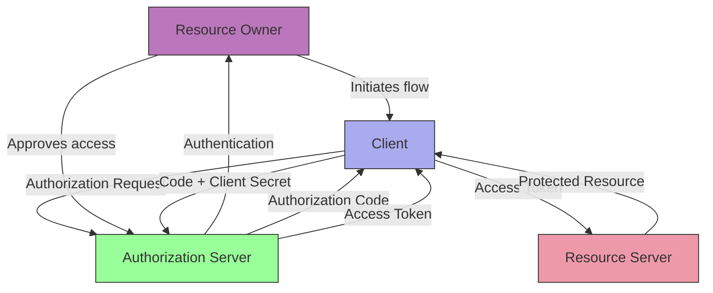
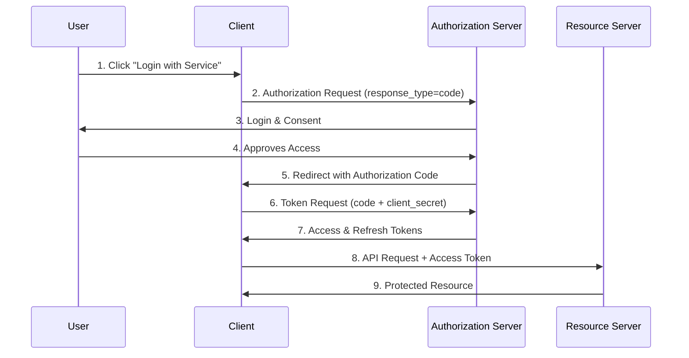
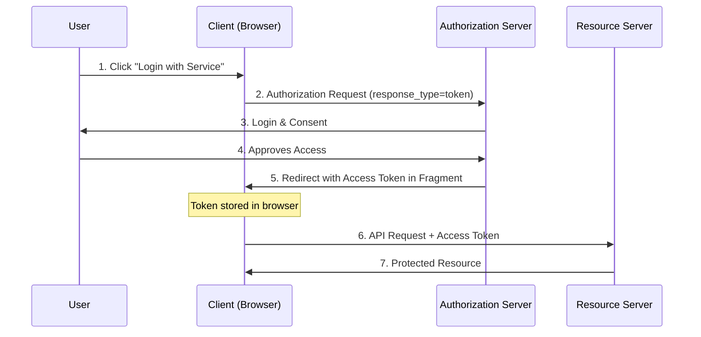

# OAuth Security Testing

## Shortcut

- Check for improper redirect validation (open redirects)
- Test state parameter manipulation/absence
- Manipulate OAuth flows to bypass authentication
- Try URL path traversal in redirect_uri
- Hunt for client secret leakage in source code/repos
- Look for improper scope validation

## Mechanisms

- **OAuth 2.0** authorizes limited access to resources via tokens; pair with **OIDC** for identity.
- **Core Flows**:
  - Authorization Code (with PKCE for public clients)
  - Client Credentials (service-to-service)
  - Avoid Implicit and ROPC where possible
- **Key Components**:
  - Resource Owner (user)
  - Client (third-party app)
  - Authorization Server (issues tokens)
  - Resource Server (hosts protected resources)
  - Tokens (access and refresh)
- **Hardening Extensions**:
  - PAR (Pushed Authorization Requests), JAR (Request Objects), JARM (JWT-secured responses)
  - Sender‑constrained tokens (DPoP, mTLS)
  - `private_key_jwt` or mTLS client authentication for confidential clients

### OAuth/OIDC Considerations

- **PKCE everywhere**: Even with confidential clients/native apps; `code_verifier` must be required and validated.
- **Nonce/state binding**: For OIDC, ensure `nonce` is present and matched; `state` should be unguessable and tied to session.
- **`redirect_uri` exact match**: Enforce exact string match against pre-registered allowlist; no wildcards/path traversal.
- **`aud`/`azp`/`iss` enforcement**: Validate tokens strictly, including clock skew and JWKS `kid` rotation behavior.
- **Front-channel logout/login CSRF**: Validate logout CSRF; defend forced login to attacker accounts.
- **ID Token vs Access Token**: APIs must not accept ID tokens; check `token_type` and audience.
- **Device Code & CIBA**: Validate polling rate limits, code expiry, and binding of device/user codes.
- **Refresh Token Rotation**: Enforce reuse detection and global invalidation chains.
- **PAR/JAR/JARM**: Use to pin exact redirect_uri and inputs and to protect front-channel parameters.

### OAuth 2.1 Updates

- **Implicit Flow Deprecated**: Authorization servers should not support `response_type=token`
- **Password Grant Deprecated**: ROPC (Resource Owner Password Credentials) considered insecure
- **PKCE Mandatory**: Required for all OAuth clients including confidential clients
- **Exact Redirect URI Matching**: No more substring or prefix matching allowed
- **Refresh Token Sender Constraint**: Refresh tokens should be sender-constrained via DPoP or mTLS

### Financial-grade API (FAPI) Security

#### FAPI 1.0 Advanced Profile

- **Signed Request Objects (JAR)**: Authorization requests as signed JWTs
- **Hybrid Flow**: Uses `response_type=code id_token` for additional security
- **MTLS Client Authentication**: Certificate-bound tokens
- **JARM**: JWT-secured authorization response mode
- **Request Object Encryption**: Sensitive parameters encrypted

#### FAPI 2.0 Security Profile

- **Pushed Authorization Requests (PAR)**: POST request parameters to dedicated endpoint
- **DPoP (Demonstrating Proof-of-Possession)**: Token bound to client's key pair
- **Client Authentication**: `private_key_jwt` or MTLS required
- **Grant Management**: Rich authorization requests and grant management API

## Hunt

- Intercept OAuth flows with proxy (Burp/ZAP)
- Manipulate redirect_uri parameters
- Remove/tamper state parameter
- Test PKCE implementations
- Inspect token handling in browsers
- Check for client secret leakage
- Analyze scope handling logic
- Test account linking/unlinking
- Review token validation procedures
- Examine refresh token security

#### Native/Mobile

- Verify App Links/Universal Links to prevent hijacking callbacks.
- Ensure OAuth proxy components in mobile apps validate issuer and JWKS; do not ship client secrets in binaries.

#### SPA/Browser

- Use Authorization Code + PKCE; avoid Implicit/Hybrid unless justified.
- Store tokens in memory; if cookies are used, set `__Host-` prefix with `HttpOnly; Secure; SameSite`.

### Authorization Code Flow

- Initial authorization request has `response_type=code`
- Request format: `/authorization?client_id=12345&redirect_uri=https://client-app.com/callback&response_type=code&scope=openid%20profile&state=ae13d489bd00e3c24`
- Callback contains authorization code: `/callback?code=a1b2c3d4e5f6g7h8&state=ae13d489bd00e3c24`
- More secure, backend exchanges code for tokens

### Implicit Flow

- Initial authorization request has `response_type=token`
- Request format: `/authorization?client_id=12345&redirect_uri=https://client-app.com/callback&response_type=token&scope=openid%20profile&state=ae13d489bd00e3c24`
- Access token returned directly in URL fragment: `/callback#access_token=z0y9x8w7v6u5&token_type=Bearer&expires_in=5000&scope=openid%20profile&state=ae13d489bd00e3c24`
- Higher vulnerability potential due to frontend token handling

## Vulnerabilities

- **Improper redirect_uri validation**
  - Open redirects
  - Subdomain/path validation bypass
- **CSRF attacks** (missing/improper state parameter)
- **Token leakage** (URL fragments in referrer headers)
- **Scope elevation** (improper authorization)
- **Account takeover** via improper linking/unlinking
- **JWT vulnerabilities** (weak signatures, lack of validation)
- **Client secret exposure** in source/git repositories
- **Authorization bypass** in misconfigured implementations
- **Session fixation** attacks
- **Access token theft** via XSS/Man-in-the-Middle

#### Authorization Code Injection / Code Substitution

- Attacker injects victim authorization code into attacker session to bind victim account. Mitigate with state-nonce binding and PKCE.

#### Method 1: Auth Bypass in OAuth Implicit Flow

- Locate POST request containing user info (email, username) and access token
- In implicit flow, servers often don't properly validate access tokens
- Try changing user parameters (email, username) while keeping the token
- Potentially impersonate other users if server trusts client-provided identifiers

#### Method 2: Forced Profile Linking

- Target OAuth profile linking functionality
- Check for missing `state` parameter in auth requests
- Create CSRF attack by copying auth URL before code/token use
- Deliver as direct link or embedded iframe to victim
- Can link attacker's social media to victim's account

#### Method 3: Account Hijacking via redirect_uri

- Identify authorization request with redirect_uri parameter
- Test redirect_uri manipulation (external domains or open redirects)
- Modify redirect_uri to attacker-controlled endpoint (webhook)
- Deliver modified auth URL to victim to capture their authorization code
- Use stolen code to complete OAuth flow and access victim's account

## Methodologies

- **Tools**:
  - Burp Suite (OAuth Scanner extension)
  - OWASP ZAP
  - OAuth 2.0 Threat Model Toolkit
  - Postman for API testing
  - JWT_Tool for token analysis
  - OAuthSecurity Cheatsheet Scanner
- **Techniques**:
  - Flow manipulation
  - Parameter tampering
  - Token analysis
  - Replay attacks
  - Social engineering (phishing for tokens)
  - DPoP proof validation testing
  - MTLS certificate validation testing
  - PAR endpoint exploitation
  - Token exchange flow testing

## Chaining and Escalation

### OAuth → Full Account Takeover

1. **Open Redirect → Authorization Code Theft**:
   - Discover open redirect on trusted domain
   - Craft OAuth flow with redirect_uri pointing to open redirect
   - Victim clicks malicious link, completes OAuth flow
   - Authorization code redirected through open redirect to attacker
   - Attacker exchanges code for access token

2. **CSRF → Account Linking Attack**:
   - Initiate OAuth flow to link social account
   - Capture authorization callback URL before code is used
   - Deliver URL to victim via CSRF
   - Victim's account linked to attacker's social account
   - Attacker logs in with social account to access victim's account

3. **XSS → Token Theft**:
   - Find XSS vulnerability on application
   - Inject script to steal access tokens from localStorage
   - Use stolen tokens to access victim's API resources
   - If refresh tokens stolen, maintain persistent access

### OAuth → Lateral Movement

1. **Token Exchange → Service Impersonation**:
   - Obtain low-privilege access token
   - Use RFC 8693 token exchange to request token for different service
   - Weak validation allows unauthorized service access
   - Move laterally across microservices

2. **Scope Elevation → Privilege Escalation**:
   - Obtain token with limited scope
   - Manipulate refresh token exchange to request broader scopes
   - Weak scope validation grants elevated permissions
   - Access privileged API endpoints

3. **IdP Confusion → Cross-Tenant Access**:
   - Multi-tenant application with multiple IdPs
   - Obtain authorization code from Tenant A's IdP
   - Exchange code at Tenant B's token endpoint
   - Weak issuer validation grants cross-tenant access

### OAuth → Backend Exploitation

1. **JWT Algorithm Confusion → Signature Bypass**:
   - Obtain valid JWT access token
   - Change algorithm from RS256 to HS256
   - Sign token with public key (treating it as HMAC secret)
   - Backend fails to validate algorithm properly
   - Forge arbitrary tokens for privilege escalation

2. **SSRF via redirect_uri → Internal Service Access**:
   - OAuth provider allows internal redirect_uri
   - Set redirect_uri to internal service (http://169.254.169.254)
   - Authorization response sent to internal service
   - Use to access cloud metadata or internal APIs

3. **Token Replay → Session Hijacking**:
   - Capture access token via network sniffing or logs
   - Token not properly bound to client (no DPoP/MTLS)
   - Replay token from attacker's system
   - Hijack victim's session and access resources

## Remediation Recommendations

### OAuth 2.1 / Modern Implementation

- **Implement OAuth 2.1**: Adopt latest security recommendations
  - Deprecate Implicit and Password grants
  - Require PKCE for all clients (public and confidential)
  - Enforce exact redirect_uri matching
  - Implement refresh token rotation with reuse detection

- **Enforce state parameter**: Always required, cryptographically random, single-use
- **Validate token claims strictly**:
  - `aud` (audience): Must match resource server
  - `iss` (issuer): Verify against known issuers
  - `exp` (expiration): Enforce with clock skew tolerance (max 60s)
  - `nbf` (not before): Validate if present

- **Secure token storage**:
  - Never use localStorage (XSS vulnerable)
  - Use httpOnly cookies with `__Host-` prefix or memory-only storage
  - Set proper cookie flags: `HttpOnly; Secure; SameSite=Strict`

### Advanced Security Features

- **Implement PAR (Pushed Authorization Requests)**: POST parameters to `/par` endpoint
- **Use DPoP (Demonstrating Proof-of-Possession)**: Bind access tokens to client's public key
- **Implement MTLS for confidential clients**: Certificate-bound access tokens
- **Use JAR (JWT-secured Authorization Request)**: Sign authorization request parameters
- **Consider JARM (JWT-secured Authorization Response)**: Signed authorization responses

### Token Management

- **Short-lived access tokens**: 5-15 minutes maximum
- **Refresh token rotation**: Issue new refresh token on each use
- **Refresh token reuse detection**: Revoke entire token family on reuse
- **Token binding**: Use DPoP or MTLS to bind tokens to clients

### Standards and Compliance

- Follow **OAuth 2.1** (draft) guidance
- Implement **FAPI** if dealing with financial data
- Follow **RFC 6819** OAuth threat model
- Adopt **RFC 8252** for native apps
- Consider **RFC 8693** for secure token exchange
- Implement **RFC 9449** for DPoP

### Regular Security Practices

- Rotate signing keys regularly (every 6-12 months)
- Implement JWKS with short TTL (< 1 hour)
- Pin trusted issuers in client configuration
- Conduct regular OAuth security audits
- Keep libraries and dependencies updated
