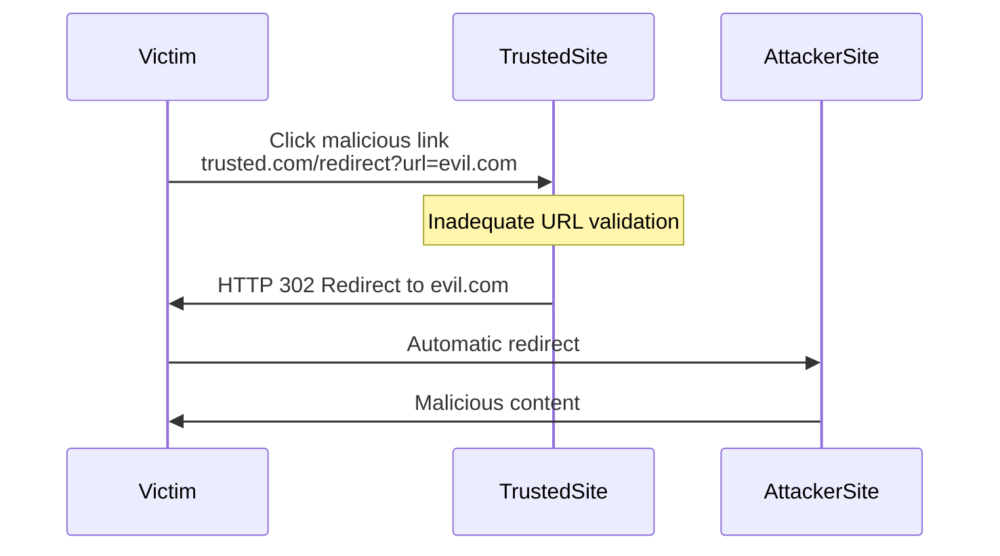
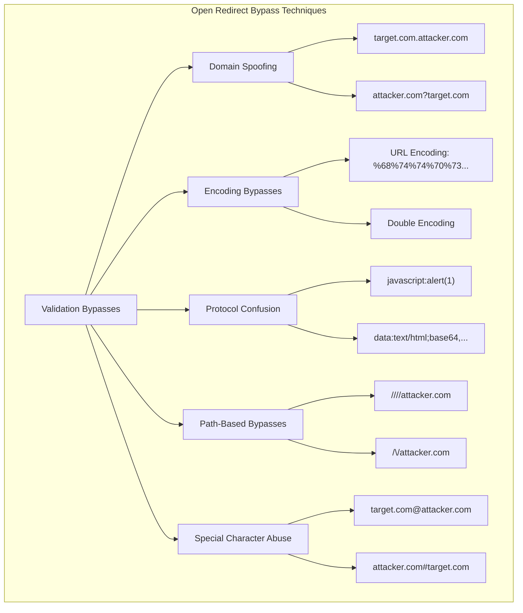
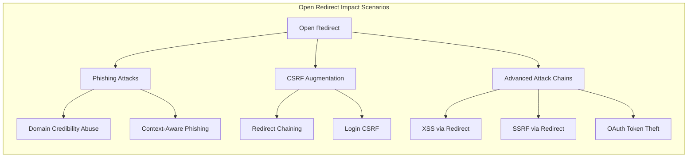
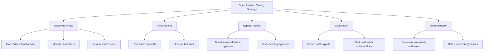

# Open Redirect Vulnerabilities

## Shortcut

- Search for redirect URL parameters. These might be vulnerable to parameter based open redirect.
- Search for pages that perform referer based redirect. These are candidates for a referer based open redirect.
- Test the pages and parameters you've found for open redirect.
- If the server blocks the open redirect, try the protection bypass techniques mentioned before.
- Brainstorm ways of using the open redirect in your other bug chains.

## Mechanisms

Open redirect vulnerabilities occur when web applications improperly validate user-supplied URLs used for redirections. These vulnerabilities allow attackers to craft links that appear legitimate but redirect victims to malicious websites. When exploited, the victim initially connects to a trusted domain, giving the malicious link an appearance of legitimacy, before being redirected to an attacker-controlled destination.



The core technical flaws leading to open redirects include:

- **Insufficient URL Validation**: Failure to properly validate redirect targets
- **Improper Allowlist Implementation**: Flawed validation logic that can be bypassed
- **Inadequate Sanitization**: Incorrect handling of special characters or encoding
- **Trusting Client-Side Input**: Using user-supplied parameters for redirection without verification

### Notes

- Browsers restrict `javascript:` navigations from cross-origin contexts more, but many apps forward redirects to clients; validate server-side before emitting 3xx.
- OAuth/SSO stacks increasingly require exact `redirect_uri` match; test for partial/path-only allowlists and case/encoding mismatches.
- Mobile deep links: open redirects can escalate to app link hijack; test `intent:` URLs on Android and iOS universal link fallbacks.

### Modern Browser Behaviors

- **Chrome 120+ Restrictions**: Enhanced protection against cross-site redirects; test if app relies on specific redirect chains
- **SameSite Cookie Implications**: `SameSite=Lax` default affects redirect flows; test authentication state preservation
- **Referrer-Policy Impact**: `no-referrer` or `strict-origin` may break redirect detection; test logging/analytics dependencies
- **COOP/COEP Headers**: Cross-Origin-Opener-Policy can break popup-based OAuth flows
- **Fenced Frames**: New iframe replacement affects redirect chains in isolated contexts

Open redirects can exist in various implementation patterns:

- **URL Parameter Redirects**: Explicit redirect parameters (e.g., `?redirect=`, `?url=`, `?next=`)
- **Path-Based Redirects**: URL paths that trigger redirects (e.g., `/redirect/https://example.com`)
- **Referer-Based Redirects**: Redirects based on the HTTP Referer header
- **Post-Authentication Redirects**: Return URLs after login or authentication flows
- **URL Shorteners**: Services that redirect to expanded URLs
- **Framework Redirector Endpoints**: Dedicated redirection functionality in web frameworks

## Hunt

### Identifying Open Redirect Vulnerabilities

#### Target Discovery

1. **Identify Redirection Parameters**:
   - Common redirect parameter names:
     ```
     redirect, redirect_to, url, link, goto, return, returnTo, destination,
     next, checkout, checkout_url, continue, return_path, return_url,
     forward, path, redir, redirect_uri, view, img_url, image_url, load_url
     ```

2. **Find Redirection Endpoints**:
   - Social login integrations
   - Authentication flows
   - Payment gateways
   - "Share" functionality
   - URL shorteners
   - SSO implementations
   - File/resource access endpoints

3. **Search Code and Documentation**:
   - Review JavaScript for redirect functions
   - Check for framework-specific redirect endpoints
   - Analyze HTTP 3xx response patterns

#### Testing Methodologies

1. **Basic Open Redirect Testing**:
   - Test with absolute URLs:
     ```
     https://target.com/redirect?url=https://attacker.com
     https://target.com/redirect?next=https://attacker.com
     ```
   - Test with protocol-relative URLs:
     ```
     https://target.com/redirect?url=//attacker.com
     ```
   - Test with relative path traversal:
     ```
     https://target.com/redirect?url=/../redirect?url=https://attacker.com
     ```

2. **Referer-Based Open Redirect Testing**:
   - Identify pages that redirect based on Referer header
   - Modify Referer header to external domains
   - Test login/logout pages with custom Referer values

3. **OAuth Redirect Testing**:
   - Identify OAuth implementation redirect_uri parameters
   - Test for improper validation:
     ```
     https://target.com/oauth/authorize?client_id=CLIENT_ID&redirect_uri=https://attacker.com
     ```

## Bypass Techniques



### Domain Spoofing Techniques

```
https://target.com/redirect?url=https://target.com.attacker.com
https://target.com/redirect?url=https://attacker.com?target.com
https://target.com/redirect?url=https://attackertarget.com
```

### CDN/Reverse Proxy Quirks

- Mixed scheme parsing (https;/) accepted upstream but normalized downstream.
- Double decode at different layers (edge vs. origin) enabling `%252F` style bypass.
- Header-driven redirects (X-Original-URL, X-Forwarded-Proto) abused through misconfigured proxies.

### Encoding Bypass Techniques

```
https://target.com/redirect?url=https%3A%2F%2Fattacker.com
https://target.com/redirect?url=%68%74%74%70%73%3a%2f%2f%61%74%74%61%63%6b%65%72%2e%63%6f%6d
```

### Protocol Confusion Bypasses

```
https://target.com/redirect?url=javascript:alert(document.domain)
https://target.com/redirect?url=data:text/html;base64,PHNjcmlwdD5hbGVydCgxKTwvc2NyaXB0Pg==
https://target.com/redirect?url=https;/attacker.com
```

### Path-Based Bypasses

```
https://target.com/redirect?url=/\/attacker.com
https://target.com/redirect?url=////attacker.com
https://target.com/redirect?url=\/\/attacker.com/
```

### Special Character Abuse

```
https://target.com/redirect?url=https://target.com@attacker.com
https://target.com/redirect?url=https://attacker.com#target.com
https://target.com/redirect?url=https://attacker.com\@target.com
```

## Vulnerabilities

### Common Open Redirect Vulnerability Patterns

#### Implementation-Specific Vulnerabilities

1. **Framework Redirector Vulnerabilities**:
   - **Spring MVC**: Improper handling of the `url` parameter
     ```
     /spring/login?url=https://attacker.com
     ```
   - **Laravel**: Unvalidated redirect in `redirect()` helper
     ```
     /redirect?url=https://attacker.com
     ```
   - **Express.js**: Unvalidated `res.redirect()` calls
     ```
     /login?redirect=https://attacker.com
     ```
   - **Next.js (App Router)**: Server Actions redirect abuse
     ```
     // Test Server Action redirect injection
     /api/action?redirect=https://attacker.com
     ```
   - **SvelteKit**: `goto()` and `redirect()` manipulation
     ```
     // Test in hooks.server.ts
     /auth/callback?redirectTo=https://attacker.com
     ```
   - **Remix**: loader/action redirect injection
     ```
     /login?redirectTo=https://attacker.com
     ```
   - **Astro**: redirect() in API routes
     ```
     /api/redirect?url=https://attacker.com
     ```

2. **OAuth Implementation Vulnerabilities**:
   - **Implicit Flow Redirect**: Missing validation in `redirect_uri`
     ```
     /oauth/authorize?response_type=token&redirect_uri=https://attacker.com
     ```
   - **Authorization Code Flow**: Improper `state` parameter handling
     ```
     /oauth/callback?code=ABC123&state=https://attacker.com
     ```

3. **Social Login Vulnerabilities**:
   - **Facebook Login**: Unvalidated return_url parameter
     ```
     /login/facebook/callback?return_url=https://attacker.com
     ```
   - **Google OAuth**: Improper redirect_uri validation
     ```
     /auth/google/callback?redirect_uri=https://attacker.com
     ```

### Impact Scenarios



#### Phishing Attack Vectors

- **Domain Credibility Abuse**: Leveraging trusted domain for phishing
- **Session Fixation Enhancement**: Combining with session fixation attacks
- **Context-Aware Phishing**: Using information from the original site

#### CSRF Augmentation

- **Redirect Chaining**: Creating multi-step attack chains
- **Login CSRF**: Forcing login to attacker-controlled accounts

#### Advanced Attack Chains

- **XSS via Open Redirect**: Using JavaScript URIs for XSS
  ```
  https://target.com/redirect?url=javascript:alert(document.cookie)
  ```
- **SSRF via Open Redirect**: Internal service access
  ```
  https://target.com/redirect?url=http://internal-service/admin
  ```
- **OAuth Token Theft**: Stealing OAuth tokens via redirect_uri manipulation

## Methodologies

### Tools

#### Open Redirect Detection Tools

- **OWASP ZAP**: Open redirect scanner
- **Burp Suite**: Collaborator for testing blind redirects
- **OpenRedireX**: Specialized open redirect testing tool
- **Gxss**: Tool to check for redirect XSS
- **Waybackurls**: For discovering historical redirect endpoints
- **Param Spider**: For discovering URL parameters

#### Custom Detection Scripts

```python
import requests
from urllib.parse import urlparse

def test_open_redirect(target_url, redirect_param, payloads):
    for payload in payloads:
        test_url = f"{target_url}{redirect_param}={payload}"
        try:
            # Disable redirects to manually check
            response = requests.get(test_url, allow_redirects=False, timeout=10)
            if response.status_code in [301, 302, 303, 307, 308]:
                location = response.headers.get('Location', '')
                parsed = urlparse(location)
                if parsed.netloc and parsed.netloc not in target_domain:
                    print(f"Potential Open Redirect: {test_url} -> {location}")
        except Exception as e:
            print(f"Error testing {test_url}: {e}")

# Target website
target_url = "https://target.com/redirect?"
target_domain = "target.com"
redirect_param = "url"

# Common bypass payloads
payloads = [
    "https://attacker.com",
    "//attacker.com",
    "https%3A%2F%2Fattacker.com",
    "/\/attacker.com",
    "https://target.com@attacker.com",
    "https://target.com.attacker.com",
    "javascript:alert(document.domain)"
]

test_open_redirect(target_url, redirect_param, payloads)
```

### Testing Strategies



#### Comprehensive Open Redirect Testing Process

1. **Discovery Phase**:
   - Map all redirection functionality
   - Identify redirect parameters through:
     - Manual testing
     - Automated crawling
     - Source code review
     - Parameter discovery tools

2. **Initial Testing Phase**:
   - Test basic payload patterns:
     ```
     ?redirect=https://attacker.com
     ?redirect=//attacker.com
     ?redirect=\/\/attacker.com
     ```
   - Observe redirection behavior
   - Document instances of successful redirects

3. **Bypass Testing Phase**:
   - Test against identified protection mechanisms:
     - Domain validation bypasses
     - Encoding bypasses
     - Protocol bypasses
     - Path manipulation bypasses

4. **Exploitation Phase**:
   - Create proof-of-concept exploits
   - Chain with other vulnerabilities where possible
   - Demonstrate potential impact scenarios

5. **Documentation Phase**:
   - Document vulnerable parameters and endpoints
   - Note successful bypass techniques
   - Provide clear reproduction steps

### Real-World Testing Examples

#### OAuth Redirect Testing

1. Identify OAuth implementation
2. Locate redirect_uri parameter
3. Test various redirect_uri values:
   - https://attacker.com
   - https://target.com.attacker.com
   - https://targetattacker.com
4. Check for token leakage in the redirection

#### Post-Authentication Redirect Testing

1. Authenticate to the application
2. Identify post-login redirects
3. Test redirect parameters with different formats:
   - Absolute URLs: `https://attacker.com`
   - Relative with protocol: `//attacker.com`
   - Encoded values: `%68%74%74%70%73%3a%2f%2f%61%74%74%61%63%6b%65%72%2e%63%6f%6d`

#### URL Shortener Testing

1. Identify URL shortening functionality
2. Submit malicious URLs for shortening
3. Test shortening of various payload formats:
   - javascript:alert(1)
   - data: URLs
   - Protocol-less URLs: //attacker.com

## Remediation Recommendations

- **Implement Proper Validation**:
  - Use allowlists of permitted domains
  - Validate using server-side logic (not client-side)
  - Implement URI parsing libraries for proper validation

- **Use Indirect References**:
  - Instead of directly using user input for redirects, map to server-side values
  - Example: Use numeric IDs that map to pre-approved URLs

- **Implement Safe Redirect Patterns**:
  - Create a warning page for external redirects
  - Include clear indicators of leaving the site
  - Add visual cues for external navigation

- **Technical Controls**:
  - Validate protocol (only http/https)
  - Validate domain against allowlist
  - Use full URL parsing rather than simple string checks
  - Implement CSRF protection for redirect endpoints
  - For mobile deep links, validate package/bundle IDs and enforce App Links/Universal Links verification.
