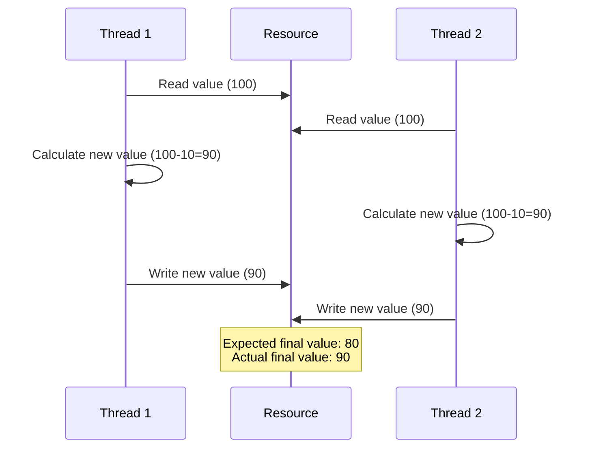
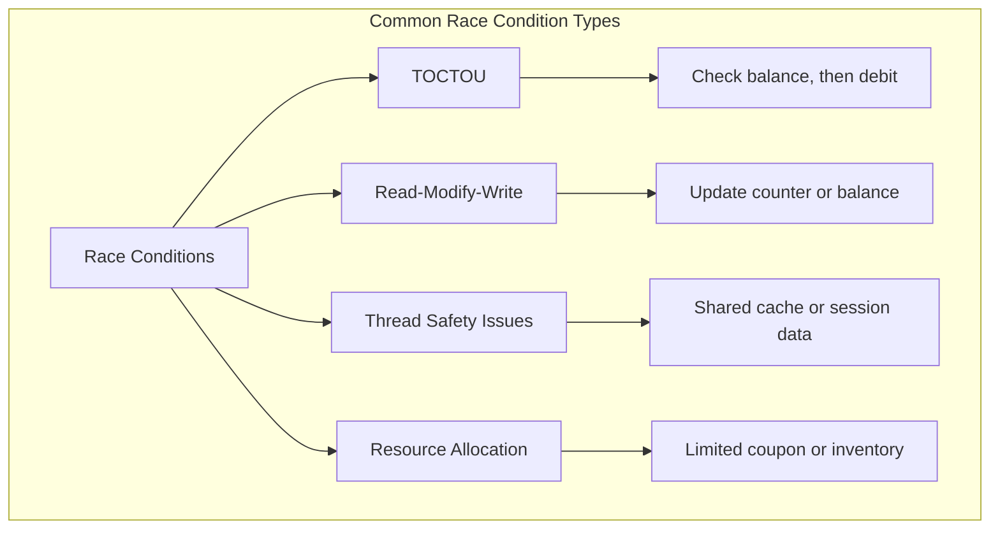
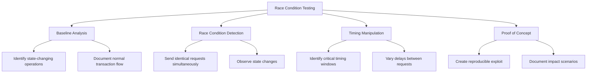
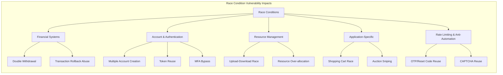
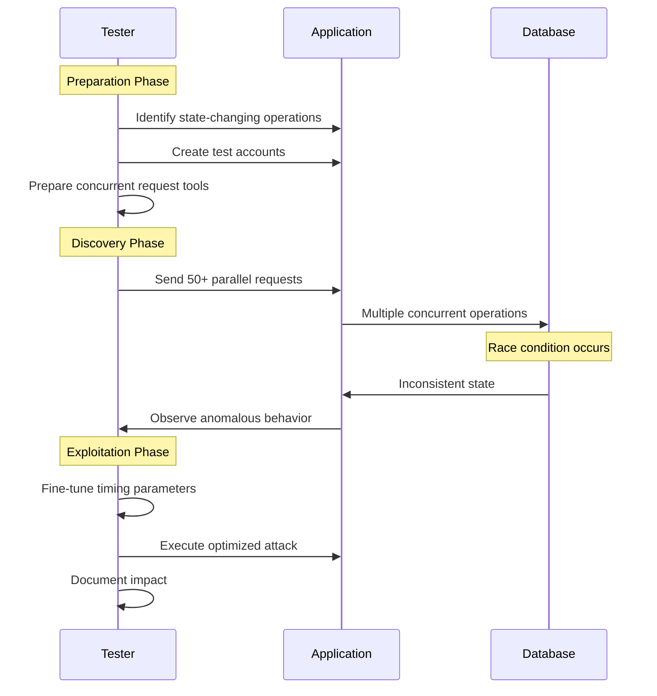

# Race Conditions

## Shortcut

- Spot the features prone to race conditions in the target application and copy the corresponding requests.
- Send multiple of these critical requests to the server simultaneously. You should craft requests that should be allowed once but not allowed multiple times.
- Check the results to see if your attack has succeeded. And try to execute the attack multiple times to maximize the chance of success.
- Consider the impact of the race condition you just found.

## Mechanisms

Race conditions occur when the behavior of a system depends on the relative timing or sequence of events that can happen in different orders. In web application security, race conditions happen when multiple concurrent processes or threads access and manipulate the same resource simultaneously without proper synchronization.



A race condition becomes a security vulnerability when it affects security controls or business logic. The critical types include:

- Time-of-Check to Time-of-Use (TOCTOU): When a check is performed, but circumstances change before the result of the check is used
- Read-Modify-Write: When multiple processes read, modify, and write back a shared resource without coordination
- Thread Safety Issues: When multithreaded applications improperly handle shared resources
- Resource Allocation Races: Competition for limited resources like database connections or memory



Common vulnerable scenarios include:

- Account Balance Manipulation: Making multiple withdrawals/transfers simultaneously
- Coupon/Promotion Code Reuse: Using a single-use code multiple times
- File Upload Processing: Uploading and accessing temporary files before validation completes
- Registration Processes: Creating multiple accounts with the same unique identifier
- Token Verification: Using authentication tokens multiple times before they're invalidated

## Hunt

### Identifying Race Condition Vulnerabilities

#### Target Functionality Selection

Focus on features handling state changes, limited resources, or critical operations:

- Financial Transactions: Fund transfers, withdrawals, purchases
- Inventory Systems: Stock allocation, reservation systems
- Coupon/Points Systems: Redeeming coupons, points, or rewards
- Voting/Rating Systems: Likes, upvotes, downvotes, polls
- Membership/Subscription Actions: Inviting users, joining/leaving groups, following/unfollowing users
- Registration Systems: Account creation with unique attributes
- Resource Management: Uploading, processing, or accessing resources
- Rate-Limited Actions: Password resets, login attempts, API endpoints with usage limits

#### Testing Prerequisites

1. Tools for sending parallel requests:
   - Burp Suite Turbo Intruder or Repeater (multi-threaded)
   - Custom scripts with threading capabilities
   - Race condition testing frameworks (e.g., Racepwn)

2. Request capturing and analysis capabilities:
   - HTTP proxy for intercepting and modifying traffic
   - Response analysis tools for detecting race-related anomalies

3. Network Proximity: Consider the physical or network location of your testing infrastructure relative to the target server. Minimizing latency (e.g., using a VPS in the same region/provider as the target) can significantly increase the chances of winning a race condition.

#### Testing Methodology



1. Baseline Behavior Analysis:
   - Identify state-changing operations
   - Understand normal request/response patterns
   - Document application's standard transaction flow

2. Race Condition Detection:
   - Send identical requests simultaneously (10-100 threads)
   - Observe effects on application state
   - Look for anomalies in responses or state changes

3. Timing Manipulation:
   - Identify critical timing windows
   - Target synchronization points
   - Test with varying delays between requests

### Advanced Testing Techniques

#### API-Based Race Condition Testing

1. Identify stateful API endpoints
2. Create automated scripts for parallel API requests:

```python
import requests
import threading

def make_request():
    requests.post('https://target.com/api/redeem',
                  json={'coupon_code': 'ONCE123'},
                  headers={'Authorization': 'Bearer token'})

threads = []
for _ in range(20):
    t = threading.Thread(target=make_request)
    threads.append(t)
    t.start()

for t in threads:
    t.join()
```

#### Transaction-Based Race Condition Testing

1. Identify multi-step transactions
2. Find the critical state change requests
3. Execute the final step in parallel before state updates propagate:
   ```
   Step 1: Start purchase (single request)
   Step 2: Apply coupon (single request)
   Step 3: Send 20 simultaneous "confirm order" requests
   ```

#### Thread Synchronization Testing

Create coordinated attacks that target specific timing windows:

```python
import requests
import threading
import time

start_gate = threading.Event()

def synchronized_request():
    start_gate.wait()  # All threads wait here until flag is set
    requests.post('https://target.com/api/withdraw',
                  json={'amount': '100'},
                  headers={'Authorization': 'Bearer token'})

threads = []
for _ in range(50):
    t = threading.Thread(target=synchronized_request)
    t.daemon = True
    threads.append(t)
    t.start()

# Release all threads simultaneously
time.sleep(2)  # Ensure all threads are waiting
start_gate.set()
```

#### Network-Level Timing Manipulation

Beyond application-level threading, manipulating network-level timing can be effective:

- **HTTP/2 / HTTP/3 Single-Packet & Last-Byte-Sync Techniques**: Classic HTTP/1.1 pipelining is disabled on most servers. Modern testers rely on HTTP/2 multiplexing or HTTP/3 streams to achieve micro-second concurrency. Burp Repeater (2023.9+) and Turbo Intruder expose this as _Send group in parallel (single-packet attack)_.
- **Last-Byte-Sync / Request Splitting**: Open multiple connections, send almost-complete requests, then flush the final bytes simultaneously. In Burp, send each tab using the _single packet attack_ gate; or in Turbo Intruder:

```python
def queueRequests(target, wordlists):
    engine = RequestEngine(
        endpoint=target.endpoint,
        concurrentConnections=1,
        engine=Engine.BURP2)

    for _ in range(20):
        engine.queue(target.req, gate='race')

    engine.openGate('race')
```

#### Rate-Limiter and CAPTCHA Races

- Send concurrent login or OTP requests across multiple sessions/IPs to probe shared counters.
- Look for global vs per-user vs per-IP buckets; test burst vs sustained patterns.

## Vulnerabilities

### Common Race Condition Vulnerability Patterns



#### Financial Systems Vulnerabilities

- Double Withdrawal: Processing the same withdrawal request twice
- Transaction Rollback Abuse: Initiating a transaction rollback while completing the transaction
- Balance Check Bypass: Racing between balance verification and transaction processing

#### Account and Authentication Vulnerabilities

- Multiple Account Creation: Creating accounts with the same unique identifier
- Token Reuse: Using one-time tokens multiple times
- Session Fixation Race: Racing between session creation and authentication
- MFA Bypass: Racing between MFA checks and authenticated resource access

#### Resource Management Vulnerabilities

- Upload-Download Race: Accessing uploaded files before security checks complete
- Resource Allocation Race: Over-allocating limited resources
- Temporary File Races: Operating on temporary files during processing

#### Specific Application Patterns

- Shopping Cart Race Conditions: Adding items at specific discount windows
- Auction Sniping Race: Timing bids to bypass minimum increments
- Reservation System Races: Double-booking limited inventory

### Time-Sensitive Vulnerabilities

1. Send parallel password reset requests for the same account
2. Check if reset tokens are identical
3. Test by changing victim's username in one request
4. Analyze response times for potential race conditions

### Session Handling Bypass

Some application frameworks (like PHP with default session handling) lock session files when `session_start()` is called, preventing concurrent requests from the _same_ session from executing simultaneously. If the application allows a user to have multiple active sessions, this can be bypassed:

1.  Authenticate multiple times to obtain several valid session identifiers (e.g., `PHPSESSID`).
2.  Assign a unique session ID to each concurrent request in your race condition attack. This makes the server treat each request as originating from a different session, circumventing the session lock.

### Database Isolation Level Testing

Different database isolation levels handle concurrency differently. Test each level to identify race vulnerabilities:

**PostgreSQL Isolation Levels:**

```sql
-- READ UNCOMMITTED (treats as READ COMMITTED in PostgreSQL)
BEGIN TRANSACTION ISOLATION LEVEL READ UNCOMMITTED;

-- READ COMMITTED (default) - prone to races
BEGIN TRANSACTION ISOLATION LEVEL READ COMMITTED;
SELECT balance FROM accounts WHERE id = 123;
-- Race window here
UPDATE accounts SET balance = balance - 100 WHERE id = 123;
COMMIT;

-- REPEATABLE READ - prevents some races
BEGIN TRANSACTION ISOLATION LEVEL REPEATABLE READ;

-- SERIALIZABLE - strongest protection
BEGIN TRANSACTION ISOLATION LEVEL SERIALIZABLE;
```

**Testing Strategy:**

1. Identify critical transactions in the application
2. Send concurrent requests during the transaction window
3. Check if inconsistent state occurs
4. Test with explicit table locking:
   ```sql
   SELECT * FROM table FOR UPDATE;  -- Row-level lock
   LOCK TABLE table IN EXCLUSIVE MODE;  -- Table-level lock
   ```

**MySQL/MariaDB:**

```sql
-- Test for missing row locks
START TRANSACTION;
SELECT balance FROM accounts WHERE id = 123;
-- Send parallel transactions here
UPDATE accounts SET balance = balance - 100 WHERE id = 123;
COMMIT;

-- Test with explicit locking
SELECT * FROM accounts WHERE id = 123 FOR UPDATE;
```

**Testing for Advisory Locks:**

```sql
-- PostgreSQL advisory locks
SELECT pg_try_advisory_lock(12345);

-- Test if application uses them
-- Send parallel requests and monitor pg_locks table
SELECT * FROM pg_locks WHERE locktype = 'advisory';
```

### WebSocket Race Conditions

WebSocket connections maintain persistent state and can be vulnerable to race conditions:

**Message Processing Races:**

```javascript
// Send concurrent WebSocket messages
const ws = new WebSocket("wss://target.com/socket");

ws.onopen = () => {
  // Send multiple messages rapidly
  for (let i = 0; i < 50; i++) {
    ws.send(
      JSON.stringify({
        action: "transfer",
        amount: 100,
        to: "attacker",
      }),
    );
  }
};
```

**Connection Upgrade Races:**

```bash
# Multiple simultaneous WebSocket handshakes
for i in {1..20}; do
  curl -i -N \
    -H "Connection: Upgrade" \
    -H "Upgrade: websocket" \
    -H "Sec-WebSocket-Key: SGVsbG8sIHdvcmxkIQ==" \
    -H "Sec-WebSocket-Version: 13" \
    https://target.com/socket &
done
wait
```

**Testing Scenarios:**

- Concurrent authentication messages
- Simultaneous room/channel joins
- Parallel state-changing commands
- Race between disconnect and final message processing

### Cloud & Serverless Race Conditions

#### AWS Lambda Specific

**Concurrent Execution Testing:**

```python
import boto3
import concurrent.futures

lambda_client = boto3.client('lambda')

def invoke_lambda():
    return lambda_client.invoke(
        FunctionName='vulnerable-function',
        InvocationType='RequestResponse',
        Payload='{"action": "redeem_coupon", "code": "SAVE50"}'
    )

# Test concurrent invocations
with concurrent.futures.ThreadPoolExecutor(max_workers=50) as executor:
    futures = [executor.submit(invoke_lambda) for _ in range(50)]
    results = [f.result() for f in futures]
```

**Reserved Concurrency Bypass:**

- Check if Lambda has reserved concurrency limits
- Test if multiple accounts/regions bypass limits
- Monitor CloudWatch for ConcurrentExecutions metric

**DynamoDB Conditional Write Testing:**

```python
import boto3
from boto3.dynamodb.conditions import Attr

dynamodb = boto3.resource('dynamodb')
table = dynamodb.Table('coupons')

# Test if conditional writes are used
def redeem_coupon():
    table.update_item(
        Key={'code': 'SAVE50'},
        UpdateExpression='SET used = :val',
        ConditionExpression=Attr('used').eq(False),  # Should prevent races
        ExpressionAttributeValues={':val': True}
    )
```

#### GCP Cloud Functions

**Concurrent Trigger Testing:**

```bash
# Test HTTP-triggered Cloud Functions
for i in {1..50}; do
  curl -X POST https://region-project.cloudfunctions.net/function \
    -H "Content-Type: application/json" \
    -d '{"action": "claim_reward"}' &
done
wait
```

#### Azure Functions

**Singleton Testing:**

```csharp
// Check if Azure Functions use Singleton attribute
[Singleton] // Should prevent concurrent execution
public static void Run([QueueTrigger("queue")] string msg) { }
```

### Protocol-specific attack primitives

- **Single-Packet Attack (HTTP/2)** and **Last-Byte-Sync (HTTP/1)** research (PortSwigger Black Hat 2023) enables ≤ 4 µs request skew; both are now directly supported in Burp Repeater and Turbo Intruder.

### GraphQL & gRPC considerations

- GraphQL batch mutations can bypass conventional CSRF and rate-limit controls. Replay a single POST body containing 20 identical mutations to test for duplicated state changes.
- For gRPC, open multiple concurrent `SendMsg` frames before the backend commits state.

### Cloud & serverless concurrency

- Serverless functions (AWS Lambda, GCP Cloud Run, Azure Functions) may process the same event in parallel. Mitigate with idempotency keys or reserved-concurrency settings.

### Observability & detection

- Enable distributed tracing (OpenTelemetry, Jaeger) and emit duplicate-call metrics within the same trace span to surface race-condition symptoms.

### Modern defensive patterns

- Use atomic **UPSERT / ON CONFLICT** statements for write-once semantics.
- Implement **Idempotency-Key** headers (IETF draft 2024) with short-TTL storage.
- Employ Redis/etcd Redlock or PostgreSQL advisory locks for cross-service resource locking.

### Additional resources

- PortSwigger white-paper _Smashing the State Machine_ + labs (Black Hat 2023).
- OWASP ASVS v5 (2024) section 7.6 "Concurrency Controls".

## Impact Assessment

#### Critical Impact Scenarios

- **Financial Loss**: Double spending, incorrect account balances
- **Privilege Escalation**: Bypassing authentication or authorization
- **Data Integrity Violations**: Corrupting database state
- **Denial of Service**: Exhausting limited resources
- **Information Disclosure**: Accessing partially processed data

#### Example Exploits

1. **Banking Application Double-Withdrawal**:
   - Initial balance: $1000
   - Send 10 simultaneous withdrawal requests for $100 each
   - Result: $1000 debited but balance only decreases once
2. **E-commerce Coupon Reuse**:
   - Single-use coupon provides $50 discount
   - Send 5 parallel requests using the same coupon
   - Result: Multiple $50 discounts applied

3. **Account Registration Email Verification Bypass**:
   - Send multiple verification requests with different tokens
   - Race between verification and account provision
   - Result: Account verified without valid email

## Methodologies

### Tools

#### Race Condition Testing Tools

- **Burp Suite Extensions**:
  - Turbo Intruder: High-volume parallel request sender.
  - Authorize: Manipulation of tokens/session data
  - Collaborator: For detecting out-of-band effects

- **Specialized Tools**:
  - Racepwn: Purpose-built race condition testing framework
  - Race-the-Web: Web application race condition finder
  - Raceocat: CLI scanner that replays raw-socket requests for µs-precision
  - URL-Race-Condition-Scanner: Generates and races endpoints from Burp history
  - OWASP ZAP with parallel request scripts

#### Custom Scripting

- **Python with Threading/Asyncio**:

```python
import asyncio
import aiohttp

async def make_request(session):
    async with session.post('https://target.com/api/action',
                           data={'param': 'value'}) as response:
        return await response.text()

async def main():
    async with aiohttp.ClientSession() as session:
        tasks = [make_request(session) for _ in range(50)]
        responses = await asyncio.gather(*tasks)
        # Analyze responses

asyncio.run(main())
```

- **Multi-threaded Testing with Go**:

```go
package main

import (
    "net/http"
    "sync"
)

func main() {
    var wg sync.WaitGroup
    for i := 0; i < 50; i++ {
        wg.Add(1)
        go func() {
            http.Post("https://target.com/api/action",
                      "application/json",
                      strings.NewReader(`{"param":"value"}`))
            wg.Done()
        }()
    }
    wg.Wait()
}
```

### Testing Strategies

#### Comprehensive Race Condition Test Methodology



1. **Preparation Phase**:
   - Map application functionality with state changes
   - Create multiple test accounts
   - Prepare parallel request tools and monitoring

2. **Discovery Phase**:
   - Test for TOCTOU issues in all critical functions
   - Test multi-step transactions with simultaneous final steps
   - Look for resource contention vulnerabilities
   - Test file operations for race conditions

3. **Exploitation Phase**:
   - Fine-tune timing and concurrency parameters
   - Create proof-of-concept exploits for confirmed issues
   - Measure impact with controlled exploitation
   - Document findings with clear reproduction steps

4. **Verification Phase**:
   - Test different concurrency levels (10, 50, 100 requests)
   - Vary timing patterns (synchronized vs staggered)
   - Test across different network conditions

### Real-World Testing Examples

#### E-commerce Application Testing

1. Add limited stock item to cart
2. Send 20 simultaneous checkout requests
3. Verify if multiple purchases succeed despite limited inventory

#### Banking Application Testing

1. Identify fund transfer functionality
2. Create 50 simultaneous transfer requests for the same amount
3. Verify account balance after transfers complete
4. Check for transaction logs inconsistencies

#### API Testing for Race Conditions

1. Identify stateful API endpoints
2. Create requests that modify shared resources
3. Execute requests simultaneously from multiple clients
4. Verify resource state consistency

## Advanced Race Condition Scenarios

### Multi-Endpoint Race Conditions

When functionality chains with multiple requests, for example in e-commerce:

```
- /product --> for the product
- /cart    --> Add to cart that product
- /cart/checkout  --> Buy that product
```

1. Send all required requests to Burp repeater in sequence
2. Create tabs for each request
3. Use "Send Parallel (single Packet Attack)" for execution

### Single-Endpoint Race Conditions

Common in email change functionality:

1. Setup:
   ```
   Account A: Attacker --> attacker@email.com
   Account B: Victim --> victim@email.com
   ```
2. When application updates email in database before confirmation
3. Send parallel requests changing email between attacker and victim addresses
4. If application generates confirmation links simultaneously, both may be sent to the same email
5. Impact: Potential for Account Takeover

## Remediation Recommendations

- **Transaction Isolation**: Implement proper database transaction isolation levels
- **Pessimistic Locking**: Lock resources before operations
- **Optimistic Concurrency Control**: Use version numbers or timestamps
- **Atomic Operations**: Use atomic operations where supported
- **Idempotent APIs**: Design APIs to be safely retried
- **Distributed Locks**: Implement distributed locking for microservices
- **Queue-Based Architecture**: Process requests sequentially through queues
- **Rate Limiting**: Enforce reasonable request rates per user
- **Stateful Synchronization**: Maintain consistent application state
- **Unique Constraint Enforcement**: Database-level constraint validation

### Connection Pool Exhaustion Races

Applications using connection pools (database, Redis, HTTP clients) can be vulnerable:

```python
# Test connection pool exhaustion
import requests
import threading

def hold_connection():
    # Keep connection open without releasing
    r = requests.get('https://target.com/long-running-query', stream=True)
    # Don't close, hold for 30 seconds
    time.sleep(30)

# Exhaust pool
threads = []
for _ in range(100):  # More than pool size
    t = threading.Thread(target=hold_connection)
    threads.append(t)
    t.start()

# Now test if race conditions occur in queue processing
```

**Testing Strategy:**

1. Identify endpoints that hold connections (long-running queries, file downloads)
2. Exhaust the pool with held connections
3. Test critical operations during exhaustion
4. Check if timeouts cause race conditions in cleanup logic

### CI/CD Pipeline Race Conditions

Deployment processes can have race conditions affecting security:

**Artifact Deployment Races:**

- Multiple pipelines deploying same artifact simultaneously
- Race between artifact upload and deployment
- Container image tag races (`latest` tag pointing to old image)

**Database Migration Races:**

```bash
# Two deployment instances running migrations simultaneously
# Test by triggering parallel deployments

# Check for migration locks
kubectl get pods -l job-name=db-migrate

# Test concurrent schema changes
```

**Configuration Deployment:**

- Race between config update and application reload
- Multiple instances reading stale configuration
- Secret rotation during active requests

**Testing Approach:**

1. Trigger multiple simultaneous deployments
2. Monitor for corrupted artifacts or partial deployments
3. Check database migration logs for conflicts
4. Verify configuration consistency across instances

## Real World Cases and CVEs

### Notable Race Condition Vulnerabilities

1. **CVE-2023-6690 - GitHub Enterprise Server**:
   - GraphQL mutation race condition
   - Low-privileged users could grant themselves site-admin privileges
   - Impact: Complete administrative takeover

2. **CVE-2021-41091 - Docker (Moby)**:
   - Race condition in permission check during container removal
   - Allowed non-root users to delete arbitrary files
   - Impact: Host system compromise

3. **CVE-2019-5736 - runc Container Escape**:
   - Race condition in container runtime
   - Attacker could overwrite host runc binary
   - Impact: Container escape to host

4. **CVE-2016-5195 - Dirty COW (Linux Kernel)**:
   - Race condition in memory management (Copy-on-Write)
   - Allowed privilege escalation to root
   - Impact: Complete system compromise

5. **PayPal - Double Payment Race Condition**:
   - Concurrent payment requests processed twice
   - User charged once but vendor paid twice
   - Impact: Financial loss

6. **Shopify - Gift Card Race Condition**:
   - Single-use gift cards redeemed multiple times
   - Race in balance check and deduction logic
   - Impact: Financial fraud

7. **Uber - Promotional Code Race**:
   - One-time promo codes used multiple times
   - Concurrent ride requests with same code
   - Impact: Revenue loss

### HackerOne Reports

1. **Flag Submission**: Race condition allowing multiple submissions of the same CTF flag, increasing user points unfairly
2. **Invite System**: Race condition allowing invitation of same member multiple times to a single team
3. **Retest Payment**: Race condition allowing multiple payments for a single retest
4. **Group Member Management**: Race condition preventing admin from removing group members
5. **User Following**: Race condition allowing multiple follows of the same user
6. **Report Voting**: Race condition enabling multiple upvotes/downvotes on a single report
7. **CTF Group Joining**: Race condition allowing multiple joins to the same CTF group
8. **Invitation Limit Bypass**: Race condition bypassing the invitation limit restriction
9. **Gift Card Redemption**: Race condition enabling multiple redemptions of the same gift card
10. **OAuth Token Generation**: Race during token generation allowed multiple valid tokens for single authorization code

### Impact Categories

- **Critical**: Financial loss, privilege escalation, data corruption
- **High**: Business logic bypass, resource exhaustion, unauthorized access
- **Medium**: Rate limit bypass, duplicate operations, inconsistent state
- **Low**: UI glitches, non-security-impacting inconsistencies

## Burp Suite Testing Methods

### Using Burp 2023.9.x or Higher

1. Send the request to repeater for multiple instances
2. Create tabs for all requests and select "Send Parallel (single Packet Attack)"
3. Execute and analyze results

### Using Turbo Intruder for Rate Limit Testing

```python
def queueRequests(target, wordlists):
    engine = RequestEngine(endpoint=target.endpoint,
                         concurrentConnections=1,
                         engine=Engine.BURP2)

    passwords = wordlists.clipboard

    for password in passwords:
        engine.queue(target.req, password, gate='1')

    engine.openGate('1')

def handleResponse(req, interesting):
    table.add(req)
```
