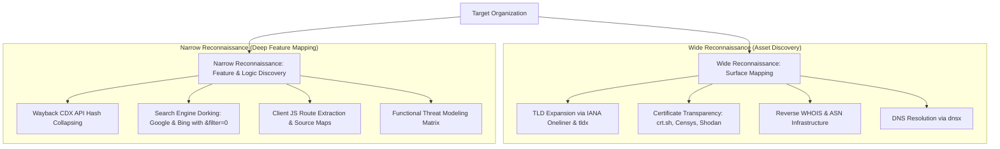

# Proposed Wiki change

## What will change
Comprehensively enrich Bug Bounty Reconnaissance guide with core mindset axioms, TLD expansion oneliners, reverse whois, Wayback CDX server API syntax, architectural threat modeling questions, and triager-focused reporting discipline.

## Proposed content
```markdown
---
title: "Bug Bounty Threat Modeling & Narrow Reconnaissance Methodology"
created: 2026-09-29
updated: 2026-09-29
type: concept
parent: "[[web-and-bug-bounty]]"
cluster: web-and-bug-bounty
tags:
  - bug-bounty
  - mapping
  - asm
  - osint
  - triage
  - report
sources:
  - Notes/Narroto-Guts Hunt/Structures.md
confidence: high
contested: false
contradictions: []
---
# Bug Bounty Threat Modeling & Narrow Reconnaissance Methodology

<!-- TOC_START -->
<!-- TOC_END -->

## Overview
Disciplined bug bounty hunting requires a deliberate reconnaissance and threat modeling methodology rather than aimless scanning. Understanding an application's business logic, architectural boundaries, and data flows must always precede active vulnerability probing.

## Core Operational Axioms (The Hunter's Mindset)

1. **The Target Offers You the Vulnerability**: Never force a predetermined exploit onto an incompatible architecture. Observe what the target exposes and follow its natural attack surface.
2. **The Least Change Principle**: When testing parameters, modify the absolute minimum number of characters, values, or headers necessary to measure state change.
3. **Hook-Based Fuzzing**: Always establish a reliable baseline hook before launching fuzzers to avoid being misled by false positives.
4. **Modern SPAs Cannot Be Crawled Automatically**: Automated tools (such as Katana) fail on complex DOMs. Passive traffic logging during real user interaction is mandatory; active crawling should only be reserved for automated pipelines.
5. **Explore Like a Normal User (Phase 0)**: Before launching intercepting proxies or scanners, navigate the application as an end user, building a mental model of business features.
6. **Paid & Authenticated Features Are Golden Areas**: High-privilege, paid, enterprise, or subscription-tier features receive less scrutiny from casual hunters and exhibit higher vulnerability density.
7. **Replacement After Ruleset Is a Killer**: Vulnerabilities frequently emerge when backend processors normalize or modify input *after* the WAF or sanitizer checker function has already evaluated the request.

---

## Two-Tier Reconnaissance Architecture



### 1. Wide Reconnaissance (Attack Surface Discovery)
- **Domain Discovery via Legal Footers & Favicons**: Search for corporate registration names, privacy policy identifiers, and favicon MD5 hashes on Shodan.
- **Top-Level Domain (TLD) Expansion**: Uncover regional properties and brand mirrors using the IANA TLD list or `tldx`:
  ```bash
  curl -s https://data.iana.org/TLD/tlds-alpha-by-domain.txt | tail -n +2 | tr 'A-Z' 'a-z' | sed 's/^/target:/'
  ```
- **Certificate Transparency Search**: Query Censys, Shodan, and `crt.sh`, auditing key certificate metadata:
  - `Issuer`, `Subject`, and `Alternative Name: DNS` (SANs uncover hidden development subdomains).
- **Reverse WHOIS**: Identify sibling infrastructure and corporate acquisitions via `website.informer.com` and `viewdns.info`.
- **DNS Resolution & Dead Host Monitoring**: Resolve large subdomain lists using `dnsx`. Monitor subdomains returning no HTTP responses for dangling DNS takeovers or subsequent provisioning.
- **Avoid Third-Party Traps**: Ensure discovered infrastructure is owned and operated by the target program rather than third-party SaaS vendors (e.g. Zendesk, Shopify) that fall outside program scope.

### 2. Narrow Reconnaissance (Feature & Logic Discovery)
- **Advanced Search Engine Dorking**:
  - Dork using **Google AND Bing** (not OR) plus DuckDuckGo.
  - Always click *"repeat the search with the omitted results included"* (or append `&filter=0` to Google search URLs).
  - Search for legacy technologies: `ext:aspx,php,asp,jsp` (directly connected to backend logic).
  - Search for raw HTML files: `ext:html` (test for DOM XSS; do not run blind fuzzing).
- **Wayback Machine CDX Server API**:
  Efficiently query historical snapshots across subdomains without downloading duplicate pages using digest collapsing:
  ```http
  https://web.archive.org/cdx/search/cdx?url=*.target.com/*&fl=timestamp,original&collapse=digest
  https://web.archive.org/cdx/search/cdx?url=*.target.com/&fl=original&collapse=urlkey
  ```
  - Historical `robots.txt` recovery via `robofinder`.

---

## Architectural Threat Modeling Questions

When analyzing a target application, systematically answer five architectural questions:

1. **Does the application have a specific Threat Model?**
   - Can an attacker modify properties belonging to another organization without authorization?
   - Can a restricted user access billing, administration, or member invitation endpoints?
2. **What is the application used for?**
   - Identify core business logic workflows.
   - Where would a failure of confidentiality (data breach) or integrity (balance manipulation) cause maximum financial impact?
3. **How does the application pass data?**
   - Legacy server-side rendering (UI + backend in one).
   - Simple web application with jQuery.
   - Single Page Applications (SPA) with REST APIs.
   - Single Page Applications (SPA) with GraphQL.
   - Real-time WebSocket bidirectional communications.
4. **How does the application handle users and authentication?**
   - Authentication primitives: Session cookies, bearer tokens, JWTs, mutual TLS.
   - Multi-factor authentication (2FA) enforcement points.
   - Account delegation, user tiers (admin, manager, viewer), and cross-application authentication handoffs.

---

## Functional Threat Modeling Matrix

| Observed Functionality / Input | Underlying Primitive | Primary Attack Vectors |
| :--- | :--- | :--- |
| **Input Reflection in DOM / Response** | Output Encoding | Reflected XSS, DOM XSS, SSTI |
| **URL Input / Webhook Parameter** | Network Request Forwarding | SSRF, Client-Side Path Traversal (CSPT) |
| **File Uploader (Images, Docs)** | Parsing & Storage | Polyglot RCE, SVG SSRF, Stored XSS |
| **Database Filtering / Search Fields** | Relational / NoSQL Queries | SQLi (Union, Error, Blind, Time), NoSQLi |
| **POST Login + Sensitive Endpoints** | Cross-Origin Policies | CORS Misconfiguration, Credential Theft |
| **POST Login + State-Changing Action**| Origin & Token Verification | CSRF, hDOM Request Injection |

> [!tip] BackSlash Powered Scanner
> For automated input anomaly detection and unknown vulnerability classes, utilize James Kettle's *BackSlash Powered Scanner* (Burp Suite BApp Store) based on the BlackHat research paper on hunting unknown vulnerability classes.

### Character & Syntax Decoding Rules:
- **Unicode Decoding in JavaScript**: In Node.js and client JavaScript engines, Unicode escapes are resolved during evaluation: `target === t\u0061rget`.
- **Automatic HTML Attribute Decoding**: HTML attributes are automatically decoded by browser parsers before event execution.
- **XSS in JSON Data**: XSS payloads reflected inside JSON API responses do not execute in raw HTTP context, but become exploitable **DOM XSS** when client JavaScript renders JSON properties into HTML sinks.

---

## Professional Bug Bounty Reporting Discipline

Triagers review hundreds of submissions daily. A successful report must be concise, reproducible, and devoid of speculative claims.

### 1. Attack Scenario (Eliminate Speculative Prose)
- Strictly avoid words like *potentially*, *attacker can*, *may*, or *might*.
- Never submit claims like *"An attacker could chain this with CVE-XXXX to achieve RCE"* without providing a verifiable working proof of concept.
- State clearly and concisely what was executed and proven with artifacts.

### 2. Steps to Reproduce
- Do not teach or lecture the triage team.
- Provide clean, sequential steps.
- Include exact, copy-pasteable Burp Suite HTTP request packets for both the attacker setup and the victim execution context.

### 3. Proof of Concept (PoC) Video
- Videos must be **under 2 minutes** (ideally 30–60 seconds).
- Show only the essential attack sequence without extraneous setup.
- For Local File Inclusion (LFI), read only 1 or 2 minimal non-sensitive files (e.g. `/etc/passwd`); never search or download sensitive customer data.

### 4. Scope Boundaries & Further Testing
- Always request explicit program permission before escalating an exploit (e.g. pivoting from a WordPress takeover to uploading a plugin shell).

## Related Pages
- [[web-and-bug-bounty]]
- [[dom-debugging-and-sink-analysis]]
- [[client-side-path-traversal]]
- [[bug-bounty-live-hunts-case-studies]]
- [[account-takeover-and-auth-flaws]]
- [[vulnerability-research-methodology]]
```

## Evidence and uncertainty
Documented from canonical notes in Notes/Narroto-Guts Hunt/ (Live Hunts, Structures, Tips and Tricks).

## Human feedback
Optionally explain or edit what should change.
