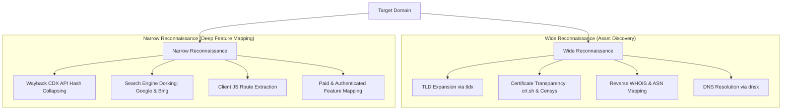

# Proposed Wiki change


<!-- TOC_START -->
## Table of Contents
- [What will change](#what-will-change)
- [Proposed content](#proposed-content)
- [Evidence and uncertainty](#evidence-and-uncertainty)
- [Human feedback](#human-feedback)
<!-- TOC_END -->

## What will change
Compile deep-dive concept note for Bug Bounty Reconnaissance & Threat Modeling.

## Proposed content
```markdown
---
title: "Bug Bounty Threat Modeling & Narrow Reconnaissance Methodology"
created: 2026-09-29
updated: 2026-09-29
type: concept
parent: "[[web-and-bug-bounty]]"
cluster: web-and-bug-bounty
tags:
  - bug-bounty
  - mapping
  - asm
  - osint
  - triage
  - report
sources:
  - Notes/Narroto-Guts Hunt/Structures.md
confidence: high
contested: false
contradictions: []
---
# Bug Bounty Threat Modeling & Narrow Reconnaissance Methodology


## Overview
Effective bug bounty hunting relies on disciplined threat modeling and precision reconnaissance rather than blind mass-fuzzing. As codified in practitioner tradecraft:
1. **The target offers you the vulnerability** — never attempt to force a predetermined exploit onto an incompatible architecture.
2. **The Least Change Principle** — when probing endpoints, change the absolute minimum number of characters, headers, or parameters necessary to measure server-state delta.
3. **Explore like a normal user** — comprehensive functional understanding of the target's business logic must precede active exploitation.

## Two-Tier Reconnaissance Architecture



### 1. Wide Reconnaissance (Attack Surface Discovery)
- **Top-Level Domain (TLD) Expansion**: Identify international brand mirrors and isolated properties:
  ```bash
  curl -s https://data.iana.org/TLD/tlds-alpha-by-domain.txt | tail -n +2 | tr 'A-Z' 'a-z' | sed 's/^/target:/'
  ```
- **Certificate Search**: Query Subject Alternative Names (SAN) on Censys, Shodan, and `crt.sh` to uncover origin hosts, internal staging portals, and development endpoints.

### 2. Narrow Reconnaissance (Feature Discovery)
- **Wayback CDX Server Digests**: Efficiently query historical snapshots across subdomains without downloading redundant duplicate files:
  ```http
  https://web.archive.org/cdx/search/cdx?url=*.target.com/*&fl=timestamp,original&collapse=digest
  ```
- **Passive Crawling Over Automated Active Spiders**: Modern Single Page Applications cannot be effectively crawled by legacy headless spiders. Passive traffic recording paired with manual user interactions yields high-signal application state maps.

## Functional Threat Modeling Matrix

| Observed Functionality / Input | Underlying Primitive | Primary Attack Vectors |
| :--- | :--- | :--- |
| **Input Reflection in DOM / Response** | Output Encoding | XSS (DOM, Reflected), SSTI |
| **URL Input / Webhook Parameter** | Network Request Forwarding | SSRF, Client-Side Path Traversal |
| **File Uploader (Images, Docs)** | Parsing & Storage | RCE via Polyglots, SVG SSRF, Stored XSS |
| **Database Filtering / Search Bar** | Relational / NoSQL Queries | SQLi (Union, Blind, Time-based), NoSQLi |
| **Cross-Domain Messaging / Popups** | Inter-Window Protocol | postMessage Origin Bypass, DOM Invader |
| **Multi-Step State Flow / Checkout** | Concurrency & Validation | Race Conditions, Parameter Tampering |

## Professional Bug Bounty Reporting Discipline

> [!important] Triager-Centric Reporting Standards
> Bug bounty triagers review hundreds of reports daily. Reports must be concise, reproducible, and devoid of speculative assertions.

1. **Eliminate Speculative Language**: Never write *"An attacker could potentially chain this with CVE-XXXX to achieve RCE"*. State precisely what was executed and proven with artifacts.
2. **Deterministic Steps to Reproduce**: Provide raw, copy-pasteable Burp Suite HTTP requests rather than ambiguous GUI descriptions.
3. **Compact PoC Evidence**: Video PoCs should be **under 2 minutes** (ideally 30–60 seconds), showing only the essential exploitation trigger.

## Related Pages
- [[web-and-bug-bounty]]
- [[dom-debugging-and-sink-analysis]]
- [[client-side-path-traversal]]
- [[osint-reconnaissance]]
- [[vulnerability-research-methodology]]
```

## Evidence and uncertainty
Documented from canonical notes in Notes/Narroto-Guts Hunt/ (Live Hunts, Structures, Tips and Tricks).

## Human feedback
Optionally explain or edit what should change.