# Clickjacking vs CSRF: Threat Models & Technical Comparison

> **Summary**: While both attacks induce authenticated victims to execute unauthorized state changes on an application, Cross-Site Request Forgery (CSRF) operates **invisibly without user interaction**, whereas Clickjacking is an **interface-based deception** requiring physical user clicks on framed UI elements. Crucially, Anti-CSRF tokens provide zero protection against Clickjacking because framed actions execute within the target origin itself.

---

<!-- TOC_START -->
## Table of Contents
- [1. Comparison Matrix](#1-comparison-matrix)
- [2. Execution Model Trade-Offs](#2-execution-model-trade-offs)
  - [CSRF: Ambient Request Forgery](#csrf-ambient-request-forgery)
  - [Clickjacking: On-Domain UI Hijacking](#clickjacking-on-domain-ui-hijacking)
- [3. Token Resistance & The On-Domain Advantage](#3-token-resistance--the-on-domain-advantage)
- [4. Defensive Remediation Comparison](#4-defensive-remediation-comparison)
- [Related Pages](#related-pages)
<!-- TOC_END -->

## 1. Comparison Matrix

| Evaluation Dimension | Clickjacking (UI Redressing) | Cross-Site Request Forgery (CSRF) |
| :--- | :--- | :--- |
| **Attack Vector** | Visual deception: transparent iframe overlay. | Request forgery: auto-submitting form or XHR. |
| **User Interaction** | **Mandatory**: User must physically click/type on the interface. | **None**: Executes silently in the background upon page load. |
| **Origin Context** | **On-Domain**: Requests are dispatched directly by the framed target page. | **Cross-Origin**: Requests are dispatched from the attacker origin. |
| **CSRF Token Immunity** | **Immune**: Anti-CSRF tokens are embedded natively in the framed DOM. | **Mitigated**: Blocked by unpredictable synchronizer tokens. |
| **Prerequisites** | Target page must be frameable (missing `frame-ancestors` / `XFO`). | Action parameters must be predictable, cookie-based auth. |
| **Primary Defenses** | CSP `frame-ancestors 'none'/'self'`, `X-Frame-Options: DENY`. | Synchronizer tokens, `SameSite=Strict` cookies, Re-auth. |

## 2. Execution Model Trade-Offs

### CSRF: Ambient Request Forgery
In CSRF, the attacker script crafts and dispatches an HTTP request directly to the target server. Because the request originates cross-origin, browsers permit the submission (subject to SameSite flags), but the attacker cannot access the DOM or read generated anti-CSRF tokens embedded in the target page.

### Clickjacking: On-Domain UI Hijacking
In Clickjacking, the target application is loaded in an iframe. When the victim interacts with the decoy page, their mouse clicks directly trigger the real UI elements inside the target application. Because the interaction happens *inside the legitimate application*, all native form handlers, nonces, and anti-CSRF tokens are already loaded and submitted normally.

```mermaid
graph TD
    subgraph CJ["Clickjacking (On-Domain Interaction)"]
        A1[Decoy Webpage] -->|Frames Target App| B1[Legitimate Target DOM]
        B1 -->|Contains Valid CSRF Token| C1[Native Form Submit]
        C1 -->|Action Executed Successfully| D1[Server Processes Mutation]
    end
    subgraph CS["CSRF (Cross-Origin Forgery)"]
        A2[Attacker Webpage] -->|Dispatches POST Form| B2[Target Endpoint]
        B2 -->|Missing / Invalid Token| E2[Server Rejects Request]
    end
```

## 3. Token Resistance & The On-Domain Advantage

A common misconception is that implementing Anti-CSRF tokens protects an application from all UI-driven attacks. **Anti-CSRF tokens do not prevent Clickjacking**. 
- In a clickjacking scenario, the iframe issues an authenticated GET request to render the real page.
- The target server generates a valid CSRF token and embeds it in the HTML form.
- The victim's physical click activates the form submit button directly on the framed DOM, sending the valid token.
Only frame-restricting controls (`frame-ancestors`, `X-Frame-Options`) can mitigate Clickjacking.

## 4. Defensive Remediation Comparison

- **To Mitigate Clickjacking**:
  - Deploy Content Security Policy with `frame-ancestors 'none'` or `'self'`.
  - Issue `X-Frame-Options: DENY` or `SAMEORIGIN`.
  - Configure `SameSite=Strict` or `Lax` to prevent cookies from attaching to cross-origin iframe requests.
- **To Mitigate CSRF**:
  - Deploy server-validated synchronizer tokens across all state-changing endpoints.
  - Enforce `SameSite=Strict` on session cookies.
  - Require user re-authentication or step-up MFA for high-risk operations.

## Related Pages
- Parent Hub: [[web-and-bug-bounty]]
- Target Concepts: [[clickjacking-attacks-and-ui-redressing]], [[csrf-attacks-and-prevention]]
- Comparisons: [[csrf-vs-cors-security]]
