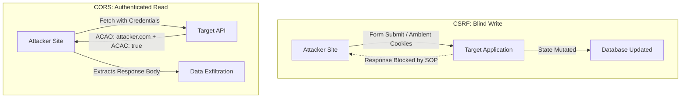

# CSRF vs CORS Misconfiguration: Threat Models & Technical Comparison

> **Summary**: While both vulnerabilities involve cross-origin browser interactions utilizing ambient user credentials, Cross-Site Request Forgery (CSRF) exploits unauthorized **action execution** (state mutation), whereas permissive Cross-Origin Resource Sharing (CORS) enables unauthorized **data exfiltration** (confidentiality breach).

---

<!-- TOC_START -->
## Table of Contents
- [1. Comparison Matrix](#1-comparison-matrix)
- [2. Architectural Mechanisms](#2-architectural-mechanisms)
  - [CSRF Threat Model (Blind Write)](#csrf-threat-model-blind-write)
  - [CORS Threat Model (Authenticated Read)](#cors-threat-model-authenticated-read)
- [3. Browser Security Boundaries](#3-browser-security-boundaries)
- [4. Attack Vectors & Primitives](#4-attack-vectors--primitives)
- [5. Remediation Architecture](#5-remediation-architecture)
- [Related Pages](#related-pages)
<!-- TOC_END -->

## 1. Comparison Matrix

| Evaluation Dimension | Cross-Site Request Forgery (CSRF) | CORS Misconfiguration |
| :--- | :--- | :--- |
| **Primary Impact** | **Integrity**: State-changing action executed without victim consent. | **Confidentiality**: Unauthorized reading of sensitive user data. |
| **Attacker Capability** | Can **write** (dispatch mutations), cannot **read** responses due to SOP. | Can **read** full response bodies via JavaScript XHR/Fetch. |
| **Trigger Mechanism** | HTML form auto-submit, simple image GET, or forged XHR. | JavaScript XHR/Fetch with `withCredentials = true`. |
| **Root Cause** | Browser sends ambient cookies automatically for cross-site requests. | Server explicitly issues permissive `ACAO` + `ACAC: true` headers. |
| **SOP Interaction** | Exploits standard SOP behavior (cross-origin writes permitted by default). | Relaxes SOP via explicit server-issued headers. |
| **Primary Defenses** | Anti-CSRF Synchronizer Tokens, `SameSite=Strict/Lax` cookies, Re-auth. | Strict server-side origin allowlisting, avoiding `ACAC: true` reflection. |

## 2. Architectural Mechanisms

### CSRF Threat Model (Blind Write)
In CSRF, the attacker abuses the browser's automatic credential attachment to perform actions blindly. The Same-Origin Policy still prevents the attacker's script from inspecting the HTTP response. Impact is limited to what the state-changing endpoint achieves (e.g. changing an email address or transferring currency).

### CORS Threat Model (Authenticated Read)
In a CORS misconfiguration, the server explicitly instructs the browser to waive SOP protections (`Access-Control-Allow-Origin: https://attacker.com` and `Access-Control-Allow-Credentials: true`). This grants the attacker's frontend JavaScript full access to read authenticated API payloads, such as account balances, private messages, PII, and API keys.

## 3. Browser Security Boundaries

- **Same-Origin Policy**: By default, permits cross-origin requests to be sent (writes), but forbids cross-origin JavaScript from reading the resulting responses (reads).
- **SameSite Cookies**: Mitigate CSRF by withholding cookies during third-party cross-site requests, which also limits CORS attacks originating from distinct sites unless the endpoint relies on token-based authentication.

## 4. Attack Vectors & Primitives

- **CSRF Attack Flow**: Attacker hosts `<form action="https://target.com/account/delete" method="POST">` and triggers `form.submit()`.
- **CORS Attack Flow**: Attacker hosts JavaScript calling `fetch('https://target.com/api/me', {credentials: 'include'})` and streams `response.text()` back to an exfiltration server.

## 5. Remediation Architecture

- **To Prevent CSRF**: Use anti-CSRF tokens in form bodies or headers; enforce `SameSite=Strict` cookies; require re-authentication for sensitive actions.
- **To Prevent CORS Flaws**: Implement an exact-match origin whitelist; disallow arbitrary reflection of incoming `Origin` headers; prohibit `Access-Control-Allow-Origin: null`.

## Related Pages
- Parent Hub: [[web-and-bug-bounty]]
- Target Concepts: [[csrf-attacks-and-prevention]], [[cors-vulnerabilities-and-exploitation]]
- Related Concepts: [[clickjacking-attacks-and-ui-redressing]], [[account-takeover-and-auth-flaws]]
