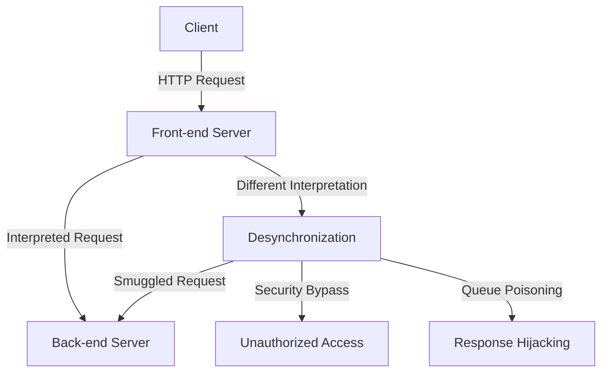
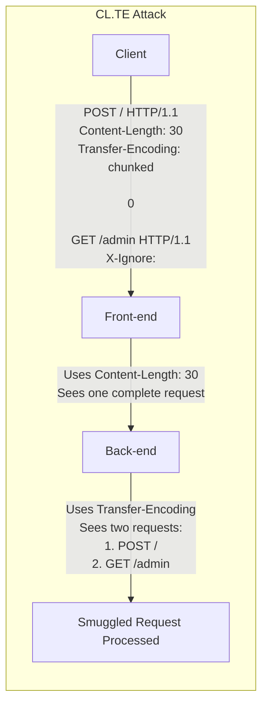
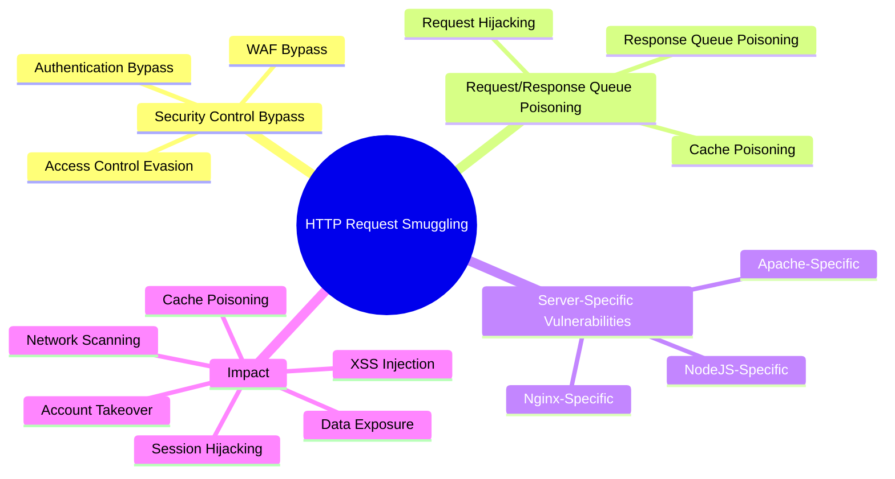

# HTTP Request Smuggling & Connection Desynchronization

<!-- TOC_START -->
## Table of Contents
- [Overview](#overview)
- [Comprehensive Exploitation Tradecraft & Methodology](#comprehensive-exploitation-tradecraft-methodology)
- [Mechanisms](#mechanisms)
- [Vulnerabilities](#vulnerabilities)
  - [Common HTTP Request Smuggling Scenarios](#common-http-request-smuggling-scenarios)
    - [Security Control Bypass](#security-control-bypass)
    - [Request/Response Queue Poisoning](#requestresponse-queue-poisoning)
    - [Server-Specific Vulnerabilities](#server-specific-vulnerabilities)
  - [Impact Examples](#impact-examples)
- [Sub-Topics & Technical Deep Dives](#sub-topics-technical-deep-dives)
- [Primary Sources & Provenance](#primary-sources-provenance)
- [Related Pages](#related-pages)
<!-- TOC_END -->

## Overview
HTTP Request Smuggling exploits discrepancies between frontend proxies and backend servers in parsing ambiguous message boundaries. This reference synthesizes CL.TE, TE.CL, TE.TE obfuscations, HTTP/2 request splitting, and cache poisoning desynchronizations.

## Comprehensive Exploitation Tradecraft & Methodology

## Mechanisms

HTTP Request Smuggling is a vulnerability that occurs when front-end and back-end servers interpret HTTP requests differently, leading to a desynchronization in the HTTP request processing chain. This desynchronization allows attackers to "smuggle" requests to the back-end server, potentially bypassing security controls or manipulating how other users' requests are processed.

Request smuggling vulnerabilities arise from inconsistencies in how servers parse and interpret HTTP messages, particularly regarding:

- **Transfer-Encoding (TE) header**: Indicates chunked encoding
- **Content-Length (CL) header**: Specifies the length of the message body
- **Header parsing**: Different handling of whitespace, newlines, and malformed headers

Common desynchronization scenarios include:

- **CL.TE**: Front-end uses Content-Length, back-end uses Transfer-Encoding
- **TE.CL**: Front-end uses Transfer-Encoding, back-end uses Content-Length
- **TE.TE**: Both servers use Transfer-Encoding but handle edge cases differently

HTTP/2/3 specific desync variants:

- H2.CL / H2.TE: Conflicts between HTTP/2 body length signaling and HTTP/1 backends during downgrade.
- H2C Upgrade: Cleartext HTTP/2 (h2c) upgrade paths mishandled by intermediaries.
- Authority/Host Confusion: `:authority` vs `Host` normalization inconsistencies under CDNs.

Modern variations include:

- **H2.HTTP/1**: HTTP/2 to HTTP/1 downgrades causing inconsistencies
- **HTTP/1.H2**: HTTP/1 to HTTP/2 transitions with different interpretations
- **Timeout-based**: Exploiting time differences in connection handling
- **Method-based**: Different interpretations of HTTP methods
- **Header-based**: Inconsistent header parsing between servers

## Vulnerabilities

### Common HTTP Request Smuggling Scenarios

#### Security Control Bypass

- Web Application Firewall (WAF) Bypass: Smuggling malicious content past WAF inspection
- Access Control Evasion: Accessing restricted resources by smuggling authorized-looking requests
- Authentication Bypass: Manipulating authentication flows through request smuggling

#### Request/Response Queue Poisoning

- Request Hijacking: Capturing parts of another user's request including cookies or authentication tokens
- Response Queue Poisoning: Causing wrong responses to be sent to users
- Cache Poisoning: Injecting malicious content into caches serving multiple users

#### Server-Specific Vulnerabilities

- Nginx-Specific: Inconsistent `Transfer-Encoding` handling with underscore prefixes
- Apache-Specific: Different chunked encoding parser behavior
- NodeJS-Specific: Unique header parsing behavior with multiple headers

### Impact Examples

- Session Hijacking: Stealing user session cookies through request smuggling
- Sensitive Data Exposure: Smuggling requests to internal resources
- Cross-Site Scripting (XSS): Injecting malicious scripts into responses sent to other users
- HTTP Cache Poisoning: Poisoning cached responses viewed by multiple users
- Internal Network Scanning: Using request smuggling for SSRF-like network scanning
- Account Takeover: Smuggling requests to change user credentials

## Sub-Topics & Technical Deep Dives
To maintain scannable modularity and prevent knowledge bloat, technical tradecraft for HTTP request smuggling is partitioned into focused deep dives:

- **[[http-request-smuggling-detection-methodology]]**: Architecture reconnaissance, CL.TE and TE.CL time-delay probes, GPOST confirmation testing, differential response analysis, and testing methodology flowcharts.
- **[[http-request-smuggling-advanced-desync]]**: Cutting-edge desynchronization primitives including HTTP/2 downgrades (H2.CL, H2.TE), HTTP/3 QUIC streams, Client-Side Desync (CSD), WebSocket tunnel hijacking, pause-based desync, and server-level parser discrepancies (V-H vs H-V).
- **[[http-request-smuggling-defense-and-remediation]]**: Real-world CVE case studies (F5 BIG-IP, Apache Traffic Server, HAProxy), reverse proxy normalization, defense testing, and why partial mitigations fail ("HTTP/1.1 must die: the desync endgame").
- **[[cl-te-vs-te-cl]]**: Architectural comparison matrix contrasting Content-Length vs Transfer-Encoding prioritization across front-end and back-end intermediaries.

## Primary Sources & Provenance
- Ingested from primary raw source: [[req-smuggle]]
- Research Foundations: PortSwigger Web Security Research (James Kettle, "HTTP Desync Attacks: Smuggling a New Era")
- RFC Specifications: RFC 7230 (HTTP/1.1 Message Syntax and Routing), RFC 9113 (HTTP/2), RFC 9114 (HTTP/3)

## Related Pages
- [[web-and-bug-bounty]]
- [[http-request-smuggling-detection-methodology]]
- [[http-request-smuggling-advanced-desync]]
- [[http-request-smuggling-defense-and-remediation]]
- [[cl-te-vs-te-cl]]
- [[smuggler]]
- [[turbo-intruder]]