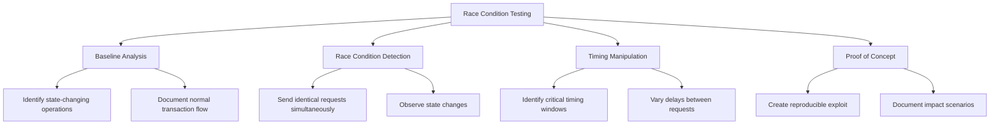

# Race Condition Vulnerabilities & Concurrency Exploitation: Detection Methodology & Probing


<!-- TOC_START -->
## Table of Contents
- [Hunt](#hunt)
  - [Identifying Race Condition Vulnerabilities](#identifying-race-condition-vulnerabilities)
    - [Target Functionality Selection](#target-functionality-selection)
    - [Testing Prerequisites](#testing-prerequisites)
    - [Testing Methodology](#testing-methodology)
  - [Advanced Testing Techniques](#advanced-testing-techniques)
    - [API-Based Race Condition Testing](#api-based-race-condition-testing)
    - [Transaction-Based Race Condition Testing](#transaction-based-race-condition-testing)
    - [Thread Synchronization Testing](#thread-synchronization-testing)
    - [Network-Level Timing Manipulation](#network-level-timing-manipulation)
    - [Rate-Limiter and CAPTCHA Races](#rate-limiter-and-captcha-races)
- [Burp Suite Testing Methods](#burp-suite-testing-methods)
  - [Using Burp 2023.9.x or Higher](#using-burp-20239x-or-higher)
  - [Using Turbo Intruder for Rate Limit Testing](#using-turbo-intruder-for-rate-limit-testing)
- [Related Pages](#related-pages)
<!-- TOC_END -->

## Hunt

### Identifying Race Condition Vulnerabilities

#### Target Functionality Selection

Focus on features handling state changes, limited resources, or critical operations:

- Financial Transactions: Fund transfers, withdrawals, purchases
- Inventory Systems: Stock allocation, reservation systems
- Coupon/Points Systems: Redeeming coupons, points, or rewards
- Voting/Rating Systems: Likes, upvotes, downvotes, polls
- Membership/Subscription Actions: Inviting users, joining/leaving groups, following/unfollowing users
- Registration Systems: Account creation with unique attributes
- Resource Management: Uploading, processing, or accessing resources
- Rate-Limited Actions: Password resets, login attempts, API endpoints with usage limits

#### Testing Prerequisites

1. Tools for sending parallel requests:
   - Burp Suite Turbo Intruder or Repeater (multi-threaded)
   - Custom scripts with threading capabilities
   - Race condition testing frameworks (e.g., Racepwn)

2. Request capturing and analysis capabilities:
   - HTTP proxy for intercepting and modifying traffic
   - Response analysis tools for detecting race-related anomalies

3. Network Proximity: Consider the physical or network location of your testing infrastructure relative to the target server. Minimizing latency (e.g., using a VPS in the same region/provider as the target) can significantly increase the chances of winning a race condition.

#### Testing Methodology



1. Baseline Behavior Analysis:
   - Identify state-changing operations
   - Understand normal request/response patterns
   - Document application's standard transaction flow

2. Race Condition Detection:
   - Send identical requests simultaneously (10-100 threads)
   - Observe effects on application state
   - Look for anomalies in responses or state changes

3. Timing Manipulation:
   - Identify critical timing windows
   - Target synchronization points
   - Test with varying delays between requests

### Advanced Testing Techniques

#### API-Based Race Condition Testing

1. Identify stateful API endpoints
2. Create automated scripts for parallel API requests:

```python
import requests
import threading

def make_request():
    requests.post('https://target.com/api/redeem',
                  json={'coupon_code': 'ONCE123'},
                  headers={'Authorization': 'Bearer token'})

threads = []
for _ in range(20):
    t = threading.Thread(target=make_request)
    threads.append(t)
    t.start()

for t in threads:
    t.join()
```

#### Transaction-Based Race Condition Testing

1. Identify multi-step transactions
2. Find the critical state change requests
3. Execute the final step in parallel before state updates propagate:
   ```
   Step 1: Start purchase (single request)
   Step 2: Apply coupon (single request)
   Step 3: Send 20 simultaneous "confirm order" requests
   ```

#### Thread Synchronization Testing

Create coordinated attacks that target specific timing windows:

```python
import requests
import threading
import time

start_gate = threading.Event()

def synchronized_request():
    start_gate.wait()  # All threads wait here until flag is set
    requests.post('https://target.com/api/withdraw',
                  json={'amount': '100'},
                  headers={'Authorization': 'Bearer token'})

threads = []
for _ in range(50):
    t = threading.Thread(target=synchronized_request)
    t.daemon = True
    threads.append(t)
    t.start()

# Release all threads simultaneously
time.sleep(2)  # Ensure all threads are waiting
start_gate.set()
```

#### Network-Level Timing Manipulation

Beyond application-level threading, manipulating network-level timing can be effective:

- **HTTP/2 / HTTP/3 Single-Packet & Last-Byte-Sync Techniques**: Classic HTTP/1.1 pipelining is disabled on most servers. Modern testers rely on HTTP/2 multiplexing or HTTP/3 streams to achieve micro-second concurrency. Burp Repeater (2023.9+) and Turbo Intruder expose this as _Send group in parallel (single-packet attack)_.
- **Last-Byte-Sync / Request Splitting**: Open multiple connections, send almost-complete requests, then flush the final bytes simultaneously. In Burp, send each tab using the _single packet attack_ gate; or in Turbo Intruder:

```python
def queueRequests(target, wordlists):
    engine = RequestEngine(
        endpoint=target.endpoint,
        concurrentConnections=1,
        engine=Engine.BURP2)

    for _ in range(20):
        engine.queue(target.req, gate='race')

    engine.openGate('race')
```

#### Rate-Limiter and CAPTCHA Races

- Send concurrent login or OTP requests across multiple sessions/IPs to probe shared counters.
- Look for global vs per-user vs per-IP buckets; test burst vs sustained patterns.


## Burp Suite Testing Methods

### Using Burp 2023.9.x or Higher

1. Send the request to repeater for multiple instances
2. Create tabs for all requests and select "Send Parallel (single Packet Attack)"
3. Execute and analyze results

### Using Turbo Intruder for Rate Limit Testing

```python
def queueRequests(target, wordlists):
    engine = RequestEngine(endpoint=target.endpoint,
                         concurrentConnections=1,
                         engine=Engine.BURP2)

    passwords = wordlists.clipboard

    for password in passwords:
        engine.queue(target.req, password, gate='1')

    engine.openGate('1')

def handleResponse(req, interesting):
    table.add(req)
```


## Related Pages
- [[race-condition-attacks]]
- [[web-and-bug-bounty]]