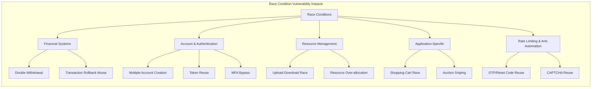

# Race Condition Vulnerabilities & Concurrency Exploitation: Exploitation Tradecraft & Attack Vectors


<!-- TOC_START -->
## Table of Contents
- [Vulnerabilities](#vulnerabilities)
  - [Common Race Condition Vulnerability Patterns](#common-race-condition-vulnerability-patterns)
    - [Financial Systems Vulnerabilities](#financial-systems-vulnerabilities)
    - [Account and Authentication Vulnerabilities](#account-and-authentication-vulnerabilities)
    - [Resource Management Vulnerabilities](#resource-management-vulnerabilities)
    - [Specific Application Patterns](#specific-application-patterns)
  - [Time-Sensitive Vulnerabilities](#time-sensitive-vulnerabilities)
  - [Session Handling Bypass](#session-handling-bypass)
  - [Database Isolation Level Testing](#database-isolation-level-testing)
  - [WebSocket Race Conditions](#websocket-race-conditions)
  - [Cloud & Serverless Race Conditions](#cloud-serverless-race-conditions)
    - [AWS Lambda Specific](#aws-lambda-specific)
    - [GCP Cloud Functions](#gcp-cloud-functions)
    - [Azure Functions](#azure-functions)
  - [Protocol-specific attack primitives](#protocol-specific-attack-primitives)
  - [GraphQL & gRPC considerations](#graphql-grpc-considerations)
  - [Cloud & serverless concurrency](#cloud-serverless-concurrency)
  - [Observability & detection](#observability-detection)
  - [Modern defensive patterns](#modern-defensive-patterns)
  - [Additional resources](#additional-resources)
- [Advanced Race Condition Scenarios](#advanced-race-condition-scenarios)
  - [Multi-Endpoint Race Conditions](#multi-endpoint-race-conditions)
  - [Single-Endpoint Race Conditions](#single-endpoint-race-conditions)
- [Related Pages](#related-pages)
<!-- TOC_END -->

## Vulnerabilities

### Common Race Condition Vulnerability Patterns



#### Financial Systems Vulnerabilities

- Double Withdrawal: Processing the same withdrawal request twice
- Transaction Rollback Abuse: Initiating a transaction rollback while completing the transaction
- Balance Check Bypass: Racing between balance verification and transaction processing

#### Account and Authentication Vulnerabilities

- Multiple Account Creation: Creating accounts with the same unique identifier
- Token Reuse: Using one-time tokens multiple times
- Session Fixation Race: Racing between session creation and authentication
- MFA Bypass: Racing between MFA checks and authenticated resource access

#### Resource Management Vulnerabilities

- Upload-Download Race: Accessing uploaded files before security checks complete
- Resource Allocation Race: Over-allocating limited resources
- Temporary File Races: Operating on temporary files during processing

#### Specific Application Patterns

- Shopping Cart Race Conditions: Adding items at specific discount windows
- Auction Sniping Race: Timing bids to bypass minimum increments
- Reservation System Races: Double-booking limited inventory

### Time-Sensitive Vulnerabilities

1. Send parallel password reset requests for the same account
2. Check if reset tokens are identical
3. Test by changing victim's username in one request
4. Analyze response times for potential race conditions

### Session Handling Bypass

Some application frameworks (like PHP with default session handling) lock session files when `session_start()` is called, preventing concurrent requests from the _same_ session from executing simultaneously. If the application allows a user to have multiple active sessions, this can be bypassed:

1.  Authenticate multiple times to obtain several valid session identifiers (e.g., `PHPSESSID`).
2.  Assign a unique session ID to each concurrent request in your race condition attack. This makes the server treat each request as originating from a different session, circumventing the session lock.

### Database Isolation Level Testing

Different database isolation levels handle concurrency differently. Test each level to identify race vulnerabilities:

**PostgreSQL Isolation Levels:**

```sql
-- READ UNCOMMITTED (treats as READ COMMITTED in PostgreSQL)
BEGIN TRANSACTION ISOLATION LEVEL READ UNCOMMITTED;

-- READ COMMITTED (default) - prone to races
BEGIN TRANSACTION ISOLATION LEVEL READ COMMITTED;
SELECT balance FROM accounts WHERE id = 123;
-- Race window here
UPDATE accounts SET balance = balance - 100 WHERE id = 123;
COMMIT;

-- REPEATABLE READ - prevents some races
BEGIN TRANSACTION ISOLATION LEVEL REPEATABLE READ;

-- SERIALIZABLE - strongest protection
BEGIN TRANSACTION ISOLATION LEVEL SERIALIZABLE;
```

**Testing Strategy:**

1. Identify critical transactions in the application
2. Send concurrent requests during the transaction window
3. Check if inconsistent state occurs
4. Test with explicit table locking:
   ```sql
   SELECT * FROM table FOR UPDATE;  -- Row-level lock
   LOCK TABLE table IN EXCLUSIVE MODE;  -- Table-level lock
   ```

**MySQL/MariaDB:**

```sql
-- Test for missing row locks
START TRANSACTION;
SELECT balance FROM accounts WHERE id = 123;
-- Send parallel transactions here
UPDATE accounts SET balance = balance - 100 WHERE id = 123;
COMMIT;

-- Test with explicit locking
SELECT * FROM accounts WHERE id = 123 FOR UPDATE;
```

**Testing for Advisory Locks:**

```sql
-- PostgreSQL advisory locks
SELECT pg_try_advisory_lock(12345);

-- Test if application uses them
-- Send parallel requests and monitor pg_locks table
SELECT * FROM pg_locks WHERE locktype = 'advisory';
```

### WebSocket Race Conditions

WebSocket connections maintain persistent state and can be vulnerable to race conditions:

**Message Processing Races:**

```javascript
// Send concurrent WebSocket messages
const ws = new WebSocket("wss://target.com/socket");

ws.onopen = () => {
  // Send multiple messages rapidly
  for (let i = 0; i < 50; i++) {
    ws.send(
      JSON.stringify({
        action: "transfer",
        amount: 100,
        to: "attacker",
      }),
    );
  }
};
```

**Connection Upgrade Races:**

```bash
# Multiple simultaneous WebSocket handshakes
for i in {1..20}; do
  curl -i -N \
    -H "Connection: Upgrade" \
    -H "Upgrade: websocket" \
    -H "Sec-WebSocket-Key: SGVsbG8sIHdvcmxkIQ==" \
    -H "Sec-WebSocket-Version: 13" \
    https://target.com/socket &
done
wait
```

**Testing Scenarios:**

- Concurrent authentication messages
- Simultaneous room/channel joins
- Parallel state-changing commands
- Race between disconnect and final message processing

### Cloud & Serverless Race Conditions

#### AWS Lambda Specific

**Concurrent Execution Testing:**

```python
import boto3
import concurrent.futures

lambda_client = boto3.client('lambda')

def invoke_lambda():
    return lambda_client.invoke(
        FunctionName='vulnerable-function',
        InvocationType='RequestResponse',
        Payload='{"action": "redeem_coupon", "code": "SAVE50"}'
    )

# Test concurrent invocations
with concurrent.futures.ThreadPoolExecutor(max_workers=50) as executor:
    futures = [executor.submit(invoke_lambda) for _ in range(50)]
    results = [f.result() for f in futures]
```

**Reserved Concurrency Bypass:**

- Check if Lambda has reserved concurrency limits
- Test if multiple accounts/regions bypass limits
- Monitor CloudWatch for ConcurrentExecutions metric

**DynamoDB Conditional Write Testing:**

```python
import boto3
from boto3.dynamodb.conditions import Attr

dynamodb = boto3.resource('dynamodb')
table = dynamodb.Table('coupons')

# Test if conditional writes are used
def redeem_coupon():
    table.update_item(
        Key={'code': 'SAVE50'},
        UpdateExpression='SET used = :val',
        ConditionExpression=Attr('used').eq(False),  # Should prevent races
        ExpressionAttributeValues={':val': True}
    )
```

#### GCP Cloud Functions

**Concurrent Trigger Testing:**

```bash
# Test HTTP-triggered Cloud Functions
for i in {1..50}; do
  curl -X POST https://region-project.cloudfunctions.net/function \
    -H "Content-Type: application/json" \
    -d '{"action": "claim_reward"}' &
done
wait
```

#### Azure Functions

**Singleton Testing:**

```csharp
// Check if Azure Functions use Singleton attribute
[Singleton] // Should prevent concurrent execution
public static void Run([QueueTrigger("queue")] string msg) { }
```

### Protocol-specific attack primitives

- **Single-Packet Attack (HTTP/2)** and **Last-Byte-Sync (HTTP/1)** research (PortSwigger Black Hat 2023) enables ≤ 4 µs request skew; both are now directly supported in Burp Repeater and Turbo Intruder.

### GraphQL & gRPC considerations

- GraphQL batch mutations can bypass conventional CSRF and rate-limit controls. Replay a single POST body containing 20 identical mutations to test for duplicated state changes.
- For gRPC, open multiple concurrent `SendMsg` frames before the backend commits state.

### Cloud & serverless concurrency

- Serverless functions (AWS Lambda, GCP Cloud Run, Azure Functions) may process the same event in parallel. Mitigate with idempotency keys or reserved-concurrency settings.

### Observability & detection

- Enable distributed tracing (OpenTelemetry, Jaeger) and emit duplicate-call metrics within the same trace span to surface race-condition symptoms.

### Modern defensive patterns

- Use atomic **UPSERT / ON CONFLICT** statements for write-once semantics.
- Implement **Idempotency-Key** headers (IETF draft 2024) with short-TTL storage.
- Employ Redis/etcd Redlock or PostgreSQL advisory locks for cross-service resource locking.

### Additional resources

- PortSwigger white-paper _Smashing the State Machine_ + labs (Black Hat 2023).
- OWASP ASVS v5 (2024) section 7.6 "Concurrency Controls".


## Advanced Race Condition Scenarios

### Multi-Endpoint Race Conditions

When functionality chains with multiple requests, for example in e-commerce:

```
- /product --> for the product
- /cart    --> Add to cart that product
- /cart/checkout  --> Buy that product
```

1. Send all required requests to Burp repeater in sequence
2. Create tabs for each request
3. Use "Send Parallel (single Packet Attack)" for execution

### Single-Endpoint Race Conditions

Common in email change functionality:

1. Setup:
   ```
   Account A: Attacker --> attacker@email.com
   Account B: Victim --> victim@email.com
   ```
2. When application updates email in database before confirmation
3. Send parallel requests changing email between attacker and victim addresses
4. If application generates confirmation links simultaneously, both may be sent to the same email
5. Impact: Potential for Account Takeover


## Related Pages
- [[race-condition-attacks]]
- [[web-and-bug-bounty]]