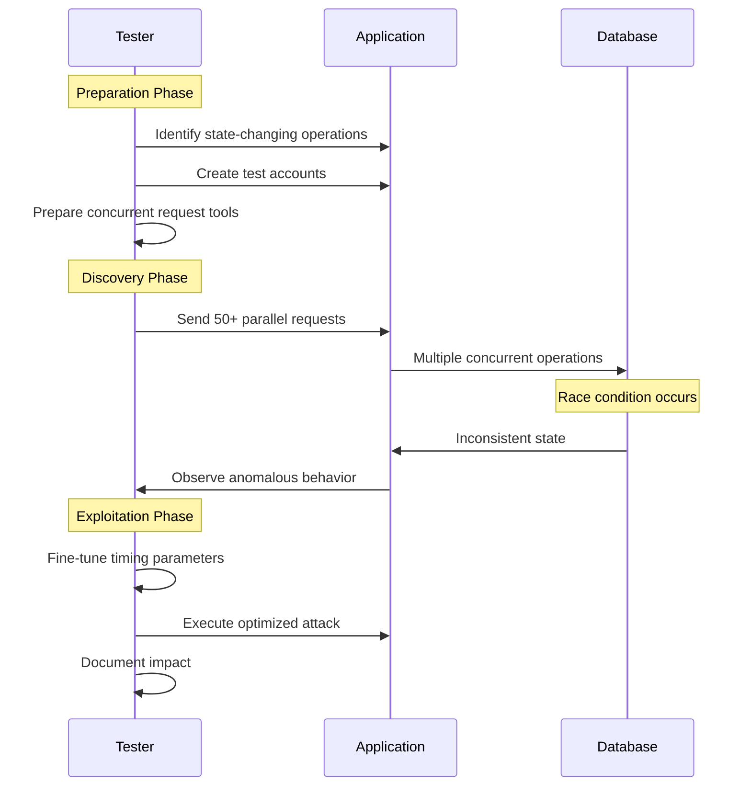

# Race Condition Vulnerabilities & Concurrency Exploitation: Methodologies


<!-- TOC_START -->
## Table of Contents
- [Methodologies](#methodologies)
  - [Tools](#tools)
    - [Race Condition Testing Tools](#race-condition-testing-tools)
    - [Custom Scripting](#custom-scripting)
  - [Testing Strategies](#testing-strategies)
    - [Comprehensive Race Condition Test Methodology](#comprehensive-race-condition-test-methodology)
  - [Real-World Testing Examples](#real-world-testing-examples)
    - [E-commerce Application Testing](#e-commerce-application-testing)
    - [Banking Application Testing](#banking-application-testing)
    - [API Testing for Race Conditions](#api-testing-for-race-conditions)
- [Related Pages](#related-pages)
<!-- TOC_END -->

## Methodologies

### Tools

#### Race Condition Testing Tools

- **Burp Suite Extensions**:
  - Turbo Intruder: High-volume parallel request sender.
  - Authorize: Manipulation of tokens/session data
  - Collaborator: For detecting out-of-band effects

- **Specialized Tools**:
  - Racepwn: Purpose-built race condition testing framework
  - Race-the-Web: Web application race condition finder
  - Raceocat: CLI scanner that replays raw-socket requests for µs-precision
  - URL-Race-Condition-Scanner: Generates and races endpoints from Burp history
  - OWASP ZAP with parallel request scripts

#### Custom Scripting

- **Python with Threading/Asyncio**:

```python
import asyncio
import aiohttp

async def make_request(session):
    async with session.post('https://target.com/api/action',
                           data={'param': 'value'}) as response:
        return await response.text()

async def main():
    async with aiohttp.ClientSession() as session:
        tasks = [make_request(session) for _ in range(50)]
        responses = await asyncio.gather(*tasks)
        # Analyze responses

asyncio.run(main())
```

- **Multi-threaded Testing with Go**:

```go
package main

import (
    "net/http"
    "sync"
)

func main() {
    var wg sync.WaitGroup
    for i := 0; i < 50; i++ {
        wg.Add(1)
        go func() {
            http.Post("https://target.com/api/action",
                      "application/json",
                      strings.NewReader(`{"param":"value"}`))
            wg.Done()
        }()
    }
    wg.Wait()
}
```

### Testing Strategies

#### Comprehensive Race Condition Test Methodology



1. **Preparation Phase**:
   - Map application functionality with state changes
   - Create multiple test accounts
   - Prepare parallel request tools and monitoring

2. **Discovery Phase**:
   - Test for TOCTOU issues in all critical functions
   - Test multi-step transactions with simultaneous final steps
   - Look for resource contention vulnerabilities
   - Test file operations for race conditions

3. **Exploitation Phase**:
   - Fine-tune timing and concurrency parameters
   - Create proof-of-concept exploits for confirmed issues
   - Measure impact with controlled exploitation
   - Document findings with clear reproduction steps

4. **Verification Phase**:
   - Test different concurrency levels (10, 50, 100 requests)
   - Vary timing patterns (synchronized vs staggered)
   - Test across different network conditions

### Real-World Testing Examples

#### E-commerce Application Testing

1. Add limited stock item to cart
2. Send 20 simultaneous checkout requests
3. Verify if multiple purchases succeed despite limited inventory

#### Banking Application Testing

1. Identify fund transfer functionality
2. Create 50 simultaneous transfer requests for the same amount
3. Verify account balance after transfers complete
4. Check for transaction logs inconsistencies

#### API Testing for Race Conditions

1. Identify stateful API endpoints
2. Create requests that modify shared resources
3. Execute requests simultaneously from multiple clients
4. Verify resource state consistency


## Related Pages
- [[race-condition-attacks]]
- [[web-and-bug-bounty]]