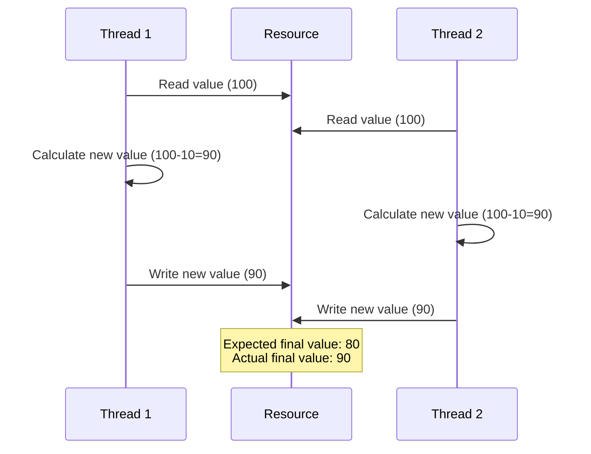
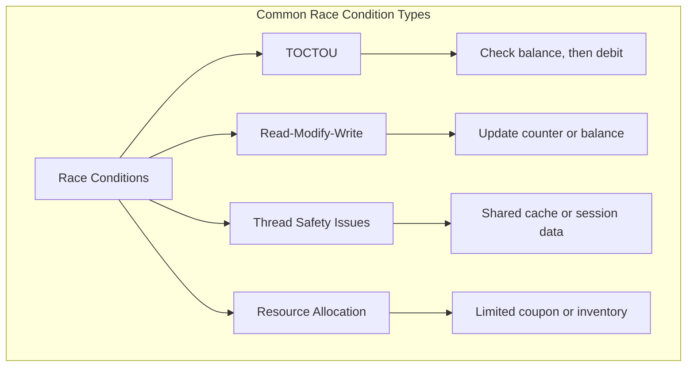

# Race Condition Vulnerabilities & Concurrency Exploitation

# Race Condition Vulnerabilities & Concurrency Exploitation

<!-- TOC_START -->
## Table of Contents
- [Overview](#overview)
- [Comprehensive Exploitation Tradecraft & Methodology](#comprehensive-exploitation-tradecraft-methodology)
- [Shortcut](#shortcut)
- [Mechanisms](#mechanisms)
- [Impact Assessment](#impact-assessment)
    - [Critical Impact Scenarios](#critical-impact-scenarios)
    - [Example Exploits](#example-exploits)
- [Real World Cases and CVEs](#real-world-cases-and-cves)
  - [Notable Race Condition Vulnerabilities](#notable-race-condition-vulnerabilities)
  - [HackerOne Reports](#hackerone-reports)
  - [Impact Categories](#impact-categories)
- [Primary Sources & Provenance](#primary-sources-provenance)
- [Related Concepts & Entities](#related-concepts-entities)
- [Sub-Topics & Technical Deep Dives](#sub-topics-technical-deep-dives)
- [Related Pages](#related-pages)
<!-- TOC_END -->

## Overview
Race conditions occur when concurrent threads or processes access shared resources without adequate synchronization. This guide details Time-of-Check to Time-of-Use (TOCTOU), limit-overrun attacks, database transaction isolation anomalies, and single-packet attack synchronization.

## Comprehensive Exploitation Tradecraft & Methodology

## Shortcut

- Spot the features prone to race conditions in the target application and copy the corresponding requests.
- Send multiple of these critical requests to the server simultaneously. You should craft requests that should be allowed once but not allowed multiple times.
- Check the results to see if your attack has succeeded. And try to execute the attack multiple times to maximize the chance of success.
- Consider the impact of the race condition you just found.

## Mechanisms

Race conditions occur when the behavior of a system depends on the relative timing or sequence of events that can happen in different orders. In web application security, race conditions happen when multiple concurrent processes or threads access and manipulate the same resource simultaneously without proper synchronization.

A race condition becomes a security vulnerability when it affects security controls or business logic. The critical types include:

- Time-of-Check to Time-of-Use (TOCTOU): When a check is performed, but circumstances change before the result of the check is used
- Read-Modify-Write: When multiple processes read, modify, and write back a shared resource without coordination
- Thread Safety Issues: When multithreaded applications improperly handle shared resources
- Resource Allocation Races: Competition for limited resources like database connections or memory

Common vulnerable scenarios include:

- Account Balance Manipulation: Making multiple withdrawals/transfers simultaneously
- Coupon/Promotion Code Reuse: Using a single-use code multiple times
- File Upload Processing: Uploading and accessing temporary files before validation completes
- Registration Processes: Creating multiple accounts with the same unique identifier
- Token Verification: Using authentication tokens multiple times before they're invalidated

## Impact Assessment

#### Critical Impact Scenarios

- **Financial Loss**: Double spending, incorrect account balances
- **Privilege Escalation**: Bypassing authentication or authorization
- **Data Integrity Violations**: Corrupting database state
- **Denial of Service**: Exhausting limited resources
- **Information Disclosure**: Accessing partially processed data

#### Example Exploits

1. **Banking Application Double-Withdrawal**:
   - Initial balance: $1000
   - Send 10 simultaneous withdrawal requests for $100 each
   - Result: $1000 debited but balance only decreases once
2. **E-commerce Coupon Reuse**:
   - Single-use coupon provides $50 discount
   - Send 5 parallel requests using the same coupon
   - Result: Multiple $50 discounts applied

3. **Account Registration Email Verification Bypass**:
   - Send multiple verification requests with different tokens
   - Race between verification and account provision
   - Result: Account verified without valid email

## Real World Cases and CVEs

### Notable Race Condition Vulnerabilities

1. **CVE-2023-6690 - GitHub Enterprise Server**:
   - GraphQL mutation race condition
   - Low-privileged users could grant themselves site-admin privileges
   - Impact: Complete administrative takeover

2. **CVE-2021-41091 - Docker (Moby)**:
   - Race condition in permission check during container removal
   - Allowed non-root users to delete arbitrary files
   - Impact: Host system compromise

3. **CVE-2019-5736 - runc Container Escape**:
   - Race condition in container runtime
   - Attacker could overwrite host runc binary
   - Impact: Container escape to host

4. **CVE-2016-5195 - Dirty COW (Linux Kernel)**:
   - Race condition in memory management (Copy-on-Write)
   - Allowed privilege escalation to root
   - Impact: Complete system compromise

5. **PayPal - Double Payment Race Condition**:
   - Concurrent payment requests processed twice
   - User charged once but vendor paid twice
   - Impact: Financial loss

6. **Shopify - Gift Card Race Condition**:
   - Single-use gift cards redeemed multiple times
   - Race in balance check and deduction logic
   - Impact: Financial fraud

7. **Uber - Promotional Code Race**:
   - One-time promo codes used multiple times
   - Concurrent ride requests with same code
   - Impact: Revenue loss

### HackerOne Reports

1. **Flag Submission**: Race condition allowing multiple submissions of the same CTF flag, increasing user points unfairly
2. **Invite System**: Race condition allowing invitation of same member multiple times to a single team
3. **Retest Payment**: Race condition allowing multiple payments for a single retest
4. **Group Member Management**: Race condition preventing admin from removing group members
5. **User Following**: Race condition allowing multiple follows of the same user
6. **Report Voting**: Race condition enabling multiple upvotes/downvotes on a single report
7. **CTF Group Joining**: Race condition allowing multiple joins to the same CTF group
8. **Invitation Limit Bypass**: Race condition bypassing the invitation limit restriction
9. **Gift Card Redemption**: Race condition enabling multiple redemptions of the same gift card
10. **OAuth Token Generation**: Race during token generation allowed multiple valid tokens for single authorization code

### Impact Categories

- **Critical**: Financial loss, privilege escalation, data corruption
- **High**: Business logic bypass, resource exhaustion, unauthorized access
- **Medium**: Rate limit bypass, duplicate operations, inconsistent state
- **Low**: UI glitches, non-security-impacting inconsistencies

## Primary Sources & Provenance
- Provenance source anchor: [[race-condition]]

Synthesized and normalized from canonical vault note `[[unprocessed-obsidians/race-condition]]`.

## Related Concepts & Entities
- [[turbo-intruder]]
- [[race-condition-attacks]]

## Sub-Topics & Technical Deep Dives
To preserve scannable modularity and prevent knowledge bloat, technical tradecraft for this topic has been decomposed into dedicated deep-dive notes:

- **[[race-condition-attacks-detection-methodology|Race Condition Vulnerabilities & Concurrency Exploitation: Detection Methodology & Probing]]** — Comprehensive tradecraft focusing on detection methodology & probing.
- **[[race-condition-attacks-exploitation-and-attack-vectors|Race Condition Vulnerabilities & Concurrency Exploitation: Exploitation Tradecraft & Attack Vectors]]** — Comprehensive tradecraft focusing on exploitation tradecraft & attack vectors.
- **[[race-condition-attacks-defense-and-remediation|Race Condition Vulnerabilities & Concurrency Exploitation: Defense, Hardening & Remediation]]** — Comprehensive tradecraft focusing on defense, hardening & remediation.
- **[[race-condition-attacks-methodologies|Race Condition Vulnerabilities & Concurrency Exploitation: Methodologies]]** — Comprehensive tradecraft focusing on methodologies.

## Related Pages
- [[web-and-bug-bounty]]
- [[race-condition-attacks-detection-methodology]]
- [[race-condition-attacks-exploitation-and-attack-vectors]]
- [[race-condition-attacks-defense-and-remediation]]
- [[race-condition-attacks-methodologies]]