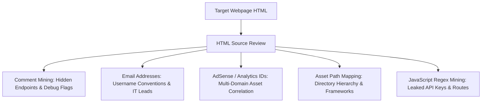

# Client-Side Source Code Review & DOM Reconnaissance Tradecraft

> **Classification**: Reconnaissance & Attack Surface Mapping, CWE-200 (Exposure of Sensitive Information to an Unauthorized Actor).
> **Primary Impact**: Identification of hidden administrative endpoints, internal network architecture, hardcoded developer credentials, tracking identifier attribution, and target attack surface expansion.

---

<!-- TOC_START -->
## Table of Contents
- [1. HTML Source Inspection Methodology](#1-html-source-inspection-methodology)
- [2. High-Yield Search Terms & OSINT Pivots](#2-high-yield-search-terms--osint-pivots)
  - [Comment Mining (<!-- ... -->)](#comment-mining----)
  - [Email Harvesting & Corporate Naming Schemes](#email-harvesting--corporate-naming-schemes)
  - [Google Publisher & AdSense Tracking IDs (ca-pub)](#google-publisher--adsense-tracking-ids-ca-pub)
  - [Google Analytics & Tag Manager Attribution (ua- / G-)](#google-analytics--tag-manager-attribution-ua---g-)
  - [Asset Path & Media Directory Structure Analysis](#asset-path--media-directory-structure-analysis)
- [3. Regex Patterns for Secret & Endpoint Extraction](#3-regex-patterns-for-secret--endpoint-extraction)
- [4. Automated Tooling & Terminal Pipelines](#4-automated-tooling--terminal-pipelines)
- [5. Primary Sources & Provenance](#5-primary-sources--provenance)
- [Related Pages](#related-pages)
<!-- TOC_END -->

## 1. HTML Source Inspection Methodology

Initial client-side inspection (`Ctrl+U` or DevTools DOM inspection) often reveals high-value operational intelligence inadvertently shipped to production browsers. While frontend JavaScript and HTML are public by design, developers frequently leave artifacts that expose backend architecture, internal staging endpoints, third-party service dependencies, and corporate organizational attribution.



## 2. High-Yield Search Terms & OSINT Pivots

| Search Pattern | Intelligence Revealed | Operational Exploitation / OSINT Pivot |
| :--- | :--- | :--- |
| `<!--` | Developer HTML Comments | Discover forgotten debug parameters, backend API routes, credentials, and commented-out links. |
| `@` | Corporate Email Addresses | Enumerate user naming schemes (`first.last@corp.com`), discover employee profiles for password spraying. |
| `ca-pub-` | Google AdSense Publisher ID | Pivot via SpyOnWeb, NerdyData, or PublicWWW to discover hidden sibling websites sharing the same owner. |
| `ua-` / `G-` | Google Analytics Property ID | Map organization umbrella properties and staging/development domains sharing the same tracking account. |
| `src=` / `href=` | Media & Script Relative Paths | Extract directory hierarchy (`/static/v2/app/`), discovering hidden admin/assets subdirectories. |

### Comment Mining (`<!-- ... -->`)
HTML and JavaScript comments frequently contain:
- Deprecated API endpoints still active on backend proxies.
- Developer TODO remarks: `<!-- TODO: remove testing auth bypass before release -->`.
- Internal hostnames and private IP ranges: `<!-- Proxy to 10.0.4.12:8080 -->`.

### Email Harvesting & Corporate Naming Schemes
Uncovering email addresses within source code facilitates:
1. Identifying the corporate email convention (`john.doe@company.com` vs `jdoe@company.com`).
2. Generating customized username wordlists for authentication testing.
3. Conducting OSINT against breaches to retrieve historical passwords for credential stuffing.

### Google Publisher & AdSense Tracking IDs (`ca-pub`)
Google AdSense IDs uniquely identify a publisher account:
```html
<script async src="//pagead2.googlesyndication.com/pagead/js/adsbygoogle.js"></script>
<script>
  (adsbygoogle = window.adsbygoogle || []).push({
    google_ad_client: "ca-pub-1234567890123456",
    enable_page_level_ads: true
  });
</script>
```
Querying reverse tracking engines (PublicWWW, SpyOnWeb) with `ca-pub-1234567890123456` returns all domains owned or monetized by the same entity, expanding target bug bounty scope.

### Google Analytics & Tag Manager Attribution (`ua-` / `G-`)
Tracking codes like `UA-123456-1` or `G-ABC123DEF` link separate web properties:
- An enterprise might run a hardened production application, but reuse the same Google Analytics tag on an unauthenticated staging domain (`staging.target-corp.com`). Searching the property ID identifies these secondary attack vectors.

### Asset Path & Media Directory Structure Analysis
Inspecting image, CSS, and script paths (`/assets/img/2026/09/logo.png`) provides clues regarding:
- CMS platforms (WordPress `/wp-content/`, Drupal `/sites/default/files/`).
- Direct directory listing exposure (`/assets/img/` may have indexing enabled).
- Potential path traversal entry points.

## 3. Regex Patterns for Secret & Endpoint Extraction

```bash
# Extract API endpoints from JavaScript bundles
grep -oE '(https?://[^"''' ]+|/[a-zA-Z0-9_/.-]+)' bundle.js | sort -u

# Extract Google Analytics and AdSense IDs
grep -oE '(UA-[0-9]+-[0-9]+|ca-pub-[0-9]+|G-[A-Z0-9]+)' target_source.html

# Extract email addresses
grep -oE '[a-zA-Z0-9._%+-]+@[a-zA-Z0-9.-]+\.[a-zA-Z]{2,}' target_source.html | sort -u
```

## 4. Automated Tooling & Terminal Pipelines

1. **`curl` + `htmlq` / `pup`**: Terminal parsing of specific HTML tags and attributes.
2. **`gau` / `waybackurls`**: Historical endpoint extraction complementing live source reviews.
3. **`LinkFinder` / `SecretFinder`**: Automated AST parsing of client-side JavaScript bundles to extract hidden API routes and sensitive tokens.

## 5. Primary Sources & Provenance
- Provenance source anchor: [[source-code-review]]

Synthesized from canonical vault note `Notes/OLD Notes/WEB/Source Code Review.md`.

## Related Pages
- Parent Hub: [[web-and-bug-bounty]]
- Related Concepts: [[bug-bounty-recon-and-threat-modeling]], [[dom-debugging-and-sink-analysis]], [[vulnerability-research-methodology]]
