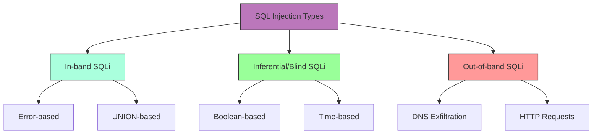

# SQL Injection Testing & Database Exploitation Frameworks

# SQL Injection Testing & Database Exploitation Frameworks

<!-- TOC_START -->
## Table of Contents
- [Overview](#overview)
- [Comprehensive Exploitation Tradecraft & Methodology](#comprehensive-exploitation-tradecraft-methodology)
- [Shortcut](#shortcut)
- [Mechanisms](#mechanisms)
  - [Types of SQL Injection](#types-of-sql-injection)
  - [Database Targets](#database-targets)
- [Primary Sources & Provenance](#primary-sources-provenance)
- [Related Concepts & Entities](#related-concepts-entities)
- [Sub-Topics & Technical Deep Dives](#sub-topics-technical-deep-dives)
- [Related Pages](#related-pages)
<!-- TOC_END -->

## Overview
SQL Injection (SQLi) occurs when untrusted user input is directly concatenated into database query structures. This note synthesizes in-band, error-based, blind boolean/time-based, and out-of-band (OOB) techniques across all major SQL dialects.

## Comprehensive Exploitation Tradecraft & Methodology

## Shortcut

- Map any of the application endpoints that takes in user input
- Insert test payload into these locations to discover whether they're vulnerable to SQL injections. if the input isn't vulnerable to classic SQL injections, try inferential techniques instead.
- Use different SQL injection queries to extract information from the database.
- Escalate the issue, try to expand your foothold.

## Mechanisms

SQL Injection (SQLi) is a code injection technique that exploits vulnerabilities in applications that dynamically construct SQL queries using user-supplied input. When successful, attackers can:

- Bypass authentication
- Access sensitive data
- Modify database data
- Execute administrative operations
- Potentially achieve remote code execution

SQLi occurs when applications fail to properly validate, sanitize, or parameterize user input before incorporating it into SQL queries. The vulnerability exists in various forms:

### Types of SQL Injection

- **Error-based**: Extract data by forcing the database to generate error messages containing sensitive information
- **Union-based**: Leverage the UNION operator to combine results from the original query with those from an injected query
- **Boolean-based blind**: Infer information by observing whether query results differ based on injected Boolean conditions
- **Time-based blind**: Deduce information by observing timing differences in responses when conditional time-delay functions are injected
- **Out-of-band**: Extract data through alternative communication channels (DNS, HTTP requests)
- **Second-order**: Occurs when user input is stored and later used unsafely in SQL queries
- **Stored procedures**: Targeting vulnerable database stored procedures
- **JSON‑based**: Abuse JSON operators/functions (->, ->>, JSON_EXTRACT, JSON_TABLE) to inject conditions or extract data where traditional syntax is filtered
- **WebSocket-based**: SQL injection through WebSocket message payloads
- **REST API Filter/Sort**: Injection via JSON filter and sort parameters that translate to SQL
- **HTTP/2 Header Smuggling**: Bypassing WAFs via header manipulation before SQL payload delivery

### Database Targets

SQLi affects virtually all major database systems:

- MySQL/MariaDB
- Microsoft SQL Server
- PostgreSQL
- Oracle
- SQLite
- IBM DB2
- NoSQL databases (MongoDB, Cassandra, etc.)

## Primary Sources & Provenance
- Provenance source anchor: [[sql-injection]]

Synthesized and normalized from canonical vault note `[[unprocessed-obsidians/sql-injection]]`.

## Related Concepts & Entities
- [[sqlmap]]
- [[in-band-vs-blind-sqli]]
- [[vulnerability-research-methodology]]

## Sub-Topics & Technical Deep Dives
To preserve scannable modularity and prevent knowledge bloat, technical tradecraft for this topic has been decomposed into dedicated deep-dive notes:

- **[[sql-injection-testing-detection-methodology|SQL Injection Testing & Database Exploitation Frameworks: Detection Methodology & Probing]]** — Comprehensive tradecraft focusing on detection methodology & probing.
- **[[sql-injection-testing-exploitation-and-attack-vectors|SQL Injection Testing & Database Exploitation Frameworks: Exploitation Tradecraft & Attack Vectors]]** — Comprehensive tradecraft focusing on exploitation tradecraft & attack vectors.
- **[[sql-injection-testing-defense-and-remediation|SQL Injection Testing & Database Exploitation Frameworks: Defense, Hardening & Remediation]]** — Comprehensive tradecraft focusing on defense, hardening & remediation.
- **[[sql-injection-testing-methodologies|SQL Injection Testing & Database Exploitation Frameworks: Methodologies]]** — Comprehensive tradecraft focusing on methodologies.

## Related Pages
- [[web-and-bug-bounty]]
- [[sql-injection-testing-detection-methodology]]
- [[sql-injection-testing-exploitation-and-attack-vectors]]
- [[sql-injection-testing-defense-and-remediation]]
- [[sql-injection-testing-methodologies]]